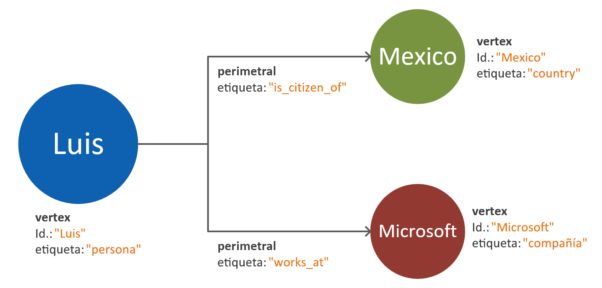
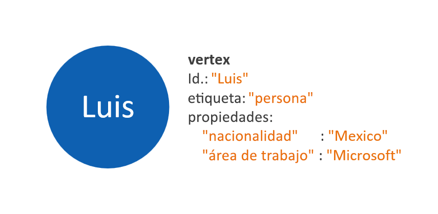
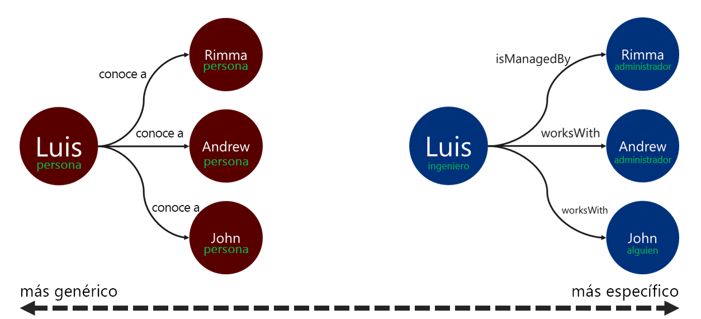

# Modelado de datos de grafo para la API para Gremlin de Azure Cosmos DB

El siguiente documento está diseñado para proporcionar recomendaciones para el modelado de datos de grafo. Este paso es fundamental para garantizar la escalabilidad y rendimiento de un sistema de base de datos de grafos a medida que evolucionan los datos. Un modelo de datos eficaz es especialmente importante con grafos a gran escala.

## Requisitos

El proceso descrito en esta guía se basa en los siguientes supuestos:
 * Las **entidades** en el espacio del problema están identificadas. Estas entidades están diseñadas para utilizarse _de forma atómica_ para cada solicitud. En otras palabras, el sistema de base de datos no está diseñado para recuperar datos de una sola entidad en varias solicitudes de consulta.
 * Hay un reconocimiento de **requisitos de lectura y escritura** para el sistema de base de datos. Estos requisitos guiarán las optimizaciones que sean necesarias para el modelo de datos de grafo.
 * Los principios del [estándar del grafo de propiedades de Apache Tinkerpop](http://tinkerpop.apache.org/docs/current/reference/#graph-computing) se han entendido bien.

## ¿Cuándo es necesaria una base de datos de grafos?

Una solución de base de datos de grafos se puede aplicar de forma óptima si las entidades y relaciones en un dominio de datos tienen cualquiera de las siguientes características: 

* Las entidades tienen una **alta conexión** mediante relaciones descriptivas. La ventaja de este escenario es el hecho de que las relaciones se conservan en almacenamiento.
* Hay **relaciones cíclicas** o **entidades que hacen referencia a sí mismas**. Este patrón a menudo es un desafío al usar bases de datos de documentos o relacionales.
* Hay **relaciones evolucionando de forma dinámica** entre entidades. Este patrón es especialmente aplicable a los datos jerárquicos o de estructura de árbol con muchos niveles.
* Existen **relaciones de varios a varios** entre entidades.
* Hay **requisitos de lectura y escritura en ambas entidades y relaciones**. 

Si se cumple los criterios mencionados anteriormente, es probable que un enfoque de base de datos de grafos proporcionará ventajas para **complejidad de las consultas**, **escalabilidad del modelo de datos** y **rendimiento de las consultas**.

El siguiente paso es determinar si el grafo se va a usar para fines analíticos o transaccionales. Si el grafo está pensado para usarse para pesadas cargas de trabajo de procesamiento de datos y cálculo, vale la pena explorar el [conector de Cosmos DB Spark](https://docs.microsoft.com/azure/cosmos-db/spark-connector) y el uso de la [biblioteca GraphX](https://spark.apache.org/graphx/). 

## Cómo usar objetos de grafo

El [estándar del grafo de propiedades de Apache Tinkerpop](http://tinkerpop.apache.org/docs/current/reference/#graph-computing) define dos tipos de objetos **Vértices** y **Bordes**. 

Los siguientes son los procedimientos recomendados para las propiedades de los objetos de grafo:

| Object | Propiedad | type | Notas |
| --- | --- | --- |  --- |
| Vértice | id | Cadena | Se aplica de forma exclusiva por partición. Si un valor no se proporciona tras la inserción, se almacenarán un GUID generado automáticamente. |
| Vértice | label | Cadena | Esta propiedad se utiliza para definir el tipo de entidad que representa el vértice. Si no se proporciona un valor, se usará el valor predeterminado "vértice". |
| Vértice | properties | Cadena, booleano, numérico | Una lista de propiedades independientes que se almacenan como pares de clave-valor en cada vértice. |
| Vértice | clave de partición | Cadena, booleano, numérico | Esta propiedad define dónde se almacenará el vértice y sus bordes salientes. Más información acerca de la [creación de particiones de grafos](graph-partitioning.md). |
| perimetral | id | Cadena | Se aplica de forma exclusiva por partición. Generado automáticamente de forma predeterminada. Normalmente, con los bordes no hay necesidad de recuperarlos de forma exclusiva mediante un identificador. |
| perimetral | label | Cadena | Esta propiedad se utiliza para definir el tipo de relación que tienen dos vértices. |
| perimetral | properties | Cadena, booleano, numérico | Una lista de propiedades independientes que se almacenan como pares de clave-valor en cada borde. |

> [!NOTE]
> Los bordes no requieren un valor de clave de partición, ya que su valor se asigna automáticamente en función de sus vértices de origen. Obtenga más información en el artículo sobre [partición de grafos](graph-partitioning.md).

## Directrices de modelado de relaciones y entidades

Las siguientes son un conjunto de directrices para el enfoque del modelado de datos para una base de datos de grafos de la API para Gremlin de Azure Cosmos DB. En estas directrices se suponen que hay una definición existente de un dominio de datos y consultas para él.

> [!NOTE]
> Los pasos descritos a continuación se presentan como recomendaciones. El modelo final se debe evaluar y probar antes de que se pueda considerar listo para el entorno de producción. Además, las siguientes recomendaciones son específicas de la implementación de la API para Gremlin de Azure Cosmos DB. 

### Vértices y propiedades de modelado 

El primer paso para un modelo de datos de grafo es asignar cada entidad identificada a un **objeto vértice**. La asignación de uno a uno de todas las entidades a vértices debe ser el paso inicial que está sujeto a cambios.

Un problema común consiste en asignar propiedades de una sola entidad como vértices independientes. Tenga en cuenta el ejemplo siguiente, donde se representa la misma entidad de dos maneras diferentes:

* **Propiedades basadas en vértice**: En este enfoque, la entidad usa tres vértices independientes y dos bordes para describir sus propiedades. Aunque este enfoque podría reducir la redundancia, aumenta la complejidad del modelo. El aumento de la complejidad del modelo puede dar como resultado latencia agregada, complejidad de las consultas y costo de cálculo. Este modelo también puede presentar desafíos en la creación de particiones.

* **Vértices insertados en propiedad**: Este enfoque aprovecha las ventajas de la lista de par clave-valor para representar todas las propiedades de la entidad dentro de un vértice. Este enfoque proporciona una complejidad reducida del modelo, lo que dará lugar a consultas más sencillas y más recorridos rentables.

> [!NOTE]
> Los ejemplos anteriores muestran un modelo de grafo simplificado para mostrar únicamente la comparación entre las dos maneras de dividir las propiedades de entidad.

El patrón **vértices insertados en propiedad** patrón suele ofrece un mayor rendimiento y enfoque escalable. El enfoque predeterminado para un nuevo modelo de datos de grafo debe siempre orientarse hacia a este patrón.

De todas formas, hay escenarios en los que hacer referencia a una propiedad puede proporcionar ventajas. Por ejemplo: si la propiedad a la que se hace referencia se actualiza con frecuencia. El uso de un vértice independiente para representar una propiedad que cambia constantemente, minimizara la cantidad de operaciones de escritura que la actualización requiere.

### Modelado de relaciones con direcciones de bordes

Una vez que se han modelado los vértices, los bordes se pueden agregar para indicar las relaciones entre ellos. El primer aspecto que tiene que evaluarse es el de la **dirección de la relación**. 

Los objetos de borde tienen una dirección predeterminada seguida de un recorrido cuando se usa la función `out()` o `outE()`. El uso de esta dirección natural da como resultado una operación eficiente, puesto que todos los vértices se almacenan con sus bordes salientes. 

De todas formas, realizar un recorrido en la dirección opuesta de una borde, utilizando la función `in()`, siempre tendrá como resultado una consulta entre particiones. Más información sobre la [creación de particiones de grafos](graph-partitioning.md). Si hay una necesidad de recorrer constantemente utilizando la función `in()`, se recomienda agregar bordes en ambas direcciones.

Puede determinar la dirección de un borde mediante los predicados `.to()` o `.from()` para el paso de Gremlin `.addE()`. También puede utilizar la [biblioteca Bulk Executor para Gremlin API](bulk-executor-graph-dotnet.md).

> [!NOTE]
> Objetos de borde tienen una dirección de forma predeterminada.

### Etiquetado de relaciones

El uso de etiquetas de relación descriptivas puede mejorar la eficacia de las operaciones de resolución de borde. Este patrón se puede aplicar de las maneras siguientes:
* Use términos de no genéricos para etiquetar una relación.
* Asocie la etiqueta del vértice de origen a la etiqueta del vértice de destino con el nombre de la relación.

Cuanto más específica sea la etiqueta que use el recorredor para filtrar los bordes, mejor. Esta decisión puede también influir de forma significativa en el costo de la consulta. Puede evaluar el costo de consulta en cualquier momento [mediante el paso executionProfile](graph-execution-profile.md).

## Pasos siguientes: 
* Comprobación de la lista de [pasos de Gremlin](gremlin-support.md) admitidos.
* Obtenga información acerca de las [particiones de bases de datos de grafos](graph-partitioning.md) para tratar con grafos a gran escala.
* Evaluación de las consultas de Gremlin con el [paso de perfil de ejecución](graph-execution-profile.md).
