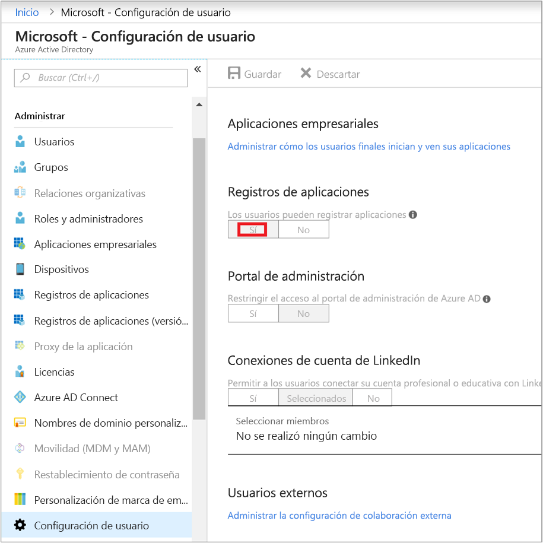
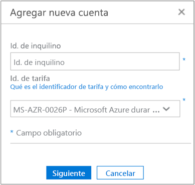
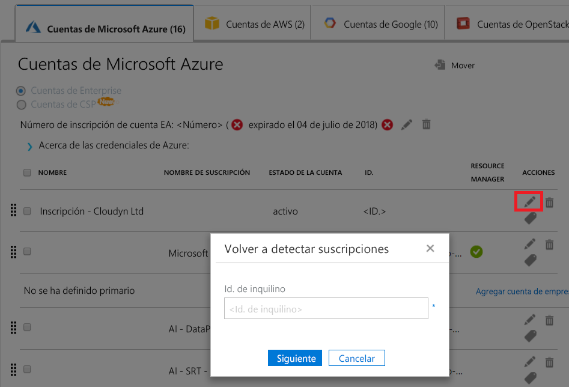

# <a name="activate-azure-subscriptions-and-accounts-with-cloudyn"></a>Activación de suscripciones y cuentas de Azure con Cloudyn

La adición o actualización de las credenciales de Azure Resource Manager permiten a Cloudyn detectar todas las cuentas y suscripciones dentro de su inquilino de Azure. Si también está habilitada la extensión de Azure Diagnostics en las máquinas virtuales, Cloudyn podrá recopilar más métricas, como la CPU y la memoria. En este artículo se describe cómo habilitar el acceso mediante las API de Azure Resource Manager tanto en las cuentas nuevas como en las existentes. También se describe cómo resolver los problemas comunes de las cuentas.

Cuando la suscripción a Azure _no está activada_, Cloudyn no puede acceder a la mayor parte de los datos de la misma. Para que Cloudyn pueda acceder a las cuentas _sin activar_ es preciso editarlas.

## <a name="required-azure-permissions"></a>Permisos de Azure necesarios

Para completar los procedimientos de este artículo se requieren determinados permisos. Usted o el Administrador de inquilinos deben tener los dos permisos siguientes:

- Permiso para registrar la aplicación CloudynCollector en su inquilino de Azure AD.
- La capacidad para asignar la aplicación a un rol en las suscripciones a Azure.

En las suscripciones a Azure, las cuentas deben tener acceso `Microsoft.Authorization/*/Write` para asignar la aplicación CloudynCollector. Esta acción se concede mediante el rol [Propietario](../../role-based-access-control/built-in-roles.md#owner) o el rol [Administrador de acceso de usuario](../../role-based-access-control/built-in-roles.md#user-access-administrator).

Si a la cuenta se le ha asignado el rol **Colaborador**, no tiene los permisos adecuados para asignar la aplicación. Recibe un error al intentar asignar la aplicación CloudynCollector a su suscripción a Azure.

### <a name="check-azure-active-directory-permissions"></a>Comprobación de los permisos de Azure Active Directory

1. Inicie sesión en [Azure Portal](https://portal.azure.com).
2. En Azure Portal, seleccione **Azure Active Directory**.
3. En su instancia de Azure Active Directory, seleccione **Configuración de usuario**.
4. Compruebe la opción **Registros de aplicaciones**.
    - Si está seleccionado **Sí**, incluso los usuarios que no sean administradores pueden registrar aplicaciones de AD. Esta configuración significa que ningún usuario en el inquilino de Azure Active Directory puede registrar una aplicación.  
    
    - Si en **Registros de aplicaciones** está seleccionada la opción **No**, los usuarios administradores de inquilinos serán los únicos que puedan registrar aplicaciones de Azure Active Directory. El Administrador de inquilinos debe registrar la aplicación CloudynCollector.


## <a name="add-an-account-or-update-a-subscription"></a>Adición de una cuenta o actualización de una suscripción

Cuando se agrega una cuenta o se actualiza una suscripción, se conceder a Cloudyn acceso a los datos de Azure.

### <a name="add-a-new-account-subscription"></a>Adición de una cuenta nueva (suscripción)

1. En el portal de Cloudyn, haga clic en el símbolo de engranaje en la esquina superior derecha y seleccione **Cloud Accounts** (Cuentas en la nube).
2. Haga clic en **Add new account** (Agregar nueva cuenta) y aparecerá el cuadro **Add new account** (Agregar nueva cuenta). Escriba la información necesaria.  
    

### <a name="update-a-subscription"></a>Actualización de una suscripción

1. Si desea actualizar una suscripción _no activada_ que ya existe en Cloudyn en Accounts Management (Administración de cuentas), haga clic en el símbolo del lápiz, que se encuentra a la derecha del _identificador único global del inquilino_ principal. Las suscripciones se agrupan en un inquilino principal, así es que evite activar las suscripciones de manera individual.
    
2. Si es necesario, escriba el identificador del inquilino. Si no conoce el identificador del inquilino, siga estos pasos para encontrarlo:
    1. Inicie sesión en [Azure Portal](https://portal.azure.com).
    2. En Azure Portal, seleccione **Azure Active Directory**.
    3. Para obtener el identificador de inquilino, seleccione **Propiedades** en el inquilino de Azure AD.
    4. Copie el GUID del identificador del directorio. Este valor es el id. de inquilino.
    Para más información, consulte [Obtención del identificador de inquilino](../../active-directory/develop/howto-create-service-principal-portal.md#get-values-for-signing-in).
3. Si es necesario, seleccione su identificador de tasa. Si no lo conoce, siga estos pasos para encontrarlo.
    1. En la parte superior derecha de Azure Portal, haga clic en la información de su usuario y, luego, en **Ver mi factura**.
    2. En **Cuenta de facturación**, haga clic en **Suscripciones**.
    3. En **Mis suscripciones**, seleccione la suscripción.
    4. El identificador de tasa se muestra debajo de **Id. de oferta**. Copie el id. de oferta de la suscripción.
4. En los cuadros Add new account (Agregar nueva cuenta) o Edit Subscription (Editar suscripción), haga clic en **Save** (Guardar), o en **Next** (Siguiente). Se le redirigirá a Azure Portal.
5. Inicie sesión en el portal. Haga clic en **Aceptar** para autorizar que Cloudyn Collector acceda a su cuenta de Azure.

    A continuación, se le redirige a la página de administración de cuentas de Cloudyn, la suscripción se actualiza y la cuenta pasa a estar estado **activa**. Debe mostrar una marca de verificación verde en la columna Resource Manager.

    Si no ve dicha marca en una o varias suscripciones, significa que no tiene permisos para crear ninguna aplicación de lectura (CloudynCollector) de la suscripción. Los usuarios con permisos superiores en la suscripción deben repetir este proceso.

En el vídeo [Connecting to Azure Resource Manager with Cloudyn](https://youtu.be/oCIwvfBB6kk) (Conexión a Azure Resource Manager con Cloudyn) se muestra todo este proceso.

>[!VIDEO https://www.youtube.com/embed/oCIwvfBB6kk?ecver=1]

## <a name="resolve-common-indirect-enterprise-set-up-problems"></a>Resolución de los problemas de configuración empresariales indirectos comunes

La primera vez que use el portal de Cloudyn, podría ver los siguientes mensajes si es usuario de Contrato Enterprise o Proveedor de soluciones en la nube (CSP):

- *The specified API key is not a top level enrollment key (La clave de API especificada no es una clave de inscripción de nivel superior)* se muestra en el **Asistente para configuración de Cloudyn**.
- *Direct Enrollment – No* (Inscripción directa: no) se muestra en el portal de Contrato Enterprise.
- *No usage data was found for the last 30 days. Please contact your distributor to make sure markup was enabled for your Azure account*  (No se encontraron datos de uso de los últimos 30 días. Póngase en contacto con su distribuidor para asegurarse de que se habilitó el margen de beneficio para su cuenta de Azure) aparece en el portal de Cloudyn.

Los mensajes anteriores indican que adquirió un Contrato Enterprise de Azure a través de un revendedor o CSP. El CSP o el revendedor deben habilitar el _margen de beneficio_ para su cuenta de Azure a fin de que pueda ver sus datos en Cloudyn.

Aquí se muestra cómo corregir los problemas:

1. El revendedor debe habilitar el _margen de beneficio_ para su cuenta. Para ver las instrucciones, consulte la [guía de incorporación para clientes indirectos ](https://ea.azure.com/api/v3Help/v2IndirectCustomerOnboardingGuide) (en inglés).
2. Debe generar la clave de Contrato Enterprise de Azure para su uso con Cloudyn. Para ver las instrucciones, consulte [Registrar un Contrato Enterprise de Azure y ver datos de costo](https://docs.microsoft.com/azure/cost-management/quick-register-ea).

Para poder generar la clave de API de Contrato Enterprise de Azure para configurar Cloudyn, debe habilitar la API de facturación de Azure siguiendo las instrucciones que aparecen en:

- [Introducción a las API de informes para clientes de Enterprise](../manage/enterprise-api.md)
- [API de informes de Microsoft Azure Enterprise Portal](https://ea.azure.com/helpdocs/reportingAPI) en **Habilitación del acceso de datos a la API**

Es posible que también deba conceder permisos a administradores de departamento, propietarios de cuentas y administradores de empresa para _ver cargos_ con la API de facturación.

Solo un administrador de servicios de Azure puede habilitar Cloudyn. Los permisos de coadministrador son insuficientes. Sin embargo, puede evitar el requisito de administrador. Puede solicitar que el administrador de Azure Active Directory conceda permiso para autorizar **CloudynAzureCollector** con un script de PowerShell. El siguiente script concede permiso para registrar la entidad de servicio de Azure Active Directory **CloudynAzureCollector**.


```powershell
#THE SOFTWARE IS PROVIDED "AS IS", WITHOUT WARRANTY OF ANY KIND, EXPRESS OR IMPLIED, INCLUDING BUT NOT LIMITED TO THE WARRANTIES OF MERCHANTABILITY, FITNESS FOR A PARTICULAR PURPOSE AND NONINFRINGEMENT. IN NO EVENT SHALL THE AUTHORS OR COPYRIGHT HOLDERS BE LIABLE FOR ANY CLAIM, DAMAGES OR OTHER LIABILITY, WHETHER IN AN ACTION OF CONTRACT, TORT OR OTHERWISE, ARISING FROM, OUT OF OR IN CONNECTION WITH THE SOFTWARE OR THE USE OR OTHER DEALINGS IN THE SOFTWARE.

#Tenant - enter your tenant ID or Name
$tenant = "<ReplaceWithYourTenantID>"

#Cloudyn Collector application ID
$appId = "83e638ef-7885-479f-bbe8-9150acccdb3d"

#URL to activate the consent screen
$url = "https://login.windows.net/"+$tenant+"/oauth2/authorize?api-version=1&response_type=code&client_id="+$appId+"&redirect_uri=http%3A%2F%2Flocalhost%3A8080%2FCloudynJava&prompt=consent"

#Choose your browser, the default is Internet Explorer

#Chrome
#[System.Diagnostics.Process]::Start("chrome.exe", "--incognito $url")

#Firefox
#[System.Diagnostics.Process]::Start("firefox.exe","-private-window $url" )

#IExplorer
[System.Diagnostics.Process]::Start("iexplore.exe","$url -private" )

```

## <a name="next-steps"></a>Pasos siguientes

- Si aún no ha completado el primer tutorial de Cloudyn, léalo en [Revisión del uso y los costos](tutorial-review-usage.md).
