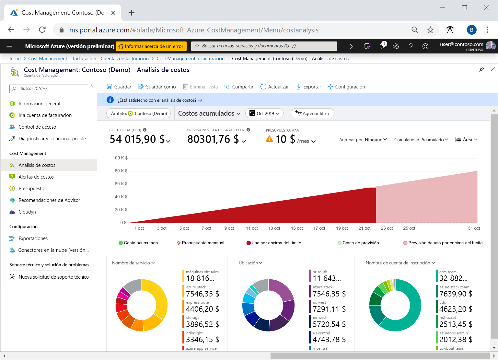
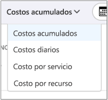
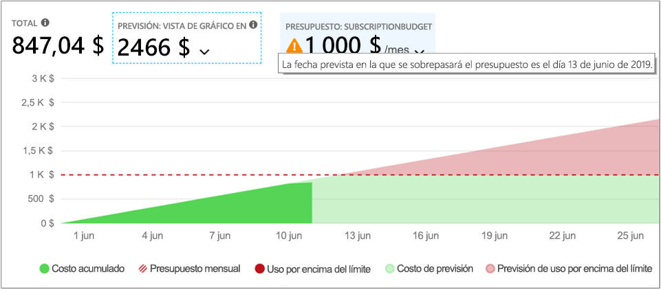
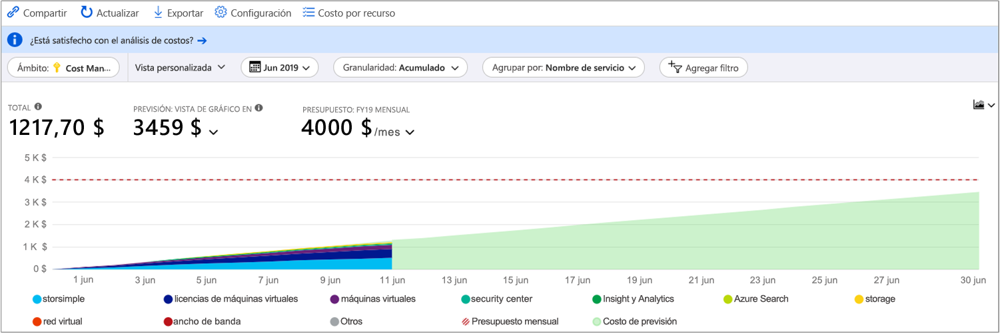
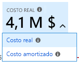
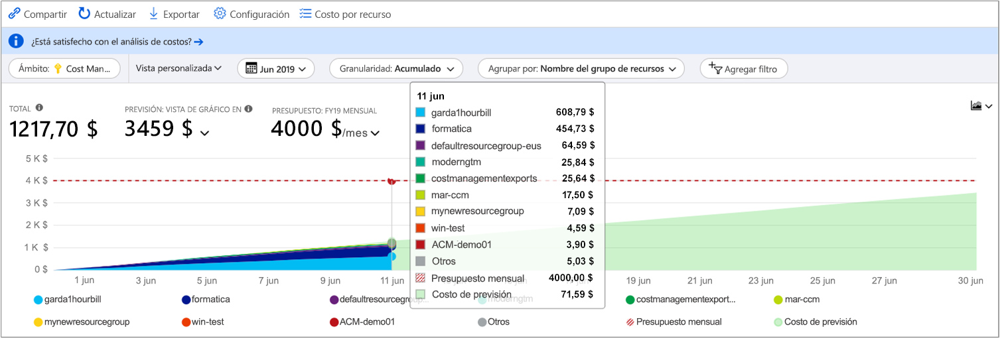
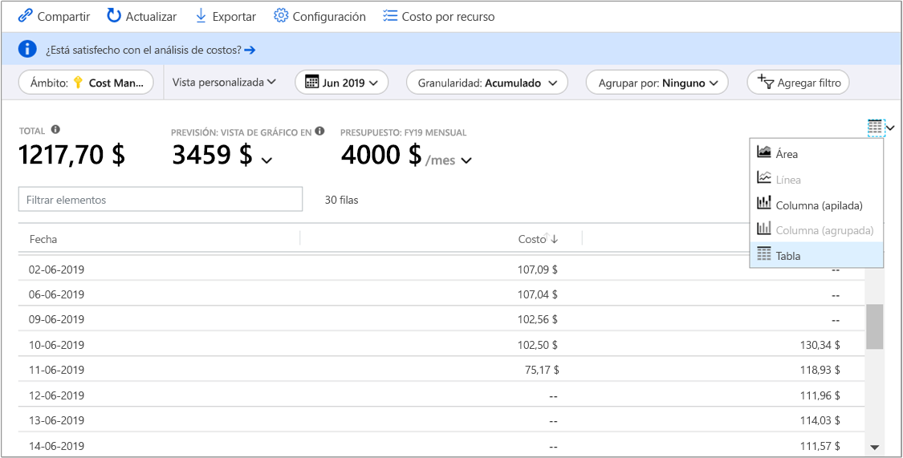

# <a name="quickstart-explore-and-analyze-costs-with-cost-analysis"></a>Inicio rápido: Explore y analice los costos con Análisis de costos

Antes de que pueda controlar y optimizar correctamente sus costos de Azure, debe saber en qué lugar de su organización se originaron los costos. También resulta de utilidad saber cuánto dinero cuestan sus servicios y en apoyo a qué entornos y sistemas. La visión general de la gama de costos al completo es fundamental para conocer con precisión los patrones de gasto de la organización. Puede usar patrones de gastos para aplicar mecanismos de control de costos, como presupuestos.

En esta guía de inicio rápido, va a utilizar el análisis de costos para explorar y analizar los costos de organización. Puede ver los costos agregados de la organización para saber dónde se producen esos costos con el tiempo e identificar las tendencias de gasto. Puede ver los costos acumulados con el tiempo para estimar las tendencias de costos mensual, trimestral o incluso anualmente con respecto a un presupuesto. Un presupuesto ayuda a los proveedores a cumplir con las restricciones financieras. Y un presupuesto se utiliza para ver los costos diarios o mensuales para aislar las irregularidades de los gastos. Además, puede descargar los datos del informe actual para realizar análisis adicionales o para usarlos en un sistema externo.

En esta guía de inicio rápido, ha aprendido a hacer lo siguiente:

- Revise los costos en análisis de costos
- Personalización de vistas de costos
- Descargue datos de análisis de costos


## <a name="prerequisites"></a>Prerequisites

El análisis de costos es compatible con varios tipos de cuenta de Azure. Para ver la lista completa de tipos de cuenta compatibles, consulte [Understand Cost Management data](understand-cost-mgt-data.md) (Información sobre los datos de Cost Management). Para ver los datos de costos, se necesita al menos acceso de lectura en la cuenta de Azure.

Para más información acerca de cómo asignar acceso a los datos de Azure Cost Management, consulte [Asignación de acceso a los datos](../../cost-management/assign-access-acm-data.md).

## <a name="sign-in-to-azure"></a>Inicio de sesión en Azure

- Inicie sesión en Azure Portal en https://portal.azure.com.

## <a name="review-costs-in-cost-analysis"></a>Revise los costos en análisis de costos

Para revisar los costos en el análisis de costos, abra el ámbito en Azure Portal y seleccione **Análisis de costos** en el menú. Por ejemplo, vaya a **Suscripciones**, seleccione una suscripción de la lista y, a continuación, seleccione **Análisis de costos** en el menú. Use la píldora **Ámbito** para cambiar a un ámbito diferente en el análisis de costos. Para más información sobre los ámbitos, consulte [Descripción y uso de ámbitos](understand-work-scopes.md).

El ámbito que seleccione se usa en todo Cost Management para proporcionar la consolidación de datos y controlar el acceso a la información de costos. Cuando use ámbitos, no realice una selección múltiple de ellos. En su lugar, seleccione un ámbito mayor en el que otros se acumulan y, luego, filtre a los ámbitos anidados que necesite. Es importante comprender este enfoque, ya que algunas personas pueden no tener acceso a un solo ámbito principal que abarca múltiples ámbitos anidados.

La vista de análisis de costos inicial incluye las siguientes áreas.

**Vista de costos acumulados**: representa la configuración de la vista del análisis de costos predefinida. Cada vista incluye la configuración del rango de fechas, granularidad, agrupar por y filtro. La vista predeterminada muestra los costos acumulados del período de facturación actual, pero se puede cambiar a otras vistas integradas. Para más información, consulte [Personalización de vistas de costos](#customize-cost-views).

**Costo real**: muestra los costos de compra y uso total del mes actual, a medida que se acumulan, y se muestran en la factura.

**Previsión**: muestra los costos totales previstos para el período que elija. (La previsión está en versión preliminar).

**Presupuesto**: muestra el límite de gasto previsto para el ámbito seleccionado, si está disponible.

**Granularidad acumulada**: muestra los costos diarios agregados totales desde el principio del período de facturación. Después de [crear un presupuesto](tutorial-acm-create-budgets.md) para su cuenta de facturación o suscripción, podrá ver rápidamente su tendencia de gastos con el presupuesto. Mantenga el puntero sobre una fecha para ver el costo acumulado hasta ese día.

**Gráficos dinámicos (anillos)** : proporcionan gráficos dinámicos, que desglosan el costo total por un conjunto común de propiedades estándar. Muestran los costos de mayor a menor del mes actual. Puede cambiar los gráficos dinámicos en cualquier momento seleccionando un área dinámica diferente. Los costos se clasifican por servicio (categoría de medidor), ubicación (región) y ámbito secundario predeterminado. Por ejemplo, las cuentas de inscripción se incluyen en las cuentas de facturación, los grupos de recursos se incluyen en las suscripciones y los recursos se incluyen en grupos de recursos.



## <a name="customize-cost-views"></a>Personalización de vistas de costos

El análisis de costos tiene cuatro vistas integradas, optimizadas para los objetivos más comunes:

Ver | Responder preguntas como
--- | ---
Costo acumulado | ¿Cuánto he gastado hasta ahora en este mes? ¿Me mantendré dentro de mi presupuesto?
Costo diario | ¿Ha habido algún aumento en los costos por día durante los últimos 30 días?
Costo por servicio | ¿Cómo ha variado mi uso mensual en las últimas tres facturas?
Costo por recurso | ¿Qué recursos cuestan más en lo que va de mes?



Sin embargo, hay muchos casos donde se necesitan análisis más profundos. La personalización comienza en la parte superior de la página, con la selección de fecha.

De forma predeterminada, el análisis de costos muestra los datos correspondientes al mes actual. Utilice el selector de fecha para cambiar rápidamente a los intervalos de fechas comunes. Algunos ejemplos son los últimos siete días, el mes pasado, el año actual o un intervalo de fechas personalizado. Las suscripciones de pago por uso también incluyen los intervalos de fechas según el período de facturación, que no está enlazado con el mes natural, como el período de facturación actual o la última factura. Use los vínculos  **<ANTERIOR** y  **SIGUIENTE>** en la parte superior del menú para ir al período anterior o siguiente, respectivamente. Por ejemplo, **<ANTERIOR** cambiará de **los últimos 7 días** a **8-14 días** o **15-21 días**.


De forma predeterminada, el análisis de costos muestra los costos **acumulados**. Los costos acumulados incluyen todos los costos correspondientes a cada día, además de los días anteriores, a fin de obtener una vista en constante crecimiento de sus costos agregados diarios. Esta vista está optimizada para mostrar sus tendencias con respecto a un presupuesto durante el intervalo de tiempo seleccionado.

Use la vista del gráfico para identificar posibles infracciones en el presupuesto. Cuando se produzca una posible infracción presupuestaria, el exceso de gasto proyectado se muestra en rojo. En el gráfico también se muestra un símbolo del indicador. Si se mueve el puntero sobre el símbolo, se muestra la fecha estimada de la infracción del presupuesto.



También hay la vista **diaria** que muestra los costos de cada día. La vista diaria no muestra una tendencia de crecimiento. La vista está diseñada para mostrar irregularidades como picos de costos o caídas de un día para otro. Si ha seleccionado un presupuesto, la vista diaria también muestra una estimación del presupuesto diario.

Cuando los costos diarios son sistemáticamente superiores al presupuesto diario estimado, cabe esperar sobrepasar el presupuesto mensual. El presupuesto diario estimado es un medio para ayudarle a visualizar su presupuesto en un nivel más bajo. Cuando los costos diarios experimenten fluctuaciones, la comparación del presupuesto diario estimado con su presupuesto mensual será menos precisa.

Esta es una vista diaria de los gastos recientes con la previsión de gasto activada.


Si desactiva la previsión de gastos, no verá el gasto proyectado para fechas futuras. Además, al examinar los costos de los períodos anteriores, la previsión de costos no muestra los costos.

Por lo general, puede esperar ver datos o notificaciones para los recursos consumidos en un plazo de entre 8 y 12 horas.


**Agrupe por** propiedades comunes para desglosar los costos e identificar los principales colaboradores. Para agrupar por etiquetas de recursos, por ejemplo, seleccione la clave de etiqueta por la que quiera agrupar. Los costos se desglosan por cada valor de etiqueta, con un segmento adicional para los recursos que tengan dicha etiqueta aplicada.

La mayoría de [recursos de Azure admiten etiquetado](../../azure-resource-manager/management/tag-support.md). Sin embargo, algunas etiquetas no están disponibles en Cost Management ni en facturación. Además, no se admiten las etiquetas de grupo de recursos. La compatibilidad con etiquetas se aplica al uso indicado *después* de que la etiqueta se aplicara al recurso. Las etiquetas no se aplican de forma retroactiva para los resúmenes de costos.

Consulte el vídeo sobre la [revisión de las directivas de etiquetas con Azure Cost Management](https://www.youtube.com/watch?v=nHQYcYGKuyw) para obtener información sobre el uso de una directiva de etiqueta de Azure para mejorar la visibilidad de los datos sobre costos.

Esta es una vista de los costos de los servicios de Azure del mes en curso.



De manera predeterminada, el análisis de costos muestra todos los costos de compra y de uso cuando se acumulan y se mostrarán en su factura, también conocido como **Costo real**. Ver el costo real es ideal para la conciliación de la factura. Sin embargo, los picos de compras en el costo pueden ser alarmantes cuando se observan anomalías en los gastos y otros cambios en el costo. Para eliminar los picos causados por los costos de compra de reservas, cambie a **Costo amortizado**.



El costo amortizado desglosa las compras de reservas en fragmentos diarios y los distribuye a lo largo de la duración del plazo de la reserva. Por ejemplo, en lugar de ver una compra de 365 USD el 1 de enero, se verá una compra de 1 USD todos los días desde el 1 de enero al 31 de diciembre. Además de la amortización básica, estos costos también se reasignan y se asocian con los recursos específicos que usó la reserva. Por ejemplo, si ese cargo diario de 1 USD se divide entre dos máquinas virtuales, vería dos cargos de 0,50 USD cada día. Si una parte de la reserva no se usa en el día, se vería un cargo de 0,50 USD asociado con la máquina virtual aplicable y otro de la misma cantidad con el tipo de cargo de `UnusedReservation`. Tenga en cuenta que los costos de las reservas sin usar solo se pueden ver cuando se ve el costo amortizado.

Debido al cambio en la forma de representar los costos, es importante tener en cuenta que las vistas del costo real y del costo amortizado mostrarán números totales diferentes. En general, el costo total de los meses con una compra de reservas se reducirá cuando se ven los costos amortizados y los meses posteriores a una compra de reservas, aumentará. La amortización solo está disponible para las compras de reservas y, en este momento, no se aplica a las compras realizadas en Azure Marketplace.

La imagen anterior muestra los nombres de los grupos de recursos. Se puede realizar la agrupación por etiqueta para ver los costos totales por etiqueta, o bien usar la vista **Coste por recurso** para ver todas las etiquetas de un recurso determinado.



Al agrupar los costos por un atributo concreto, se muestran los diez mayores contribuidores a los costos, de mayor a menor. Si hay más de diez grupos, se muestran los nueve mayores contribuidores a los costos, así como un grupo **Otros**, que representa todos los grupos restantes combinados. Al agrupar por etiquetas, se muestra un grupo **Sin etiqueta** para los costos a los que no se ha aplicado la clave de etiqueta. El grupo **Sin etiqueta** siempre es el último, aunque haya más costos sin etiqueta que con ella. Si hay 10 o más valores de etiqueta, los costos sin etiqueta formarán parte de **Otros**. Cambie a la vista de tabla y cambie la granularidad a **Ninguno** para ver todos los valores clasificados de mayor a menor costo.

Las máquinas virtuales, redes y recursos de almacenamiento clásicos no comparten datos de facturación detallados. Al agrupar los costos, se combinan como **servicios clásicos**.

Los gráficos dinámicos del gráfico principal muestran distintas agrupaciones que le ofrecen una imagen más amplia de los costos generales durante el período de tiempo seleccionado y con los filtros elegidos. Seleccione una propiedad o una etiqueta para ver los costos agregados por cualquier dimensión.


Puede ver el conjunto de datos completo de cualquier vista. Todas las selecciones o los filtros que aplique afectan a los datos presentados. Para ver el conjunto de datos completo, haga clic en la lista **Tipo de gráfico** y, después, haga clic en la vista **Tabla**.




## <a name="understanding-grouping-and-filtering-options"></a>Descripción de las opciones de agrupación y filtrado

En la tabla siguiente se enumeran algunas de las opciones de agrupación y filtrado más comunes, y también se indica cuándo se deben usar.

| Propiedad | Cuándo se usa |
| --- | --- |
| **Período de facturación** | Cuando se desglosan los costos por mes de factura. Esta opción es importante para las suscripciones de pago por uso y de desarrollo y pruebas, que no están enlazadas a los meses naturales. Las cuentas de EA/MCA pueden utilizar meses naturales en el selector de fecha o una granularidad mensual para lograr el mismo objetivo. |
| **Tipo de cargo** | Cuando se desglosa el uso, la compra, el reembolso y los costos de la reserva. Las compras de reservas y los reembolsos solo están disponibles cuando se usan costos de acción, no cuando se usan costos amortizados. Los costos de las reservas sin usar solo están disponibles cuando se examinan los costos amortizados. |
| **Cloud** | Cuando se desglosan los costos por AWS y Azure. Los costos de AWS solo están disponibles desde los grupos de administración, las cuentas de facturación externas y las suscripciones externas. |
| **Departamento** / **Sección de factura** | Cuando se desglosan los costos por departamento de EA o la sección de la factura de MCA. Esta opción solo está disponible para las cuentas de facturación de EA/MCA y los perfiles de facturación de MCA. |
| **Cuenta de inscripción** | Cuando se desglosan los costos por propietario de cuenta de EA. Esta opción solo está disponible para los departamentos y las cuentas de facturación de EA. |
| **Frecuencia** | Cuando se desglosan los costos basados en uso, puntuales y periódficos. |
| **Medidor** | Cuando se desglosan los costos por medidor de uso de Azure. Esta opción solo está disponible para el uso de Azure. Tanto en las compras como en el uso de Marketplace se mostrará **No especificado** o **Sin asignar**. |
| **Tipo de anunciante** | Cuando se desglosan los costos de AWS, Azure y Marketplace. |
| **Reserva** | Cuando se desglosan los costos por reserva. Cualquier uso que no incluya una reserva se mostrará como **No especificado**. |
| **Recurso** | Cuando se desglosan los costos por recurso. Todas las compras se mostrarán como **No especificado**, ya que se aplican a una cuenta de facturación de EA o PAYG, o a un nivel de perfil de facturación de MCA.  |
| **Grupos de recursos** | Cuando se desglosan los costos por grupo de recursos. Esta opción solo está disponible para usos distintos del clásico. El uso de recursos clásico mostrará **otro** y las compras mostrarán el mensaje **No especificado**. |
| **Tipo de recurso** | Cuando se desglosan los costos por tipo de recurso. Esta opción solo está disponible para usos distintos del clásico. El uso de recursos clásico mostrará **otro** y las compras mostrarán el mensaje **No especificado**. |
| **Nombre de servicio** o **Categoría de medidor** | Cuando se desglosa el costo por servicio de Azure. Esta opción solo está disponible para el uso de Azure. Tanto en las compras como en el uso de Marketplace se mostrará **No especificado** o **Sin asignar**. |
| **Nivel de servicio** o **Subcategoría de medidor** | Cuando se desglosa el costo por subclasificación de medidor de uso de Azure. Esta opción solo está disponible para el uso de Azure. Tanto en las compras como en el uso de Marketplace se mostrará **No especificado** o **Sin asignar**. |
| **Suscripción** | Cuando se desglosan los costos por suscripción. Todas las compras muestran el mensaje **No especificado**. |
| **Tag** | Cuando se desglosan los costos por valores de etiqueta para una clave de etiqueta concreta. |

Para más información acerca de los términos, consulte [Información acerca de los términos usados en el archivo de uso y de cargos de Azure](../understand/understand-usage.md).


## <a name="saving-and-sharing-customized-views"></a>Almacenamiento y uso compartido de vistas personalizadas

Para guardar y compartir vistas personalizadas con otros usuarios, ancle el análisis de costos al panel de Azure Portal o copie un vínculo al análisis de costos.

Para anclar un análisis de costos, seleccione el icono de anclaje en la esquina superior derecha. El anclaje de un análisis de costos solo guardará el gráfico principal o la vista de tabla. Comparta el panel para dar a otros usuarios acceso al icono. Tenga en cuenta que así solo se comparte la configuración del panel y no se concede a otros usuarios acceso a los datos subyacentes. Si no tiene acceso a los costos, pero tiene acceso a un panel compartido, verá un mensaje de acceso denegado.

Para compartir un vínculo al análisis de costos, seleccione **Compartir** en la parte superior de la hoja. Se mostrará una dirección URL personalizada, que abre esta vista específica para este ámbito concreto. Si no tiene acceso de costo y obtiene esta dirección URL, verá el mensaje "acceso denegado".

Para más información acerca de cómo conceder acceso a los costos para cada ámbito compatible, consulte [Descripción y uso de ámbitos](understand-work-scopes.md).

## <a name="automation-and-offline-analysis"></a>Automatización y análisis sin conexión

Hay ocasiones en que es necesario descargar los datos para analizarlos en mayor profundidad, combinarlos con los datos propios o integrarlos en los sistemas propios. Cost Management ofrece algunas opciones distintas. Como punto de partida, si necesita un resumen ad hoc de alto nivel, como el que se obtiene en el análisis de costos, cree la vista que necesite. Después, descárguelo seleccionando **Exportar** y **Descargar datos en CSV** o **Descargar datos en Excel**. La descarga de Excel proporciona contexto adicional en la vista que usó para generar la descarga, como el ámbito, la configuración de las consultas, el total y la fecha en que se generó.

Si necesita el conjunto de datos completo sin agregar, descárguelo de la cuenta de facturación. A continuación, en la lista de servicios del panel de navegación izquierdo del portal, vaya a **Administración de costos + facturación**. Seleccione su cuenta de facturación, si procede. Vaya a **Uso y cargos** y, a continuación, seleccione el icono de **descarga** para el período de facturación deseado.

Adopte un enfoque similar para automatizar la recepción de datos de costo. Use la [API de consulta](/rest/api/cost-management/query) para mejorar el análisis con filtrado dinámico, agrupación y agregación, o bien use la [API UsageDetails](/rest/api/consumption/usageDetails) para obtener un conjunto de datos completo sin agregar. La versión de disponibilidad general (GA) de estas API es 2019-01-01. Use **2019-04-01-preview** para obtener acceso a la versión preliminar de las compras de reservas y de Marketplace dentro de estas API.

Por ejemplo, a continuación se muestra una vista agregada de costos amortizados desglosados por tipo de cargo (uso, compra o reembolso), tipo de anunciante (Azure o Marketplace), grupo de recursos (vacío para las compras) y reserva (vacío si no es aplicable).

```
POST https://management.azure.com/{scope}/providers/Microsoft.CostManagement/query?api-version=2019-04-01-preview
Content-Type: application/json

{
  "type": "AmortizedCost",
  "timeframe": "Custom",
  "timePeriod": { "from": "2019-04-01", "to": "2019-04-30" },
  "dataset": {
    "granularity": "None",
    "aggregation": {
      "totalCost": { "name": "PreTaxCost", "function": "Sum" }
    },
    "grouping": [
      { "type": "dimension", "name": "ChargeType" },
      { "type": "dimension", "name": "PublisherType" },
      { "type": "dimension", "name": "Frequency" },
      { "type": "dimension", "name": "ResourceGroup" },
      { "type": "dimension", "name": "SubscriptionName" },
      { "type": "dimension", "name": "SubscriptionId" },
      { "type": "dimension", "name": "ReservationName" },
      { "type": "dimension", "name": "ReservationId" },
    ]
  },
}
```

Y si no necesita la agregación y prefiere el conjunto de datos completo sin procesar:

```
GET https://management.azure.com/{scope}/providers/Microsoft.Consumption/usageDetails?metric=AmortizedCost&$filter=properties/usageStart+ge+'2019-04-01'+AND+properties/usageEnd+le+'2019-04-30'&api-version=2019-04-01-preview
```

Si necesita los costos reales para mostrar las compras a medida que se acumulan, cambie **type**/**metric** por **ActualCost**. Para más información acerca de estas API, consulte la documentación de [Query API](/rest/api/cost-management/query) y [UsageDetails API](/rest/api/consumption/usageDetails). Tenga en cuenta que los documentos publicados son para la versión de GA. Sin embargo, ambos son válidos para la versión de la API *2019-04-01-preview* fuera de los nombres de propiedad cambiados y el nuevo atributo type/metric. (A continuación encontrará más información acerca de los nombres de propiedad).

Las API de Cost Management funcionan en todos los ámbitos superiores a los recursos: grupo de recursos, suscripción y grupo de administración a través del acceso a Azure RBAC, cuentas de facturación de EA (inscripciones), departamentos y cuentas de inscripciones a través del acceso al portal de EA. Para más información acerca de los ámbitos; por ejemplo, cómo determinar el identificador de ámbito o administrar el acceso, consulte [Descripción y uso de ámbitos](understand-work-scopes.md).

## <a name="next-steps"></a>Pasos siguientes

Continúe con el primer tutorial para aprender crear y administrar presupuestos.

> [!div class="nextstepaction"]
> [Creación y administración de presupuestos](tutorial-acm-create-budgets.md)
