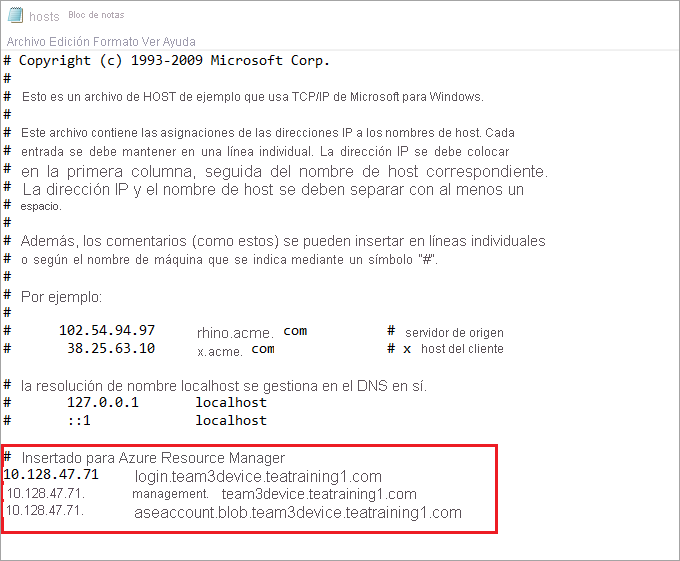

# <a name="deploy-vms-on-your-azure-stack-edge-gpu-device-via-azure-powershell-script"></a>Implementación de VM en el dispositivo Azure Stack Edge con GPU mediante un script de Azure PowerShell

<!--[!INCLUDE [applies-to-skus](../../includes/azure-stack-edge-applies-to-all-sku.md)]-->

En este tutorial se describe cómo crear y administrar una VM en un dispositivo Azure Stack Edge mediante un script de Azure PowerShell.

## <a name="prerequisites"></a>Requisitos previos

Antes de empezar a crear y administrar una máquina virtual en el dispositivo Azure Stack Edge con este script, debe asegurarse de que ha completado los requisitos previos que se indican en los pasos siguientes:

### <a name="for-azure-stack-edge-device-via-the-local-web-ui"></a>Para un dispositivo Azure Stack Edge a través de la interfaz de usuario web local

1. Ha completado la configuración de red en el dispositivo Azure Stack Edge como se describe en [Paso 1: Configuración del dispositivo Azure Stack Edge](azure-stack-edge-j-series-connect-resource-manager.md#step-1-configure-azure-stack-edge-device).

2. Ha habilitado una interfaz de red para proceso. Esta dirección IP de la interfaz de red se utiliza para crear un conmutador virtual para la implementación de la máquina virtual. Los pasos siguientes le guiarán en el proceso:

    1. Vaya a la **Configuración del proceso**. Seleccione la interfaz de red que va a usar para crear un conmutador virtual.

        > [!IMPORTANT] 
        > Solo puede configurar un puerto para Proceso.

    2. Habilite Proceso en la interfaz de red. Azure Stack Edge crea y administra el conmutador virtual correspondiente a esa interfaz de red.

3. Ha creado e instalado todos los certificados en el dispositivo Azure Stack Edge y en el almacén raíz de confianza del cliente. Siga el procedimiento descrito en [Paso 2: Creación e instalación de certificados](azure-stack-edge-j-series-connect-resource-manager.md#step-2-create-and-install-certificates).

### <a name="for-your-windows-client"></a>Para el cliente de Windows

1. Ha definido el protocolo de Internet virtual (VIP) de servicios coherentes de Azure en la página **Red** de la interfaz de usuario web local del dispositivo. Debe agregar este VIP a:

    - El archivo de host en el cliente, o
    - La configuración del servidor DNS.
    
    > [!IMPORTANT]
    > Se recomienda modificar la configuración del servidor DNS para la resolución de nombres del punto de conexión.

    1. Inicie **Bloc de notas** como administrador (se requieren privilegios de administrador para guardar el archivo) y, a continuación, abra el archivo **hosts** ubicado en `C:\Windows\System32\Drivers\etc`.
    
        
    
    2. Agregue las entradas siguientes al archivo de **hosts** reemplazando los valores por los adecuados para el dispositivo:
    
        ```
        <Azure consistent services VIP> login.<appliance name>.<DNS domain>
        <Azure consistent services VIP> management.<appliance name>.<DNS domain>
        <Azure consistent services VIP> <storage name>.blob.<appliance name>.<DNS domain>
        ```
        Para la cuenta de almacenamiento, puede proporcionar el nombre que quiere que el script use más adelante para crear una nueva cuenta de almacenamiento. El script no comprueba si existe la cuenta de almacenamiento.

    3. Use la siguiente imagen como referencia. Guarde el archivo **hosts**.

        

2. [Descargue el script de PowerShell](https://aka.ms/ase-vm-powershell) que se usa en este procedimiento.

3. Asegúrese de que el cliente de Windows ejecuta PowerShell 5.0 o posterior.

4. Asegúrese de que `Azure.Storage Module version 4.5.0` está instalado en el sistema. Puede obtener este módulo en la [Galería de PowerShell](https://www.powershellgallery.com/packages/Azure.Storage/4.5.0). Para instalar este módulo, escriba:

    `Install-Module -Name Azure.Storage -RequiredVersion 4.5.0`

    Para comprobar la versión del módulo instalado, escriba:

    `Get-InstalledModule -name Azure.Storage`

    Para desinstalar cualquier otro módulo de versión, escriba:

    `Uninstall-Module -Name Azure.Storage`

5. [Descargue AzCopy 10](https://docs.microsoft.com/azure/storage/common/storage-use-azcopy-v10#download-azcopy) en el cliente de Windows. Tome nota de esta ubicación, ya que la pasará como parámetro al ejecutar el script.

6. Asegúrese de que el cliente de Windows ejecuta TLS 1.2 o posterior.


## <a name="create-a-vm"></a>Crear una VM

1. Ejecute PowerShell como administrador.
2. Vaya a la carpeta en la que descargó el script en el cliente.  
3. Use el siguiente comando para ejecutar el script:
 
    `.\ArmPowershellClient.ps1 -VNetAddressSpace <AddressSpace> -NicPrivateIp <Private IP> -VHDPath <Path> -VHDFile <VHD File, with extension> -StorageAccountName <Name> -OS <Windows/Linux> -VMSize <Supported VM Size> -VMUserName <UserName to be used to login into VM> -VMPassword <Password for the VM login> --AzCopy10Path <Absolute Path>`

    Estos son los ejemplos en los que se ejecuta el script para crear una VM Windows y una VM Linux.

    **Para una VM Windows:**

    `.\ArmPowershellClient.ps1 -VNetAddressSpace 5.5.0.0/16 -NicPrivateIp 5.5.168.73 -VHDPath \\intel01\d$\vm_vhds\AzureWindowsVMmode -VHDFile WindowsServer2016Datacenter.vhd -StorageAccountName teaaccount1 -OS Windows -VMSize Standard_D1_v2 -VMUserName Administrator -VMPassword Password1 -AzCopy10Path C:\azcopy10\azcopy.exe`

    **Para una VM Linux:**

    `.\ArmPowershellClient.ps1 -VNetAddressSpace 5.5.0.0/16 -NicPrivateIp 5.5.168.83 -VHDPath \\intel01\d$\vm_vhds\AzurestackLinux -VHDFile ubuntu13.vhd -StorageAccountName sa2 -OS Linux -VMSize Standard_D1_v2 -VMUserName Administrator -VMPassword Password1 -AzCopy10Path C:\azcopy10\azcopy.exe`
    
4. Para limpiar los recursos creados por el script, use los comandos siguientes:
    
    ```powershell
    Get-AzureRmVM | Remove-AzureRmVM -Force
    Get-AzureRmNetworkInterface | Remove-AzureRmNetworkInterface -Force
    Get-AzureRmResource | Remove-AzureRmResource -f
    Get-AzureRmResourceGroup | Remove-AzureRmResourceGroup -f
    ```


## <a name="next-steps"></a>Pasos siguientes

[Implementación de máquinas virtuales mediante cmdlets de Azure PowerShell](azure-stack-edge-j-series-deploy-virtual-machine-powershell.md)
