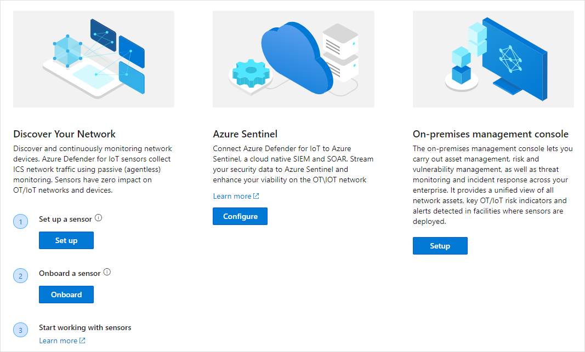

# Inicio rápido: Preparación de la red para la implementación de Azure Defender para IoT

## Selección del hardware
Azure Defender para IoT admite varias aplicaciones certificadas, entre las que se incluyen:
- Dispositivos preconfigurados certificados en los que el software ya está instalado.
- Aplicaciones certificadas no configuradas en las que puede descargar e instalar software de sensor.
- Especificaciones del dispositivo de la consola de administración local. La consola de administración local no está disponible como dispositivo preconfigurado. 

Para más información, consulte la [Guía de especificaciones de hardware](https://aka.ms/AzureDefenderforIoTBareMetalAppliance).

## Instalar componentes
Después de adquirir los componentes de hardware y descargar el paquete de software del portal de Azure Defender para IoT, puede instalar el software de componentes. Para más información, consulte la [Guía de instalación](https://aka.ms/AzureDefenderforIoTInstallSensorISO).

## Incorporación de sensores al portal de Azure Defender para IoT 
 En este artículo se proporciona información general sobre los procesos de implementación, incorporación y actualización de procesos para sensores de Azure Defender para IoT y la consola de administración local. Este proceso se lleva a cabo siguiendo las instrucciones de la página principal de Azure Defender para IoT y las páginas siguientes.

Para abrir la página principal:

1. Inicie sesión en su cuenta de Azure y busque Azure Defender para IoT.

1. Para **implementar los sensores** , se necesita lo siguiente: Comprar el hardware preconfigurado en Arrow o comprar su propio dispositivo e instalar en él software del sensor.
1. Para **implementar la consola de administración local** , es necesario que compre su propio dispositivo e instale en él el software de la consola de administración local. Para obtener más información,

## Configuración de red
Después de instalar los componentes del sistema de Defender para IoT, puede configurar el equipo de red para la supervisión óptima de la red. Para más información, consulte esta [guía de configuración de red](https://aka.ms/AzureDefenderForIoTNetworkSetup).   

## Pasos siguientes

En este artículo, aprendió a prepararse para usar Defender para IoT. Para más información sobre cómo comenzar, consulte el artículo siguiente:

- [Introducción](getting-started.md)