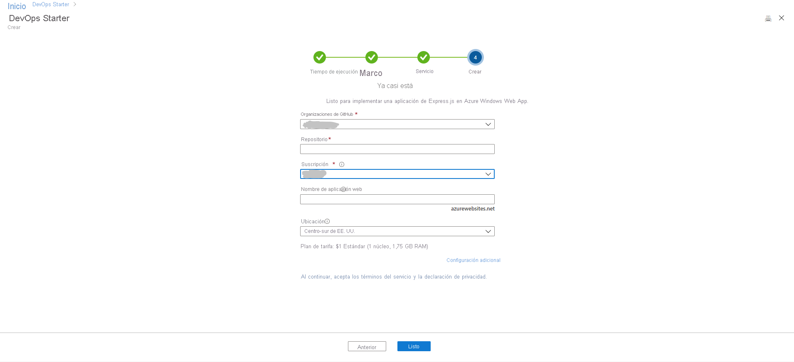
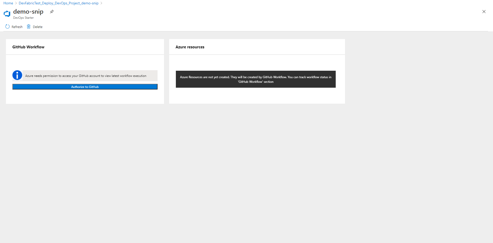
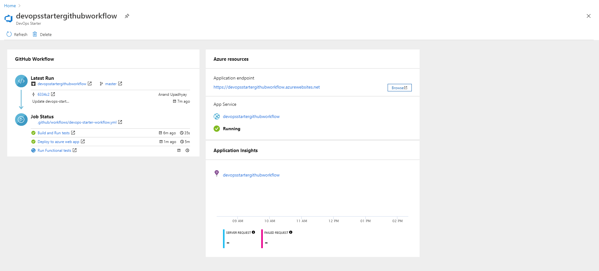

# Configuración de CI/CD para una aplicación de Node.js con DevOps Starter mediante Acciones de GitHub

En este inicio rápido se usa la experiencia simplificada de DevOps Starter para configurar un flujo de trabajo de integración continua (CI) y entrega continua (CD) para una aplicación de Node.js mediante Acciones de GitHub. DevOps Starter se puede usar para configurar todo lo necesario para desarrollar, implementar y supervisar una aplicación. 

## Requisitos previos

- Una cuenta de Azure con una suscripción activa. [Cree una cuenta gratuita](https://azure.microsoft.com/free/?ref=microsoft.com&utm_source=microsoft.com&utm_medium=docs&utm_campaign=visualstudio). 
- Una cuenta de [GitHub](https://github.com/).

## Inicio de sesión en Azure Portal

DevOps Starter crea un flujo de trabajo de CI/CD mediante acciones de GitHub. DevOps Starter también crea recursos de Azure en la suscripción a Azure que prefiera.

1. Inicie sesión en [Azure Portal](https://portal.azure.com).

1. En el cuadro de búsqueda, escriba **DevOps Starter** y, después, selecciónelo. Haga clic en **Agregar** para crear un recurso.

    

## Seleccione una aplicación de ejemplo y el servicio de Azure

1. Haga clic en **Set up DevOps starter with GitHub** (Configurar DevOps Starter con GitHub) en el mensaje emergente lateral derecho.

    

1. Asegúrese de que el proveedor de CI/CD seleccionado sea **Acciones de GitHub**.

    

1. Seleccione la aplicación de ejemplo de **Node.js**. Los ejemplos de Node.js incluyen una opción de varios marcos de trabajo de la aplicación.

1. El marco de trabajo de ejemplo predeterminado es **Express.js**. Deje la configuración predeterminada y seleccione **Siguiente**.   

2. Aplicación web de Windows es el destino de implementación predeterminado. El marco de trabajo de la aplicación que ha elegido antes determina el tipo de destino de implementación del servicio de Azure disponible aquí. Deje el servicio predeterminado y seleccione **Siguiente**.
 
## Configuración de una cuenta de GitHub y una suscripción de Azure 

1. Autentíquese con GitHub.

   1. Haga clic en el botón **Authorize** (Autorizar). 
   
   1. Inicia sesión en GitHub. Si no tiene cuenta de GitHub, puede suscribirse aquí también.

2. Elija una **organización de GitHub** existente. 
   
   1. Elija un nombre para el repositorio de GitHub. 
   
   1. Seleccione la suscripción de Azure y la ubicación, elija el nombre de la aplicación y seleccione **Listo**.
    
       

    En unos minutos, el panel de DevOps Starter se muestra en Azure Portal. Hay una aplicación de ejemplo instalada en un repositorio de la organización de Azure DevOps, se ha desencadenado un flujo se trabajo de GitHub y la aplicación está implementada en Azure. Este panel proporciona visibilidad sobre el repositorio de código, el flujo de trabajo de GitHub y la aplicación en Azure.
   
3. Seleccione **Examinar** para ver la aplicación en ejecución.
    
    El panel contiene detalles del flujo de trabajo de GitHub y de los recursos de Azure. Para ver los detalles del flujo de trabajo de GitHub, como la ejecución más reciente, las confirmaciones y el estado de los trabajos, deberá seleccionar **Authorize to GitHub** (Autorizar para GitHub).
   
   

DevOps Starter configuró automáticamente un flujo de trabajo de GitHub con trabajos de compilación e implementación mediante acciones de GitHub. Ahora ya puede colaborar con un equipo en una aplicación de Node.js con un proceso de CI/CD que implemente automáticamente el trabajo más reciente en su sitio web.

   

## Confirmación de los cambios de código y ejecución de CI/CD

DevOps Starter crea un repositorio en GitHub. Para ver el repositorio y realizar cambios en el código de la aplicación, siga estos pasos:

1. En el lado izquierdo del panel de DevOps Starter, seleccione el vínculo de la rama maestra. Este vínculo abre una vista al repositorio de GitHub recién creado.

1. Para ver la dirección URL de clonación del repositorio, seleccione **Clonar** en la parte superior derecha del explorador. Puede clonar el repositorio de Git en su IDE favorito. En los pasos siguientes, puede usar el explorador web para realizar cambios en el código y confirmarlos directamente en la rama maestra.

1. En el lado izquierdo del explorador, vaya al archivo **/Application/views/index.pug**.

1. Seleccione **Editar** y realice un cambio en alguna parte del texto.
    Por ejemplo, cambie parte del texto de una de las etiquetas.

1. Seleccione **Confirmar** y guarde los cambios.

1. En el explorador, vaya al panel de DevOps Starter.   
Ahora, debería ver un trabajo de compilación del flujo de trabajo de GitHub en curso. Los cambios que ha realizado se compilan e implementan automáticamente a través de un flujo de trabajo de GitHub.

## Visualización del flujo de trabajo de GitHub

En el paso anterior, DevOps Starter configuró automáticamente un flujo de trabajo completo de GitHub. Explore y personalice el flujo de trabajo según sea necesario. Siga estos pasos para familiarizarse con el flujo de trabajo.

1. A la izquierda del panel de DevOps Starter, seleccione **GitHub workflow** (Flujo de trabajo de GitHub). Este vínculo abre una pestaña del explorador y el flujo de trabajo de GitHub del nuevo proyecto.
    > [!NOTE]
    > No cambie el nombre del archivo de flujo de trabajo. Este nombre debe ser **devops-starter-workflow.yml** para que el panel refleje los cambios.

1. El archivo YAML del flujo de trabajo contiene todas las acciones de GitHub necesarias para compilar e implementar la aplicación. Haga clic en la opción **Edit file** (Editar archivo) para personalizar el archivo de flujo de trabajo.

1. En la pestaña **Code** (Código) del repositorio, haga clic en **Commits** (Confirmaciones). Esta vista muestra las confirmaciones de código asociadas a la implementación concreta.

1. En la pestaña **Actions** (Acciones) del repositorio, puede ver el historial de todas las ejecuciones de flujos de trabajo del repositorio.

1. Seleccione **Latest run** (Última ejecución) para ver todos los trabajos que se ejecutaron en el flujo de trabajo.

1. Haga clic en los **trabajos** para ver los registros detallados de la ejecución del flujo de trabajo. Los registros contienen información útil sobre el proceso de implementación. Pueden verse durante y después de las implementaciones.

1. Haga clic en la pestaña **Pull request** (Solicitud de incorporación de cambios) para ver todas las solicitudes de incorporación de cambios que hay en el repositorio.

## Limpieza de recursos

Azure App Service y otros recursos relacionados se pueden eliminar cuando no se necesiten. Use la funcionalidad **Eliminación** del panel de DevOps Starter.

## Pasos siguientes

Cuando configuró el proceso de CI/CD, el flujo de trabajo de GitHub se creó automáticamente. Este flujo de trabajo se puede modificar para satisfacer las necesidades de su equipo. Para más información sobre Acciones de GitHub y el flujo de trabajo, consulte:

> [!div class="nextstepaction"]
> [Personalización del flujo de trabajo de GitHub](https://docs.github.com/actions/configuring-and-managing-workflows/configuring-and-managing-workflow-files-and-runs)
