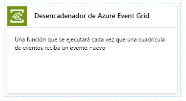
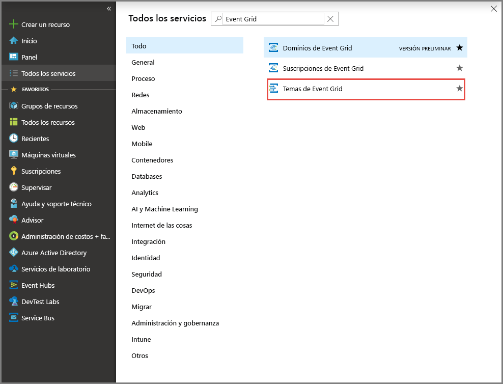
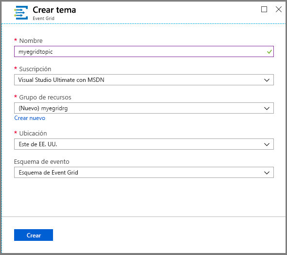
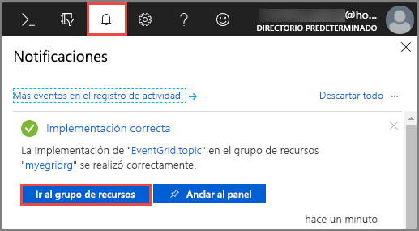
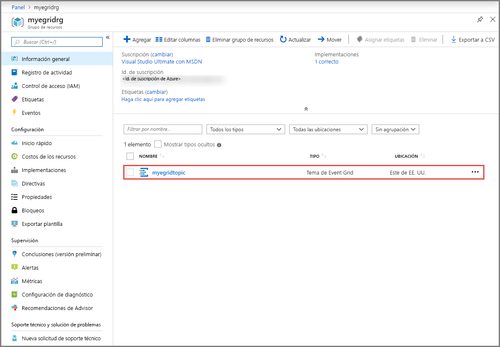
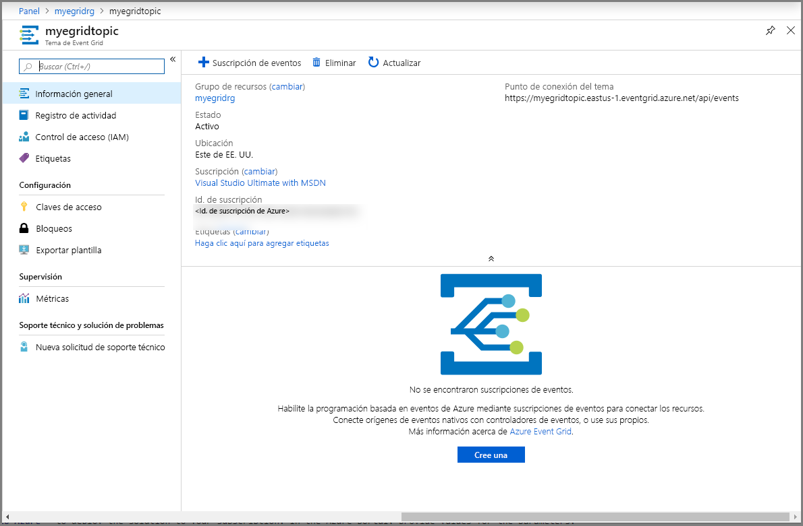
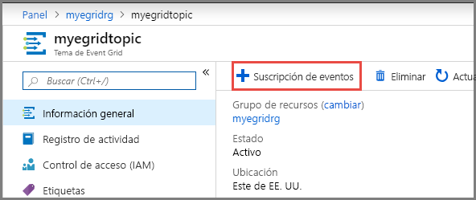
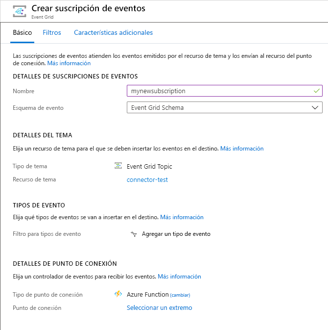
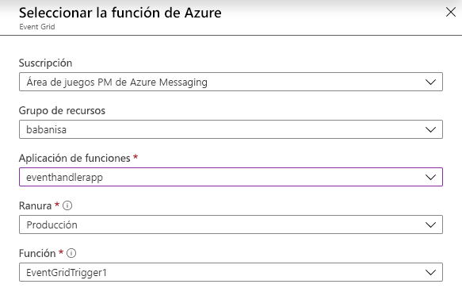
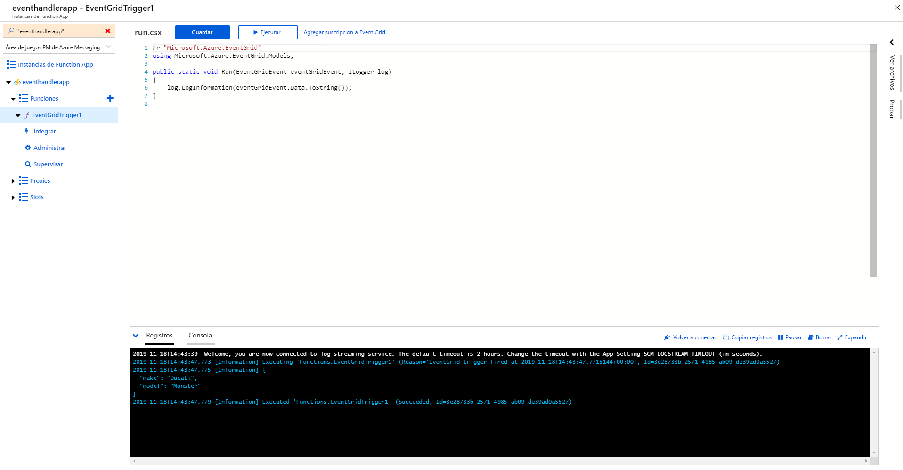

# <a name="quickstart-route-custom-events-to-an-azure-function-with-event-grid"></a>Inicio rápido: Enrutamiento de eventos personalizados a una instancia de Azure Functions con Event Grid

Azure Event Grid es un servicio de eventos para la nube. Azure Functions es uno de los controladores de eventos compatibles. En este artículo, se usa Azure Portal para crear un tema personalizado, suscribirse al tema y desencadenar el evento para ver el resultado. Los eventos se envían a una instancia de Azure Functions.

[!INCLUDE [quickstarts-free-trial-note.md](../../includes/quickstarts-free-trial-note.md)]

## <a name="create-azure-function"></a>Creación de una función de Azure

Antes de suscribirse al tema personalizado, vamos a crear una función que controle los eventos. En Azure Portal, haga clic en "Crear un recurso", escriba "function", elija "Function App" y haga clic en Crear. Seleccione "Crear nuevo" en el grupo de recursos y asígnele un nombre. Lo usará en el resto del tutorial. Asigne un nombre a la aplicación de funciones, deje el conmutador de alternancia "Publish" en "Código", seleccione cualquier runtime y región, y pulse Crear.

Una vez que la aplicación de funciones esté lista, vaya a ella y haga clic en "+ Nueva función". Seleccione "En el portal" para el entorno de desarrollo y pulse Continuar. En Crear una función, elija "Más plantillas" para ver más plantillas, busque "Azure Event Grid Trigger" (Desencadenador de Azure Event Grid) y selecciónela. Si es la primera vez que usa este desencadenador, es posible que tenga que hacer clic en "Install" para instalar la extensión.



Una vez que haya instalado la extensión, haga clic en Continuar, asigne un nombre a la función y pulse Crear.

[!INCLUDE [event-grid-register-provider-portal.md](../../includes/event-grid-register-provider-portal.md)]

## <a name="create-a-custom-topic"></a>Creación de un tema personalizado

Un tema de cuadrícula de eventos proporciona un punto de conexión definido por el usuario en el que se registran los eventos. 

1. Inicie sesión en el [portal de Azure](https://portal.azure.com/).
2. Seleccione **Todos los servicios** en el menú de navegación izquierdo, busque **Event Grid** y seleccione **Temas de Event Grid**. 

    
3. En la página **Temas de Event Grid**, seleccione **+ Agregar** en la barra de herramientas. 

    

4. En la página **Crear tema**, siga estos pasos:

    1. Escriba un **nombre** único para el tema personalizado. El nombre del tema debe ser único porque se representa mediante una entrada DNS. No use el nombre que se muestra en la imagen. En su lugar, cree su propio nombre: debe tener entre 3 y 50 caracteres y contener solo los valores a-z, A-Z, 0-9 y "-".
    2. Selección la **suscripción**de Azure.
    3. Seleccione el mismo grupo de recursos que en los pasos anteriores.
    4. Seleccione una **ubicación** para el tema de Event Grid.
    5. Mantenga el valor predeterminado **Esquema de Event Grid** para el campo **Esquema de eventos**. 

       
    6. Seleccione **Crear**. 

5. Cuando se ha creado el tema personalizado, se ve la notificación de que la operación se ha realizado correctamente. Seleccione **Ir al grupo de recursos**. 

   

6. En la página **Grupo de recursos**, seleccione el tema de Event Grid. 

   

7. Verá la página **Tema de Event Grid** de la cuadrícula de eventos. Mantenga esta página abierta. La usará más adelante en este inicio rápido. 

    

## <a name="subscribe-to-custom-topic"></a>Suscripción a un tema personalizado

Suscríbase a un tema de cuadrícula de eventos que indique a Event Grid los eventos cuyo seguimiento desea realizar y el lugar al que deben enviarse los eventos.

1. Ahora, en la página **Tema de Event Grid** de su tema personalizado, seleccione **+ Suscripción de eventos** en la barra de herramientas.

   

2. En la página **Crear suscripción de eventos**, siga estos pasos:
    1. Escriba un **nombre** para la suscripción a eventos.
    3. Seleccione **Función de Azure** en **Tipo de punto de conexión**. 
    4. Elija **Seleccionar un punto de conexión**. 

       

    5. Para el punto de conexión de la función, seleccione la suscripción de Azure y el grupo de recursos en que está la aplicación de funciones y, después, seleccione la aplicación de funciones y la función que creó anteriormente. Seleccione **Confirm Selection** (Confirmar selección).

       

    6. De nuevo en la página **Crear suscripción de eventos**, seleccione **Crear**.

## <a name="send-an-event-to-your-topic"></a>Envío de un evento al tema

Ahora, vamos a desencadenar un evento para ver cómo Event Grid distribuye el mensaje al punto de conexión. Use la CLI de Azure o PowerShell para enviar un evento de prueba a su tema personalizado. Normalmente, una aplicación o servicio de Azure enviaría los datos del evento.

En el primer ejemplo se utiliza la CLI de Azure. Se obtiene la dirección URL y la clave del tema personalizado, y los datos de evento de ejemplo. Use su nombre de un tema personalizado para `<topic name>`. Se crean datos de evento de ejemplo. El elemento `data` del archivo JSON es la carga del evento. En este campo, puede usar cualquier archivo JSON bien formado. También puede usar el campo de asunto para realizar enrutamiento y filtrado avanzados. CURL es una utilidad que envía solicitudes HTTP.


### <a name="azure-cli"></a>Azure CLI
1. En Azure Portal, seleccione **Cloud Shell**. Seleccione **Bash** en la esquina superior izquierda de la ventana Cloud Shell. 

    
1. Ejecute el comando siguiente para obtener el **punto de conexión** para el tema: Después de copiar y pegar el comando, actualice el **nombre del tema** y el **nombre del grupo de recursos** antes de ejecutar el comando. 

    ```azurecli
    endpoint=$(az eventgrid topic show --name <topic name> -g <resource group name> --query "endpoint" --output tsv)
    ```
2. Ejecute el siguiente comando para obtener la **clave** para el tema personalizado: Después de copiar y pegar el comando, actualice el **nombre del tema** y el **nombre del grupo de recursos** antes de ejecutar el comando. 

    ```azurecli
    key=$(az eventgrid topic key list --name <topic name> -g <resource group name> --query "key1" --output tsv)
    ```
3. Copie la siguiente instrucción con la definición del evento y presione **ENTRAR**. 

    ```json
    event='[ {"id": "'"$RANDOM"'", "eventType": "recordInserted", "subject": "myapp/vehicles/motorcycles", "eventTime": "'`date +%Y-%m-%dT%H:%M:%S%z`'", "data":{ "make": "Ducati", "model": "Monster"},"dataVersion": "1.0"} ]'
    ```
4. Ejecute el siguiente comando de **CURL** para publicar el evento:

    ```
    curl -X POST -H "aeg-sas-key: $key" -d "$event" $endpoint
    ```

### <a name="azure-powershell"></a>Azure PowerShell
El segundo ejemplo usa PowerShell para realizar pasos similares.

1. En Azure Portal, seleccione **Cloud Shell** (o vaya a `https://shell.azure.com/`). Seleccione **PowerShell** en la esquina superior izquierda de la ventana Cloud Shell. Vea el la imagen de la ventana **Cloud Shell** del ejemplo en la sección de la CLI de Azure.
2. Establezca las siguientes variables. Después de copiar y pegar cada comando, actualice el **nombre del tema** y el **nombre del grupo de recursos** antes de ejecutar el comando:

    ```powershell
    $resourceGroupName = <resource group name>
    $topicName = <topic name>
    ```
3. Ejecute los siguientes comandos para obtener el **punto de conexión** y las **claves** del tema:

    ```powershell
    $endpoint = (Get-AzEventGridTopic -ResourceGroupName $resourceGroupName -Name $topicName).Endpoint
    $keys = Get-AzEventGridTopicKey -ResourceGroupName $resourceGroupName -Name $topicName
    ```
4. Prepare el evento. Copie y ejecute las instrucciones en la ventana Cloud Shell. 

    ```powershell
    $eventID = Get-Random 99999

    #Date format should be SortableDateTimePattern (ISO 8601)
    $eventDate = Get-Date -Format s

    #Construct body using Hashtable
    $htbody = @{
        id= $eventID
        eventType="recordInserted"
        subject="myapp/vehicles/motorcycles"
        eventTime= $eventDate   
        data= @{
            make="Ducati"
            model="Monster"
        }
        dataVersion="1.0"
    }
    
    #Use ConvertTo-Json to convert event body from Hashtable to JSON Object
    #Append square brackets to the converted JSON payload since they are expected in the event's JSON payload syntax
    $body = "["+(ConvertTo-Json $htbody)+"]"
    ```
5. Use el cmdlet **Invoke-WebRequest** para enviar el evento. 

    ```powershell
    Invoke-WebRequest -Uri $endpoint -Method POST -Body $body -Headers @{"aeg-sas-key" = $keys.Key1}
    ```

### <a name="verify-in-the-event-grid-viewer"></a>Comprobación en Visor de Event Grid
Ha desencadenado el evento y Event Grid ha enviado el mensaje al punto de conexión que configuró al realizar la suscripción. Vaya a la función desencadenada por Event Grid y abra los registros, donde debería ver una copia de la carga de datos del evento. Si no la ve, asegúrese de que abre primero los registros, o pulsa Volver a conectar, y luego intente volver a enviar el evento de prueba.



## <a name="clean-up-resources"></a>Limpieza de recursos
Si piensa seguir trabajando con este evento, no limpie los recursos creados en este artículo. De lo contrario, elimine los recursos que ha creado en este artículo.

1. Seleccione **Grupos de recursos** en el menú de la izquierda. Si no lo ve en el menú izquierdo, seleccione **Todos los servicios** en el menú de la izquierda y, después, seleccione **Grupos de recursos**. 
2. Seleccione el grupo de recursos para iniciar la página **Grupo de recursos**. 
3. Seleccione **Eliminar grupo de recursos** en la barra de herramientas. 
4. Confirme la eliminación; para ello, escriba el nombre del grupo de recursos y seleccione **Eliminar**. 

    

    El otro grupo de recursos que se ve en la imagen ha sido creado y utilizado por la ventana Cloud Shell. Elimínelo si no va a usar la ventana Cloud Shell más adelante. 

## <a name="next-steps"></a>Pasos siguientes

Ahora que sabe cómo crear suscripciones a temas y eventos, aprenda más sobre cómo Event Grid puede ayudarle:

- [Una introducción a Azure Event Grid](overview.md)
- [Enrutamiento de eventos de Blob Storage a un punto de conexión web personalizado](../storage/blobs/storage-blob-event-quickstart.md?toc=%2fazure%2fevent-grid%2ftoc.json)
- [Supervisión de los cambios en máquinas virtuales con Azure Event Grid y Logic Apps](monitor-virtual-machine-changes-event-grid-logic-app.md)
- [Transmisión de macrodatos a un almacén de datos](event-grid-event-hubs-integration.md)
