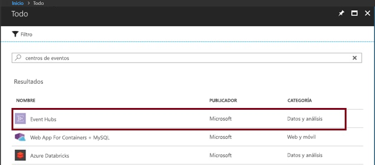
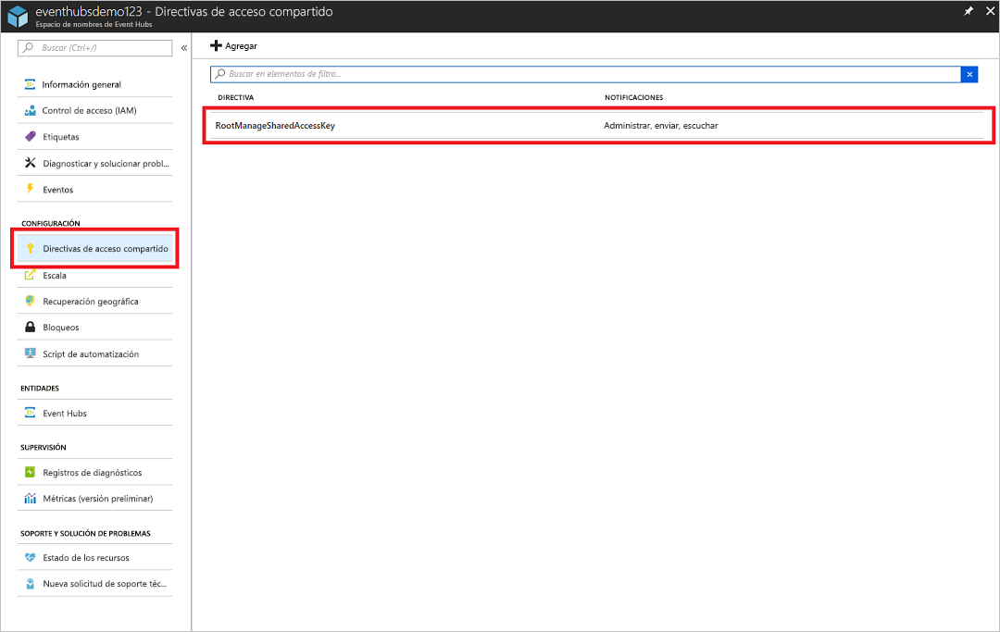
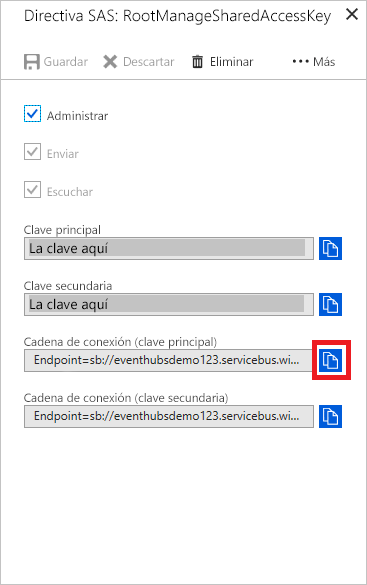

# <a name="stream-into-event-hubs-for-the-apache-kafka"></a>Streaming en Event Hubs para Apache Kafka
En esta guía de inicio rápido se muestra cómo transmitir a instancias de Event Hubs habilitadas para Kafka sin cambiar los clientes del protocolo o ejecutar sus propios clústeres. Va a aprender a usar sus productores y consumidores para hablar con instancias de Event Hubs habilitadas para Kafka con un simple cambio de configuración en sus aplicaciones. Azure Event Hubs admite [Apache Kafka versión 1.0.](https://kafka.apache.org/10/documentation.html)

> [!NOTE]
> Este ejemplo está disponible en [GitHub](https://github.com/Azure/azure-event-hubs-for-kafka/tree/master/quickstart/java).

## <a name="prerequisites"></a>Requisitos previos

Para completar esta guía de inicio rápido, asegúrese de cumplir los siguientes requisitos previos:

* Lea el artículo [Event Hubs para Apache Kafka](event-hubs-for-kafka-ecosystem-overview.md).
* Una suscripción de Azure. Si no tiene una, cree una [cuenta gratuita](https://azure.microsoft.com/free/?ref=microsoft.com&utm_source=microsoft.com&utm_medium=docs&utm_campaign=visualstudio) antes de empezar.
* [Kit de desarrollo de Java (JDK) 1.7+](https://aka.ms/azure-jdks).
* [Descargue](https://maven.apache.org/download.cgi) e [instale](https://maven.apache.org/install.html) un archivo binario de Maven.
* [Git](https://www.git-scm.com/)
* [Un espacio de nombres de Event Hubs habilitado para Kafka](event-hubs-create.md)

## <a name="create-a-kafka-enabled-event-hubs-namespace"></a>Creación de un espacio de nombres de Event Hubs habilitado para Kafka

1. Inicie sesión en [Azure Portal](https://portal.azure.com) y haga clic en **Crear un recurso** en la parte superior izquierda de la pantalla.

2. Busque Event Hubs y seleccione las opciones que se muestran aquí:
    
    
 
3. Proporcione un nombre único y habilite a Kafka en el espacio de nombres. Haga clic en **Create**(Crear). Nota: Event Hubs para Kafka solo es compatible con los niveles Estándar y Dedicado de Event Hubs. El nivel Básico de Event Hubs devolverá un error de autorización de tema en respuesta a las operaciones de Kafka.
    
    
 
4. Una vez que se crea el espacio de nombres, en la pestaña **Configuración**, haga clic en **Directivas de acceso compartido** para obtener la cadena de conexión.

    

5. Puede elegir la directiva **RootManageSharedAccessKey** predeterminada o agregar una nueva directiva. Haga clic en el nombre de la directiva y copie la cadena de conexión. 
    
    
 
6. Agregue esta cadena de conexión a la configuración de la aplicación de Kafka.

Ahora puede transmitir eventos desde las aplicaciones que usan el protocolo de Kafka en Event Hubs.

## <a name="send-and-receive-messages-with-kafka-in-event-hubs"></a>Envío y recepción de mensajes con Kafka en Event Hubs

1. Clone el [repositorio de Azure Event Hubs para Kafka](https://github.com/Azure/azure-event-hubs-for-kafka).

2. Vaya a `azure-event-hubs-for-kafka/quickstart/java/producer`.

3. Actualice los detalles de configuración para el productor en `src/main/resources/producer.config` de la siguiente manera:

    ```xml
    bootstrap.servers={YOUR.EVENTHUBS.FQDN}:9093
    security.protocol=SASL_SSL
    sasl.mechanism=PLAIN
    sasl.jaas.config=org.apache.kafka.common.security.plain.PlainLoginModule required username="$ConnectionString" password="{YOUR.EVENTHUBS.CONNECTION.STRING}";
    ```
    
4. Ejecute el código de productor y transmítalo a Event Hubs habilitado para Kafka:
   
    ```shell
    mvn clean package
    mvn exec:java -Dexec.mainClass="TestProducer"                                    
    ```
    
5. Vaya a `azure-event-hubs-for-kafka/quickstart/java/consumer`.

6. Actualice los detalles de configuración para el consumidor en `src/main/resources/consumer.config` de la siguiente manera:
   
    ```xml
    bootstrap.servers={YOUR.EVENTHUBS.FQDN}:9093
    security.protocol=SASL_SSL
    sasl.mechanism=PLAIN
    sasl.jaas.config=org.apache.kafka.common.security.plain.PlainLoginModule required username="$ConnectionString" password="{YOUR.EVENTHUBS.CONNECTION.STRING}";
    ```

7. Ejecute el código de consumidor y procéselo desde Event Hubs habilitado para Kafka mediante los clientes de Kafka:

    ```java
    mvn clean package
    mvn exec:java -Dexec.mainClass="TestConsumer"                                    
    ```

Si el clúster de Kafka de Event Hubs tiene eventos, ahora comenzará a recibirlos desde el consumidor.

## <a name="next-steps"></a>Pasos siguientes
En este artículo se muestra cómo hacer streaming a instancias de Event Hubs habilitadas para Kafka sin cambiar los clientes del protocolo o ejecutar sus propios clústeres. Para más información, continúe con el siguiente tutorial:

* [Más información sobre Events Hubs](event-hubs-what-is-event-hubs.md)
* [Información sobre Event Hubs para Kafka](event-hubs-for-kafka-ecosystem-overview.md)
* [Más ejemplos en GitHub de Event Hubs para Kafka](https://github.com/Azure/azure-event-hubs-for-kafka)
* Use [MirrorMaker](https://cwiki.apache.org/confluence/pages/viewpage.action?pageId=27846330) para [transmitir eventos desde Kafka local a una instancia de Event Hubs habilitada para Kafka en la nube](event-hubs-kafka-mirror-maker-tutorial.md).
* Aprenda a transmitir en Event Hubs habilitado para Kafka mediante [Apache Flink](event-hubs-kafka-flink-tutorial.md) o [Akka Streams](event-hubs-kafka-akka-streams-tutorial.md)
