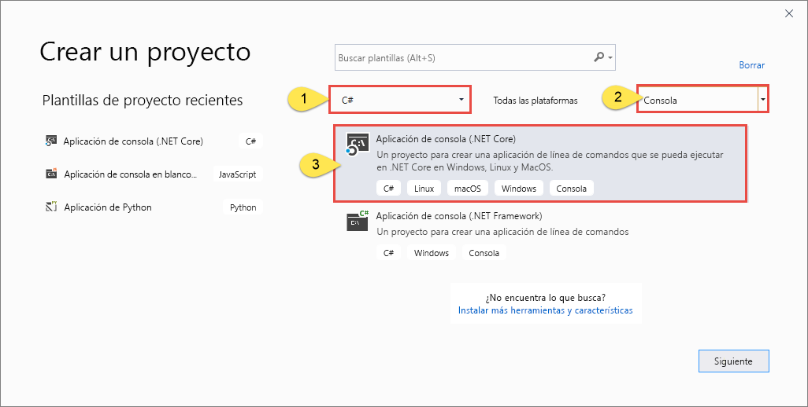
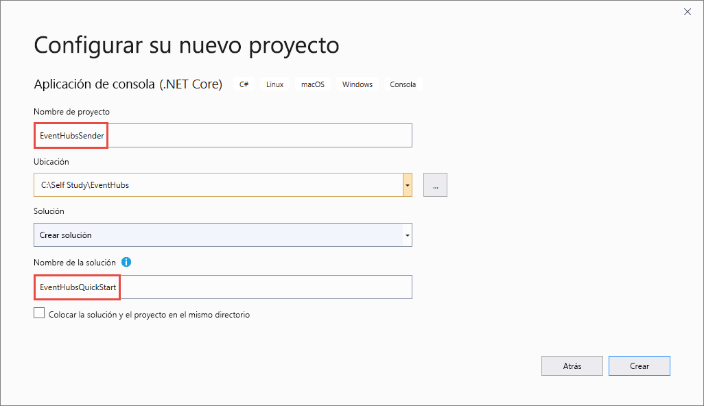

# <a name="send-events-to-and-receive-events-from-azure-event-hubs---net-azuremessagingeventhubs"></a>Envío y recepción de eventos desde Azure Event Hubs: .NET (Azure.Messaging.EventHubs) 
En este inicio rápido se muestra cómo enviar y recibir eventos desde un centro de eventos mediante la biblioteca de .NET **Azure.Messaging.EventHubs**. 

> [!IMPORTANT]
> Este inicio rápido usa la nueva biblioteca del servicio **Azure.Messaging.EventHubs**. Para ver un inicio rápido que use la biblioteca **Microsoft.Azure.EventHubs**anterior, consulte [Envío y recepción de eventos mediante la biblioteca Microsoft.Azure.EventHubs](event-hubs-dotnet-standard-getstarted-send.md). 


## <a name="prerequisites"></a>Prerrequisitos
Si es la primera vez que usa Azure Event Hubs, consulte la [información general de Event Hubs](event-hubs-about.md) antes de continuar con este inicio rápido. 

Para completar este tutorial de inicio rápido, debe cumplir los siguientes requisitos previos:

- Una **suscripción a Microsoft Azure**. Para usar los servicios de Azure, entre los que se incluye Azure Event Hubs, se necesita una suscripción.  Si no se dispone de una cuenta de Azure, es posible registrarse para obtener una [evaluación gratuita](https://azure.microsoft.com/free/), o bien usar las ventajas que disfrutan los suscriptores MSDN al [crear una cuenta](https://azure.microsoft.com).
- **Microsoft Visual Studio 2019**. La biblioteca cliente de Azure Event Hubs utiliza las nuevas características que se introdujeron en C# 8.0.  Aunque puede seguir usando la biblioteca con versiones anteriores de C#, la nueva sintaxis no estará disponible. Para usar la sintaxis completa, se recomienda realizar la compilación con el [SDK de .NET Core](https://dotnet.microsoft.com/download) 3.0 o superior y la [versión de lenguaje](/dotnet/csharp/language-reference/configure-language-version#override-a-default) establecida en `latest`. Si usa Visual Studio, las versiones anteriores a Visual Studio 2019 no son compatibles con las herramientas necesarias para compilar proyectos de C# 8.0. Visual Studio 2019, incluida la edición gratuita Community, se puede descargar [aquí](https://visualstudio.microsoft.com/vs/).
- **Creación de un espacio de nombres de Event Hubs y un centro de eventos**. El primer paso consiste en usar [Azure Portal](https://portal.azure.com) para crear un espacio de nombres de tipo Event Hubs y obtener las credenciales de administración que la aplicación necesita para comunicarse con el centro de eventos. Para crear un espacio de nombres y un centro de eventos, siga el procedimiento que se indica en [este artículo](event-hubs-create.md). Después, obtenga la **cadena de conexión para el espacio de nombres de Event Hubs**. Para ello, siga las instrucciones del artículo: [Obtenga la cadena de conexión](event-hubs-get-connection-string.md#get-connection-string-from-the-portal). La utilizará más adelante en este inicio rápido.

## <a name="send-events"></a>Envío de eventos 
En esta sección se muestra cómo crear una aplicación de consola de .NET Core para enviar eventos a un centro de eventos. 

### <a name="create-a-console-application"></a>Creación de una aplicación de consola

1. Inicie Visual Studio 2019. 
1. Seleccione **Crear un proyecto**. 
1. En el cuadro de diálogo **Crear un nuevo proyecto**, siga estos pasos: Si no ve este cuadro de diálogo, seleccione **Archivo** en el menú, seleccione **Nuevo** y, después, seleccione **Proyecto**. 
    1. Seleccione **C#** como lenguaje de programación.
    1. Seleccione **Consola** como tipo de aplicación. 
    1. Seleccione **Aplicación de consola (.NET Core)** en la lista de resultados. 
    1. Después, seleccione **Siguiente**. 

            
1. Escriba **EventHubsSender** como nombre del proyecto, **EventHubsQuickStart** como nombre de la solución y, después, seleccione **Aceptar** para crear el proyecto. 

    

### <a name="add-the-event-hubs-nuget-package"></a>Incorporación del paquete NuGet de Event Hubs

1. Seleccione **Herramientas** > **Administrador de paquetes NuGet** > **Consola del Administrador de paquetes** en el menú. 
1. Ejecute el siguiente comando para instalar el paquete NuGet **Azure.Messaging.EventHubs**:

    ```cmd
    Install-Package Azure.Messaging.EventHubs
    ```


### <a name="write-code-to-send-messages-to-the-event-hub"></a>Escritura de código para enviar mensajes al centro de eventos

1. Agregue las siguientes instrucciones `using` al principio del archivo **Program.cs**:

    ```csharp
    using System.Text;
    using System.Threading.Tasks;
    using Azure.Messaging.EventHubs;
    using Azure.Messaging.EventHubs.Producer;
    ```

2. Agregue constantes a la clase `Program` de la cadena de conexión de Event Hubs y del nombre del centro de eventos. Reemplace los marcadores de posición entre llaves por los valores adecuados que recibió al crear el centro de eventos. Asegúrese de que `{Event Hubs namespace connection string}` es la cadena de conexión en el nivel de espacio de nombres y no la cadena de Event Hub. 

    ```csharp
    private const string connectionString = "<EVENT HUBS NAMESPACE - CONNECTION STRING>";
    private const string eventHubName = "<EVENT HUB NAME>";
    ```

3. Reemplace el método `Main` por el siguiente método `async Main`. Vea los comentarios de código para obtener más detalles. 

    ```csharp
        static async Task Main()
        {
            // Create a producer client that you can use to send events to an event hub
            await using (var producerClient = new EventHubProducerClient(connectionString, eventHubName))
            {
                // Create a batch of events 
                using EventDataBatch eventBatch = await producerClient.CreateBatchAsync();

                // Add events to the batch. An event is a represented by a collection of bytes and metadata. 
                eventBatch.TryAdd(new EventData(Encoding.UTF8.GetBytes("First event")));
                eventBatch.TryAdd(new EventData(Encoding.UTF8.GetBytes("Second event")));
                eventBatch.TryAdd(new EventData(Encoding.UTF8.GetBytes("Third event")));

                // Use the producer client to send the batch of events to the event hub
                await producerClient.SendAsync(eventBatch);
                Console.WriteLine("A batch of 3 events has been published.");
            }
        }
    ```
5. Compile el proyecto y asegúrese de que no hay errores.
6. Ejecute el programa y espere el mensaje de confirmación. 
7. En Azure Portal, puede comprobar que el centro de eventos ha recibido los mensajes. Cambie a la vista **Mensajes** en la sección **Métricas**. Actualice la página para actualizar el gráfico. Puede tardar unos segundos en mostrar que los mensajes se han recibido. 

    [](./media/getstarted-dotnet-standard-send-v2/verify-messages-portal.png#lightbox)

    > [!NOTE]
    > Para ver el código fuente completo con comentarios muy útiles, consulte [este archivo en GitHub](https://github.com/Azure/azure-sdk-for-net/blob/master/sdk/eventhub/Azure.Messaging.EventHubs/samples/Sample03_PublishAnEventBatch.cs).

## <a name="receive-events"></a>Recepción de eventos
En esta sección se muestra cómo escribir una aplicación de consola de .NET Core que reciba mensajes de un centro de eventos mediante un procesador de eventos. El procesador de eventos simplifica la recepción de eventos desde centros de eventos mediante la administración de puntos de control persistentes y las recepciones paralelas desde esos centros de eventos. Un procesador de eventos está asociado a un centro de eventos concreto y a un grupo de consumidores. Recibe eventos de varias particiones del centro de eventos y los pasa a un controlador delegado para que realice el procesamiento mediante el código que se ha especificado. 


> [!NOTE]
> Si trabaja en Azure Stack Hub, esa plataforma puede admitir una versión diferente del SDK de Blob Storage que las que suelen estar disponibles en Azure. Por ejemplo, si trabaja [en la versión 2002 de Azure Stack Hub](/azure-stack/user/event-hubs-overview), la versión más alta disponible para el servicio Storage es 2017-11-09. En este caso, además de seguir los pasos de esta sección, también tendrá que agregar código para usar como destino la versión 2017-11-09 de la API del servicio de almacenamiento. Consulte [este ejemplo en GitHub](https://github.com/Azure/azure-sdk-for-net/tree/master/sdk/eventhub/Azure.Messaging.EventHubs.Processor/samples/Sample10_RunningWithDifferentStorageVersion.cs) para ver cómo usar como destino una versión específica de la API de Storage. Para más información sobre las versiones del servicio Azure Storage que se admiten en Azure Stack Hub, consulte [Almacenamiento de Azure Stack Hub: diferencias y consideraciones](/azure-stack/user/azure-stack-acs-differences).

### <a name="create-an-azure-storage-and-a-blob-container"></a>Creación de una instancia de Azure Storage y un contenedor de blobs de Azure Storage
En este inicio rápido, se usa Azure Storage como almacén de puntos de control. Siga estos pasos para crear una cuenta de Azure Storage. 

1. [Creación de una cuenta de Azure Storage](../storage/common/storage-account-create.md?tabs=azure-portal)
2. [Creación de un contenedor de blobs](../storage/blobs/storage-quickstart-blobs-portal.md#create-a-container)
3. [Obtención de la cadena de conexión para una cuenta de almacenamiento](../storage/common/storage-configure-connection-string.md)

    Anote la cadena de conexión y el nombre del contenedor. Los usará en el código de recepción. 


### <a name="create-a-project-for-the-receiver"></a>Creación de un proyecto para el destinatario

1. En la ventana del Explorador de soluciones, haga clic con el botón derecho en la solución **EventHubQuickStart**, haga clic en **Agregar** y seleccione **Nuevo proyecto**. 
1. Seleccione **Aplicación de consola (.NET Core)** y, después, **Siguiente**. 
1. Escriba **EventHubsReceiver** en **Nombre de proyecto** y seleccione **Crear**. 

### <a name="add-the-event-hubs-nuget-package"></a>Incorporación del paquete NuGet de Event Hubs

1. Seleccione **Herramientas** > **Administrador de paquetes NuGet** > **Consola del Administrador de paquetes** en el menú. 
1. Ejecute el siguiente comando para instalar el paquete NuGet **Azure.Messaging.EventHubs**:

    ```cmd
    Install-Package Azure.Messaging.EventHubs
    ```
1. Ejecute el siguiente comando para instalar el paquete NuGet **Azure.Messaging.EventHubs.Processor**:

    ```cmd
    Install-Package Azure.Messaging.EventHubs.Processor
    ```    

### <a name="update-the-main-method"></a>Actualización del método Main 

1. Agregue las siguientes instrucciones `using` al principio del archivo **Program.cs**.

    ```csharp
    using System.Text;
    using System.Threading.Tasks;
    using Azure.Storage.Blobs;
    using Azure.Messaging.EventHubs;
    using Azure.Messaging.EventHubs.Consumer;
    using Azure.Messaging.EventHubs.Processor;
    ```
1. Agregue constantes a la clase `Program` de la cadena de conexión de Event Hubs y del nombre del centro de eventos. Reemplace los marcadores de posición entre llaves por los valores adecuados que recibió al crear el centro de eventos. Reemplace los marcadores de posición entre llaves por los valores adecuados que recibió al crear el centro de eventos y la cuenta de almacenamiento (claves de acceso y cadena de conexión principal). Asegúrese de que `{Event Hubs namespace connection string}` es la cadena de conexión en el nivel de espacio de nombres y no la cadena de Event Hub.

    ```csharp
        private const string ehubNamespaceConnectionString = "<EVENT HUBS NAMESPACE - CONNECTION STRING>";
        private const string eventHubName = "<EVENT HUB NAME>";
        private const string blobStorageConnectionString = "<AZURE STORAGE CONNECTION STRING>";
        private const string blobContainerName = "<BLOB CONTAINER NAME>";
    ```
3. Reemplace el método `Main` por el siguiente método `async Main`. Vea los comentarios de código para obtener más detalles. 

    ```csharp
        static async Task Main()
        {
            // Read from the default consumer group: $Default
            string consumerGroup = EventHubConsumerClient.DefaultConsumerGroupName;

            // Create a blob container client that the event processor will use 
            BlobContainerClient storageClient = new BlobContainerClient(blobStorageConnectionString, blobContainerName);

            // Create an event processor client to process events in the event hub
            EventProcessorClient processor = new EventProcessorClient(storageClient, consumerGroup, ehubNamespaceConnectionString, eventHubName);

            // Register handlers for processing events and handling errors
            processor.ProcessEventAsync += ProcessEventHandler;
            processor.ProcessErrorAsync += ProcessErrorHandler;

            // Start the processing
            await processor.StartProcessingAsync();

            // Wait for 10 seconds for the events to be processed
            await Task.Delay(TimeSpan.FromSeconds(10));

            // Stop the processing
            await processor.StopProcessingAsync();
        }    
    ```
1. Ahora, agregue los siguientes métodos de control de eventos y errores a la clase. 

    ```csharp
        static async Task ProcessEventHandler(ProcessEventArgs eventArgs)
        {
            // Write the body of the event to the console window
            Console.WriteLine("\tRecevied event: {0}", Encoding.UTF8.GetString(eventArgs.Data.Body.ToArray()));

            // Update checkpoint in the blob storage so that the app receives only new events the next time it's run
            await eventArgs.UpdateCheckpointAsync(eventArgs.CancellationToken);
        }

        static Task ProcessErrorHandler(ProcessErrorEventArgs eventArgs)
        {
            // Write details about the error to the console window
            Console.WriteLine($"\tPartition '{ eventArgs.PartitionId}': an unhandled exception was encountered. This was not expected to happen.");
            Console.WriteLine(eventArgs.Exception.Message);
            return Task.CompletedTask;
        }    
    ```
1. Compile el proyecto y asegúrese de que no hay errores.

    > [!NOTE]
    > Para ver el código fuente completo con comentarios muy útiles, consulte [este archivo en GitHub](https://github.com/Azure/azure-sdk-for-net/blob/master/sdk/eventhub/Azure.Messaging.EventHubs.Processor/samples/Sample01_HelloWorld.cs).
6. Ejecute la aplicación del destinatario. 
1. Debería ver un mensaje que indica que el evento se ha recibido. 

    

    Estos eventos son los tres que envió al centro de eventos anteriormente mediante la ejecución del programa del emisor. 


## <a name="next-steps"></a>Pasos siguientes
Consulte los ejemplos de GitHub. 

- [Ejemplos de Event Hubs en GitHub](https://github.com/Azure/azure-sdk-for-net/tree/master/sdk/eventhub/Azure.Messaging.EventHubs/samples)
- [Ejemplos de procesador de eventos en GitHub](https://github.com/Azure/azure-sdk-for-net/tree/master/sdk/eventhub/Azure.Messaging.EventHubs.Processor/samples)
- [Control de acceso basado en rol (RBAC): Ejemplos](https://github.com/Azure/azure-event-hubs/tree/master/samples/DotNet/Azure.Messaging.EventHubs/ManagedIdentityWebApp)
