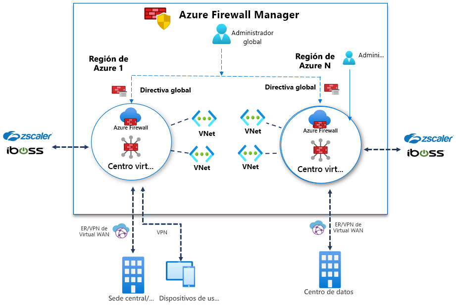

# ¿Qué es Azure Firewall Manager (versión preliminar)?

[!INCLUDE [Preview](../../includes/firewall-manager-preview-notice.md)]

Azure Firewall Manager (versión preliminar) es un servicio de administración de seguridad que proporciona una directiva de seguridad central y administración de rutas para perímetros de seguridad basados en la nube. Funciona con el [centro de conectividad de Azure Virtual WAN](../virtual-wan/virtual-wan-about.md#resources), un recurso administrado por Microsoft que permite crear fácilmente arquitecturas radiales. Cuando las directivas de seguridad y enrutamiento están asociadas a ese concentrador, se denomina *[centro virtual protegido](secured-virtual-hub.md)* . 

## Características de Azure Firewall Manager (versión preliminar)

Azure Firewall Manager (versión preliminar) ofrece las siguientes características:

### Implementación y configuración centralizadas de Azure Firewall

Puede implementar y configurar de forma centralizada varias instancias de Azure Firewall que abarquen diferentes regiones y suscripciones de Azure. 

### Directivas jerárquicas (globales y locales)

Puede usar Azure Firewall Manager (versión preliminar) para administrar de forma centralizada las directivas de Azure Firewall en varios centros virtuales protegidos. Los equipos de TI centrales pueden crear directivas de firewall globales para aplicar la directiva de firewall a los equipos de toda la organización. Las directivas de firewall creadas localmente permiten un modelo de autoservicio de DevOps, lo que aumenta la agilidad.

### Integración con seguridad como servicio de terceros para la seguridad avanzada

Además de Azure Firewall, puede integrar los proveedores de seguridad como servicio (SECaaS) de terceros para proporcionar mayor protección de red para las conexiones de Internet de la red virtual y las ramas.

- Filtrado de tráfico de la red virtual a Internet (V2I)

   - Filtre el tráfico saliente de la red virtual con el proveedor de seguridad de terceros que prefiera.
   - Aproveche la protección de Internet avanzada con reconocimiento del usuario para sus cargas de trabajo en la nube que se ejecutan en Azure.

- Filtrado de tráfico de la rama a Internet (B2I)

   Aproveche la conectividad de Azure y la distribución global para agregar fácilmente el filtrado de terceros para escenarios de rama a Internet.

Para más información acerca de los proveedores de seguridad de confianza, consulte [¿Qué son los asociados de seguridad de confianza de Azure Firewall Manager (versión preliminar)?](trusted-security-partners.md)

### Administración de rutas centralizada

Enrute fácilmente el tráfico al centro de conectividad seguro para filtrar y registrar sin necesidad de configurar manualmente rutas definidas por el usuario (UDR) en redes virtuales de radios. Puede usar proveedores de terceros para el filtrado de tráfico de rama a Internet (B2I), en paralelo con Azure Firewall para rama a red virtual (B2V), red virtual a red virtual (V2V) y red virtual a Internet (V2I). También puede usar proveedores de terceros para el filtrado del tráfico V2I, siempre que Azure Firewall no sea necesario para B2V o V2V. 

## Disponibilidad en regiones

Las siguientes regiones se admiten en la versión preliminar pública:

- Oeste de Europa, Norte de Europa, Centro de Francia, Sur de Francia, Sur de Reino Unido y Oeste de Reino Unido
- Este de Australia, Centro de Australia, Centro de Australia 2, Sudeste de Australia
- Centro de Canadá
- Este de EE. UU., Oeste de EE. UU., Este de EE. UU. 2, Centro-sur de EE. UU., Oeste de EE. UU. 2, Centro de EE. UU., Centro-norte de EE. UU. y Centro-oeste de EE. UU.

Solo se pueden crear directivas de Azure Firewall en estas regiones, pero se pueden usar en varias regiones. Por ejemplo, puede crear una directiva en Oeste de EE. UU. y usarla en Este de EE. UU. 

## Problemas conocidos

Azure Firewall Manager (versión preliminar) presenta los siguientes problemas conocidos:

|Problema  |DESCRIPCIÓN  |Mitigación  |
|---------|---------|---------|
|No se admiten redes virtuales centrales creadas manualmente|Actualmente, Azure Firewall Manager admite redes creadas con centros de conectividad virtuales. Todavía no se admite el uso de su propia red virtual de centro de conectividad creada de forma manual.|Por ahora, use Azure Firewall Manager con redes en estrella tipo hub-and-spoke creadas con centros de conectividad virtuales Actualmente se está investigando.
|Limitaciones del filtrado de terceros|El filtrado de tráfico V2I con proveedores de terceros no es compatible con Azure Firewall B2V y V2V.|Actualmente se está investigando.|
|Actualmente no se admite la división del tráfico|Actualmente no se admite la división del tráfico de PaaS público de Azure y de Office 365. Como tal, la selección de un proveedor de terceros para V2I o B2I también envía todo el tráfico de PaaS público de Azure y de Office 365 a través del servicio de asociados.|La división del tráfico en el centro de conectividad se está investigando actualmente.
|Un centro de conectividad por región|No se puede tener más de un centro de conectividad por región|Cree varias WAN virtuales en una región.|
|Las directivas base deben estar en la misma región que la directiva local|Cree todas las directivas locales en la misma región que la directiva de base. Puede seguir aplicando una directiva que se creó en una región de un centro seguro desde otra región.|Actualmente se está investigando.|
|La comunicación entre centros no funciona con los centros virtuales protegidos|Aún no se admite la comunicación entre centros virtuales protegidos.|Actualmente se está investigando.|

## Pasos siguientes

- Consulte [Información general sobre la implementación de Azure Firewall Manager (versión preliminar)](deployment-overview.md)
- Información sobre [centros de conectividad virtuales protegidos](secured-virtual-hub.md).