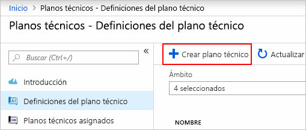
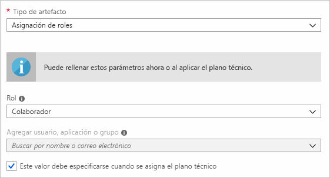
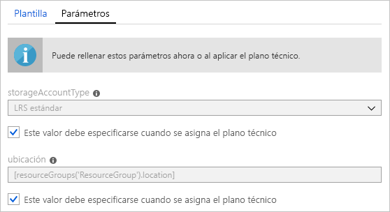
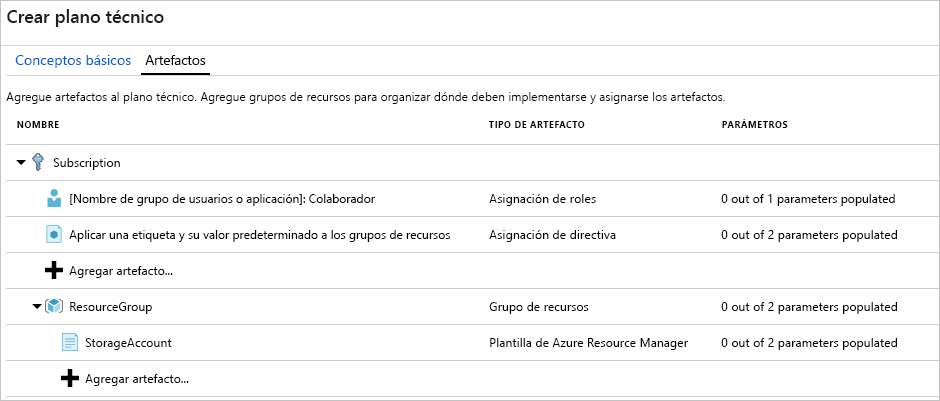
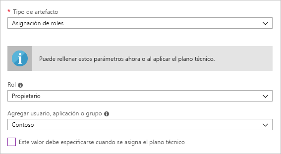
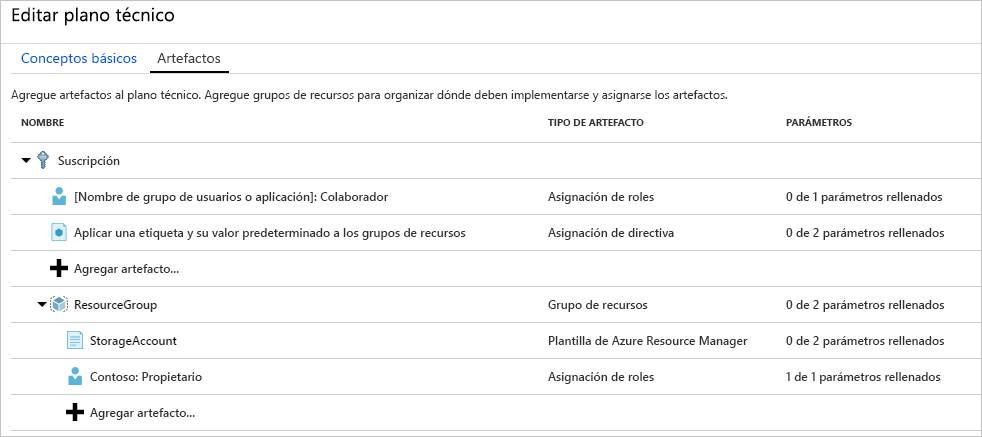
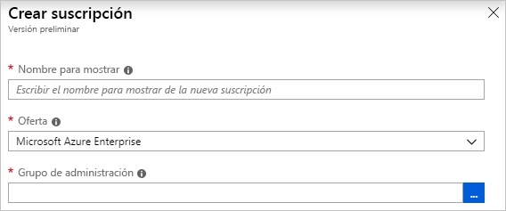
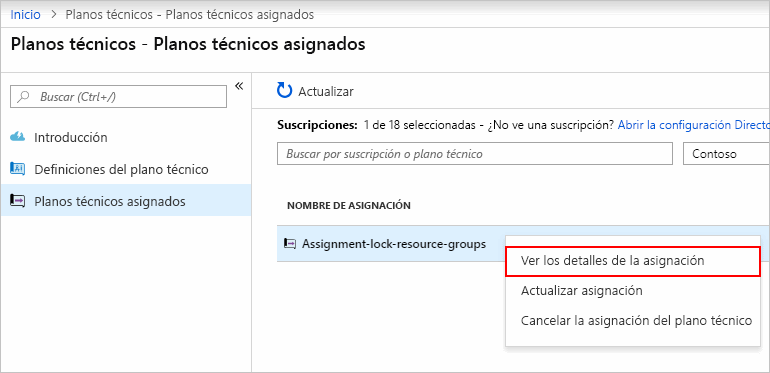

# <a name="quickstart-define-and-assign-a-blueprint-in-the-portal"></a>Inicio rápido: Definición y asignación de un plano técnico en Azure Portal

Cuando aprenda a crear y asignar planos técnicos podrá definir patrones comunes para desarrollar configuraciones reutilizables y de implementación rápida basadas en plantillas de Azure Resource Manager, directivas, seguridad y mucho más. En este tutorial, aprenderá a usar planos técnicos de Azure Blueprints para realizar algunas de las tareas más comunes relacionadas con la creación, publicación y asignación de planos técnicos en toda la organización. Estas tareas incluyen:

> [!div class="checklist"]
> - Creación de un nuevo plano técnico y adición de varios artefactos compatibles
> - Realización de cambios en un plano técnico existente que sigue en **borrador**
> - Marcado de un plano técnico como listo para asignación con el estado **Publicado**
> - Asignación de un plano técnico a una suscripción existente
> - Comprobación del estado y progreso de un plano técnico asignado
> - Eliminación de un plano técnico que se ha asignado a una suscripción

Si no tiene una suscripción a Azure, cree una [cuenta gratuita](https://azure.microsoft.com/free) antes de empezar.

## <a name="create-a-blueprint"></a>Creación de un plano técnico

El primer paso para definir un patrón estándar de cumplimiento es elaborar un plano técnico a partir de los recursos disponibles. En este ejemplo, va a crear un plano técnico llamado **MyBlueprint** para configurar las asignaciones de roles y de directivas de la suscripción. A continuación, agregará un nuevo grupo de recursos, y creará una plantilla de Resource Manager y una asignación de roles en el grupo de recursos.

1. Seleccione **Todos los servicios** en el panel izquierdo. Busque y seleccione **Planos técnicos**.

1. Seleccione primero **Definiciones del plano técnico** en la página de la izquierda y luego el botón **+ Crear plano técnico** en la parte superior de la página.

   También, puede seleccionar **Crear** en la página **Introducción** para ir directamente a la creación de un plano técnico.

   

1. Proporcione un **Nombre del plano técnico** como **MyBlueprint**. (Puede usar hasta 48 letras y números, pero sin incluir espacios ni caracteres especiales). De momento deje **Descripción del plano técnico** en blanco.

1. En el cuadro **Ubicación de definición**, seleccione el botón de puntos suspensivos de la derecha, seleccione el [grupo de administración](../management-groups/overview.md) o la suscripción en la que quiera guardar el plano técnico y haga clic en **Seleccionar**.

1. Compruebe que la información es correcta. Los campos **Nombre del plano técnico** y **Ubicación de definición** no se puede cambiar más adelante. Después, seleccione **Siguiente: Artefactos** en la parte inferior de la página o en la pestaña **Artefactos** en la parte superior de la página.

1. Agregue una asignación de roles a nivel de suscripción:

   1. Seleccione la fila **+ Agregar artefacto** en **Suscripción**. Se abre la ventana **Agregar artefacto** en el lado derecho del explorador.

   1. Seleccione **Asignación de roles** para **Tipo de artefacto**.

   1. En **Rol**, seleccione **Colaborador**. Deje el cuadro **Agregar usuario, aplicación o grupo** con la casilla de verificación que indica un parámetro dinámico.

   1. Seleccione **Agregar** para agregar este artefacto al plano técnico.

   

   > [!NOTE]
   > La mayoría de los artefactos admiten parámetros. Un parámetro al que se asigna un valor durante la creación del plano técnico es un *parámetro estático*. Si la asignación del parámetro se realiza durante la asignación del plano técnico, es un *parámetro dinámico*. Para más información, consulte el artículo sobre los [parámetros de un plano técnico](./concepts/parameters.md).

1. Agregue una asignación de directiva a nivel de suscripción:

   1. Seleccione la fila **+ Agregar artefacto** debajo del artefacto de asignación de roles.

   1. Seleccione **Asignación de directiva** para **Tipo de artefacto**.

   1. Cambie **Tipo** a **Integrado**. En **Búsqueda**, escriba **Etiqueta**.

   1. Haga clic fuera de **Búsqueda** para que se produzca el filtrado. Seleccione **Append tag and its default value to resource groups** (Anexar una etiqueta y su valor predeterminado a los grupos de recursos).

   1. Seleccione **Agregar** para agregar este artefacto al plano técnico.

1. Seleccione la fila de la asignación de directiva **Append tag and its default value to resource groups** (Anexar una etiqueta y su valor predeterminado a los grupos de recursos).

1. La ventana para proporcionar parámetros al artefacto como parte de la definición del plano técnico se abre y permite establecer los parámetros para todas las asignaciones (parámetros estáticos) basadas en este plano técnico, en lugar de durante la asignación (parámetros dinámicos). Este ejemplo usa parámetros dinámicos durante la asignación del plano técnico, así que deje los valores predeterminados y seleccione **Cancelar**.

1. Agregue un grupo de recursos en el nivel de suscripción:

   1. Seleccione la fila **+ Agregar artefacto** en **Suscripción**.

   1. Seleccione **Grupo de recursos** para **Tipo de artefacto**.

   1. Deje los cuadros **Nombre para mostrar del artefacto**, **Nombre del grupo de recursos** y **Ubicación** en blanco, pero asegúrese de que la casilla esté activada en cada propiedad de parámetro para hacerlos parámetros dinámicos.

   1. Seleccione **Agregar** para agregar este artefacto al plano técnico.

1. Agregue una plantilla en el grupo de recursos:

   1. Seleccione la fila **+ Agregar artefacto** directamente bajo la entrada **ResourceGroup**.

   1. Seleccione **Plantilla de Azure Resource Manager** para **Tipo de artefacto**, establezca **Nombre para mostrar del artefacto** en **StorageAccount** y deje **Descripción** en blanco.

   1. En la pestaña **Plantilla** en el cuadro del editor, pegue la siguiente plantilla de Resource Manager.
      Después de pegar la plantilla, seleccione la pestaña **Parámetros** y observe que se han detectado los parámetros de plantilla **storageAccountType** y **location**. Los parámetros se detectaron y se rellenaron automáticamente, pero se configuraron como parámetro dinámico.

      > [!IMPORTANT]
      > Si importa la plantilla, asegúrese de que el archivo es JSON solo y no incluye HTML. Cuando apunte a una dirección URL en GitHub, asegúrese de que ha seleccionado **RAW** para obtener el archivo JSON puro y no el que está encapsulado con HTML para mostrarse en GitHub. Si la plantilla importada no tiene formato JSON puro, se producirá un error.

      ```json
      {
          "$schema": "https://schema.management.azure.com/schemas/2015-01-01/deploymentTemplate.json#",
          "contentVersion": "1.0.0.0",
          "parameters": {
              "storageAccountType": {
                  "type": "string",
                  "defaultValue": "Standard_LRS",
                  "allowedValues": [
                      "Standard_LRS",
                      "Standard_GRS",
                      "Standard_ZRS",
                      "Premium_LRS"
                  ],
                  "metadata": {
                      "description": "Storage Account type"
                  }
              },
              "location": {
                  "type": "string",
                  "defaultValue": "[resourceGroup().location]",
                  "metadata": {
                      "description": "Location for all resources."
                  }
              }
          },
          "variables": {
              "storageAccountName": "[concat('store', uniquestring(resourceGroup().id))]"
          },
          "resources": [{
              "type": "Microsoft.Storage/storageAccounts",
              "name": "[variables('storageAccountName')]",
              "location": "[parameters('location')]",
              "apiVersion": "2018-07-01",
              "sku": {
                  "name": "[parameters('storageAccountType')]"
              },
              "kind": "StorageV2",
              "properties": {}
          }],
          "outputs": {
              "storageAccountName": {
                  "type": "string",
                  "value": "[variables('storageAccountName')]"
              }
          }
      }
      ```

   1. Quite la marca de la casilla **storageAccountType** y observe que la lista desplegable solo contiene los valores incluidos en la plantilla de Resource Manager en **allowedValues**. Seleccione la casilla para volver a establecer un parámetro dinámico.

   1. Seleccione **Agregar** para agregar este artefacto al plano técnico.

   

1. El plano técnico completado debería tener una apariencia similar a esta. Observe que cada artefacto tiene **_x_ de _y_ parámetros rellenados** en la columna **Parámetros**. Los parámetros dinámicos se establecen durante cada asignación del plano técnico.

   

1. Ahora que se han agregado todos los artefactos planeados, seleccione **Guardar borrador** en la parte inferior de la página.

## <a name="edit-a-blueprint"></a>Edición de un plano técnico

En [Crear un plano técnico](#create-a-blueprint), no proporcionó una descripción ni la asignación de roles al nuevo grupo de recursos. Puede cambiar ambas cosas siguiendo estos pasos:

1. Seleccione **Definiciones del plano técnico** en la página de la izquierda.

1. En la lista de planos técnicos, haga clic con el botón derecho en el que creó anteriormente y seleccione **Editar plano técnico**.

1. En **Descripción del plano técnico**, proporcione información sobre el plano técnico y los artefactos que lo componen. En este caso, escriba un texto similar al siguiente: **Este plano técnico establece la directiva de etiquetas y la asignación de roles en la suscripción, crea un grupo de recursos e implementa una plantilla de recursos y una asignación de roles a ese grupo de recursos.**

1. Seleccione **Siguiente: Artefactos** en la parte inferior de la página o en la pestaña **Artefactos** en la parte superior de la página.

1. Agregue la asignación de roles en el grupo de recursos:

   1. Seleccione la fila **+ Agregar artefacto** directamente bajo la entrada **ResourceGroup**.

   1. Seleccione **Asignación de roles** para **Tipo de artefacto**.

   1. En **Rol**, seleccione **Propietario**y desactive la casilla situada en el cuadro **Agregar usuario, aplicación o grupo**.

   1. Busque y seleccione un usuario, aplicación o grupo para agregar. Este artefacto utiliza un parámetro estático que se establece igual en cada asignación de este plano técnico.

   e. Seleccione **Agregar** para agregar este artefacto al plano técnico.

   

1. El plano técnico completado debería tener una apariencia similar a esta. Observe que la asignación de roles recién agregada muestra **1 de 1 parámetros rellenados**. Esto significa que se trata de un parámetro estático.

   

1. Seleccione **Guardar borrador** ahora que se ha actualizado.

## <a name="publish-a-blueprint"></a>Publicación de un plano técnico

Ahora que todos los artefactos planeados se han agregado al plano técnico, es momento de publicarlo.
La publicación hace que el plano técnico esté disponible para asignarse a una suscripción.

1. Seleccione **Definiciones del plano técnico** en la página de la izquierda.

1. En la lista de planos técnicos, haga clic con el botón derecho en el que creó anteriormente y seleccione **Publicar plano técnico**.

1. En el panel que se abre, proporcione una **versión** (letras, números y guiones con una longitud máxima de 20 caracteres) como **v1**. De forma opcional, puede añadir texto en **Notas de cambios** como **Primera publicación**.

1. Seleccione **Publicar** en la parte inferior de la página.

## <a name="assign-a-blueprint"></a>Asignación de un plano técnico

Una vez que se publica un plano técnico, se puede asignar a una suscripción. Asigne el plano técnico que ha creado a una de las suscripciones de la jerarquía de su grupo de administración. Si el proyecto se guarda en una suscripción, solo se puede asignar a dicha suscripción.

1. Seleccione **Definiciones del plano técnico** en la página de la izquierda.

1. En la lista de planos técnicos, haga clic con el botón derecho en el que creó anteriormente (o seleccione los puntos suspensivos) y seleccione **Asignar plano técnico**.

1. En la página **Asignar plano técnico**, en la lista desplegable **Suscripción**, seleccione las suscripciones en las que desee implementar este plano técnico.

   Si no hay ofertas de Enterprise admitidas desde la [facturación de Azure](../../billing/index.md), un vínculo **Crear** se activa en el cuadro **Suscripción**. Siga estos pasos:

   1. Seleccione el vínculo **Crear** para crear una suscripción en lugar de seleccionar las existentes.

   1. Proporcione un **Nombre para mostrar** para la nueva suscripción.

   1. Seleccione la **Oferta** disponible de la lista desplegable.

   1. Use el botón de puntos suspensivos para seleccionar el [grupo de administración](../management-groups/index.md) del que la suscripción será un elemento secundario.

   1. En la parte inferior de la página, seleccione **Crear**.

   

   > [!IMPORTANT]
   > La nueva suscripción se crea inmediatamente al seleccionar **Crear**.

   > [!NOTE]
   > Se crea una asignación para cada suscripción que seleccione. Puede realizar cambios en una sola asignación de suscripción en un momento posterior sin forzar cambios en el resto de las suscripciones seleccionadas.

1. En **Nombre asignado**, proporcione un nombre único para esta asignación.

1. En **Ubicación**, seleccione una región donde crear la identidad administrada y el objeto de implementación de suscripción. Azure Blueprint usa esta identidad administrada para implementar todos los artefactos del plano técnico asignado. Para más información, consulte [Identidades administradas para recursos de Azure](../../active-directory/managed-identities-azure-resources/overview.md).

1. Deje la selección de la lista desplegable **Versión de definición de Blueprint** de versiones **Publicadas** en la entrada **v1**. (El valor predeterminado es la versión publicada más recientemente).

1. En **Asignación de bloqueo**, deje el valor predeterminado de **No bloquear**. Para más información, consulte [Bloqueo de recursos en planos técnicos](./concepts/resource-locking.md).

   

1. En **Identidad administrada**, deje el valor predeterminado de **Asignado por el sistema**.

1. Para la asignación de roles a nivel de suscripción **[Nombre de aplicación o grupo de usuarios]: Colaborador**, busque y seleccione un usuario, aplicación o grupo.

1. Para la asignación de directivas de nivel de suscripción, establezca el **Nombre de etiqueta** en **CostCenter** y el **Valor de etiqueta** en **ContosoIT**.

1. Para **ResourceGroup**, proporcione un **Nombre** de **StorageAccount** y una **Ubicación** **Este de EE. UU. 2** en la lista desplegable.

   > [!NOTE]
   > Por cada artefacto que ha agregado en el grupo de recursos durante la definición del plano técnico, se aplica una sangría a ese artefacto para alinearlo con el grupo de recursos o con el objeto con el que lo implementará.
   > Los artefactos que no toman parámetros o que no tienen parámetros para definirse en la asignación solo se mostrarán para proporcionar información contextual.

1. En la plantilla de Azure Resource Manager **StorageAccount**, seleccione **Standard_GRS** para el parámetro **storageAccountType**.

1. Consulte el cuadro de información en la parte inferior de la página y seleccione **Asignar**.

## <a name="track-deployment-of-a-blueprint"></a>Realización del seguimiento de la implementación de un plano técnico

Cuando se ha asignado un plano técnico a una o varias suscripciones, suceden dos cosas:

- El plano técnico se agrega a la página **Planos técnicos asignados** para cada suscripción.
- Comienza el proceso de implementación de todos los artefactos definidos por el plano técnico.

Ahora que el plano técnico se ha asignado a una suscripción, compruebe el progreso de la implementación:

1. Seleccione **Planos técnicos asignados** en la página de la izquierda.

1. En la lista de planos técnicos, haga clic con el botón derecho en el que asignó anteriormente y seleccione **Ver los detalles de la asignación**.

   

1. En la página **Asignación de plano técnico**, asegúrese de que todos los artefactos se implementaron correctamente y que no ha habido ningún error durante el proceso. Si se han producido errores, consulte la [solución de problemas de planos técnicos](./troubleshoot/general.md) para conocer los pasos necesarios que le permitan determinar el motivo del error.

## <a name="unassign-a-blueprint"></a>Cancelación de la asignación de un plano técnico

Si ya no necesita una asignación de plano técnico, puede eliminarla de una suscripción. Es posible que el plano técnico haya sido reemplazado por otro plano más reciente con patrones, directivas y diseños actualizados. Cuando se quita un plano técnico, se omiten los artefactos que se asignaron como parte de ese plano técnico. Para eliminar una asignación de plano técnico, siga estos pasos:

1. Seleccione **Planos técnicos asignados** en la página de la izquierda.

1. En la lista de planos técnicos, seleccione el plano técnico cuya asignación desea cancelar. Después, seleccione el botón **Cancelar la asignación de plano técnico** en la parte superior de la página.

1. Lea el mensaje de confirmación y haga clic en **Aceptar**.

## <a name="delete-a-blueprint"></a>Eliminación de un plano técnico

1. Seleccione **Definiciones del plano técnico** en la página de la izquierda.

1. Haga clic con el botón derecho en el plano técnico que desea eliminar y, a continuación, seleccione **Eliminar plano técnico**. A continuación, seleccione **Sí** en el cuadro de diálogo de confirmación.

> [!NOTE]
> La eliminación de un plano técnico con este método también elimina todas las versiones publicadas del plano técnico seleccionado.
> Para eliminar una única versión, abra el plano técnico, haga clic en la pestaña **Versiones publicadas**, seleccione la versión que desea eliminar y, después, seleccione **Eliminar esta versión**. No puede eliminar un plano técnico hasta que haya eliminado todas las asignaciones de plano técnico de esa definición de plano técnico.

## <a name="next-steps"></a>Pasos siguientes

- Información acerca del [ciclo de vida del plano técnico](./concepts/lifecycle.md).
- Descubra cómo utilizar [parámetros estáticos y dinámicos](./concepts/parameters.md).
- Aprenda a personalizar el [orden de secuenciación de planos técnicos](./concepts/sequencing-order.md).
- Averigüe cómo usar el [bloqueo de recursos de planos técnicos](./concepts/resource-locking.md).
- Aprenda a [actualizar las asignaciones existentes](./how-to/update-existing-assignments.md).
- Puede consultar la información de [solución de problemas generales](./troubleshoot/general.md) para resolver los problemas durante la asignación de un plano técnico.