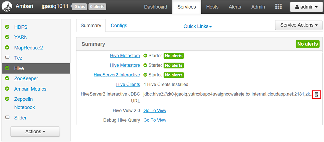

# Uso de Interactive Query con HDInsight
Interactive Query, también llamado Apache Hive LLAP o [Low Latency Analytical Processing](https://cwiki.apache.org/confluence/display/Hive/LLAP) (Procesamiento analítico de baja latencia), es un nuevo [tipo de clúster](../hdinsight-hadoop-provision-linux-clusters.md#cluster-types) de Azure HDInsight. Interactive Query admite el almacenamiento en el caché de la memoria, lo que hace que las consultas de Apache Hive sean más rápidas y mucho más interactivas.

[!INCLUDE [hdinsight-price-change](../../../includes/hdinsight-enhancements.md)] 

Un clúster de Interactive Query no es igual que un clúster de Apache Hadoop. Solo contiene el servicio de Hive. 

> [!NOTE]  
> Solo se puede obtener acceso al servicio Hive en el clúster de Interactive Query mediante la vista Apache Ambari Hive, Beeline y el controlador de conectividad abierta de bases de datos de Microsoft Hive (Hive ODBC). No se puede acceder a él mediante la consola de Hive, Templeton, la CLI de Azure clásica ni Azure PowerShell. 

## Creación de un clúster de Interactive Query
Para obtener más información sobre cómo crear un clúster de HDInsight, consulte [Create Apache Hadoop clusters in HDInsight](../hdinsight-hadoop-provision-linux-clusters.md) (Creación de clústeres de Apache Hadoop en HDInsight). Elija el tipo de clúster de Interactive Query.

## Ejecutar consultas de Apache Hive desde Interactive Query
Para ejecutar consultas de Hive, tiene las siguientes opciones:

* Uso de Microsoft Power BI

    Consulte [Visualize Interactive Query Apache Hive data with Power BI in Azure HDInsight](./apache-hadoop-connect-hive-power-bi-directquery.md) (Visualización de datos de Interactive Query Apache Hive con Power BI en Azure HDInsight) y [Visualize big data with Power BI in Azure HDInsight](../hadoop/apache-hadoop-connect-hive-power-bi.md) (Visualizar macrodatos con Power BI en Azure HDInsight).
 
* Uso de Apache Zeppelin

    Consulte [Use Apache Zeppelin para ejecutar consultas de Apache Hive en HDInsight de Azure](../hdinsight-connect-hive-zeppelin.md).

* Usar Visual Studio

    Consulte [Conectarse a Azure HDInsight y ejecutar consultas de Apache Hive con Herramientas de Data Lake para Visual Studio](../hadoop/apache-hadoop-visual-studio-tools-get-started.md#run-interactive-apache-hive-queries).

* Usar Visual Studio Code

    Consulte [Use Visual Studio Code for Apache Hive, LLAP or pySpark](../hdinsight-for-vscode.md) (Uso de Visual Studio Code para Apache Hive, LLAP o pySpark).
* Ejecute Apache Hive con la vista Apache Ambari Hive.
  
    Consulte [Use Apache Hive View with Apache Hadoop in Azure HDInsight](../hadoop/apache-hadoop-use-hive-ambari-view.md) (Uso de la vista de Apache Hive con Apache Hadoop en Azure HDInsight).

* Ejecute Apache Hive mediante Beeline.
  
    Consulte [Use Apache Hive with Apache Hadoop in HDInsight with Beeline](../hadoop/apache-hadoop-use-hive-beeline.md) (Uso de Apache Hive con Apache Hadoop en HDInsight con Beeline).
  
    Puede usar Beeline desde el nodo principal o desde un nodo perimetral vacío. Se recomienda usar Beeline en un nodo perimetral vacío. Para más información sobre la creación de un clúster de HDInsight con un nodo perimetral vacío, consulte [Uso de nodos perimetrales vacíos en HDInsight](../hdinsight-apps-use-edge-node.md).
* Ejecute Apache Hive mediante la conectividad abierta de bases de datos de Hive.
  
    Consulte [Connect Excel to Apache Hadoop with the Microsoft Hive ODBC driver](../hadoop/apache-hadoop-connect-excel-hive-odbc-driver.md) (Conexión de Excel a Apache Hadoop con Microsoft Hive ODBC Driver).

Para buscar la cadena de conexión de Java Database Connectivity (JDBC):

1. Inicie sesión en Apache Ambari mediante la siguiente dirección URL: https://\<nombre del clúster\>.AzureHDInsight.net.
2. En el menú de la izquierda, seleccione **Hive**.
3. Para copiar la dirección URL, seleccione el icono del Portapapeles:
   
   

## Pasos siguientes

* Aprenda a [crear clústeres de Interactive Query en HDInsight](../hdinsight-hadoop-provision-linux-clusters.md).
* Aprenda a [visualizar datos de Hive con Microsoft Power BI en Azure HDInsight](../hadoop/apache-hadoop-connect-hive-power-bi.md).
* Obtenga información sobre cómo [usar Apache Zeppeling para ejecutar consultas de Apache Hive en HDInsight de Azure](../hdinsight-connect-hive-zeppelin.md).
* Aprenda a [ejecutar consultas de Apache Hive con Herramientas de Data Lake para Visual Studio](../hadoop/apache-hadoop-visual-studio-tools-get-started.md#run-interactive-apache-hive-queries).
* Obtenga información sobre cómo [usar Herramientas de HDInsight para Visual Studio Code](../hdinsight-for-vscode.md).
* Aprenda a [usar la vista de Apache Hive con Apache Hadoop en HDInsight](../hadoop/apache-hadoop-use-hive-ambari-view.md).
* Aprenda a [usar Beeline para enviar consultas de Apache Hive en HDInsight](../hadoop/apache-hadoop-use-hive-beeline.md).
* Aprenda a [conectar Excel a Apache Hadoop con Microsoft Hive ODBC Driver](../hadoop/apache-hadoop-connect-excel-hive-odbc-driver.md).

