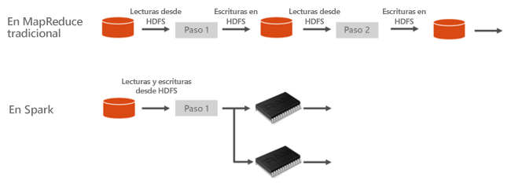
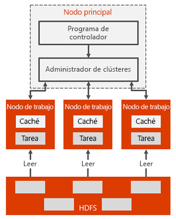

# Qué es Apache Spark en Azure HDInsight

Apache Spark es una plataforma de procesamiento paralelo que admite el procesamiento en memoria para mejorar el rendimiento de aplicaciones de análisis de macrodatos. Apache Spark en Azure HDInsight es la implementación que hace Microsoft de Apache Spark en la nube. HDInsight facilita la creación y la configuración de un clúster de Spark en Azure. Los clústeres de Spark en HDInsight son compatibles con Azure Storage y Azure Data Lake Storage. Por lo que puede usar clústeres de HDInsight Spark para procesar los datos almacenados en Azure. Para conocer los componentes y la información de versiones, consulte el artículo [¿Cuáles son los componentes y versiones de Apache Hadoop disponibles con HDInsight?](../hdinsight-component-versioning.md).

## ¿Qué es Apache Spark?

Spark proporciona primitivas de computación de clúster en memoria. Un trabajo de Spark puede cargar y almacenar en la memoria caché datos, y repetir consultas sobre ellos. La informática en memoria es mucho más rápida que las aplicaciones basadas en disco, como Hadoop, que comparten datos mediante el sistema de archivos distribuido de Hadoop. Spark también se integra en el lenguaje de programación de Scala para que pueda manipular conjuntos de datos distribuidos, como las colecciones locales. No se necesita estructurar todo como operaciones de asignación y reducción.

Los clústeres de Spark en HDInsight ofrecen un servicio de Spark completamente administrado. Aquí se enumeran las ventajas de crear un clúster de Spark en HDInsight.

| Característica | Descripción |
| --- | --- |
| Creación sencilla |Puede crear un clúster de Spark en HDInsight en cuestión de minutos mediante Azure Portal, Azure PowerShell o el SDK de .NET de HDInsight. Consulte [Introducción al clúster de Apache Spark en HDInsight](apache-spark-jupyter-spark-sql-use-portal.md). |
| Facilidad de uso |El clúster de Spark en HDInsight incluye cuadernos de Jupyter y Apache Zeppelin. Puede usar estos notebooks para el procesamiento y la visualización de datos interactivos. Consulte [Uso de cuadernos de Apache Zeppelin con un clúster de Apache Spark](apache-spark-zeppelin-notebook.md) y [Carga de datos y ejecución de consultas en un clúster de Apache Spark](apache-spark-load-data-run-query.md).|
| API de REST |Los clústeres de Spark en HDInsight incluyen [Apache Livy](https://github.com/cloudera/hue/tree/master/apps/spark/java#welcome-to-livy-the-rest-spark-server), un servidor de trabajos de Spark basado en una API REST para enviar y supervisar trabajos de forma remota. Consulte [Uso de la API REST de Apache Spark para enviar trabajos remotos a un clúster de HDInsight Spark](apache-spark-livy-rest-interface.md).|
| Compatibilidad con Azure Data Lake Storage | Los clústeres de Spark en HDInsight pueden usar Azure Data Lake Storage como almacenamiento principal o almacenamiento adicional. Para más información sobre Data Lake Storage, consulte [Introducción a Azure Data Lake Storage](../../data-lake-store/data-lake-store-overview.md). |
| Integración con servicios de Azure |Un clúster de Spark en HDInsight incluye un conector a Azure Event Hubs. Las aplicaciones de streaming se pueden compilar mediante Event Hubs, lo que incluye Apache Kafka, que ya está disponible como parte de Spark. |
| Compatibilidad con ML Server | Se proporciona compatibilidad con ML Server en HDInsight como el tipo de clúster **ML Services**. Puede configurar un clúster de ML Services para ejecutar cálculos R distribuidos con las velocidades prometidas mediante un clúster de Spark. Para obtener más información, vea [¿Qué es Machine Learning Services en Azure HDInsight?](../r-server/r-server-overview.md). |
| Integración con IDE de terceros | HDInsight ofrece varios complementos de IDE que son útiles para crear y enviar aplicaciones a un clúster de Spark en HDInsight. Para más información, consulte [Uso de Azure Toolkit for IntelliJ IDEA](apache-spark-intellij-tool-plugin.md), [Uso de las herramientas de Spark y Hive para VSCode](../hdinsight-for-vscode.md) y [Uso de Azure Toolkit for Eclipse](apache-spark-eclipse-tool-plugin.md).|
| Consultas simultáneas |Los clústeres de Spark en HDInsight admiten consultas simultáneas. Esta funcionalidad permite que varias consultas de un usuario o varias consultas de diversos usuarios y aplicaciones compartan los mismos recursos de clúster. |
| Almacenamiento en caché en SSD |Puede almacenar datos en caché, ya sea en memoria o en SSD conectadas a los nodos del clúster. El almacenamiento en memoria caché ofrece el mejor rendimiento de las consultas, pero también podría ser costoso. El almacenamiento en memoria caché en SSD ofrece una opción excelente para mejorar el rendimiento de las consultas sin necesidad de crear un clúster de un tamaño que admita todo el conjunto de datos en memoria. Consulte [Mejora del rendimiento de las cargas de trabajo de Apache Spark con la memoria caché de E/S de Azure HDInsight](apache-spark-improve-performance-iocache.md). |
| Integración con herramientas de BI |Los clústeres de Spark en HDInsight ofrecen conectores para herramientas de BI, como Power BI, para el análisis de datos. |
| Bibliotecas de Anaconda precargadas |Los clústeres de Spark en HDInsight incluyen bibliotecas de Anaconda preinstaladas. [Anaconda](https://docs.continuum.io/anaconda/) ofrece casi 200 bibliotecas para el aprendizaje automático, el análisis de datos, la visualización, etc. |
| Adaptabilidad | HDInsight permite cambiar el número de nodos de clúster de forma dinámica con la característica Escalabilidad automática. Consulte [Escalado automático de clústeres de Azure HDInsight](../hdinsight-autoscale-clusters.md). Además, se pueden quitar clústeres de Spark sin que se pierdan datos, ya que todos están almacenados en Azure Storage o Data Lake Storage. |
| Contrato de nivel de servicio |Los clústeres de Spark en HDInsight incluyen soporte técnico ininterrumpido y un SLA del 99,9 % de tiempo de actividad. |

Los clústeres de Apache Spark en HDInsight incluyen los siguientes componentes que están disponibles en los clústeres de manera predeterminada.

* [Spark Core](https://spark.apache.org/docs/latest/). Incluye Spark Core, Spark SQL, API Spark de streaming, GraphX y MLlib.
* [Anaconda](https://docs.continuum.io/anaconda/)
* [Apache Livy](https://github.com/cloudera/hue/tree/master/apps/spark/java#welcome-to-livy-the-rest-spark-server)
* [Jupyter Notebook](https://jupyter.org)
* [Apache Zeppelin Notebook](http://zeppelin-project.org/)

HDInsight Spark agrupa en clústeres un [controlador ODBC](https://go.microsoft.com/fwlink/?LinkId=616229) para obtener conectividad de herramientas de BI como Microsoft Power BI.

## Arquitectura de clúster de Spark

Los componentes de Spark son fáciles de entender si se conoce la manera en que Spark se ejecuta en clústeres de HDInsight.

Las aplicaciones de Spark se ejecutan como conjuntos de procesos independientes en un clúster. Coordinado por el objeto SparkContext en el programa principal (denominado programa de controladores).

SparkContext puede conectarse a varios tipos de administradores de clúster, lo que da recursos entre las aplicaciones. Estos administradores de clúster incluyen Apache Mesos, [Apache Hadoop YARN](https://hadoop.apache.org/docs/current/hadoop-yarn/hadoop-yarn-site/YARN.html) o el administrador de clústeres de Spark. En HDInsight, Spark se ejecuta mediante el Administrador de clústeres YARN. Una vez conectado, Spark adquiere los ejecutores en nodos de trabajo en el clúster, que son procesos que ejecutan cálculos y almacenan los datos de la aplicación. A continuación, envía el código de la aplicación (definido por archivos JAR o Python que se pasan a SparkContext) a los ejecutores. Por último, SparkContext envía las tareas a los ejecutores para la ejecución.

SparkContext ejecuta la función principal del usuario y las distintas operaciones paralelas en los nodos de trabajo. A continuación, SparkContext recopila los resultados de las operaciones. Los nodos de trabajo leen y escriben datos del sistema de archivos distribuido de Hadoop y también en él. Además, los nodos de trabajo almacenan en caché datos transformados en memoria como conjuntos de datos distribuidos resistentes (RDD).

SparkContext se conecta al maestro de Spark y es responsable de convertir una aplicación en un grafo acíclico dirigido (DAG) de tareas individuales. Tareas que se ejecutan en un proceso ejecutor en los nodos de trabajo. Cada aplicación obtiene sus propios procesos de ejecutor. Lo que permanece mientras dure toda la aplicación y ejecuta tareas en varios subprocesos.

## Casos de uso de Spark en HDInsight

Los clústeres de Spark en HDInsight hacen posibles los siguientes escenarios clave:

### Análisis interactivo de datos y BI

Apache Spark en HDInsight almacena datos en Azure Storage o Azure Data Lake Storage. Los expertos empresariales y responsables de la toma de decisiones clave pueden analizar y crear informes en base a esos datos. Y utilizan Microsoft Power BI para crear informes interactivos a partir de los datos analizados. Los analistas pueden comenzar a partir de datos no estructurados y semiestructurados presentes en el almacenamiento de clúster, definir un esquema de los datos mediante notebooks y luego generar modelos de datos mediante Microsoft Power BI. Los clústeres de Spark en HDInsight también admiten varias herramientas de BI de terceros. Una de ellas es Tableau, que facilita a los analistas de datos, expertos empresariales y responsables de la toma de decisiones clave.

* [Tutorial: Visualización de datos de Spark mediante Power BI](apache-spark-use-bi-tools.md)

### Machine Learning con Spark

Apache Spark incluye [MLlib](https://spark.apache.org/mllib/). MLlib es una biblioteca de aprendizaje automático basada en Spark que puede usar desde un clúster de Spark en HDInsight. El clúster de Spark en HDInsight también incluye Anaconda, una distribución de Python con diversos tipos de paquetes para el aprendizaje automático. Y con la compatibilidad integrada con cuadernos de Jupyter Notebook y Zeppelin, dispone de un entorno para la creación de aplicaciones de aprendizaje automático.

* [Tutorial: Predicción de las temperaturas de edificios con datos HVAC](apache-spark-ipython-notebook-machine-learning.md)  
* [Tutorial: Predicción de resultados de inspección alimentaria](apache-spark-machine-learning-mllib-ipython.md)

### Streaming y análisis de datos en tiempo real con Spark

Los clústeres de Spark en HDInsight ofrecen amplia compatibilidad para crear soluciones de análisis en tiempo real. Spark ya tiene conectores para ingerir datos de muchos orígenes, como Kafka, Flume, Twitter, ZeroMQ o sockets TCP. Spark en HDInsight agrega compatibilidad de primera clase para la ingesta de datos de Azure Event Hubs. Event Hubs son el servicio de cola más usado de Azure. La disponibilidad de compatibilidad completa con Event Hubs convierte a los clústeres de Spark en HDInsight en una plataforma ideal para crear una canalización de análisis en tiempo real.

* [Introducción a Apache Spark Streaming](apache-spark-streaming-overview.md)
* [Información general acerca de Apache Spark Structured Streaming](apache-spark-structured-streaming-overview.md)

## ¿Por dónde empiezo?

Puede usar los siguientes artículos para obtener más información acerca de Apache Spark en HDInsight:

* [Inicio rápido: Creación de un clúster de Apache Spark en Azure HDInsight](./apache-spark-jupyter-spark-sql-use-portal.md)
* [Tutorial: Ejecución de un trabajo de Apache Spark con Jupyter](./apache-spark-load-data-run-query.md)
* [Tutorial: Análisis de datos mediante herramientas de inteligencia empresarial](./apache-spark-use-bi-tools.md)
* [Tutorial: Aprendizaje automático con Apache Spark](./apache-spark-ipython-notebook-machine-learning.md)
* [Tutorial: Creación de una aplicación de Scala Maven mediante IntelliJ](./apache-spark-create-standalone-application.md)

## Pasos siguientes

En esta introducción, obtendrá cierto conocimiento básico de Apache Spark en Azure HDInsight. Aprenda a crear clústeres de HDInsight Spark y ejecutar consultas SQL de Spark:

* [Creación de un clúster de Apache Spark en Azure HDInsight](./apache-spark-jupyter-spark-sql-use-portal.md)
