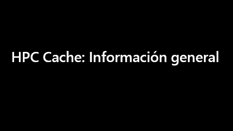

# ¿Qué es Azure HPC Cache?

Azure HPC Cache acelera el acceso a los datos para las tareas de informática de alto rendimiento (HPC). Mediante el almacenamiento en caché de archivos en Azure, Azure HPC Cache aporta la escalabilidad de la informática en la nube al flujo de trabajo existente. Este servicio se puede usar incluso para los flujos de trabajo en los que se almacenan los datos mediante vínculos WAN, como por ejemplo el entorno de almacenamiento conectado a la red (NAS) local del centro de datos.

Azure HPC Cache es fácil de iniciar y supervisar desde el Azure Portal. El almacenamiento de NFS existente o los nuevos contenedores de blobs pueden formar parte de su espacio de nombres agregado, lo que hace que el acceso del cliente sea sencillo aunque cambie el destino de almacenamiento de back-end.

## Vídeo de información general

Haga clic en la imagen anterior para ver una [breve introducción a la caché de Azure HPC](https://azure.microsoft.com/resources/videos/hpc-cache-overview/).

## Casos de uso

Azure HPC Cache mejora la productividad en flujos de trabajo como los siguientes:

* Flujo de trabajo de acceso a archivos de lectura intensiva
* Datos almacenados en almacenamiento accesible desde NFS, blobs de Azure o ambos
* Granjas de servidores de hasta 75 000 núcleos de CPU

Azure HPC Cache se puede agregar a una amplia variedad de flujos de trabajo de muchos sectores. Cualquier sistema en el que un gran número de máquinas necesite acceder a un conjunto de archivos a escala y con latencia baja se beneficiará de este servicio. En las secciones siguientes se proporcionan ejemplos específicos.

### Representación de efectos visuales

En medios y entretenimiento, Azure HPC Cache acelera el acceso a los datos para los proyectos de representación en los que el tiempo es un factor crítico. Los flujos de trabajo de representación de efectos visuales suelen requerir procesamiento de última hora en un gran número de nodos de proceso. Los datos de estos flujos de trabajo suelen encontrarse en un entorno NAS local. Azure HPC Cache almacena en caché los datos de archivos en la nube para reducir la latencia y mejorar la flexibilidad para la representación a petición.

### Ciencias biológicas

Muchos flujos de trabajo de ciencias biológicas pueden beneficiarse del almacenamiento en caché de archivos de escalabilidad horizontal.

Un instituto de investigación que quiera migrar sus flujos de trabajo de análisis genómico a Azure puede desplazarlos fácilmente mediante Azure HPC Cache. Dado que la caché proporciona acceso a los archivos POSIX, no es necesario realizar cambios en el lado cliente para ejecutar el flujo de trabajo del cliente existente en la nube.

También se puede aprovechar Azure HPC Cache para mejorar la eficacia de tareas como el análisis secundario, la simulación farmacológica o el análisis de imágenes controlado por IA.

### Análisis de servicios financieros

La implementación de Azure HPC Cache puede ayudar a acelerar los cálculos en los análisis cuantitativos, las cargas de trabajo en los análisis de riesgos y las simulaciones de Monte Carlo para ofrecer a las empresas de servicios financieros una mejor perspectiva para la toma de decisiones estratégicas.

## Disponibilidad en regiones

Visite la página de [productos de infraestructura global de Azure por región](https://azure.microsoft.com/global-infrastructure/services/?products=hpc-cache) para saber dónde está disponible Azure HPC Cache.

La [característica de claves administradas por el cliente](customer-keys.md) solo se admite en estas regiones de Azure:

* Este de EE. UU.
* Centro-sur de EE. UU.
* Oeste de EE. UU. 2
* Oeste de Europa
* US Gov: Arizona
* US Gov - Virginia

## Pasos siguientes

* Lea la [página del producto Azure HPC Cache](https://azure.microsoft.com/services/hpc-cache) para más información sobre sus funcionalidades
* Información sobre los [requisitos previos](hpc-cache-prerequisites.md) del producto
* [Creación de una instancia de Azure HPC Cache](hpc-cache-create.md) desde Azure Portal
