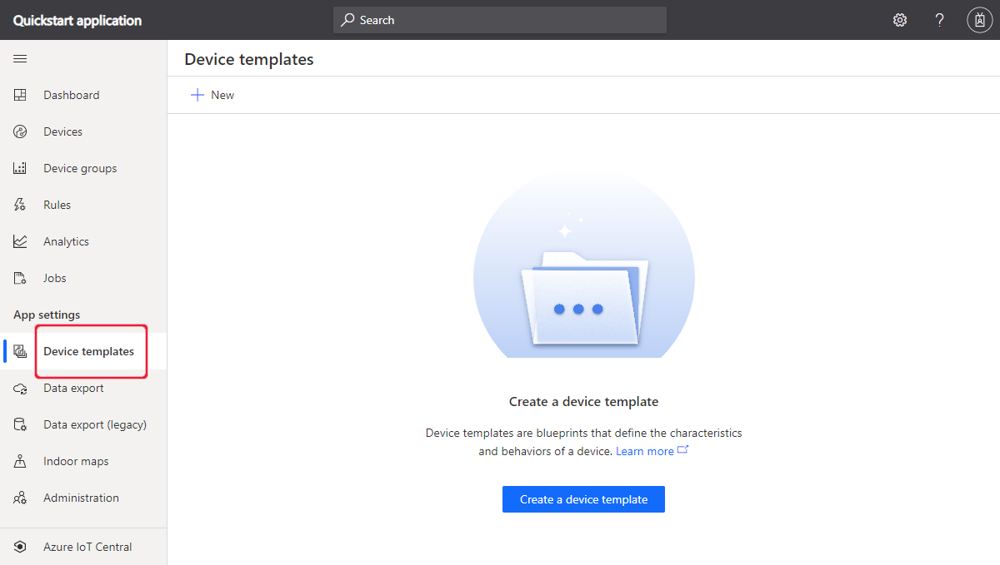
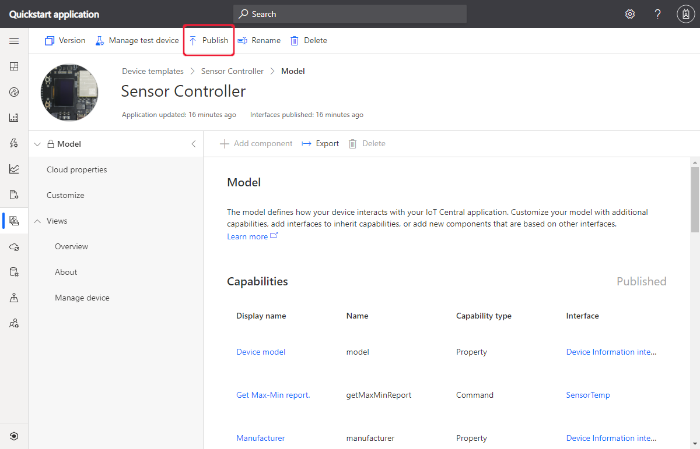

# Inicio rápido: Adición de un dispositivo simulado a una aplicación de IoT Central

*Este artículo se aplica a los administradores, operadores y compiladores.*

Una plantilla de dispositivo define las capacidades de un dispositivo que se conecta a la aplicación en IoT Central. Entre estas se incluyen la telemetría que envía el dispositivo, las propiedades del dispositivo y los comandos a los que responde un dispositivo. En una plantilla de dispositivo, un generador u operador puede agregar dispositivos reales y simulados a una aplicación. Los dispositivos simulados son útiles para probar el comportamiento de la aplicación IoT Central antes de conectar dispositivos reales.

En este inicio rápido, se agrega una plantilla de dispositivo para una placa *MXChip IoT DevKit* (DevKit) y se crea un dispositivo simulado. Para completar este inicio rápido no se necesita un dispositivo real, se trabaja con una simulación del dispositivo. Un dispositivo DevKit:

* Envía datos de telemetría, como la temperatura.
* Notifica propiedades específicas del dispositivo, como el nivel de brillo.
* Responde a comandos como, por ejemplo, activar y desactivar.
* Notifica propiedades genéricas del dispositivo, como la versión de firmware y el número de serie.

## Prerrequisitos

Complete el inicio rápido [Creación de una aplicación de Azure IoT Central](./quick-deploy-iot-central.md) para crear una aplicación de IoT Central mediante la plantilla **Aplicación personalizada > Aplicación personalizada**.

## Creación de una plantilla

Los desarrolladores pueden crear y editar plantillas de dispositivo en una aplicación de IoT Central. Después de publicar una plantilla de dispositivo, puede generar un dispositivo simulado o conectar dispositivos reales desde la plantilla de dispositivo. Los dispositivos simulados permiten probar el comportamiento de la aplicación antes de conectar un dispositivo real.

Para agregar una nueva plantilla de dispositivo a una aplicación, seleccione la pestaña **Device Templates** (Plantillas de dispositivo) en el panel izquierdo.

Una plantilla de dispositivo incluye un modelo de funcionalidad del dispositivo que define la telemetría que envía el dispositivo, las propiedades de este y los comandos a los que el dispositivo responde.

### Adición de un modelo de funcionalidad del dispositivo

Hay varias opciones para agregar un modelo de funcionalidad del dispositivo a la aplicación de IoT Central. Se puede crear un modelo desde cero, importarlo de un archivo o seleccionar un dispositivo en el catálogo. IoT Central también admite un enfoque de *conexión inicial del dispositivo*, por el que se importa automáticamente un modelo de un repositorio la primera vez que se conecta un dispositivo. En este inicio rápido, se elige un dispositivo del catálogo para importar su modelo de funcionalidad del dispositivo.

En los pasos siguientes se muestra cómo usar el catálogo de dispositivos para importar el modelo de funcionalidad del dispositivo **MXChip IoT DevKit**. Estos dispositivos envían telemetría a la aplicación, por ejemplo, los datos de temperatura:

1. Para agregar una nueva plantilla de dispositivo, seleccione **+** en la página **Plantillas de dispositivo**.

1. En la página **Select template type** (Seleccionar tipo de plantilla), desplácese hacia abajo hasta que encuentre el icono de **MXChip IoT DevKit**.

1. Seleccione el icono **MXChip IoT DevKit** y, después, seleccione **Next: Customize** (Personalizar)

1. En la página **Revisar**, seleccione **Crear**.

1. A los pocos segundos verá la nueva plantilla de dispositivo:

    

    El modelo de funcionalidad de MXChip IoT DevKit incluye interfaces como **mxchip_sensor**, **mxchip_settings** y **Device Information** (Información de dispositivo). Las interfaces definen las funcionalidades de un dispositivo MXChip IoT DevKit. Entre las funcionalidades se incluyen la telemetría que envía un dispositivo, las propiedades que notifica un dispositivo y los comandos a los que responde un dispositivo.

### Adición de propiedades de nube

Una plantilla de dispositivo puede incluir propiedades de la nube. Las propiedades de la nube solo existen en la aplicación IoT Central y nunca se envían a un dispositivo ni se reciben de él.

1. Seleccione **Cloud Properties** (Propiedades de la nube) y, luego, **+ Add cloud property** (+ Agregar propiedad de la nube). Use la información de la tabla siguiente para agregar dos propiedades de la nube a la plantilla de dispositivo:

    | Display Name (Nombre para mostrar)      | Semantic Type (Tipo semántico) | Schema |
    | ----------------- | ------------- | ------ |
    | Fecha de la última revisión | None          | Date   |
    | Nombre del cliente     | None          | String |

1. Seleccione **Save** (Guardar) para guardar los cambios.

    

## Vistas

Los desarrolladores pueden personalizar la aplicación para que muestre información pertinente sobre el dispositivo a un operador. Las personalizaciones permiten al operador administrar los dispositivos conectados a la aplicación. Puede crear dos tipos de vistas para que un operador interactúe con los dispositivos:

* Formularios para ver y editar las propiedades del dispositivo y la nube
* Paneles para visualizar dispositivos, lo que incluye los datos de telemetría que envían.

### Vistas predeterminadas

Las vistas predeterminadas son una forma rápida de empezar a visualizar información importante de los dispositivos. Puede generar hasta tres vistas predeterminadas para la plantilla de dispositivo:

* La vista **Commands** (Comandos) permite que el operador envíe comandos al dispositivo.
* La vista **Overview** (Información general) usa gráficos y métricas para mostrar la telemetría del dispositivo.
* La vista **About** (Acerca de) muestra las propiedades del dispositivo.

Seleccione el nodo **Views** (Vistas) en la plantilla de dispositivo. Puede ver que IoT Central generó automáticamente dos vistas, **Overview** (Información general) y **About** (Acerca de), al agregar la plantilla.

Para agregar un formulario para la **administración de dispositivos** que los operadores puedan usar para administrar el dispositivo:

1. Seleccione el nodo **Views** (Vistas) y, después, seleccione el icono **Editing device and cloud data** (Editar datos del dispositivo y de la nube) para agregar una vista.

1. Cambie el nombre del formulario a **Manage device** (Administrar dispositivo).

1. Seleccione las propiedades de la nube **Customer Name** (Nombre de cliente) y **Last Service Date** (Fecha de último servicio), así como la propiedad **Fan Speed** (Velocidad del ventilador). Después, seleccione **Add section** (Agregar sección):

    

1. Seleccione **Save** (Guardar) para guardar la configuración.

## Publicación de la plantilla de dispositivo

Para poder crear un dispositivo simulado, o conectar un dispositivo real, es preciso publicar la plantilla de dispositivo. Aunque IoT Central publicó la plantilla cuando el usuario creó el dispositivo, debe publicar la versión actualizada.

Para publicar una plantilla de dispositivo, siga estos pasos:

1. Vaya a la plantilla de dispositivo en la página **Device Templates** (Plantillas de dispositivo).

1. Seleccione **Publish** (Publicar):

    

1. En el cuadro de diálogo **Publish this device template to the application** (Publicar esta plantilla de dispositivo en la aplicación), seleccione **Publish** (Publicar). 

Una vez que se publica una plantilla de dispositivo, se puede ver en la página **Devices** (Dispositivos). En una plantilla de dispositivo publicada, no se puede editar un modelo de funcionalidad del dispositivo sin crear una versión. Sin embargo, puede hacer actualizaciones en las propiedades de la nube, las personalizaciones y las vistas en una plantilla de dispositivo publicada sin control de versiones. Después de realizar los cambios, seleccione **Publish** (Publicar) para enviar esos cambios al operador.

## Adición de un dispositivo simulado

Para agregar un dispositivo simulado a la aplicación, use la plantilla de dispositivo **MXChip IoT DevKit** que creó.

1. Para agregar un nuevo dispositivo como operador, elija **Dispositivos** en el panel izquierdo. La pestaña **Devices** (Dispositivos) muestra **All devices** (Todos los dispositivos) y la plantilla de dispositivo **MXChip IoT DevKit**. Seleccione **MXChip IoT DevKit**.

1. Para agregar un dispositivo DevKit simulado, seleccione **+** . Use el valor de **Device ID** (Id. de dispositivo) que se sugiere o escriba el **identificador de su dispositivo** en minúsculas. También puede escribir el nombre del nuevo dispositivo. Asegúrese de que el botón de alternancia **Simulated** (Simulado) está en la posición **On** (Activado) y seleccione **Create** (Crear).

    

Mediante los datos simulados ya puede interactuar con las vistas que creó el generador para la plantilla de dispositivo:

1. Seleccione el dispositivo simulado en la página **Devices** (Dispositivos).

1. La vista de **información general** muestra un trazado con los datos de telemetría simulados:

    

1. En la vista **About** (Acerca de) se muestran los valores de las propiedades, que incluyen las propiedades de la nube que ha agregado a la vista.

1. La vista de **comandos** le permite ejecutar comandos, como **blink**, en el dispositivo.

1. La vista de **administración de dispositivos** es el formulario que ha creado para que el operador administre el dispositivo.

## Uso de un dispositivo simulado para mejorar las vistas

Después de crear un dispositivo simulado, el generador puede usarlo para mejorar y desarrollar las vistas de la plantilla de dispositivo.

1. Elija **Device templates** (Plantillas de dispositivos) en el panel izquierdo y seleccione la plantilla de **MXChip IoT DevKit**.

1. Seleccione la vista que desea editar o cree una. Seleccione **Configure preview device** (Configurar dispositivo en versión preliminar) y, después, **Select from a running device** (Seleccionar en un dispositivo en ejecución). Aquí puede elegir entre no tener ningún dispositivo en versión preliminar, un dispositivo real configurado para realizar pruebas o un dispositivo existente que ha agregado a IoT Central.

1. Elija el dispositivo simulado en la lista. Después, seleccione **Aplicar**. Ahora puede ver el mismo dispositivo simulado en la experiencia de creación de las vistas de plantilla de dispositivos. Esta vista es útil para gráficos y otras visualizaciones.

    

## Pasos siguientes

En este inicio rápido, ha aprendido a crear una plantilla de dispositivo de **MXChip IoT DevKit** y a agregar un dispositivo simulado a la aplicación.

Para más información sobre la supervisión de dispositivos conectados a la aplicación, continúe con la guía de inicio rápido:

> [!div class="nextstepaction"]
> [Configuración de reglas y acciones](./quick-configure-rules.md)
