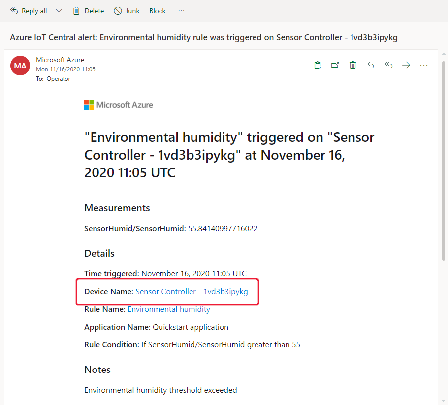
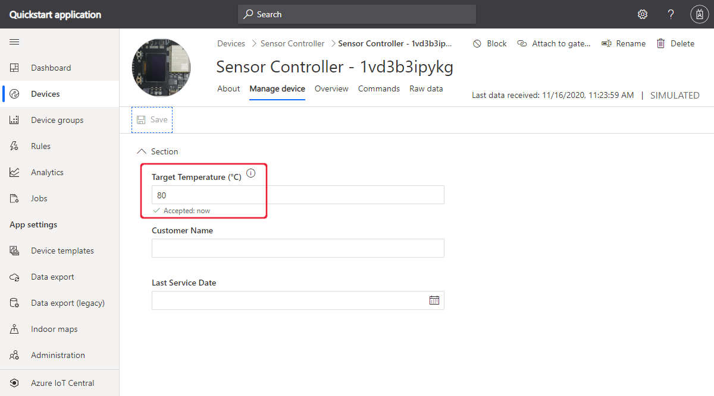

# Inicio rápido: Uso de Azure IoT Central para supervisar los dispositivos

*Este artículo se aplica a los administradores, operadores y compiladores.*

En esta guía de inicio rápido se muestra cómo puede, como operador, usar la aplicación en Microsoft Azure IoT Central para supervisar los dispositivos y cambiar la configuración.

## Prerrequisitos

Antes de comenzar, debe completar los tres inicios rápidos anteriores: [Crear una aplicación de Azure IoT Central](./quick-deploy-iot-central.md), [Agregar un dispositivo simulado a la aplicación en IoT Central](./quick-create-simulated-device.md) y [Configurar reglas y acciones para el dispositivo](quick-configure-rules.md).

## Recibir una notificación

Azure IoT Central envía notificaciones acerca de los dispositivos como mensajes de correo electrónico. El generador ha agregado una regla para enviar una notificación cuando la temperatura del sensor de cualquier dispositivo conectado supera un umbral. Compruebe los correos electrónicos enviados a la cuenta que el desarrollador ha elegido para recibir notificaciones.

Abra el mensaje de correo electrónico que recibió al final del inicio rápido [Configurar reglas y acciones para el dispositivo](quick-configure-rules.md). En el correo electrónico, seleccione el vínculo al dispositivo:

Se abre en el explorador la vista **Información general** del dispositivo simulado que creó en los inicios rápidos anteriores:

## Investigar un problema

Los operadores pueden ver información acerca del dispositivo en las vistas **Información general**, **Acerca de** y **Comandos**. El generador ha creado una vista **Administrar dispositivo** en la que se puede editar la información del dispositivo y establecer sus propiedades.

El gráfico del panel muestra un trazado de la temperatura del dispositivo. Decide que la temperatura del dispositivo es demasiado alta.

## Corregir un problema

Para realizar cualquier cambio en el dispositivo, use la página **Administrar dispositivo**.

Cambie **Velocidad del ventilador** a 500 para enfriar el dispositivo. Elija **Guardar** para actualizar el dispositivo. Cuando el dispositivo confirma el cambio en la configuración, el estado del valor cambia a **sincronizado**:

## Pasos siguientes

En este tutorial, ha aprendido a hacer lo siguiente:

* Recibir una notificación
* Investigar un problema
* Corregir un problema

Ahora que sabe cómo supervisar un dispositivo, el siguiente paso que se recomienda es:

> [!div class="nextstepaction"]
> [Cree y administre una plantilla de dispositivo](howto-set-up-template.md).
