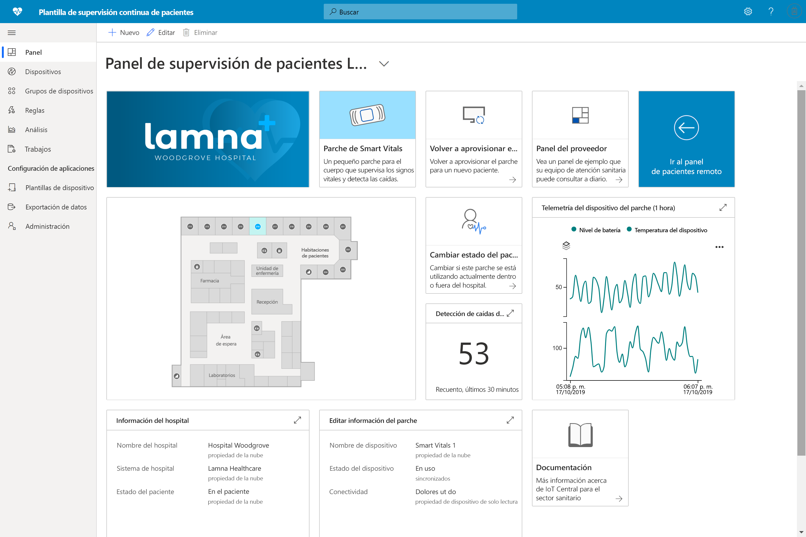

# Creación de soluciones para el sector sanitario con Azure IoT Central 

[!INCLUDE [iot-central-pnp-original](../../../includes/iot-central-pnp-original-note.md)]

Aprenda a crear soluciones de salud con Azure IoT Central mediante plantillas de aplicación.

## ¿Qué es la plantilla de supervisión continua de pacientes?

En el espacio de salud de IoT, la supervisión continua de pacientes es uno de los principales facilitadores a la hora de reducir el riesgo de readmisiones, administrar las enfermedades crónicas de un modo más eficaz y mejorar los resultados de los pacientes. La supervisión continua de pacientes puede dividirse en dos categorías principales:

1. **Supervisión en el paciente**: Con ponibles médicos y otros dispositivos en el hospital, los equipos de atención sanitaria pueden supervisar las señales vitales de los pacientes y sus condiciones médicas sin tener que enviar a una enfermera a visitar a un paciente varias veces al día. Los equipos de atención médica pueden detectar el momento en que un paciente necesita atención crítica mediante notificaciones y priorizar su tiempo de forma eficaz.
1. **Supervisión remota de pacientes**: Al usar ponibles y resultados notificados por los pacientes (PRO) para supervisar a los pacientes fuera del hospital, se puede reducir significativamente el riesgo de readmisión. Se pueden recopilar datos de pacientes con enfermedades crónicas y en rehabilitación para garantizar que los pacientes siguen los planes de atención médica y que las alertas del empeoramiento de los pacientes pueden llegar a los equipos de atención antes de ser críticas.

Esta plantilla de aplicación se puede usar para crear soluciones para ambas categorías de supervisión continua de pacientes. Entre las ventajas se incluye lo siguiente:

* Conectar fácilmente varios ponibles médicos a una instancia de IoT Central.
* Supervisar y administrar los dispositivos para asegurarse de que están en buen estado.
* Crear reglas personalizadas para los datos de los dispositivos para desencadenar las alertas adecuadas.
* Exportar los datos de estado de los pacientes a Azure API for FHIR, un almacén de datos compatible.
* Exportar las conclusiones agregadas a aplicaciones empresariales nuevas o existentes que dan al personal de atención sanitaria las herramientas que necesitan.

>[!div class="mx-imgBorder"] 
>

## Pasos siguientes

Para empezar a crear una solución de supervisión continua de pacientes:

* [Implementar la plantilla de la aplicación](tutorial-continuous-patient-monitoring.md)
* [Consulte una arquitectura de ejemplo](concept-continuous-patient-monitoring-architecture.md)