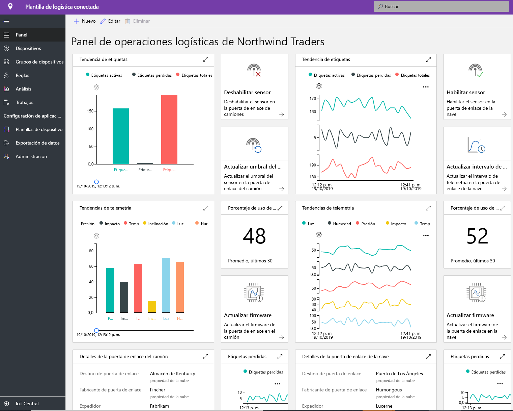
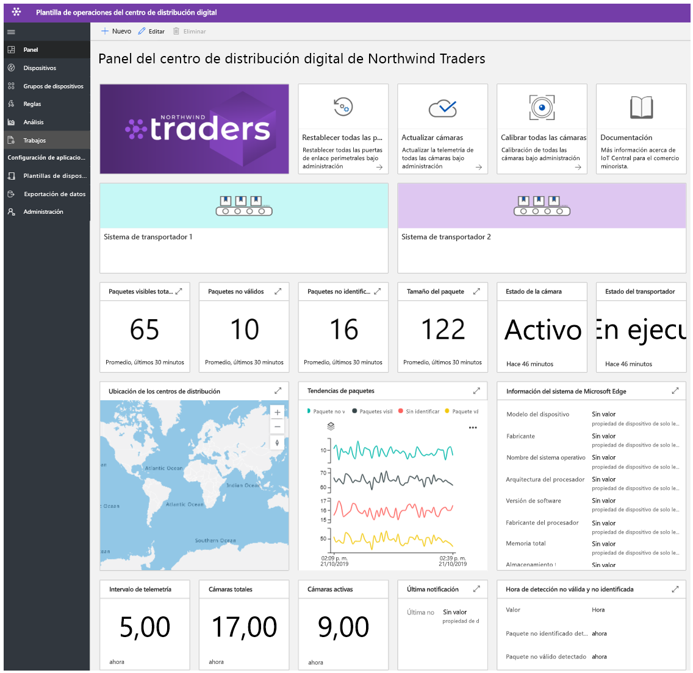
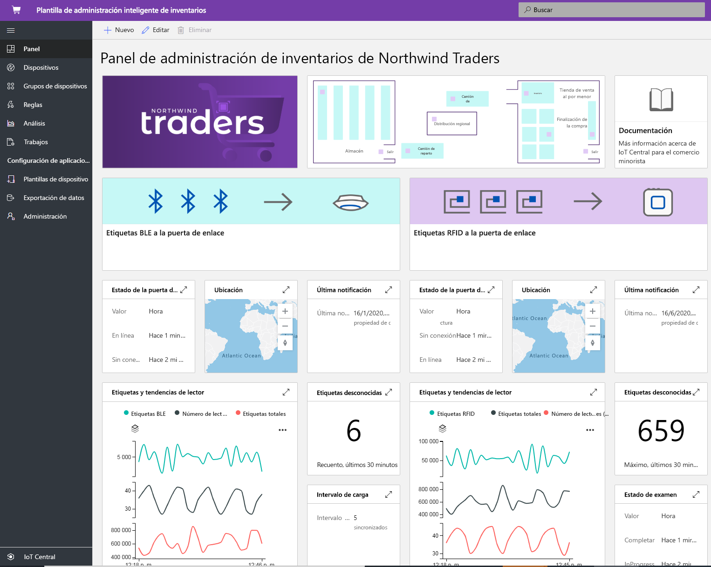

# Creación de soluciones de comercio minorista con Azure IoT Central

[!INCLUDE [iot-central-pnp-original](../../../includes/iot-central-pnp-original-note.md)]

Azure IoT Central es una plataforma de aplicaciones de Internet de las cosas (IoT) para creadores de soluciones que simplifica los problemas que puedan surgir durante la creación y administración de aplicaciones escalables. En este artículo, se destacarán varias plantillas de aplicaciones específicas del comercio minorista dentro de IoT Central. Los creadores de soluciones pueden aprovechar las plantillas publicadas para crear soluciones de IoT para optimizar la cadena de suministro, mejorar la experiencia de los clientes en la tienda y realizar un seguimiento del inventario de forma más eficaz.

> [!div class="mx-imgBorder"]
> 

## ¿Qué es una solución de logística conectada?
Se espera que el gasto logístico global alcance los 10,6 billones de dólares en 2020, el mayor PIB de la historia por sector. El transporte de mercancías es el mayor de los gastos logísticos totales (70 %). Los proveedores de servicios de envío están sujetos a restricciones y sufren una gran presión debido a la feroz competencia. Los proveedores de logística de terceros se enfrentan a plazos cada vez menores y a costos de compensación en constante crecimiento. La logística sufre también los riesgos derivados de la situación geopolítica, los eventos climáticos extremos y la delincuencia. 

Con la ayuda de sensores de IoT, podemos recopilar y supervisar las condiciones ambientales, tales como temperatura, humedad, inclinación, impacto, luz y ubicación del envío mediante GPS en una transformación multimodal (aire, agua y tierra). Los datos recopilados de sensores, dispositivos, clima y eventos se pueden integrar con sistemas de inteligencia empresarial basados en la nube. Estos son los beneficios de la solución de logística conectada:
* Transferencia del envío con seguimiento en tiempo real 
* Integridad del envío con supervisión de las condiciones ambientales en tiempo real y la cadena de frío
* Seguridad contra robo, pérdida o daño del envío
* Geovallado, optimización de rutas, administración de flotas. Análisis de vehículos
* Previsión y previsibilidad de las salidas y llegadas 

### Experiencia lista para usar
Los asociados pueden aprovechar la plantilla para desarrollar soluciones integrales de logística conectada y disfrutar de las ventajas indicadas. Esta plantilla publicada se centra en la conectividad, la configuración y la administración de dispositivos en IoT Central. 

> [!div class="mx-imgBorder"]
> 

> [!div class="mx-imgBorder"]
> 

Tenga en cuenta que el panel anterior es un ejemplo y que puede personalizar completamente esta aplicación para que se ajuste al caso de uso que desee.

Empiece con el [tutorial completo](./tutorial-iot-central-connected-logistics-pnp.md) que le guía en la creación de una solución que aprovecha una de las plantillas de solución de logística conectada.

## ¿Qué es la solución de centro de distribución digital?
Cada vez más fabricantes y minoristas establecen su presencia en todo el mundo, lo que implica la diversificación de sus cadenas de suministro, que ahora son más complejas que nunca. Los centros de distribución se están convirtiendo en uno de los principales desafíos. El centro de distribución y los almacenes sienten el peso de la presión del comercio electrónico. Ahora, los consumidores esperan que haya grandes selecciones de productos disponibles y que las mercancías lleguen uno o dos días después de haberlas comprado. Los centros de distribución deben adaptarse a estas tendencias y, al mismo tiempo, superar las ineficiencias existentes. 

En la actualidad, una excesiva dependencia del trabajo manual implica que la selección y el empaquetado supone el 55-65 % de los costos del centro de distribución. Aunque ya es malo que el trabajo manual ralentice el centro de distribución, las necesidades de personal cambian rápidamente (en período vacacional, el personal aumenta 10 veces) y hace aún más difícil atender los volúmenes de envío. Esta fluctuación estacional provoca una gran rotación, lo que también aumenta la probabilidad de que se produzcan errores y la necesidad de tener que rehacer pedidos.
Las soluciones basadas en cámaras habilitadas para IoT pueden ofrecer ventajas transformacionales, ya que habilitan un bucle de comentarios digitales. Esta entrada de datos de todo el centro de distribución genera conocimientos prácticos que, a su vez, dan como resultado mejores datos.

Las ventajas son: 
* Las cámaras supervisan las mercancías a medida que llegan y pasan por el sistema transportador.
* Se identifican las mercancías defectuosas y se envían a reparación.
* Se hace un seguimiento eficaz de los pedidos.
* Se reducen los costos, mejora la productividad y se maximiza el uso.

### Experiencia lista para usar
Los asociados pueden aprovechar esta plantilla de aplicación para crear un centro de distribución digital con el fin de obtener conocimientos prácticos y las ventajas arriba indicadas. La plantilla publicada se centra en la conectividad, configuración y administración de la cámara y los dispositivos perimetrales en IoT Central. 

> [!div class="mx-imgBorder"]
> 

Tenga en cuenta que el panel anterior es un ejemplo y que puede personalizar completamente esta aplicación para que se ajuste al caso de uso que desee.

Empiece con el [tutorial completo](./tutorial-iot-central-digital-distribution-center-pnp.md) que le guía en la creación de una solución que aprovecha una de las plantillas de centro de distribución digital.

## ¿Qué es la supervisión de las condiciones del análisis en tienda?
En el actual panorama competitivo, los comercios minoristas buscan constantemente nuevas formas de ofrecer a los clientes algo único o especial para impulsar el tráfico en sus tiendas físicas. Muchos comercios minoristas reconocen la importancia de las condiciones ambientales de la tienda como una herramienta para marcar la diferencia con sus competidores. Los minoristas quieren tener la certeza de que las condiciones ambientales en sus tiendas son agradables en todo momento para que sus clientes estén cómodos.  

La plantilla de aplicación In-Store Analytics Condition Monitoring de IoT Central proporciona al creador de soluciones un lienzo que se puede usar para crear una solución integral. La plantilla de aplicación les permite conectarse y supervisar digitalmente el entorno de un comercio minorista mediante varios dispositivos sensores. Dichos dispositivos capturan señales significativas que se pueden convertir en información empresarial que permita al comercio minorista reducir sus costos de explotación y crear experiencias que atraigan a sus clientes.

La plantilla de aplicación le permite:

*  Conectar sin problemas varios sensores de IoT a una instancia de la aplicación IoT Central.
*  Supervisar y administrar el estado de la red de sensores, así como los dispositivos de puerta de enlace del entorno.
*  Crear reglas personalizadas basadas en las condiciones del entorno de una tienda para desencadenar las alertas apropiadas.
*  Transformar las condiciones del entorno de la tienda en información que el equipo de la tienda del comercio minorista pueda aprovechar.
* Exportar la información agregada a aplicaciones empresariales nuevas o existentes que dan al personal del comercio minorista las herramientas que necesitan.

### Experiencia lista para usar
La plantilla de aplicación incluye de forma predeterminada un conjunto de plantillas de dispositivo y una experiencia de operador. Utiliza un conjunto de dispositivos simulados para rellenar los elementos del panel. Una vez que implemente una aplicación de IoT Central mediante la plantilla de aplicación [In-Store Analytics Condition Monitoring](https://aka.ms/conditiontemplate), irá al panel predeterminado de la aplicación, tal y como se muestra a continuación. 

> [!div class="mx-imgBorder"]
> 

Tenga en cuenta que el panel anterior es un ejemplo y que puede personalizar completamente esta aplicación para que se ajuste al caso de uso que desee. 

Empiece con el [tutorial completo](./tutorial-in-store-analytics-create-app-pnp.md) que le guía en la creación de una solución que aprovecha una de las plantillas de supervisión de las condiciones de análisis en tienda.

## ¿Qué es la finalización de la compra en el análisis en tienda?
En el panorama actual, cada vez más competitivo, los comercios minoristas modernos soportan cada vez más presión, ya que deben ofrecer en sus tiendas una experiencia que supere las expectativas de los clientes y les haga volver. Aunque algunos comercios minoristas han empezado a implementar la tecnología necesaria para cubrir esta necesidad, un área que pasa muy inadvertida es la finalización de la compra.

La plantilla de aplicación In-Store Analytics Checkout de IoT Central permite a los creadores de soluciones habilitar experiencias que aporten al personal del comercio minorista información significativa sobre la zona de finalización de la compra de la tienda. Aprovecha un conjunto de dispositivos simulados para determinar el estado de ocupación de cada una de las filas de finalización de la compra de una tienda minorista. Los sensores permiten capturar el número de personas y el tiempo de espera medio de cada una de filas de finalización de la compra.

La plantilla ayuda al creador de soluciones a acelerar sus planes de comercialización, porque proporciona una solución de IoT de línea de base que permite: 

* Conectar sin problemas varios sensores de IoT a una instancia de la aplicación IoT Central.
* Supervisar y administrar el estado de la red de sensores, así como los dispositivos de puerta de enlace del entorno.
* Crear reglas personalizadas basadas en el estado de la finalización de la compra de una tienda para desencadenar las alertas apropiadas.
* Transformar las condiciones de finalización de la compra de la tienda en información que el equipo de la tienda del comercio minorista pueda aprovechar.
* Exportar la información agregada a aplicaciones empresariales nuevas o existentes que dan al personal del comercio minorista las herramientas que necesitan.

### Experiencia lista para usar
La plantilla de aplicación incluye de forma predeterminada un conjunto de plantillas de dispositivo y una experiencia de operador. Utiliza un conjunto de dispositivos simulados para rellenar los elementos del panel. Una vez que implemente una aplicación de IoT Central mediante la plantilla de aplicación [In-Store Analytics Checkout](https://aka.ms/checkouttemplate), irá al panel predeterminado de la aplicación, tal y como se muestra a continuación. 

> [!div class="mx-imgBorder"]
> 

Tenga en cuenta que el panel anterior es un ejemplo y que puede personalizar completamente esta aplicación para que se ajuste al caso de uso que desee. 

Empiece con el [tutorial completo](./tutorial-in-store-analytics-create-app-pnp.md) que le guía en la creación de una solución que aprovecha una de las plantillas de finalización de la compra de análisis en tienda.

## ¿Qué es la solución de administración inteligente del inventario?
"Inventario" son las existencias de mercancías que mantiene un comercio minorista. Todos los comercios minoristas necesitan un inventario para ocuparse del suministro y de los plazos logísticos. El inventario es posiblemente el recurso más valioso con el que cuentan los minoristas. En el mundo actual, donde hay tantos canales, la administración del inventario es un requisito crítico para asegurarse de que el producto correcto se encuentra en el lugar adecuado en el momento preciso. Almacenar un inventario demasiado grande o demasiado pequeño podría perjudicar el negocio del comercio minorista. Todos los años, los minoristas pierden entre un 8 % y un 10 % de sus ingresos debido a la falta de funcionalidades para la administración del inventario.

Los datos de IoT habilitados por la identificación por radiofrecuencia (RFID), las balizas y las cámaras son la oportunidad para afrontar este enorme desafío a escala. La conectividad y el análisis en tiempo real inherentes a las señales de IoT han cambiado la forma de abordar los problemas de inventario del comercio minorista.  Los datos recopilados de sensores, dispositivos, clima y eventos se pueden integrar con sistemas de inteligencia empresarial basados en la nube.  
Los beneficios de la administración inteligente del inventario son: 
* Protege la organización contra el agotamiento de existencias y garantiza el nivel del servicio de atención al cliente deseado. 
* Análisis exhaustivo e información sobre la precisión del inventario casi en tiempo real.
* Permite decidir la cantidad adecuada de inventario suficiente para atender los pedidos de los clientes.

### Experiencia lista para usar
Los asociados pueden aprovechar la plantilla para desarrollar soluciones de administración inteligente del inventario completas y disfrutar de las ventajas indicadas. Esta plantilla publicada se centra en la conectividad, configuración y administración de lectores de RFID y Bluetooth de bajo consumo (BLE) en IoT Central. 

> [!div class="mx-imgBorder"]
> 

Tenga en cuenta que el panel anterior es un ejemplo y que puede personalizar completamente esta aplicación para que se ajuste al caso de uso que desee. 

Empiece con el [tutorial completo](./tutorial-iot-central-smart-inventory-management-pnp.md) que le guía en la creación de una solución que aprovecha una de las plantillas de administración inteligente del inventario.

## Pasos siguientes
Para empezar a crear una solución para el comercio minorista:
* Empiece con el [tutorial completo](./tutorial-in-store-analytics-create-app-pnp.md) que le guía en la creación de una solución que aprovecha una de las plantillas de aplicación de análisis en tienda.
* Aprenda a implementar una [plantilla de solución de logística conectada](./tutorial-iot-central-connected-logistics-pnp.md)
* Aprenda a implementar una [plantilla de centro de distribución digital](./tutorial-iot-central-digital-distribution-center-pnp.md)
* Aprenda a implementar una [plantilla de administración inteligente del inventario](./tutorial-iot-central-smart-inventory-management-pnp.md)
* Para más información acerca de IoT Central, consulte [Introducción a IoT Central](../core/overview-iot-central-pnp.md)
