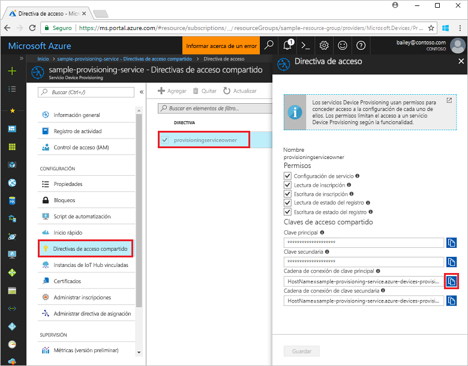
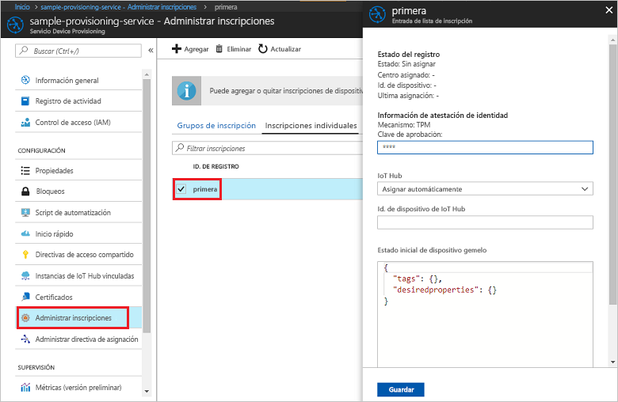

# <a name="quickstart-enroll-tpm-device-to-iot-hub-device-provisioning-service-using-nodejs-service-sdk"></a>Inicio rápido: Inscripción de un dispositivo de TPM al servicio IoT Hub Device Provisioning mediante el SDK del servicio de Node.js

[!INCLUDE [iot-dps-selector-quick-enroll-device-tpm](../../includes/iot-dps-selector-quick-enroll-device-tpm.md)]


En estos pasos se muestra cómo crear una inscripción individual para un dispositivo de TPM mediante programación en el servicio Azure IoT Hub Device Provisioning mediante el [SDK del servicio de Node.js](https://github.com/Azure/azure-iot-sdk-node) y una aplicación de ejemplo de Node.js. Si lo desea, puede inscribir un dispositivo de TPM simulado en el servicio de aprovisionamiento mediante esta entrada de inscripción individual. Aunque estos pasos funcionarán en máquinas Windows y Linux, en este artículo se usará una máquina de desarrollo de Windows.

## <a name="prerequisites"></a>Requisitos previos

- Asegúrese de completar los pasos descritos en [Configuración de un servicio Azure IoT Hub Device Provisioning con Azure Portal](./quick-setup-auto-provision.md) antes de continuar. 
-  Asegúrese de que tiene [Node.js v4.0 o posterior](https://nodejs.org) instalado en su máquina.
- Si quiere inscribir un dispositivo simulado al final de esta guía de inicio rápido, siga los pasos descritos en [Creación y aprovisionamiento de un dispositivo simulado](quick-create-simulated-device.md) hasta el paso donde obtiene una clave de aprobación para el dispositivo. Tome nota de la clave de aprobación porque la usará más adelante en esta guía de inicio rápido. **No siga los pasos para crear una inscripción individual mediante Azure Portal.**
 
## <a name="create-the-individual-enrollment-sample"></a>Creación del ejemplo de inscripción individual 

 
1. Desde una ventana de comandos en la carpeta de trabajo, ejecute:
  
    ```cmd\sh
    npm install azure-iot-provisioning-service
    ```  

2. Con un editor de texto, cree un archivo **create_individual_enrollment.js** en la carpeta de trabajo. Agregue el siguiente código al archivo y guárdelo:

    ```
    'use strict';

    var provisioningServiceClient = require('azure-iot-provisioning-service').ProvisioningServiceClient;

    var serviceClient = provisioningServiceClient.fromConnectionString(process.argv[2]);
    var endorsementKey = process.argv[3];

    var enrollment = {
      registrationId: 'first',
      attestation: {
        type: 'tpm',
        tpm: {
          endorsementKey: endorsementKey
        }
      }
    };

    serviceClient.createOrUpdateIndividualEnrollment(enrollment, function(err, enrollmentResponse) {
      if (err) {
        console.log('error creating the individual enrollment: ' + err);
      } else {
        console.log("enrollment record returned: " + JSON.stringify(enrollmentResponse, null, 2));
      }
    });
    ```

## <a name="run-the-individual-enrollment-sample"></a>Ejecución del ejemplo de inscripción individual
  
1. Para ejecutar el ejemplo, necesita la cadena de conexión para el servicio de aprovisionamiento. 
    1. Inicie sesión en Azure Portal, haga clic en el botón **Todos los recursos** situado en el menú izquierdo y abra el servicio Device Provisioning. 
    2. Haga clic en **Directivas de acceso compartido** y, a continuación, haga clic en la directiva de acceso que quiere usar para abrir sus propiedades. En la ventana **Directiva de acceso**, copie y tome nota de la cadena de conexión de la clave principal. 

        


2. También se necesitará la clave de aprobación para el dispositivo. Si siguió la guía de inicio rápido [Creación y aprovisionamiento de un dispositivo simulado](quick-create-simulated-device.md) para crear un dispositivo de TPM simulado, use la clave que se creó para dicho dispositivo. En caso contrario, para crear una inscripción individual de ejemplo, puede usar la siguiente clave de aprobación proporcionada con el SDK:

    ```
    AToAAQALAAMAsgAgg3GXZ0SEs/gakMyNRqXXJP1S124GUgtk8qHaGzMUaaoABgCAAEMAEAgAAAAAAAEAxsj2gUScTk1UjuioeTlfGYZrrimExB+bScH75adUMRIi2UOMxG1kw4y+9RW/IVoMl4e620VxZad0ARX2gUqVjYO7KPVt3dyKhZS3dkcvfBisBhP1XH9B33VqHG9SHnbnQXdBUaCgKAfxome8UmBKfe+naTsE5fkvjb/do3/dD6l4sGBwFCnKRdln4XpM03zLpoHFao8zOwt8l/uP3qUIxmCYv9A7m69Ms+5/pCkTu/rK4mRDsfhZ0QLfbzVI6zQFOKF/rwsfBtFeWlWtcuJMKlXdD8TXWElTzgh7JS4qhFzreL0c1mI0GCj+Aws0usZh7dLIVPnlgZcBhgy1SSDQMQ==
    ```

3. Para crear una inscripción individual para el dispositivo de TPM, ejecute el comando siguiente (incluidas las comillas alrededor de los argumentos de comando):
 
     ```cmd\sh
     node create_individual_enrollment.js "<the connection string for your provisioning service>" "<endorsement key>"
     ```
 
3. Tras una creación correcta, la ventana de comandos muestra las propiedades de la inscripción individual nueva.

     

4. Compruebe que se haya creado una inscripción individual. En Azure Portal, en la hoja de resumen del servicio Device Provisioning, seleccione **Administrar inscripciones**. Seleccione la pestaña **Inscripciones individuales** y (*primero*) haga clic en la entrada de inscripción nueva para comprobar la clave de aprobación y las otras propiedades de la entrada.

     
 
Ahora que creó una inscripción individual para un dispositivo de TPM, si quiere inscribir un dispositivo simulado, puede continuar con los pasos restantes de [Creación y aprovisionamiento de un dispositivo simulado](quick-create-simulated-device.md). Asegúrese de omitir los pasos para crear una inscripción individual mediante Azure Portal de esa guía de inicio rápido.

## <a name="clean-up-resources"></a>Limpieza de recursos
Si tiene previsto explorar los ejemplos del servicio de Node.js, no elimine los recursos que se crearon con esta guía de inicio rápido. Si no va a continuar, use el siguiente comando para eliminar todos los recursos creados.

1. Cierre la ventana de salida de ejemplo de Node.js en su máquina.
1. Si creó un dispositivo de TPM simulado, cierre la ventana del simulador de TPM.
2. Vaya a su servicio de Device Provisioning en Azure Portal, haga clic en **Administrar inscripciones** y, a continuación, seleccione la pestaña **Inscripciones individuales**. Seleccione el *id. de registro* de la entrada de inscripción que creó en esta guía de inicio rápido y haga clic en el botón **Eliminar** situado en la parte superior de la hoja. 
 
## <a name="next-steps"></a>Pasos siguientes
En esta guía de inicio rápido, creó una entrada de inscripción individual mediante programación para un dispositivo de TPM y, opcionalmente, creó un dispositivo de TPM simulado en su máquina y lo aprovisionó con IoT Hub mediante el servicio Azure IoT Hub Device Provisioning. Para más información acerca del aprovisionamiento de dispositivos, continúe con el tutorial para instalar el servicio Device Provisioning en Azure Portal. 
 
> [!div class="nextstepaction"]
> [Tutoriales del servicio Azure IoT Hub Device Provisioning](./tutorial-set-up-cloud.md)