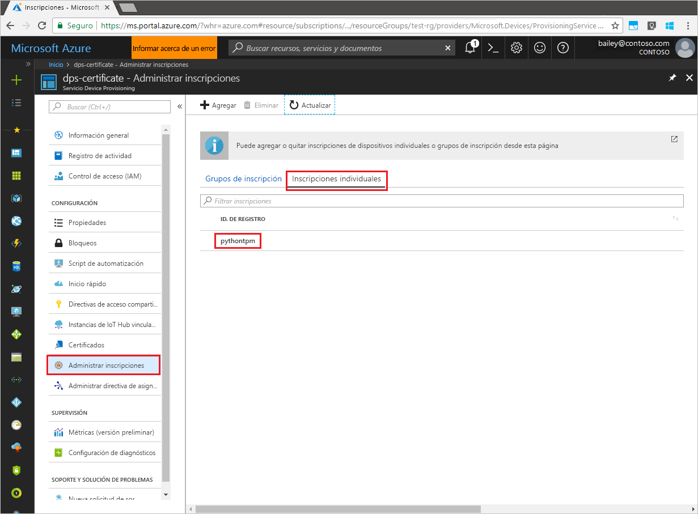

# <a name="quickstart-enroll-tpm-device-to-iot-hub-device-provisioning-service-using-python-provisioning-service-sdk"></a>Inicio rápido: Inscripción de un dispositivo de TPM al servicio IoT Hub Device Provisioning con el SDK del servicio de aprovisionamiento de Python

[!INCLUDE [iot-dps-selector-quick-enroll-device-tpm](../../includes/iot-dps-selector-quick-enroll-device-tpm.md)]

En estos pasos se muestra cómo crear una inscripción individual para un dispositivo de TPM mediante programación en Azure IoT Hub Device Provisioning Service mediante el [SDK del servicio de aprovisionamiento de Python V1](https://github.com/Azure/azure-iot-sdk-python/tree/v1-deprecated/provisioning_service_client) con la ayuda de una aplicación de Python de ejemplo. Aunque el SDK del servicio de Python funciona en máquinas Windows y Linux, este artículo usa una máquina de desarrollo Windows para guiarle por el proceso de inscripción.

> [!IMPORTANT]
> Este artículo solo se aplica al SDK de Python v1 en desuso. El dispositivo y los clientes del servicio para IoT Hub Device Provisioning Service aún no están disponibles en la versión 2. Actualmente, el equipo está haciendo todo lo posible para incorporar la versión 2 a la paridad de características.

Asegúrese de [configurar un servicio Azure IoT Hub Device Provisioning con Azure Portal](./quick-setup-auto-provision.md) antes de continuar.


<a id="prepareenvironment"></a>

## <a name="prepare-the-environment"></a>Preparación del entorno 

1. Descargue e instale [Python 2.x o 3.x](https://www.python.org/downloads/). Asegúrese de usar la instalación de 32 bits o 64 bits en función del programa de instalación. Cuando se le solicite durante la instalación, asegúrese de agregar Python a las variables de entorno específicas de la plataforma. 

1. Elija una de las siguientes opciones:

    - Cree y compile el **SDK de Python de Azure IoT**. Siga [estas instrucciones](https://github.com/Azure/azure-iot-sdk-python/blob/v1-deprecated/doc/python-devbox-setup.md) para compilar los paquetes de Python. Si usa el sistema operativo Windows, instale igualmente el [paquete redistribuible de Visual C++](https://support.microsoft.com/help/2977003/the-latest-supported-visual-c-downloads) para permitir el uso de archivos DLL nativos de Python.

    - [Instale o actualice *pip*, el sistema de administración de paquetes de Python](https://pip.pypa.io/en/stable/installing/) e instale el paquete mediante el comando siguiente:

        ```cmd/sh
        pip install azure-iothub-provisioningserviceclient
        ```

1. Necesitará la clave de aprobación para el dispositivo. Si siguió la guía de inicio rápido [Creación y aprovisionamiento de un dispositivo simulado](quick-create-simulated-device.md) para crear un dispositivo de TPM simulado, use la clave que se creó para dicho dispositivo. En caso contrario, puede usar la siguiente clave de aprobación proporcionada con el SDK:

    ```
    AToAAQALAAMAsgAgg3GXZ0SEs/gakMyNRqXXJP1S124GUgtk8qHaGzMUaaoABgCAAEMAEAgAAAAAAAEAtW6MOyCu/Nih47atIIoZtlYkhLeCTiSrtRN3q6hqgOllA979No4BOcDWF90OyzJvjQknMfXS/Dx/IJIBnORgCg1YX/j4EEtO7Ase29Xd63HjvG8M94+u2XINu79rkTxeueqW7gPeRZQPnl1xYmqawYcyzJS6GKWKdoIdS+UWu6bJr58V3xwvOQI4NibXKD7htvz07jLItWTFhsWnTdZbJ7PnmfCa2vbRH/9pZIow+CcAL9mNTNNN4FdzYwapNVO+6SY/W4XU0Q+dLMCKYarqVNH5GzAWDfKT8nKzg69yQejJM8oeUWag/8odWOfbszA+iFjw3wVNrA5n8grUieRkPQ==
    ```


## <a name="modify-the-python-sample-code"></a>Modificación del código de ejemplo de Python

En esta sección se muestra cómo agregar los detalles de aprovisionamiento del dispositivo de TPM al código de ejemplo. 

1. Con un editor de texto, cree un nuevo archivo **TpmEnrollment.py**.

1. Agregue las siguientes instrucciones y variables `import` al principio del archivo **TpmEnrollment.py**. Después, reemplace `dpsConnectionString` por la cadena de conexión que se encuentra en **Directivas de acceso compartido** en **Device Provisioning Service** de **Azure Portal**. Reemplace `endorsementKey` por el valor que se ha indicado anteriormente en [Preparación del entorno](quick-enroll-device-tpm-python.md#prepareenvironment). Por último, cree un único `registrationid`, y asegúrese de que solo consta de caracteres alfanuméricos en minúsculas y guiones.  
   
    ```python
    from provisioningserviceclient import ProvisioningServiceClient
    from provisioningserviceclient.models import IndividualEnrollment, AttestationMechanism

    CONNECTION_STRING = "{dpsConnectionString}"

    ENDORSEMENT_KEY = "{endorsementKey}"

    REGISTRATION_ID = "{registrationid}"
    ```

1. Agregue la función y llamada de función siguientes para implementar la creación de inscripción de grupo:
   
    ```python
    def main():
        print ( "Starting individual enrollment..." )

        psc = ProvisioningServiceClient.create_from_connection_string(CONNECTION_STRING)

        att = AttestationMechanism.create_with_tpm(ENDORSEMENT_KEY)
        ie = IndividualEnrollment.create(REGISTRATION_ID, att)

        ie = psc.create_or_update(ie)
    
        print ( "Individual enrollment successful." )
    
    if __name__ == '__main__':
        main()
    ```

1. Guarde y cierre el archivo **TpmEnrollment.py**.
 

## <a name="run-the-sample-tpm-enrollment"></a>Ejecución de la inscripción de TPM de ejemplo

1. Abra el símbolo del sistema y ejecute el script.

    ```cmd/sh
    python TpmEnrollment.py
    ```

1. Observe la salida para comprobar si la inscripción se realizó correctamente.

1. Vaya al servicio de aprovisionamiento en Azure Portal. Seleccione **Administrar inscripciones**. Tenga en cuenta que el dispositivo de TPM aparecerá en la pestaña **Inscripciones individuales**, con el nombre `registrationid` creado anteriormente. 

      


## <a name="clean-up-resources"></a>Limpieza de recursos
Si planea explorar el ejemplo del servicio de Java, no elimine los recursos que se han creado en este inicio rápido. Si no va a continuar, use el siguiente comando para eliminar todos los recursos creados por este inicio rápido.

1. Cierre la salida de ejemplo de Python en su máquina.
1. Si creó un dispositivo de TPM simulado, cierre la ventana del simulador de TPM.
1. Vaya a Device Provisioning Service en Azure Portal, seleccione **Administrar inscripciones** y, a continuación, seleccione la pestaña **Inscripciones individuales**. Seleccione la casilla que se encuentra junto al *identificador de registro* de la entrada de inscripción que creó en este inicio rápido y presione el botón **Eliminar** de la parte superior de la hoja.


## <a name="next-steps"></a>Pasos siguientes
En esta guía de inicio rápido, ha creado una entrada de inscripción individual mediante programación para un dispositivo de TPM y, opcionalmente, ha creado en una máquina un dispositivo de TPM simulado y lo ha aprovisionado en su centro de IoT mediante Azure IoT Hub Device Provisioning Service. Para más información acerca del aprovisionamiento de dispositivos, continúe con el tutorial para instalar el servicio Device Provisioning en Azure Portal.

> [!div class="nextstepaction"]
> [Tutoriales del servicio Azure IoT Hub Device Provisioning](./tutorial-set-up-cloud.md)
