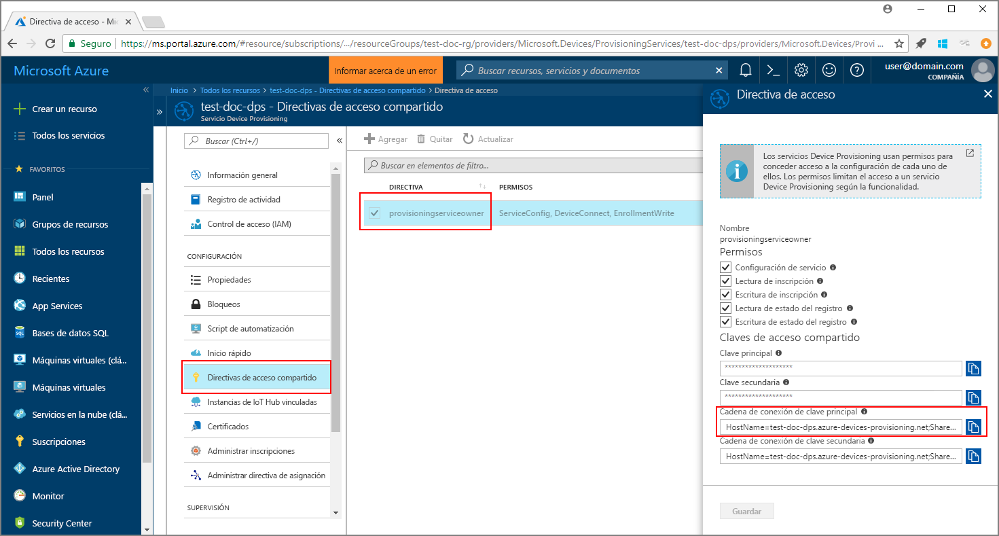
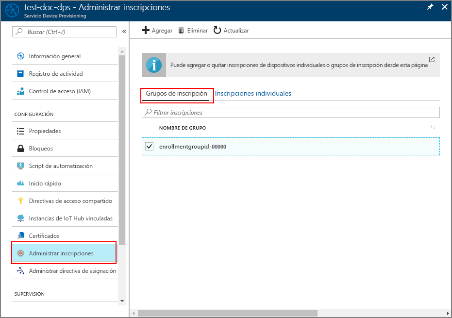

# <a name="quickstart-enroll-x509-devices-to-the-device-provisioning-service-using-java"></a>Inicio rápido: Inscripción de dispositivos X.509 en el servicio Device Provisioning mediante Java

[!INCLUDE [iot-dps-selector-quick-enroll-device-x509](../../includes/iot-dps-selector-quick-enroll-device-x509.md)]

Este inicio rápido va a usar Java para inscribir mediante programación un grupo de dispositivos simulados X.509 en el servicio Azure IoT Hub Device Provisioning Service. Los dispositivos se inscriben en una instancia de Device Provisioning Service mediante la creación de un grupo de inscripción o de una inscripción individual. En este inicio rápido se muestra cómo crear ambos tipos de inscripciones mediante el SDK del servicio de Java y una aplicación Java de ejemplo.

## <a name="prerequisites"></a>Prerrequisitos

- Haber leído [Configuración de Azure IoT Hub Device Provisioning Service con Azure Portal](./quick-setup-auto-provision.md).
- Una cuenta de Azure con una suscripción activa. [cree una de forma gratuita](https://azure.microsoft.com/free/?ref=microsoft.com&utm_source=microsoft.com&utm_medium=docs&utm_campaign=visualstudio).
- [Java SE Development Kit 8](https://aka.ms/azure-jdks). En este inicio rápido se instala el [SDK de servicio de Java](https://azure.github.io/azure-iot-sdk-java/master/service/) siguiente. Funciona tanto en Windows como en Linux. En este inicio rápido se usa Windows.
- [Maven 3](https://maven.apache.org/download.cgi).
- [Git](https://git-scm.com/download/).

<a id="javasample"></a>

## <a name="download-and-modify-the-java-sample-code"></a>Descarga y modificación del código de ejemplo de Java

En esta sección se usa un certificado X.509 autofirmado, así que es importante tener en cuenta los siguientes puntos:

* Los certificados autofirmados son solo para la realización de pruebas, no se deben usar en producción.
* La fecha de expiración predeterminada de un certificado autofirmado es de un año.

Los siguientes pasos muestran cómo agregar los detalles de aprovisionamiento del dispositivo X.509 al código de ejemplo. 

1. Abra un símbolo del sistema. Clone el repositorio de GitHub para código de ejemplo de inscripción de dispositivos mediante el [SDK del servicio de Java](https://azure.github.io/azure-iot-sdk-java/master/service/):
    
    ```cmd\sh
    git clone https://github.com/Azure/azure-iot-sdk-java.git --recursive
    ```

2. En el código fuente descargado, navegue hasta la carpeta de ejemplo **_azure-iot-sdk-java/provisioning/provisioning-samples/service-enrollment-group-sample_** . Abra el archivo **_/src/main/java/samples/com/microsoft/azure/sdk/iot/ServiceEnrollmentGroupSample.java_** en el editor que prefiera y agregue los detalles siguientes:

    1. Desde el portal, agregue la cadena `[Provisioning Connection String]` para su servicio de aprovisionamiento como se muestra a continuación:
        1. Vaya al servicio de aprovisionamiento en [Azure Portal](https://portal.azure.com). 
        2. Abra las **directivas de acceso compartido** y seleccione una directiva que tenga el permiso *EnrollmentWrite*.
        3. Copie la **cadena de conexión de clave principal**. 

              

        4. En el archivo de código de ejemplo **_ServiceEnrollmentGroupSample.java_** , reemplace la cadena `[Provisioning Connection String]` con la **cadena de conexión de clave principal**.

            ```Java
            private static final String PROVISIONING_CONNECTION_STRING = "[Provisioning Connection String]";
            ```

    2. Agregue el certificado raíz para el grupo de dispositivos. Si necesita un certificado raíz de ejemplo, use la herramienta para _generar certificados X.509_ como se muestra a continuación:
        1. En la ventana Comandos, navegue hasta la carpeta **_azure-iot-sdk-java/provisioning/provisioning-tools/provisioning-x509-cert-generator_** .
        2. Para compilar la herramienta, ejecute el comando siguiente:

            ```cmd\sh
            mvn clean install
            ```

        4. Ejecute la herramienta con los comandos siguientes:

            ```cmd\sh
            cd target
            java -jar ./provisioning-x509-cert-generator-{version}-with-deps.jar
            ```

        5. Cuando se le solicite, puede especificar opcionalmente un _nombre común_ para los certificados.
        6. La herramienta genera un valor de **Client Cert** (certificado de cliente), **Client Cert Private Key** (clave privada del certificado de cliente) y el **Root Cert** (certificado raíz) de forma local.
        7. Copie el **certificado raíz** , incluidas las líneas **_---BEGIN CERTIFICATE---_** y **_---END CERTIFICATE---_** . 
        8. Asigne el valor del **certificado raíz** al parámetro **PUBLIC_KEY_CERTIFICATE_STRING** tal y como se muestra a continuación:

            ```Java
            private static final String PUBLIC_KEY_CERTIFICATE_STRING =
            "-----BEGIN CERTIFICATE-----\n" +
            "XXXXXXXXXXXXXXXXXXXXXXXXXXXXXXXXXXXXXXXXXXXXXXXXXXXXXXXXXXXXXXXX\n" +
            "XXXXXXXXXXXXXXXXXXXXXXXXXXXXXXXXXXXXXXXXXXXXXXXXXXXXXXXXXXXXXXXX\n" +
            "XXXXXXXXXXXXXXXXXXXXXXXXXXXXXXXXXXXXXXXXXXXXXXXXXXXXXXXXXXXXXXXX\n" +
            "XXXXXXXXXXXXXXXXXXXXXXXXXXXXXXXXXXXXXXXXXXXXXXXXXXXXXXXXXXXXXXXX\n" +
            "XXXXXXXXXXXXXXXXXXXXXXXXXXXXXXXXXXXXXXXXXXXXXXXXXXXXXXXXXXXXXXXX\n" +
            "XXXXXXXXXXXXXXXXXXXXXXXXXXXXXXXXXXXXXXXXXXXXXXXXXXXXXXXXXXXXXXXX\n" +
            "XXXXXXXXXXXXXXXXXXXXXXXXXXXXXXXXXXXXXXXXXXXXXXXXXXXXXXXXXXXXXXXX\n" +
            "XXXXXXXXXXXXXXXXXXXXXXXXXXXXXXXXXXXXXXXXXXXXXXXXXXXXXXXXXXXXXXXX\n" +
            "XXXXXXXXXXXXXXXXXXXXXXXXXXXXXXXXXXXXXXXXXXXXXXXXXXXXXXXXXXXXXXXX\n" +
            "XXXXXXXXXXXXXXXXXXXXXXXXXXXXXXXXXXXXXXXXXXXXXXXXXXXXXXXXXXXXXXXX\n" +
            "-----END CERTIFICATE-----\n";
            ```

        9. Cierre la ventana de comandos o escriba **n** cuando se le solicite el *código de verificación*. 
 
    3. Si lo desea, puede configurar el servicio de aprovisionamiento con el código de ejemplo:
        - Para agregar esta configuración al ejemplo, siga estos pasos:
            1. Vaya a la instancia de IoT Hub enlazada con el servicio de aprovisionamiento en [Azure Portal](https://portal.azure.com). Abra la pestaña **Información general** de dicha instancia y copie el **nombre de host**. Asigne este **nombre de host** al parámetro *IOTHUB_HOST_NAME*.

                ```Java
                private static final String IOTHUB_HOST_NAME = "[Host name].azure-devices.net";
                ```
            2. Asigne un nombre descriptivo al parámetro *DEVICE_ID* y mantenga el elemento *PROVISIONING_STATUS* con el valor predeterminado *HABILITADO*. 

        - Si decide no configurar el servicio de aprovisionamiento, asegúrese de que convierte en comentario o elimina las siguientes instrucciones en el archivo _ServiceEnrollmentGroupSample.java_ :

            ```Java
            enrollmentGroup.setIotHubHostName(IOTHUB_HOST_NAME);                // Optional parameter.
            enrollmentGroup.setProvisioningStatus(ProvisioningStatus.ENABLED);  // Optional parameter.
            ```

    4. Estudie el código de ejemplo. Crea, actualiza, consulta y elimina una inscripción de un grupo para dispositivos X.509. Para comprobar si la inscripción se realizó correctamente en el portal, convierta temporalmente en comentario las siguientes líneas de código al final del archivo _ServiceEnrollmentGroupSample.java_ :

        ```Java
        // ************************************** Delete info of enrollmentGroup ***************************************
        System.out.println("\nDelete the enrollmentGroup...");
        provisioningServiceClient.deleteEnrollmentGroup(enrollmentGroupId);
        ```

    5. Guarde el archivo _ServiceEnrollmentGroupSample.java_. 
 

<a id="runjavasample"></a>

## <a name="build-and-run-sample-group-enrollment"></a>Compilación y ejecución de la inscripción de grupo de ejemplo

Azure IoT Hub Device Provisioning Service admite dos tipos de inscripciones:

- [Grupos de inscripción](concepts-service.md#enrollment-group): usados para inscribir varios dispositivos relacionados.
- [Inscripciones individuales](concepts-service.md#individual-enrollment): usadas para inscribir un solo dispositivo.

Este procedimiento utiliza un grupo de inscripción. En la sección siguiente se usa una inscripción individual.

1. Abra una ventana de comandos y navegue hasta la carpeta **_azure-iot-sdk-java/provisioning/provisioning-samples/service-enrollment-group-sample_** .

2. Compile el código de ejemplo con este comando:

    ```cmd\sh
    mvn install -DskipTests
    ```

   Este comando descarga el paquete de Maven [`com.microsoft.azure.sdk.iot.provisioning.service`](https://mvnrepository.com/artifact/com.microsoft.azure.sdk.iot.provisioning/provisioning-service-client) a su máquina. El paquete incluye los archivos binarios para el SDK del servicio de Java que debe compilar el código de ejemplo. Si ejecutó la herramienta para _generar certificados X.509_ en la sección anterior, este paquete ya estará descargado en su máquina. 

3. Para ejecutar el ejemplo, use estos comandos en la ventana de comandos:

    ```cmd\sh
    cd target
    java -jar ./service-enrollment-group-sample-{version}-with-deps.jar
    ```

4. Observe la ventana de salida para comprobar si la inscripción se realizó correctamente.

5. Vaya al servicio de aprovisionamiento en Azure Portal. Haga clic en **Administrar inscripciones**. Tenga en cuenta que el grupo de dispositivos X.509 aparecerá en la pestaña **Grupos de inscripción** junto con un *NOMBRE DE GRUPO* generado automáticamente. 

      

## <a name="modifications-to-enroll-a-single-x509-device"></a>Modificaciones para inscribir un único dispositivo X.509

Para inscribir un único dispositivo X.509, modifique el código de ejemplo de la *inscripción individual* que se usa en [Inscripción de un dispositivo de TPM al Servicio IoT Hub Device Provisioning mediante el SDK del servicio de Java](quick-enroll-device-tpm-java.md#javasample) tal y como se indica a continuación:

1. Copie el *nombre común* del certificado de cliente X.509 en el Portapapeles. Si desea utilizar la herramienta para _generar certificados X.509_ tal y como se muestra en la [sección de código de ejemplo anterior](#javasample), escriba un _nombre común_ para el certificado o use el nombre predeterminado **microsoftriotcore**. Use este **nombre común** como el valor para la variable *REGISTRATION_ID*. 

    ```Java
    // Use common name of your X.509 client certificate
    private static final String REGISTRATION_ID = "[RegistrationId]";
    ```

2. Cambie el nombre de la variable *TPM_ENDORSEMENT_KEY* a *PUBLIC_KEY_CERTIFICATE_STRING*. Copie su certificado de cliente o el valor de **Client Cert** (certificado de cliente) que obtuvo con la herramienta para _generar certificados X.509_ , como el valor de la variable *PUBLIC_KEY_CERTIFICATE_STRING*. 

    ```Java
    // Rename the variable *TPM_ENDORSEMENT_KEY* as *PUBLIC_KEY_CERTIFICATE_STRING*
    private static final String PUBLIC_KEY_CERTIFICATE_STRING =
            "-----BEGIN CERTIFICATE-----\n" +
            "XXXXXXXXXXXXXXXXXXXXXXXXXXXXXXXXXXXXXXXXXXXXXXXXXXXXXXXXXXXXXXXX\n" +
            "XXXXXXXXXXXXXXXXXXXXXXXXXXXXXXXXXXXXXXXXXXXXXXXXXXXXXXXXXXXXXXXX\n" +
            "XXXXXXXXXXXXXXXXXXXXXXXXXXXXXXXXXXXXXXXXXXXXXXXXXXXXXXXXXXXXXXXX\n" +
            "XXXXXXXXXXXXXXXXXXXXXXXXXXXXXXXXXXXXXXXXXXXXXXXXXXXXXXXXXXXXXXXX\n" +
            "XXXXXXXXXXXXXXXXXXXXXXXXXXXXXXXXXXXXXXXXXXXXXXXXXXXXXXXXXXXXXXXX\n" +
            "XXXXXXXXXXXXXXXXXXXXXXXXXXXXXXXXXXXXXXXXXXXXXXXXXXXXXXXXXXXXXXXX\n" +
            "XXXXXXXXXXXXXXXXXXXXXXXXXXXXXXXXXXXXXXXXXXXXXXXXXXXXXXXXXXXXXXXX\n" +
            "XXXXXXXXXXXXXXXXXXXXXXXXXXXXXXXXXXXXXXXXXXXXXXXXXXXXXXXXXXXXXXXX\n" +
            "XXXXXXXXXXXXXXXXXXXXXXXXXXXXXXXXXXXXXXXXXXXXXXXXXXXXXXXXXXXXXXXX\n" +
            "XXXXXXXXXXXXXXXXXXXXXXXXXXXXXXXXXXXXXXXXXXXXXXXXXXXXXXXXXXXXXXXX\n" +
            "-----END CERTIFICATE-----\n";
    ```
3. En la función **main** , reemplace la línea `Attestation attestation = new TpmAttestation(TPM_ENDORSEMENT_KEY);` con el código siguiente para usar el certificado de cliente X.509:
    ```Java
    Attestation attestation = X509Attestation.createFromClientCertificates(PUBLIC_KEY_CERTIFICATE_STRING);
    ```

4. Guarde, compile y ejecute el archivo de ejemplo para la *inscripción individual*. Para ello, use los pasos de la sección sobre [compilación y ejecución del código de ejemplo para la inscripción individual](quick-enroll-device-tpm-java.md#runjavasample).


## <a name="clean-up-resources"></a>Limpieza de recursos
Si planea explorar el ejemplo del servicio de Java, no elimine los recursos que se han creado en este inicio rápido. Si no va a continuar, use el siguiente comando para eliminar todos los recursos que se han creado en este inicio rápido.

1. Cierre la ventana de salida de ejemplo de Java en su máquina.
1. Cierre la ventana de la herramienta para _generar certificados X.509_ en su máquina.
1. Vaya a Device Provisioning Service en Azure Portal, seleccione **Administrar inscripciones** y, a continuación, seleccione la pestaña **Grupos de inscripción**. Seleccione la casilla que se encuentra junto a *NOMBRE DE GRUPO* para ver los dispositivos X.509 que inscribió mediante este inicio rápido y presione el botón **Eliminar** situado en la parte superior del panel.  

## <a name="next-steps"></a>Pasos siguientes
En este inicio rápido, ha inscrito un grupo de dispositivos X.509 simulados en Device Provisioning Service. Para más información acerca del aprovisionamiento de dispositivos, continúe con el tutorial para instalar el servicio Device Provisioning en Azure Portal. 

> [!div class="nextstepaction"]
> [Tutoriales del servicio Azure IoT Hub Device Provisioning](./tutorial-set-up-cloud.md)
