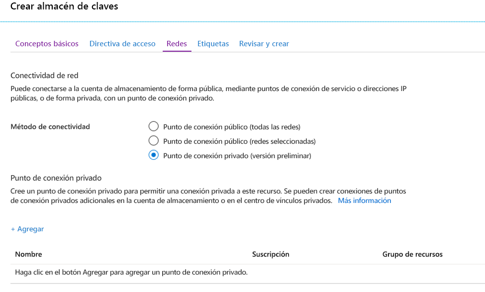
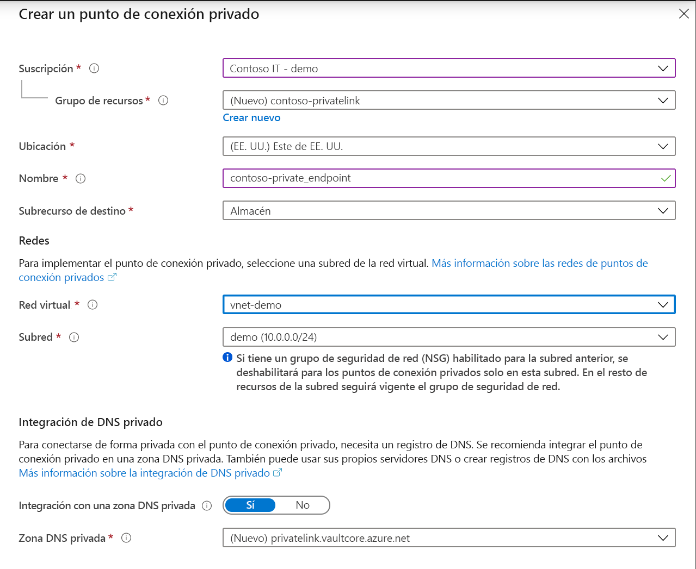
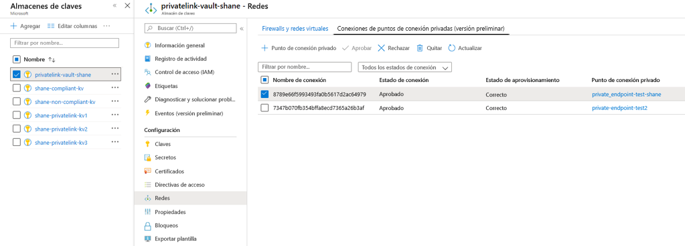

# <a name="integrate-key-vault-with-azure-private-link"></a>Integración de Key Vault con Azure Private Link

El servicio Azure Private Link le permite acceder a los servicios de Azure (por ejemplo, Azure Key Vault, Azure Storage y Azure Cosmos DB) y a los servicios de asociados o clientes hospedados de Azure mediante un punto de conexión privado de la red virtual.

Un punto de conexión privado de Azure es una interfaz de red que le conecta de forma privada y segura a un servicio con la tecnología de Azure Private Link. El punto de conexión privado usa una dirección IP privada de la red virtual para incorporar el servicio de manera eficaz a su red virtual. Todo el tráfico dirigido al servicio se puede enrutar mediante el punto de conexión privado, por lo que no se necesita ninguna puerta de enlace, dispositivos NAT, conexiones de ExpressRoute o VPN ni direcciones IP públicas. El tráfico entre la red virtual y el servicio atraviesa la red troncal de Microsoft, eliminando la exposición a la red pública de Internet. Puede conectarse a una instancia de un recurso de Azure, lo que le otorga el nivel más alto de granularidad en el control de acceso.

Para más información, consulte [¿Qué es Azure Private Link?](../private-link/private-link-overview.md)

## <a name="prerequisites"></a>Prerrequisitos

Para integrar un almacén de claves con Azure Private Link, necesitará lo siguiente:

- Un almacén de claves.
- Una red virtual de Azure.
- Una subred en la red virtual.
- Permisos de propietario o colaborador para el almacén de claves y la red virtual.

El punto de conexión privado y la red virtual deben estar en la misma región. Al seleccionar una región para el punto de conexión privado mediante el portal, solo se filtran automáticamente las redes virtuales que se encuentran en dicha región. El almacén de claves puede estar en una región diferente.

El punto de conexión privado usa una dirección IP privada en la red virtual.

## <a name="establish-a-private-link-connection-to-key-vault-using-the-azure-portal"></a>Establecimiento de una conexión de vínculo privado con Key Vault desde Azure Portal 

En primer lugar, cree una red virtual siguiendo los pasos del artículo [Creación de una red virtual mediante Azure Portal](../virtual-network/quick-create-portal.md).

Después, puede crear un nuevo almacén de claves o establecer una conexión de vínculo privado con un almacén de claves existente.

### <a name="create-a-new-key-vault-and-establish-a-private-link-connection"></a>Creación de un nuevo almacén de claves y establecimiento de una conexión de vínculo privado

Puede crear rápidamente un almacén de claves si sigue los pasos descritos en [Inicio rápido: Establecimiento y recuperación de un secreto de Azure Key Vault mediante Azure Portal](quick-create-portal.md).

Después de configurar los aspectos básicos del almacén de claves, seleccione la pestaña Redes y siga estos pasos:

1. Seleccione el botón de radio Punto de conexión privado en la pestaña Redes.
1. Haga clic en el botón "+ Agregar" para agregar un punto de conexión privado.

    
 
1. En el campo "Ubicación" de la hoja Crear un punto de conexión privado, seleccione la región en la que se encuentra la red virtual. 
1. En el campo "Nombre", cree un nombre descriptivo que le permita identificar este punto de conexión privado. 
1. En el menú desplegable, seleccione la red virtual y la subred en la que desea que se cree este punto de conexión privado. 
1. Deje la opción "Integrate with the private zone DNS" (Integrar con el DNS de la zona privada) sin cambios.  
1. Seleccione "Aceptar".

    
 
Ahora podrá ver el punto de conexión privado configurado. Y tendrá la opción de eliminarlo y de editarlo. Seleccione el botón "Revisar y crear" y cree el almacén de claves. La implementación puede tardar entre 5 y 10 minutos en completarse. 

### <a name="establish-a-private-link-connection-to-an-existing-key-vault"></a>Establecimiento de una conexión de vínculo privado con un almacén de claves existente

Si ya tiene un almacén de claves, puede crear una conexión de vínculo privado siguiendo estos pasos:

1. Inicie sesión en Azure Portal. 
1. En la barra de búsqueda, escriba "almacenes de claves".
1. En la lista, seleccione el almacén de claves al que desea agregar un punto de conexión privado.
1. Seleccione la pestaña "Redes" en Configuración.
1. Seleccione la pestaña Conexiones de puntos de conexión privadas en la parte superior de la página.
1. Seleccione el botón "+ Punto de conexión privado" en la parte superior de la página.

     

Puede optar por crear un punto de conexión privado para cualquier recurso de Azure mediante esta hoja. Puede usar los menús desplegables para seleccionar un tipo de recurso y seleccionar un recurso en el directorio, o bien puede conectarse a cualquier recurso de Azure mediante un identificador de recurso. Deje la opción "Integrate with the private zone DNS" (Integrar con el DNS de la zona privada) sin cambios.  


## <a name="establish-a-private-link-connection-to-key-vault-using-cli"></a>Establecimiento de una conexión de vínculo privado con Key Vault mediante CLI

### <a name="login-to-azure-cli"></a>Inicio de sesión en la CLI de Azure
```console
az login 
```
### <a name="select-your-azure-subscription"></a>Selección de una suscripción a Azure 
```console
az account set --subscription {AZURE SUBSCRIPTION ID}
```
### <a name="create-a-new-resource-group"></a>Creación de un grupo de recursos 
```console
az group create -n {RG} -l {AZURE REGION}
```
### <a name="register-microsoftkeyvault-as-a-provider"></a>Registro de Microsoft.KeyVault como proveedor 
```console
az provider register -n Microsoft.KeyVault
```
### <a name="create-a-new-key-vault"></a>Creación de una instancia de Key Vault
```console
az keyvault create --name {KEY VAULT NAME} --resource-group {RG} --location {AZURE REGION}
```
### <a name="turn-on-key-vault-firewall"></a>Activación del firewall de Key Vault
```console
az keyvault update --name {KEY VAULT NAME} --resource-group {RG} --location {AZURE REGION} --default-action deny
```
### <a name="create-a-virtual-network"></a>Creación de una red virtual
```console
az network vnet create --resource-group {RG} --name {vNet NAME} --location {AZURE REGION}
```
### <a name="add-a-subnet"></a>Incorporación de una subred
```console
az network vnet subnet create --resource-group {RG} --vnet-name {vNet NAME} --name {subnet NAME} --address-prefixes {addressPrefix}
```
### <a name="disable-virtual-network-policies"></a>Deshabilitación de directivas de red virtual 
```console
az network vnet subnet update --name {subnet NAME} --resource-group {RG} --vnet-name {vNet NAME} --disable-private-endpoint-network-policies true
```
### <a name="add-a-private-dns-zone"></a>Incorporación de una zona de DNS privado 
```console
az network private-dns zone create --resource-group {RG} --name privatelink.vaultcore.azure.net
```
### <a name="link-private-dns-zone-to-virtual-network"></a>Vinculación de una zona de DNS privado a una red virtual 
```console
az network private-dns link vnet create --resoruce-group {RG} --virtual-network {vNet NAME} --zone-name privatelink.vaultcore.azure.net --name {dnsZoneLinkName} --registration-enabled true
```
### <a name="create-a-private-endpoint-automatically-approve"></a>Creación de un punto de conexión privado (aprobación automática) 
```console
az network private-endpoint create --resource-group {RG} --vnet-name {vNet NAME} --subnet {subnet NAME} --name {Private Endpoint Name}  --private-connection-resource-id "/subscriptions/{AZURE SUBSCRIPTION ID}/resourceGroups/{RG}/providers/Microsoft.KeyVault/vaults/ {KEY VAULT NAME}" --group-ids vault --connection-name {Private Link Connection Name} --location {AZURE REGION}
```
### <a name="create-a-private-endpoint-manually-request-approval"></a>Crear un punto de conexión privado (solicitud manual de aprobación) 
```console
az network private-endpoint create --resource-group {RG} --vnet-name {vNet NAME} --subnet {subnet NAME} --name {Private Endpoint Name}  --private-connection-resource-id "/subscriptions/{AZURE SUBSCRIPTION ID}/resourceGroups/{RG}/providers/Microsoft.KeyVault/vaults/ {KEY VAULT NAME}" --group-ids vault --connection-name {Private Link Connection Name} --location {AZURE REGION} --manual-request
```
### <a name="show-connection-status"></a>Mostrar el estado de la conexión 
```console
az network private-endpoint show --resource-group {RG} --name {Private Endpoint Name}
```
## <a name="manage-private-link-connection"></a>Administración de una conexión de vínculo privado

Cuando se crea un punto de conexión privado, se debe aprobar la conexión. Si el recurso para el que va a crear el punto de conexión privado está en el directorio, podrá aprobar la solicitud de conexión siempre que tenga los permisos necesarios. Si se va a conectar a un recurso de Azure en otro directorio, debe esperar a que el propietario de ese recurso apruebe la solicitud de conexión.

Hay cuatro estados de aprovisionamiento:

| Acción de suministro de servicios | Estado de punto de conexión privado del consumidor del servicio | Descripción |
|--|--|--|
| None | Pending | La conexión se crea manualmente y está pendiente de aprobación por parte del propietario del recurso de Private Link. |
| Aprobación | Aprobado | La conexión se aprobó de forma automática o manual y está lista para usarse. |
| Reject | Rechazada | El propietario del recurso de vínculo privado rechazó la conexión. |
| Remove | Escenario desconectado | El propietario del recurso del vínculo privado quitó la conexión, el punto de conexión privado se vuelve informativo y debe eliminarse para la limpieza. |
 
###  <a name="how-to-manage-a-private-endpoint-connection-to-key-vault-using-the-azure-portal"></a>Administración de una conexión de punto de conexión privado con Key Vault desde Azure Portal 

1. Inicie sesión en el Portal de Azure.
1. En la barra de búsqueda, escriba "almacenes de claves".
1. Seleccione el almacén de claves que desea administrar.
1. Seleccione la pestaña "Redes".
1. Si hay alguna conexión pendiente, verá una conexión listada con "Pendiente" en el estado de aprovisionamiento. 
1. Seleccione el punto de conexión privado que desea aprobar.
1. Después, haga clic en el botón Aprobar.
1. Si hay conexiones de punto de conexión privado que quiere rechazar, ya sea una solicitud pendiente o una conexión existente, seleccione la conexión y haga clic en el botón "Rechazar".

    

##  <a name="how-to-manage-a-private-endpoint-connection-to-key-vault-using-azure-cli"></a>Administración de una conexión de punto de conexión privado con Key Vault mediante la CLI de Azure

### <a name="approve-a-private-link-connection-request"></a>Aprobación de una solicitud de conexión de vínculo privado
```console
az keyvault private-endpoint-connection approve --approval-description {"OPTIONAL DESCRIPTION"} --resource-group {RG} --vault-name {KEY VAULT NAME} –name {PRIVATE LINK CONNECTION NAME}
```

### <a name="deny-a-private-link-connection-request"></a>Denegación de una solicitud de conexión de vínculo privado
```console
az keyvault private-endpoint-connection reject --rejection-description {"OPTIONAL DESCRIPTION"} --resource-group {RG} --vault-name {KEY VAULT NAME} –name {PRIVATE LINK CONNECTION NAME}
```

### <a name="delete-a-private-link-connection-request"></a>Eliminación de una solicitud de conexión de vínculo privado
```console
az keyvault private-endpoint-connection delete --resource-group {RG} --vault-name {KEY VAULT NAME} --name {PRIVATE LINK CONNECTION NAME}
```

## <a name="validate-that-the-private-link-connection-works"></a>Validación de que la conexión de vínculo privado funciona

Debe validar que los recursos de la misma subred del recurso de punto de conexión privado se conectan al almacén de claves mediante una dirección IP privada y que tienen la integración correcta de la zona DNS privada.

En primer lugar, cree una máquina virtual siguiendo los pasos que encontrará en [Creación de una máquina virtual Windows en Azure Portal](../virtual-machines/windows/quick-create-portal.md).

Haga clic en la pestaña "Redes".

1. Especifique una red virtual y una subred. Puede crear una red virtual o seleccionar una existente. Si selecciona una existente, asegúrese de que la región coincide.
1. Especifique un recurso de dirección IP pública.
1. En "Grupo de seguridad de red de NIC", seleccione "Ninguno".
1. En "Equilibrio de carga", seleccione "No".

Abra el símbolo del sistema y ejecute el siguiente comando:

```console
nslookup <your-key-vault-name>.vault.azure.net
```

Si ejecuta el comando de búsqueda ns para resolver la dirección IP de un almacén de claves sobre un punto de conexión público, verá un resultado similar al siguiente:

```console
c:\ >nslookup <your-key-vault-name>.vault.azure.net

Non-authoritative answer:
Name:    
Address:  (public IP address)
Aliases:  <your-key-vault-name>.vault.azure.net
```

Si ejecuta el comando de búsqueda ns para resolver la dirección IP de un almacén de claves sobre un punto de conexión privado, verá un resultado similar al siguiente:

```console
c:\ >nslookup your_vault_name.vault.azure.net

Non-authoritative answer:
Name:    
Address:  10.1.0.5 (private IP address)
Aliases:  <your-key-vault-name>.vault.azure.net
          <your-key-vault-name>.privatelink.vaultcore.azure.net
```

## <a name="limitations-and-design-considerations"></a>Limitaciones y consideraciones de diseño

**Precios**: Para más información sobre los precios, consulte [Precios de Azure Private Link](https://azure.microsoft.com/pricing/details/private-link/).

**Limitaciones**:  El punto de conexión privado para Azure Key Vault solo está disponible en regiones públicas de Azure.

**Número máximo de puntos de conexión privados por almacén de claves**: 64.

**Número máximo de almacenes de claves con puntos de conexión privados por suscripción**: 64.

Para más información, consulte [Servicio Azure Private Link: Limitaciones](../private-link/private-link-service-overview.md#limitations)

## <a name="next-steps"></a>Pasos siguientes

- Más información sobre [Azure Private Link](../private-link/private-link-service-overview.md).
- Más información sobre [Azure Key Vault](key-vault-overview.md)
