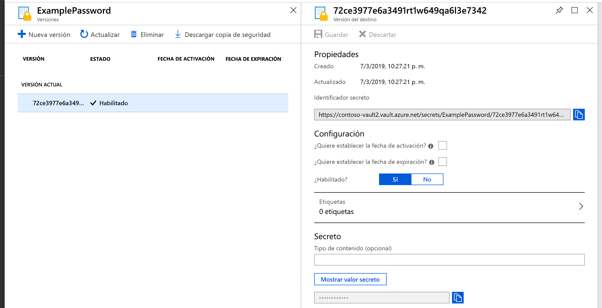

# Inicio rápido: Establecimiento y recuperación de un secreto de Azure Key Vault mediante Azure Portal

Azure Key Vault es un servicio de almacenamiento seguro de secretos en la nube. Puede almacenar de forma segura claves, contraseñas, certificados y otros secretos. Las instancias de Azure Key Vault se pueden crear y administrar a través de Azure Portal. En esta guía de inicio rápido se crea un almacén de claves y se usa para almacenar un secreto. Para más información sobre Key Vault, consulte esta [introducción](key-vault-overview.md).

Si no tiene una suscripción a Azure, cree una [cuenta gratuita](https://azure.microsoft.com/free/?WT.mc_id=A261C142F) antes de empezar.

## Inicio de sesión en Azure

Inicie sesión en Azure Portal en https://portal.azure.com.

## Creación de un almacén

1. En el menú de Azure Portal o en la **página principal**, seleccione **Crear un recurso**.
2. En el cuadro de búsqueda, escriba **Key Vault**.
3. En la lista de resultados, elija **Key Vault**.
4. En la sección Key Vault, elija **Crear**.
5. En la sección **Crear Key Vault**, proporcione la siguiente información:
    - **Nombre**: se requiere un nombre único. En esta guía de inicio rápido se usará **Contoso-vault2**. 
    - **Suscripción**: elija una suscripción.
    - En **Grupo de recursos** elija **Crear nuevo** y escriba un nombre para el grupo de recursos.
    - En el menú desplegable **Ubicación**, elija una ubicación.
    - Deje las restantes opciones con sus valores predeterminados.
6. Después de proporcionar la información descrita anteriormente, seleccione **Crear**.

Tome nota de las dos propiedades siguientes:

* **Nombre de almacén**: en este ejemplo es **Contoso-Vault2**. Utilizará este nombre para otros pasos.
* **URI de almacén**: en el ejemplo, es https://contoso-vault2.vault.azure.net/. Las aplicaciones que utilizan el almacén a través de su API de REST deben usar este identificador URI.

En este momento, su cuenta de Azure es la única autorizada para realizar operaciones en este nuevo almacén.

## Incorporación de un secreto a Key Vault

Para agregar un secreto al almacén, simplemente debe realizar un par de pasos adicionales. En este caso se ha agregado una contraseña que una aplicación podría usar. La contraseña se denomina **ExamplePassword** y almacena el valor de **Pa$$hVFkk965BuUv**.

1. En las páginas de propiedades de Key Vault, seleccione **Secretos**.
2. Haga clic en **Generar o Importar**.
3. En la pantalla **Crear un secreto**, elija los siguientes valores:
    - **Opciones de carga**: Manual.
    - **Nombre**: ExamplePassword.
    - **Valor**: hVFkk965BuUv
    - Deje las restantes opciones con sus valores predeterminados. Haga clic en **Crear**.

Una vez recibido el mensaje de que el secreto se ha creado correctamente, puede hacer clic en él en la lista. A continuación, puede ver algunas de las propiedades. Si hace clic en la versión actual puede ver el valor especificado en el paso anterior.

Si hace clic en el botón "Mostrar valor secreto" en el panel de la derecha, puede usar el valor oculto. 

## Limpieza de recursos

Otras guías de inicio rápido y tutoriales de Key Vault se basan en esta. Si tiene pensado seguir trabajando en otras guías de inicio rápido y tutoriales, considere la posibilidad de dejar estos recursos activos.
Cuando ya no lo necesite, elimine el grupo de recursos; de este modo se eliminarán también Key Vault y los recursos relacionados. Para eliminar el grupo de recursos mediante el portal:

1. Escriba el nombre del grupo de recursos en el cuadro de búsqueda de la parte superior del portal. Cuando vea el grupo de recursos que se utiliza en esta guía de inicio rápido en los resultados de búsqueda, selecciónelo.
2. Seleccione **Eliminar grupo de recursos**.
3. En el cuadro **ESCRIBA EL NOMBRE DEL GRUPO DE RECURSOS:** escriba el nombre del grupo de recursos y seleccione **Eliminar**.

## Pasos siguientes

En este inicio rápido ha creado una instancia de Key Vault y ha almacenado un secreto en ella. Para más información sobre Key Vault y cómo integrarlo con las aplicaciones, continúe con los artículos siguientes.

- Lea una [introducción a Azure Key Vault](key-vault-overview.md).
- Consulte la [guía del desarrollador de Azure Key Vault](key-vault-developers-guide.md).
- Consulte sobre las [claves, secretos y certificados](about-keys-secrets-and-certificates.md).
- Consulte los [procedimientos recomendados de Azure Key Vault](key-vault-best-practices.md).