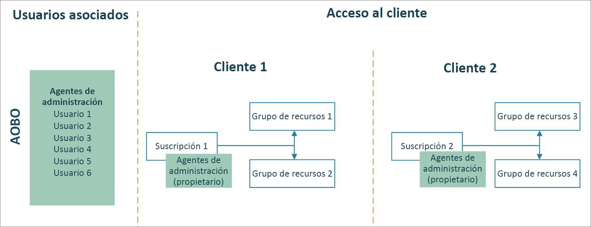
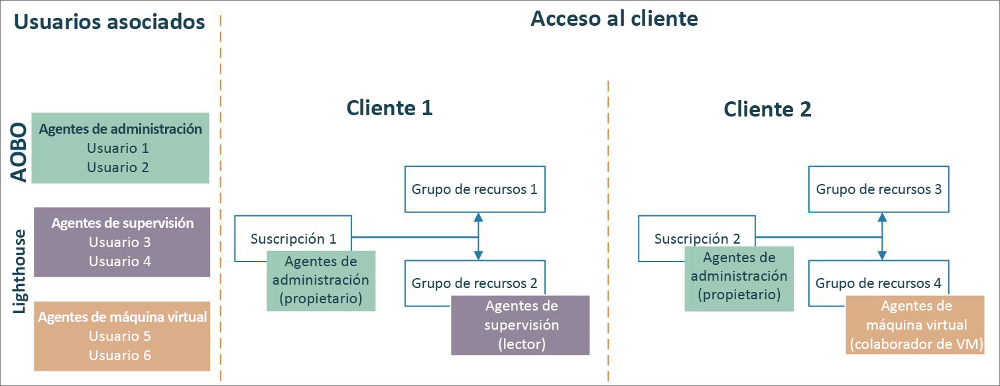

# Azure Lighthouse y el programa Proveedor de soluciones en la nube

Si es un partner [CSP (Proveedor de soluciones en la nube)](/partner-center/csp-overview), ya puede acceder a las suscripciones a Azure creadas para sus clientes desde el programa CSP mediante la funcionalidad [Administrar en nombre de (AOBO)](https://channel9.msdn.com/Series/cspdev/Module-11-Admin-On-Behalf-Of-AOBO). Este acceso le permite admitir, configurar y administrar directamente las suscripciones de sus clientes.

[Azure Lighthouse](../overview.md) permite usar la administración de recursos delegados de Azure junto con AOBO. Esto ayuda a mejorar la seguridad y reduce el acceso innecesario, gracias a la habilitación de permisos más pormenorizados para los usuarios. También permite conseguir mayor eficiencia y escalabilidad, ya que los usuarios pueden trabajar en varias suscripciones de clientes con un único inicio de sesión en el inquilino.

> [!TIP]
> Para ayudar a proteger los recursos de los clientes, asegúrese de revisar y seguir nuestros [procedimientos de seguridad recomendados](recommended-security-practices.md) junto con los [requisitos de seguridad del asociado](/partner-center/partner-security-requirements).

## Administrar en nombre de (AOBO)

Con AOBO, cualquier usuario con el rol [Agente de administración](/partner-center/permissions-overview#manage-commercial-transactions-in-partner-center-azure-ad-and-csp-roles) en el inquilino tendrá acceso AOBO a las suscripciones a Azure que cree desde el programa CSP. Cualquier usuario que necesite tener acceso a las suscripciones de los clientes debe ser miembro de este grupo. AOBO no permite la flexibilidad de crear grupos distintos que funcionen con distintos clientes ni de habilitar diferentes roles para grupos o usuarios.

## Administración de recursos delegados de Azure

Con Azure Lighthouse, puede asignar grupos diferentes a distintos clientes o roles, tal y como se muestra en el diagrama siguiente. Dado que los usuarios tendrán el nivel de acceso adecuado a través de la administración de recursos delegados de Azure, puede reducir el número de usuarios que tienen el rol de agente de administración (y, por tanto, tienen acceso AOBO completo). Esto ayuda a mejorar la seguridad al limitar el acceso innecesario a los recursos de los clientes. También le ofrece más flexibilidad para administrar varios clientes a escala.

Para incorporar una suscripción creada desde el programa CSP, siga los pasos descritos en [Onboard a subscription to Azure Lighthouse](../how-to/onboard-customer.md) (Incorporación de una suscripción a Azure Lighthouse). Cualquier usuario que tenga el rol de agente de administración en el inquilino puede realizar esta incorporación.

> [!TIP]
> Las [ofertas de servicio administrado](managed-services-offers.md) no son compatibles con las suscripciones que se establecen a través de un revendedor del programa Proveedor de soluciones en la nube (CSP). Puede incorporar estas suscripciones a Azure Lighthouse [mediante el uso de plantillas de Azure Resource Manager](../how-to/onboard-customer.md).

> [!NOTE]
> La página [**Mis clientes** de Azure Portal](../how-to/view-manage-customers.md) ahora incluye la sección **Proveedor de soluciones en la nube (versión preliminar)** , que muestra la información de facturación y los recursos para los clientes de CSP que han [firmado el Contrato de cliente de Microsoft (MCA)](/partner-center/confirm-customer-agreement) y usan [el plan de Azure](/partner-center/azure-plan-get-started). Para obtener más información, consulte [Introducción a la cuenta de facturación para un contrato Microsoft Partner Agreement](../../cost-management-billing/understand/mpa-overview.md).
>
> Los clientes de CSP pueden aparecer en esta sección independientemente de si también se han incorporado a Azure Lighthouse. En caso afirmativo, también se mostrarán en la sección **Clientes**, como se describe en [Ver y administrar clientes y recursos delegados](../how-to/view-manage-customers.md). Del mismo modo, no es necesario que un cliente de CSP aparezca en la sección **Proveedor de soluciones en la nube (versión preliminar)** de **Mis clientes** para poder incorporarlo a Azure Lighthouse.

## Pasos siguientes

- Más información sobre las [experiencias de administración entre inquilinos](cross-tenant-management-experience.md).
- Aprenda a [incorporar una suscripción a Azure Lighthouse](../how-to/onboard-customer.md).
- Más información acerca del [programa Proveedor de soluciones en la nube](/partner-center/csp-overview).
