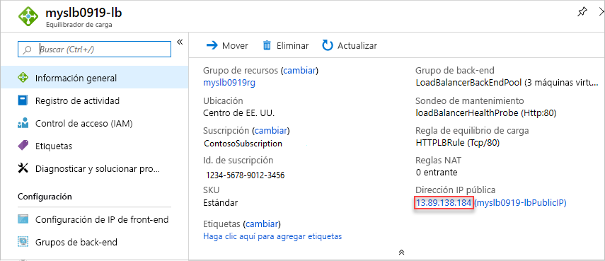

# <a name="quickstart-create-a-public-load-balancer-to-load-balance-vms-by-using-an-arm-template"></a>Inicio rápido: Creación de un equilibrador de carga público para equilibrar la carga de las máquinas virtuales mediante una plantilla de Resource Manager

El equilibrio de carga proporciona un mayor nivel de disponibilidad y escala, ya que distribuye las solicitudes entrantes entre varias máquinas virtuales. 

En este inicio rápido se muestra cómo implementar un equilibrador de carga estándar para equilibrar la carga de las máquinas virtuales.

El uso de una plantilla de Resource Manager requiere menos pasos que otros métodos de implementación.

[!INCLUDE [About Azure Resource Manager](../../includes/resource-manager-quickstart-introduction.md)]

Si su entorno cumple los requisitos previos y está familiarizado con el uso de plantillas de Resource Manager, seleccione el botón **Implementar en Azure**. La plantilla se abrirá en Azure Portal.

[](https://portal.azure.com/#create/Microsoft.Template/uri/https%3A%2F%2Fraw.githubusercontent.com%2FAzure%2Fazure-quickstart-templates%2Fmaster%2F101-load-balancer-standard-create%2Fazuredeploy.json)

## <a name="prerequisites"></a>Requisitos previos

Si no tiene una suscripción a Azure, cree una [cuenta gratuita](https://azure.microsoft.com/free/?WT.mc_id=A261C142F) antes de empezar.

## <a name="review-the-template"></a>Revisión de la plantilla

La plantilla usada en este inicio rápido forma parte de las [plantillas de inicio rápido de Azure](https://azure.microsoft.com/resources/templates/101-load-balancer-standard-create/).

El equilibrador de carga y las SKU de IP públicas deben coincidir. Cuando se crea un equilibrador de carga estándar, también se debe crear una nueva dirección IP pública estándar que se configura como front-end para esa instancia. Si desea crear un equilibrador de carga básico, use [esta plantilla](https://azure.microsoft.com/resources/templates/201-2-vms-loadbalancer-natrules/). Microsoft recomienda usar la SKU estándar para cargas de trabajo de producción.

:::code language="json" source="~/quickstart-templates/101-load-balancer-standard-create/azuredeploy.json":::

En la plantilla se han definido varios recursos de Azure:

- [**Microsoft.Network/loadBalancers**](/azure/templates/microsoft.network/loadbalancers)
- [**Microsoft.Network/publicIPAddresses**](/azure/templates/microsoft.network/publicipaddresses): para el equilibrador de carga y para cada una de las tres máquinas virtuales.
- [**Microsoft.Network/networkSecurityGroups**](/azure/templates/microsoft.network/networksecuritygroups)
- [**Microsoft.Network/virtualNetworks**](/azure/templates/microsoft.network/virtualnetworks)
- [**Microsoft.Compute/virtualMachines**](/azure/templates/microsoft.compute/virtualmachines) (3 de ellas)
- [**Microsoft.Network/networkInterfaces**](/azure/templates/microsoft.network/networkinterfaces) (3 de ellas)
- [**Microsoft.Compute/virtualMachine/extensions**](/azure/templates/microsoft.compute/virtualmachines/extensions) (3 de ellas): se usan para configurar Internet Information Server (IIS) y las páginas web.

Para encontrar más plantillas relacionadas con Azure Load Balancer, consulte [Plantillas de inicio rápido de Azure](https://azure.microsoft.com/resources/templates/?resourceType=Microsoft.Network&pageNumber=1&sort=Popular).

## <a name="deploy-the-template"></a>Implementación de la plantilla

1. Seleccione **Try It** (Probarlo) en el bloque de código siguiente para abrir Azure Cloud Shell y siga las instrucciones para iniciar sesión en Azure.

   ```azurepowershell-interactive
   $projectName = Read-Host -Prompt "Enter a project name with 12 or less letters or numbers that is used to generate Azure resource names"
   $location = Read-Host -Prompt "Enter the location (i.e. centralus)"
   $adminUserName = Read-Host -Prompt "Enter the virtual machine administrator account name"
   $adminPassword = Read-Host -Prompt "Enter the virtual machine administrator password" -AsSecureString

   $resourceGroupName = "${projectName}rg"
   $templateUri = "https://raw.githubusercontent.com/Azure/azure-quickstart-templates/master/101-load-balancer-standard-create/azuredeploy.json"

   New-AzResourceGroup -Name $resourceGroupName -Location $location
   New-AzResourceGroupDeployment -ResourceGroupName $resourceGroupName -TemplateUri $templateUri -projectName $projectName -location $location -adminUsername $adminUsername -adminPassword $adminPassword

   Write-Host "Press [ENTER] to continue."
   ```

   Espere hasta que vea el aviso de la consola.

1. Seleccione **Copiar** en el bloque de código anterior para copiar el script de PowerShell.

1. Haga clic con el botón derecho en el panel de consola del shell y, a continuación, seleccione **Pegar**.

1. Escriba los valores.

   La implementación de plantilla crea tres zonas de disponibilidad. Las zonas de disponibilidad se admiten solo en [determinadas regiones](../availability-zones/az-overview.md). Use alguna de las regiones admitidas. Si no está seguro, escriba **centralus**.

   El nombre del grupo de recursos es el nombre del proyecto con **rg** anexado. Necesitará el nombre del grupo de recursos en la sección siguiente.

Tardará unos 10 minutos en implementar la plantilla. Al finalizar, la salida es parecida a esta:


Azure PowerShell se usa para implementar la plantilla. También puede usar Azure Portal, la CLI de Azure y la API REST. Para obtener información sobre otros métodos de implementación, consulte [Implementación de plantillas](../azure-resource-manager/templates/deploy-portal.md).

## <a name="review-deployed-resources"></a>Revisión de los recursos implementados

1. Inicie sesión en [Azure Portal](https://portal.azure.com).

1. Seleccione **Grupos de recursos** en el panel izquierdo.

1. Seleccione el grupo de recursos que creó en la sección anterior. El nombre del grupo de recursos predeterminado es el nombre del proyecto con **rg** anexado.

1. Seleccione el equilibrador de carga. Su nombre predeterminado es el nombre del proyecto con **-lb** anexado.

1. Copie solo la parte de la dirección IP pública y, luego, péguela en la barra de direcciones del explorador.

   

    El explorador muestra la página predeterminada del servidor web de Internet Information Services (IIS).

   

Para ver cómo Load Balancer distribuye el tráfico entre las tres máquinas virtuales, puede forzar una actualización del explorador web desde la máquina cliente.

## <a name="clean-up-resources"></a>Limpieza de recursos

Cuando ya no los necesite, elimine: 

* Resource group
* Equilibrador de carga
* Recursos relacionados

Vaya a Azure Portal, seleccione el grupo de recursos que contiene el equilibrador de carga y, luego, seleccione **Eliminar grupo de recursos**.

## <a name="next-steps"></a>Pasos siguientes

En esta guía de inicio rápido:

* Ha creado un equilibrador de carga estándar y ha conectado máquinas virtuales a él.
* Ha configurado la regla de tráfico del equilibrador de carga y el sondeo de estado.
* Probó el equilibrador de carga.

Para más información, continúe con los tutoriales de Azure Load Balancer.

> [!div class="nextstepaction"]
> [Tutoriales de Azure Load Balancer](tutorial-load-balancer-standard-public-zone-redundant-portal.md)
