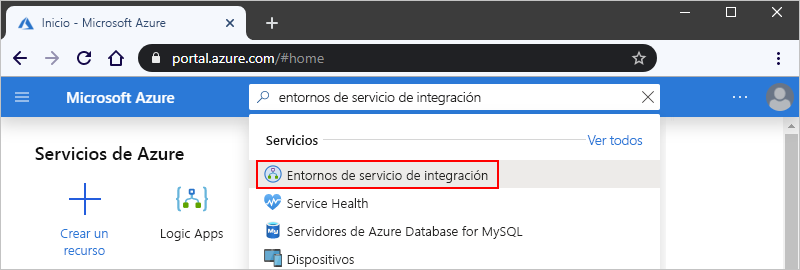

# Administración del entorno del servicio de integración (ISE) en Azure Logic Apps

Para comprobar el estado de la red en su [entorno del servicio de integración (ISE)](../logic-apps/connect-virtual-network-vnet-isolated-environment-overview.md) y administrar las aplicaciones lógicas, las conexiones, las cuentas de integración y los conectores que existan en el ISE, siga los pasos de este tema. Para agregar estos artefactos al ISE, consulte [Adición de artefactos al entorno del servicio de integración](../logic-apps/add-artifacts-integration-service-environment-ise.md).

## Ver su ISE

1. Inicie sesión en el [Azure Portal](https://portal.azure.com).

1. En el cuadro de búsqueda del portal, escriba "entornos de servicio de integración" y, después, seleccione **Entornos de servicio de integración**.

   

1. En la lista de resultados, seleccione su entorno del servicio de integración.

   

1. Continúe con las secciones siguientes para buscar aplicaciones lógicas, conexiones, conectores o cuentas de integración en el ISE.

## Comprobación del estado de la red

En el menú de ISE, en **Configuración**, seleccione **Estado de la red**. Este panel muestra el estado de mantenimiento de las subredes y las dependencias de salida en otros servicios.

## Administración de las aplicaciones lógicas

Puede ver y administrar las aplicaciones lógicas que se encuentran en el ISE.

1. En el menú de ISE, en **Configuración**, seleccione **Aplicaciones lógicas**.

   

1. Para eliminar aplicaciones lógicas del ISE cuando ya no las necesite, selecciónelas y, a continuación, seleccione **Eliminar**. Seleccione **Sí** para confirmar que desea eliminarlas.

## Administración de las conexiones de API

Puede ver y administrar las conexiones creadas por las aplicaciones lógicas que se ejecutan en el ISE.

1. En el menú de ISE, en **Configuración**, seleccione **Conexiones de API**.

   

1. Para eliminar las conexiones del ISE cuando ya no las necesite, seleccione esas conexiones y, a continuación, seleccione **Eliminar**. Seleccione **Sí** para confirmar que desea eliminarlas.

## Administración de los conectores de ISE

Puede ver y administrar los conectores de API que se han implementado en el ISE.

1. En el menú de ISE, en **Configuración**, seleccione **Conectores administrados**.

   

1. Para eliminar los conectores del ISE cuando ya no los necesite, seleccione esos conectores y, a continuación, seleccione **Eliminar**. Seleccione **Sí** para confirmar que desea eliminarlas.

## Administración de conectores personalizados

Puede ver y administrar los conectores personalizados que implementó en el ISE.

1. En el menú de ISE, en **Configuración**, seleccione **Conectores personalizados**.

   

1. Para eliminar los conectores personalizados del ISE cuando ya no los necesite, seleccione esos conectores y, a continuación, seleccione **Eliminar**. Seleccione **Sí** para confirmar que desea eliminarlas.

## Administración de cuentas de integración

1. En el menú de ISE, en **Configuración**, seleccione **Cuentas de integración**.

   

1. Para quitar las cuentas de integración del ISE cuando ya no las necesite, selecciónelas y, después, seleccione **Eliminar**.

## Pasos siguientes

* Aprenda a [conectarse a las redes virtuales de Azure desde aplicaciones lógicas aisladas](../logic-apps/connect-virtual-network-vnet-isolated-environment.md).
