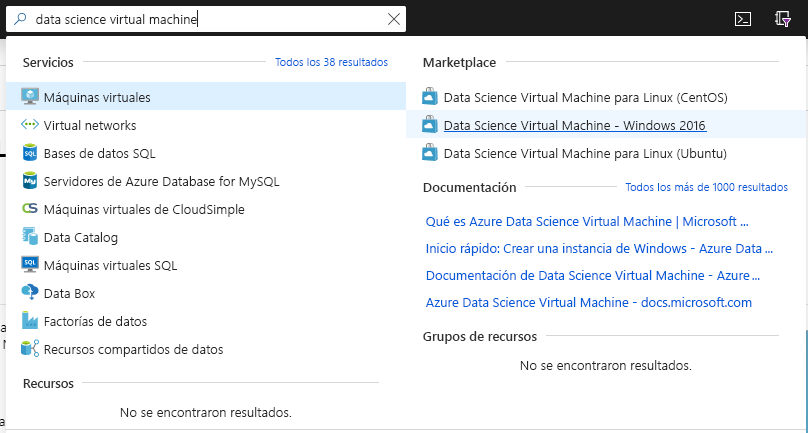
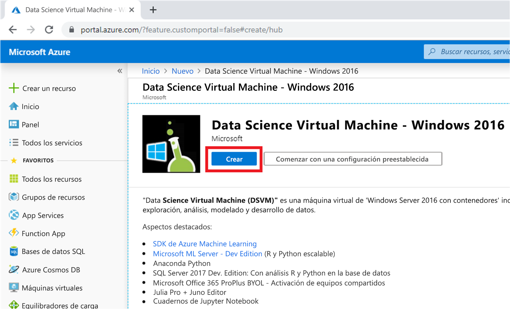
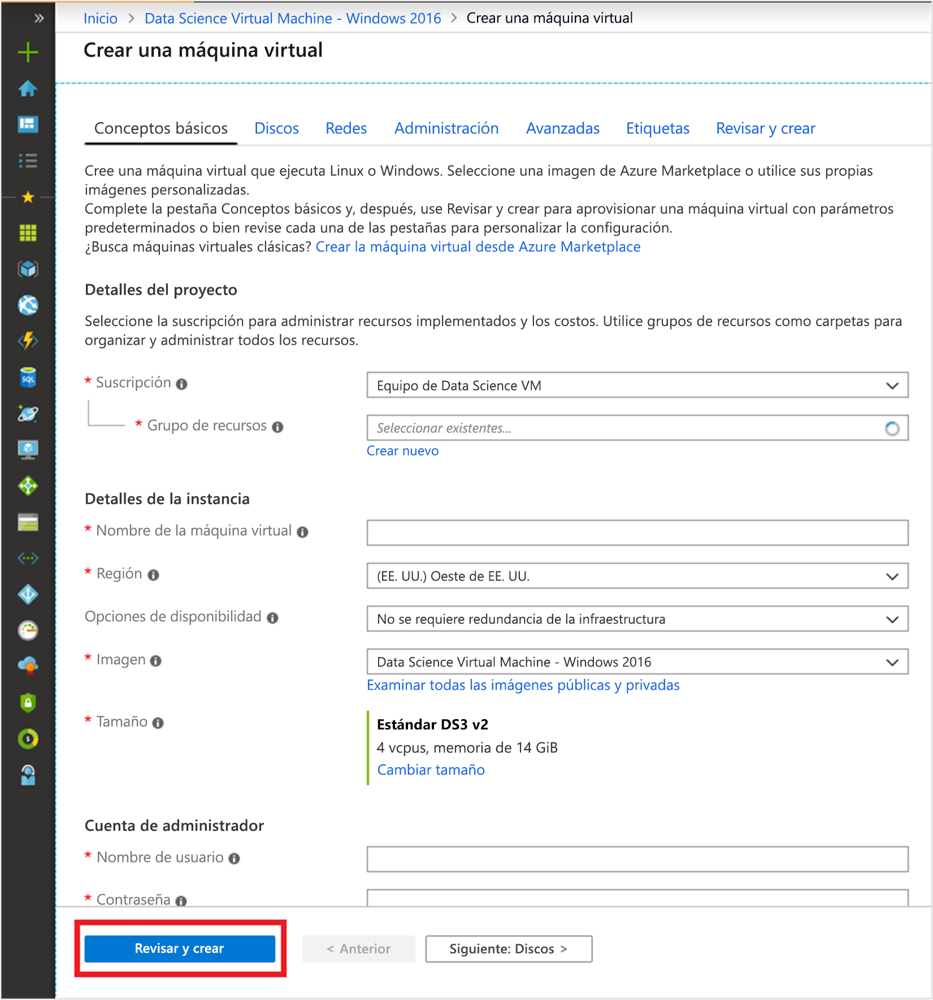

# Inicio rápido: Configuración de Data Science Virtual Machine para Windows

Empiece a trabajar con la instancia de Data Science Virtual Machine para Windows.

## Requisito previo

Para crear una instancia de Microsoft Data Science Virtual Machine, debe tener una suscripción de Azure. [Pruebe Azure gratis](https://azure.com/free).
Tenga en cuenta que las cuentas gratuitas de Azure no admiten los SKU de máquinas virtuales habilitadas para GPU.

## Creación de su instancia de DSVM

Para crear una instancia de DSVM:

1. Vaya a [Azure Portal](https://portal.azure.com). Es posible que se le pida que inicie sesión en su cuenta de Azure, si todavía no lo ha hecho.
1. Busque la lista de máquinas virtuales. Para ello, escriba "data science virtual machine" y seleccione "Data Science Virtual Machine - Windows 2016".

    

1. Seleccione el botón **Crear** que se encuentra en la parte inferior.

    

1. Debería ser redirigido a la hoja "Crear una máquina virtual".
   

1. Rellene la pestaña **Aspectos básicos**:
      * **Suscripción**: si tiene más de una suscripción, seleccione aquella en la que se creará y facturará la máquina. Debe tener privilegios de creación de recursos en esta suscripción.
      * **Grupo de recursos**: cree un grupo o use uno existente.
      * **Nombre de la máquina virtual**: escriba el nombre de la máquina virtual. Así es como aparecerá en Azure Portal.
      * **Ubicación**: seleccione el centro de datos más adecuado. Para disfrutar de un acceso más rápido a la red, elija el centro de datos que tenga la mayoría de los datos o el que esté más cerca de su ubicación física. Más información sobre las [regiones de Azure](https://azure.microsoft.com/global-infrastructure/regions/).
      * **Imagen**: Deje el valor predeterminado.
      * **Tamaño**: debería rellenarse automáticamente con un tamaño adecuado para cargas de trabajo generales. Más información sobre los [tamaños de máquina virtual Windows en Azure](../../virtual-machines/windows/sizes.md).
      * **Nombre de usuario**: escriba el nombre de usuario del administrador. Es el nombre de usuario que usará para iniciar sesión en la máquina virtual y no necesariamente debe ser el mismo que el nombre de usuario de Azure.
      * **Contraseña**: escriba la contraseña que utilizará para iniciar sesión en la máquina virtual.    
1. Seleccione **Revisar + crear**.
1. **Revisar y crear**
   * Compruebe que toda la información que ha especificado es correcta. 
   * Seleccione **Crear**.

> [!NOTE]
> * No pague las licencias del software que viene precargado en la máquina virtual. Pague el costo de proceso del tamaño del servidor que eligió en el paso **Tamaño**.
> * El aprovisionamiento tarda entre 10 y 20 minutos. Puede ver el estado de la máquina virtual en Azure Portal.

## Acceso a la instancia de DSVM

Después de que la máquina virtual se crea y se aprovisiona, siga los pasos que se indican para [conectar con una máquina virtual basada en Azure](../../marketplace/cloud-partner-portal/virtual-machine/cpp-connect-vm.md). Use las credenciales de la cuenta de administrador que configuró en el paso **Aspectos básicos** de la creación de una máquina virtual. 

Ya está listo para empezar a usar las herramientas que están instaladas y configuradas en la máquina virtual. Se puede acceder a muchas de las herramientas mediante los iconos del menú **Inicio** y de los iconos del escritorio.

También puede conectar una instancia de DSVM a Azure Notebooks para ejecutar cuadernos de Jupyter en la máquina virtual y omitir las limitaciones del nivel de servicio gratuito. Para más información, consulte [Administración y configuración de proyectos de Azure Notebooks](../../notebooks/configure-manage-azure-notebooks-projects.md#manage-and-configure-projects).

## Pasos siguientes

* Para explorar las herramientas en DSVM; abra el menú **Inicio**.
* Obtenga información acerca de Azure Machine Learning Service en [¿Qué es el servicio Azure Machine Learning service?](../service/overview-what-is-azure-ml.md) y pruebe los [tutoriales](../index.yml).
* En el Explorador de archivos, vaya a C:\Archivos de programa\Microsoft\ML Server\R_SERVER\library\RevoScaleR\demoScripts para ver ejemplos de uso de la biblioteca RevoScaleR de R que admiten análisis de datos a escala empresarial. 
* Lea el artículo [Diez cosas que puede hacer en Data Science Virtual Machine](https://aka.ms/dsvmtenthings).
* Aprenda a crear soluciones analíticas completas mediante el uso sistemático del [proceso de ciencia de datos en equipo](../team-data-science-process/index.yml).
* Visite la [Galería de Azure AI](https://gallery.cortanaintelligence.com) para ver ejemplos de aprendizaje automático y análisis de datos donde se usa Azure Machine Learning y servicios de datos relacionados en Azure. También hemos proporcionado un icono para esta galería en el menú **Inicio** y en el escritorio de la máquina virtual.

