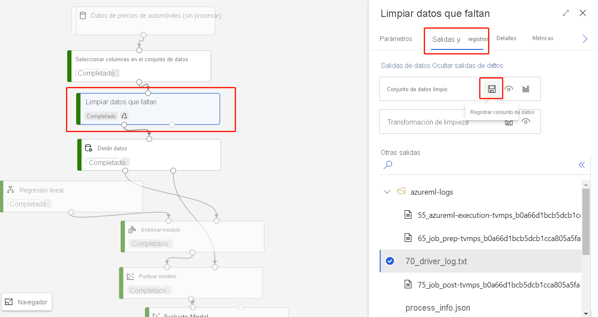

# Importación de datos en el diseñador de Azure Machine Learning (versión preliminar)

En este artículo, aprenderá a importar sus propios datos en el diseñador para crear soluciones personalizadas. Hay dos formas de importar datos en el diseñador: 

* **Conjuntos de datos de Azure Machine Learning**: registre [conjuntos de datos](concept-data.md#datasets) en Azure Machine Learning para habilitar características avanzadas que le ayuden a administrar sus datos.
* **Módulo Import Data** (Importar datos): el módulo [Import data](algorithm-module-reference/import-data.md) (Importar datos) se usa para acceder directamente a datos de orígenes de datos en línea.

## Uso de conjuntos de datos de Azure Machine Learning

Se recomienda usar [conjuntos de datos](concept-data.md#datasets) para importar datos en el diseñador. Al registrar un conjunto de datos, puede aprovechar al máximo las características de datos avanzadas como el [control de versiones y el seguimiento](how-to-version-track-datasets.md), y la [supervisión de datos](how-to-monitor-datasets.md).

### Registro de un conjunto de datos

Puede registrar los conjuntos de datos existentes [mediante programación con el SDK](how-to-create-register-datasets.md#use-the-sdk) o [visualmente en Azure Machine Learning Studio](how-to-create-register-datasets.md#use-the-ui).

También puede registrar la salida de cualquier módulo del diseñador como un conjunto de datos.

1. Seleccione el módulo que genera los datos que desea registrar.

1. En el panel de propiedades, seleccione **Salidas** > **Visualizar**.

    

### Uso de un conjunto de datos

Sus conjuntos de datos registrados se pueden encontrar en la paleta del módulo, en **Datasets** > **My Datasets** (Conjuntos de datos > Mis conjuntos de datos). Para usar un conjunto de datos, arrástrelo y suéltelo en el lienzo de la canalización. Luego, conecte el puerto de salida del conjunto de datos a otros módulos de la paleta.

> [!NOTE]
> Actualmente, el diseñador solo admite el procesamiento de [conjuntos de datos tabulares](how-to-create-register-datasets.md#dataset-types). Si desea usar [conjuntos de datos de archivo](how-to-create-register-datasets.md#dataset-types), use el SDK de Azure Machine Learning disponible para Python y R.

## Importación de datos mediante el módulo Import Data (Importar datos)

Aunque es aconsejable usar conjuntos de datos para importar datos, también se puede usar el módulo [Import Data](algorithm-module-reference/import-data.md) (Importar datos). El módulo Import Data (Importar datos) omite el registro del conjunto de datos en Azure Machine Learning e importa los datos directamente de un [almacén de datos](concept-data.md#datastores) o la dirección URL HTTP.

Para más información acerca de cómo usar el módulo Import Data (Importar datos), consulte la [página de referencia Importar datos](algorithm-module-reference/import-data.md).

> [!NOTE]
> Si el conjunto de datos tiene demasiadas columnas, puede encontrar el siguiente error: "Validation failed due to size limitation" (Error de validación debido a un límite de tamaño). Para evitar esto, [registre el conjunto de datos en la interfaz de conjuntos de datos](how-to-create-register-datasets.md#use-the-ui).

## Orígenes compatibles

En esta sección se enumeran los orígenes de datos que admite el diseñador. Los datos llegan al diseñador desde un almacén de datos o un [conjunto de datos tabular](how-to-create-register-datasets.md#dataset-types).

### Orígenes del almacén de datos
Para ver una lista de los orígenes del almacén de datos compatibles, consulte [Acceso a los datos en los servicios de almacenamiento de Azure](how-to-access-data.md#supported-data-storage-service-types).

### Orígenes de conjuntos de datos tabulares

El diseñador admite los conjuntos de datos tabulares creados en los siguientes orígenes:
 * Archivos delimitados
 * Archivos JSON
 * Archivos de Parquet
 * Consultas SQL

## Tipos de datos

Internamente, el diseñador reconoce los siguientes tipos de datos:

* String
* Entero
* Decimal
* Boolean
* Date

El diseñador usa un tipo de datos interno para pasar datos entre los módulos. Puede convertir explícitamente sus datos en formato de tabla de datos con el módulo [Convertir al conjunto de datos](algorithm-module-reference/convert-to-dataset.md). Todos los módulos que acepten formatos que no sean el interno convertirán los datos de manera silenciosa antes de pasarlos al módulo siguiente.

## Restricciones de datos

Los módulos del diseñador están limitados por el tamaño del destino de proceso. Para conjuntos de datos mayores, debe usar un recurso de proceso de Azure Machine Learning mayor. Para más información sobre el proceso de Azure Machine Learning, consulte [¿Qué son los destinos de proceso en Azure Machine Learning?](concept-compute-target.md#azure-machine-learning-compute-managed)

## Acceso a los datos de una red virtual

Si el área de trabajo está en una red virtual, debe realizar pasos de configuración adicionales para visualizar los datos en el diseñador. Para más información sobre cómo usar los almacenes de datos y los conjuntos de datos en una red virtual, consulte [Aislamiento de red durante el entrenamiento e inferencia con redes virtuales privadas](how-to-enable-virtual-network.md#machine-learning-studio).

## Pasos siguientes

Aprenda los conceptos básicos del diseñador con [Tutorial: Predecir el precio del automóvil con el diseñador](tutorial-designer-automobile-price-train-score.md).
