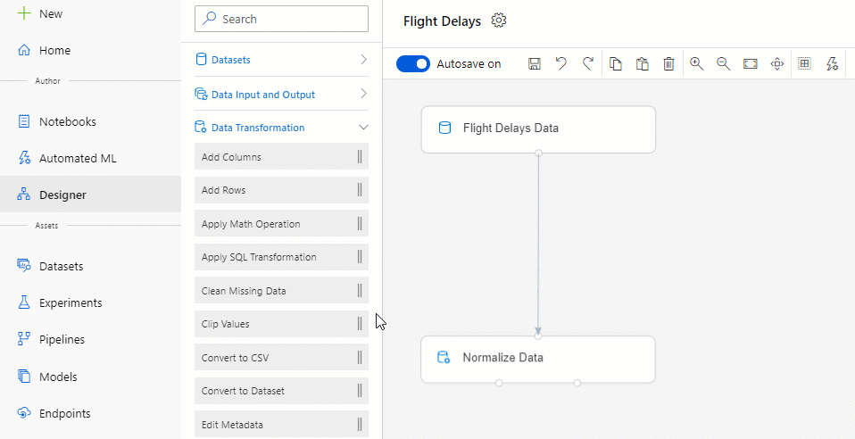
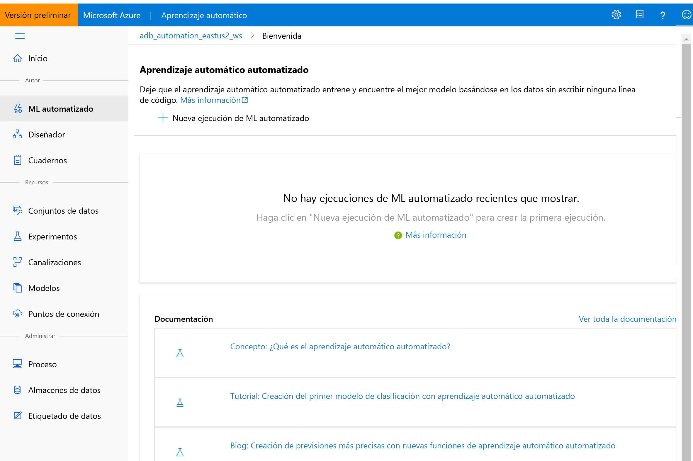

# ¿Qué es Azure Machine Learning?

En este artículo, obtendrá información sobre Azure Machine Learning, un entorno en la nube que puede usar para entrenar, implementar, automatizar, administrar y realizar un seguimiento de los modelos de aprendizaje automático. 

Azure Machine Learning se puede usar para todos los tipos de aprendizaje automático, desde el clásico hasta el aprendizaje profundo, supervisado y no supervisado. Tanto si prefiere escribir código de Python o de R como si se decide por opciones con poco o ningún código, como el [diseñador](tutorial-designer-automobile-price-train-score.md), puede crear, entrenar y realizar un seguimiento de modelos de aprendizaje automático y aprendizaje profundo muy precisos en un área de trabajo de Azure Machine Learning. 

Comience a entrenar en su máquina local y luego escale horizontalmente a la nube. 

El servicio también interopera con herramientas de código abierto populares, como PyTorch, TensorFlow y scikit-learn.

> [!VIDEO https://channel9.msdn.com/Events/Connect/Microsoft-Connect--2018/D240/player]

> [!Tip]
> **Evaluación gratuita**  Si no tiene una suscripción a Azure, cree una cuenta gratuita antes de empezar. Pruebe hoy mismo la [versión gratuita o de pago de Azure Machine Learning](https://aka.ms/AMLFree). Puede obtener créditos para gastarlos en servicios de Azure. Después de que se agoten los créditos, puede mantener la cuenta y usar los [servicios gratuitos de Azure](https://azure.microsoft.com/free/). No se le realizará ningún cargo en su tarjeta de crédito a menos que cambie explícitamente la configuración y lo solicite.

## ¿Qué es el aprendizaje automático?

El aprendizaje automático es una técnica de ciencia de datos que permite a los equipos utilizar datos existentes para prever tendencias, resultados y comportamientos futuros. Mediante el aprendizaje automático, los equipos aprenden sin necesidad de programarlos explícitamente.

Las previsiones o predicciones del aprendizaje automático pueden hacer que las aplicaciones y los dispositivos sean más inteligentes. Por ejemplo, cuando compra en línea, el aprendizaje automático ayuda a recomendar otros productos según lo que haya adquirido. O, cuando pasa su tarjeta de crédito, el aprendizaje automático compara la transacción con una base de datos de transacciones y ayuda a detectar fraudes. Y cuando la aspiradora robot aspira una sala, el aprendizaje automático le ayuda a decidir si se ha terminado el trabajo.

## Herramientas de aprendizaje automático que se ajustan a cada tarea 

Azure Machine Learning proporciona todas las herramientas que los desarrolladores y científicos de datos necesitan para sus flujos de trabajo de aprendizaje automático, entre las que se incluyen:
+ El [diseñador de Azure Machine Learning](tutorial-designer-automobile-price-train-score.md) (versión preliminar): módulos de arrastrar y colocar para compilar los experimentos e implementar canalizaciones.

+ Cuadernos de Jupyter Notebook: use nuestros [cuadernos de ejemplo](https://aka.ms/aml-notebooks) o cree los suyos propios para aprovechar los ejemplos del <a href="https://docs.microsoft.com/python/api/overview/azure/ml/intro?view=azure-ml-py" target="_blank">SDK para Python</a> para el aprendizaje automático. 

+ Scripts o cuadernos de R en los que usa el <a href="https://azure.github.io/azureml-sdk-for-r/reference/index.html" target="_blank">SDK para R</a> para escribir su propio código, o use los módulos de R en el diseñador.

+ [Extensión de Visual Studio Code](tutorial-setup-vscode-extension.md)

+ [CLI de Machine Learning](reference-azure-machine-learning-cli.md)

+ Plataformas de código abierto como PyTorch, TensorFlow y scikit-learn, entre muchas otras

Incluso puede usar [MLflow para realizar un seguimiento de las métricas e implementar modelos](how-to-use-mlflow.md) o Kubeflow para [compilar canalizaciones de flujo de trabajo de un extremo a otro](https://www.kubeflow.org/docs/azure/).

## Creación de modelos de aprendizaje automático en Python o R

Empiece a entrenar en su máquina local mediante el <a href="https://docs.microsoft.com/python/api/overview/azure/ml/intro?view=azure-ml-py" target="_blank">SDK de Python </a> o el <a href="https://azure.github.io/azureml-sdk-for-r/reference/index.html" target="_blank">SDK de R</a> para Azure Machine Learning. Luego, puede escalar horizontalmente a la nube. 

Con muchos [destinos de proceso](how-to-set-up-training-targets.md) disponibles, por ejemplo, los procesos de Azure Machine Learning y [Azure Databricks](/azure/azure-databricks/what-is-azure-databricks), y con los [servicios avanzados de ajuste de hiperparámetros](how-to-tune-hyperparameters.md), puede compilar mejores modelos de forma más rápida gracias al potencial de la nube.

También puede [automatizar el entrenamiento y optimización del modelo](tutorial-auto-train-models.md) mediante el SDK.

## Creación de modelos de aprendizaje automático con herramientas sin código

Para realizar la implementación y el entrenamiento sin código o con poco código, pruebe:

+ **Diseñador de Azure Machine Learning (versión preliminar)**

  Use el diseñador para preparar los datos, entrenar, probar, implementar, administrar y realizar un seguimiento de los modelos de aprendizaje automático sin necesidad de escribir código. No se requiere programación; conecte visualmente los conjuntos de datos y los módulos para construir el modelo. Pruebe el [tutorial del diseñador](tutorial-designer-automobile-price-train-score.md).

  Puede obtener más información en [el artículo de introducción al diseñador de Azure Machine Learning](concept-designer.md). 

  

+ **Interfaz de usuario de Automated Machine Learning**

  Aprenda a crear [experimentos de ML automatizado](tutorial-first-experiment-automated-ml.md) en una interfaz fácil de usar. 

  

## MLOps: Administración de la implementación y del ciclo de vida
Cuando tenga el modelo adecuado, podrá usarlo fácilmente en un servicio web, en un dispositivo de IoT o en Power BI. Para más información, consulte el artículo sobre [cómo y dónde llevar a cabo la implementación](how-to-deploy-and-where.md).

Luego, puede administrar los modelos implementados mediante el [SDK de Azure Machine Learning para Python](https://aka.ms/aml-sdk), [Azure Machine Learning Studio](https://ml.azure.com) o la [CLI de Machine Learning](reference-azure-machine-learning-cli.md).

Se pueden usar estos modelos para que devuelvan predicciones en [tiempo real](how-to-consume-web-service.md) o de forma [asincrónica](how-to-use-parallel-run-step.md) para grandes cantidades de datos.

Y con las [canalizaciones de aprendizaje automático](concept-ml-pipelines.md) avanzadas, puede colaborar en cada paso desde la preparación de datos, el entrenamiento y la evaluación de modelos hasta su implementación. Las canalizaciones permiten:

* Automatizar el proceso de aprendizaje automático de un extremo a otro en la nube
* Reutilizar los componentes y volver a ejecutar los pasos cuando sea necesario
* Usar recursos de proceso diferentes en cada paso
* Ejecutar tareas de puntuación por lotes

Si desea usar scripts para automatizar el flujo de trabajo de aprendizaje automático, la [CLI de Machine Learning](reference-azure-machine-learning-cli.md) proporciona herramientas de línea de comandos que realizan tareas comunes, como el envío de una ejecución de entrenamiento o la implementación de un modelo.

Para comenzar a usar Azure Machine Learning, consulte la sección [Pasos siguientes](#next-steps).

## Integración con otros servicios

Azure Machine Learning funciona con otros servicios de la plataforma Azure y también se integra con herramientas de código abierto como Git y MLFlow.

+ Destinos de proceso, como __Azure Kubernetes Service__, __Azure Container Instances__, __Azure Databricks__, __Azure Data Lake Analytics__ y __de Azure HDInsight__. Para más información sobre los destinos de proceso, consulte [¿Qué son los destinos de proceso?](concept-compute-target.md).
+ __Azure Event Grid__. Para más información, consulte [Consumo de eventos de Azure Machine Learning](concept-event-grid-integration.md).
+ __Azure Monitor__. Para más información, consulte [Supervisión de Azure Machine Learning](monitor-azure-machine-learning.md).
+ Almacenes de datos, como las __cuentas de Azure Storage__, __Azure Data Lake Storage__, __Azure SQL Database__, __Azure Database for PostgreSQL__ y __Azure Open Datasets__. Para más información, consulte [Acceso a los datos en los servicios de almacenamiento de Azure](how-to-access-data.md) y [Creación de conjuntos de datos con Azure Open Datasets](how-to-create-register-datasets.md#create-datasets-with-azure-open-datasets).
+ __Redes virtuales de Azure__. Para más información, consulte [Protección de experimentos e inferencias en una red virtual](how-to-enable-virtual-network.md).
+ __Azure Pipelines__. Para más información, consulte [Entrenamiento e implementación de modelos de aprendizaje automático](/azure/devops/pipelines/targets/azure-machine-learning).
+ __Registros del repositorio de Git__. Para más información, consulte [Integración de Git](concept-train-model-git-integration.md).
+ __MLFlow__. Para más información, consulte[MLflow para realizar un seguimiento de las métricas e implementar modelos](how-to-use-mlflow.md). 
+ __Kubeflow__. Para más información, consulte [Compilación de canalizaciones de flujo de trabajo de un extremo a otro](https://www.kubeflow.org/docs/azure/).

### Comunicaciones seguras

La cuenta de Azure Storage, los destinos de proceso y otros recursos se pueden usar de forma segura dentro de una red virtual para entrenar modelos y realizar la inferencia. Para más información, consulte [Protección de experimentos e inferencias en una red virtual](how-to-enable-virtual-network.md).

## Basic Edition y Enterprise Edition

Azure Machine Learning ofrece dos ediciones adaptadas a sus necesidades de aprendizaje automático:
+ Basic (disponibilidad general)
+ Enterprise (versión preliminar)

Estas ediciones determinan qué herramientas de aprendizaje automático están disponibles para los desarrolladores y científicos de datos en su área de trabajo.   

Las áreas de trabajo de la edición Basic permiten seguir usando Azure Machine Learning y pagar solo por los recursos de Azure consumidos durante el proceso de aprendizaje automático. Las áreas de trabajo de Enterprise Edition solo se cobrarán por su consumo de Azure mientras la edición esté en versión preliminar. Obtenga más información sobre lo que está disponible en la [página de precios e información general de las ediciones](https://azure.microsoft.com/pricing/details/machine-learning/) de Azure Machine Learning. 

La edición se asigna cada vez que se crea un área de trabajo. Las áreas de trabajo preexistentes se han convertido automáticamente a la edición Basic. La edición Basic incluye todas las características que ya estaban disponibles con carácter general a partir de octubre de 2019. Los experimentos en esas áreas de trabajo que se compilaron con las características de la edición Enterprise seguirán estando disponibles en modo de solo lectura hasta que realice la actualización a Enterprise. Aprenda a [actualizar un área de trabajo de la edición Basic a Enterprise](how-to-manage-workspace.md#upgrade). 

Los clientes son responsables de los costos en los que se incurre en el proceso y en otros recursos de Azure durante este tiempo.

## Pasos siguientes

- Cree el primer experimento con el método que prefiera:
  + [Uso de cuadernos de Python para entrenar e implementar modelos de aprendizaje automático](tutorial-1st-experiment-sdk-setup.md)
  + [Uso de R Markdown para entrenar e implementar modelos de aprendizaje automático](tutorial-1st-r-experiment.md) 
  + [Uso del aprendizaje automático automatizado para entrenar e implementar modelos de aprendizaje automático](tutorial-first-experiment-automated-ml.md) 
  + [Uso de las funcionalidades de arrastrar y colocar del diseñador para entrenar e implementar](tutorial-designer-automobile-price-train-score.md) 
  + [Uso de la CLI de Machine Learning para entrenar e implementar un modelo](tutorial-train-deploy-model-cli.md)

- Aprenda sobre [la canalización de aprendizaje automático ](concept-ml-pipelines.md) para crear, optimizar y administrar los escenarios de aprendizaje automático.

- Lea el artículo detallado [Arquitectura y conceptos del servicio Azure Machine Learning](concept-azure-machine-learning-architecture.md).
