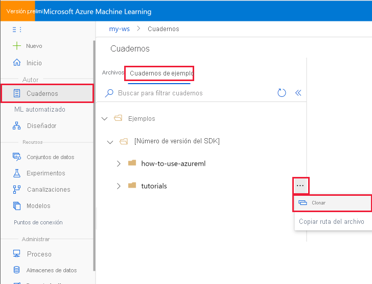
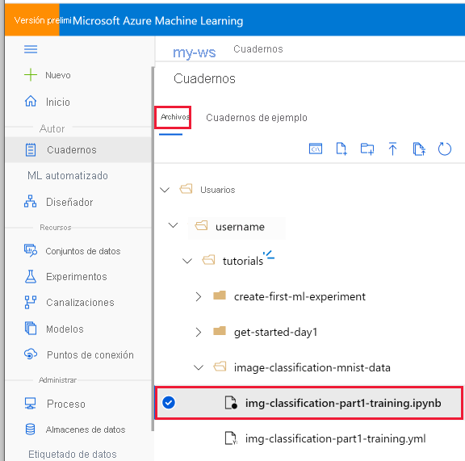

# Tutorial: Creación del primer experimento de ML con el SDK de Python
[!INCLUDE [applies-to-skus](../../includes/aml-applies-to-basic-enterprise-sku.md)]

En este tutorial, realizará los pasos de un extremo a otro para empezar a trabajar con el SDK de Python para Azure Machine Learning que se ejecuta en cuadernos de Jupyter. Este tutorial es la **parte uno de una serie de tutoriales de dos partes**, y abarca la instalación y la configuración del entorno de Python, así como la creación de un área de trabajo para administrar los experimentos y los modelos de aprendizaje automático. En la [**segunda parte**](tutorial-1st-experiment-sdk-train.md) se usa este área de trabajo para entrenar varios modelos de aprendizaje automático e introducir el proceso de administración de modelos mediante Azure Machine Learning Studio y el SDK.

En este tutorial, hizo lo siguiente:

> [!div class="checklist"]
> * Crear un [área de trabajo de Azure Machine Learning](concept-workspace.md) para usarla en el siguiente tutorial.
> * Clone el cuaderno de tutoriales en su carpeta en el área de trabajo.
> * Cree una instancia de proceso basada en la nube que tenga instalado y preconfigurado el SDK de Python para Azure Machine Learning.

Si no tiene una suscripción a Azure, cree una cuenta gratuita antes de empezar. Pruebe hoy mismo la [versión gratuita o de pago de Azure Machine Learning](https://aka.ms/AMLFree).

## Crear un área de trabajo

Un área de trabajo de Azure Machine Learning es un recurso básico de la nube que se usa para experimentar, entrenar e implementar modelos de aprendizaje automático. Vincula la suscripción y el grupo de recursos de Azure con un objeto fácilmente consumido del servicio. 

Puede crear un área de trabajo mediante Azure Portal, una consola basada en web para administrar los recursos de Azure. 

[!INCLUDE [aml-create-portal](../../includes/aml-create-in-portal.md)]

>[!IMPORTANT] 
> Tome nota del **área de trabajo** y de la **suscripción**. Los necesitará para asegurarse de que crea el experimento en el lugar correcto. 

## Ejecución de un cuaderno en el área de trabajo

En este tutorial se usa el servidor de cuadernos en la nube del área de trabajo para obtener una experiencia sin instalación y configurada previamente. Si prefiere tener control sobre su entorno, los paquetes y las dependencias, use [su propio entorno](how-to-configure-environment.md#local).

Siga este vídeo o use los pasos detallados que se indican a continuación para clonar y ejecutar el tutorial desde el área de trabajo. 

> [!VIDEO https://www.microsoft.com/en-us/videoplayer/embed/RE4mTUr]

### Clonación de la carpeta de un cuaderno

Complete los siguientes pasos de configuración y ejecución del experimento en Azure Machine Learning Studio, una interfaz consolidada que incluye herramientas de aprendizaje automático para realizar escenarios de ciencia de datos para los profesionales de ciencia de datos de todos los niveles de conocimiento.

1. Inicie sesión en [Azure Machine Learning Studio](https://ml.azure.com/).

1. Seleccione la suscripción y el área de trabajo que ha creado.

1. Seleccione **Notebooks** en la parte izquierda.

1. Abra la carpeta **Samples** (Muestras).

1. Abra la carpeta **Python**.

1. Abra la carpeta con un número de versión.  Este número representa la versión actual del SDK de Python.

1. Seleccione **"..."** a la derecha de la carpeta **tutorials** (tutoriales) y seleccione **Clone** (Clonar).

    

1. Aparece una lista de las carpetas que muestran los usuarios con acceso al área de trabajo.  Seleccione la carpeta donde se va a clonar la carpeta **tutorials**.

### <a name="open">Apertura del cuaderno clonado

1. En **User files** (Archivos de usuario), abra su carpeta y, después, la carpeta clonada **tutorials** (tutoriales).

    

    > [!IMPORTANT]
    > Puede ver los cuadernos en la carpeta **samples** (ejemplos), pero no puede ejecutar un cuaderno desde aquí.  Para ejecutar un cuaderno, asegúrese de que abre la versión clonada del cuaderno en la sección **User Files** (Archivos de usuario).
    
1. Seleccione el archivo **tutorial-1st-experiment-sdk-train.ipynb** de la carpeta **tutorials** (tutoriales).

1. En la barra superior, seleccione una instancia de proceso para usarla para ejecutar el cuaderno. Estas máquinas virtuales están configuradas previamente con [todo lo necesario para ejecutar Azure Machine Learning](concept-compute-instance.md#contents). Puede seleccionar una máquina virtual creada por cualquier usuario del área de trabajo. 

1. Si no encuentra ninguna máquina virtual, seleccione **+ Add** (+ Agregar) para crear la máquina virtual de instancia de proceso. 

    1. Al crear una máquina virtual, proporciónele un nombre;  este debe tener entre 2 y 16 caracteres. Los caracteres válidos son letras, dígitos y el guion (-), y también deben ser únicos en toda la suscripción de Azure.

    1.  Seleccione el tamaño de la máquina virtual de entre las opciones disponibles.

    1. Seleccione **Crear**. La configuración de la máquina virtual puede tardar aproximadamente 5 minutos.

1. Una vez disponible, se mostrará en la barra de herramientas superior.  Ahora puede ejecutar el cuaderon con **Run all** (Ejecutar todo) de la barra de herramientas o **Mayús + Entrar** en las celdas de código del cuaderno.

Si tiene widgets personalizados o prefiere usar Jupyter/JupyterLab, seleccione la lista desplegable **Jupyter** en el extremo derecho y, después, seleccione **Jupyter** o **JupyterLab**. Se abrirá la nueva ventana del explorador.

> [!NOTE]
> Actualmente, las instancias de proceso (versión preliminar) solo están disponibles para las áreas de trabajo con una región de **Centro-norte de EE. UU.** o **Sur de Reino Unido**. La compatibilidad con otras regiones estará disponible próximamente.
>Si el área de trabajo se encuentra en otra región, puede seguir creando y usando una [máquina virtual de cuadernos](concept-compute-instance.md#notebookvm) en su lugar.  Puede usar una máquina virtual de Notebook o una instancia de proceso para ejecutar el cuaderno. Una máquina virtual seguirá en ejecución y generando costos a menos que la detenga. Puede detenerla manualmente en la pestaña **Proceso** de Studio o consultar la [entrada de blog](https://techcommunity.microsoft.com/t5/educator-developer-blog/azure-virtual-machine-auto-shutdown/ba-p/379342) sobre cómo habilitar el apagado automático programado en máquinas virtuales de Azure.

## Pasos siguientes

En este tutorial ha completado estas tareas:

* Ha creado un área de trabajo de Azure Machine Learning.
* Ha creado y configurado un servidor de cuadernos en la nube en el área de trabajo.

En la **segunda parte** del tutorial, se ejecuta el código en `tutorial-1st-experiment-sdk-train.ipynb` para entrenar un modelo de Machine Learning. 

> [!div class="nextstepaction"]
> [Tutorial: Entrenamiento del primer modelo](tutorial-1st-experiment-sdk-train.md)

> [!IMPORTANT]
> Si no está pensando en la segunda parte de este tutorial o en otros tutoriales, debe [detener la máquina virtual del servidor de cuadernos en la nube](tutorial-1st-experiment-sdk-train.md#clean-up-resources) cuando no se use para reducir el costo.

