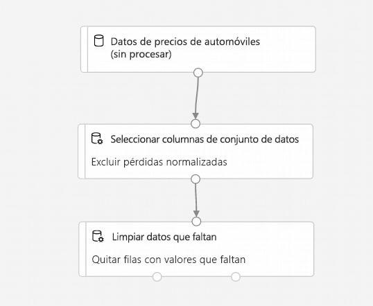
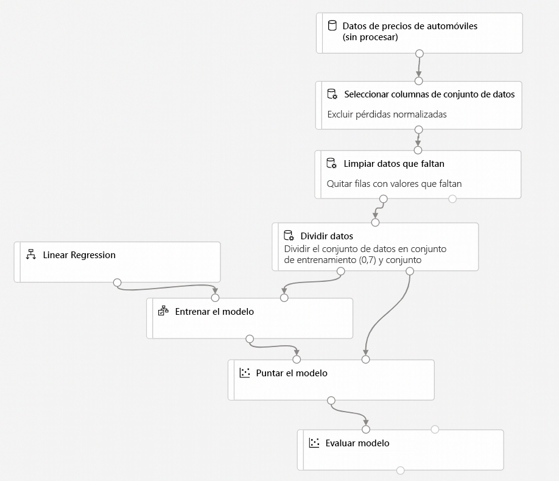
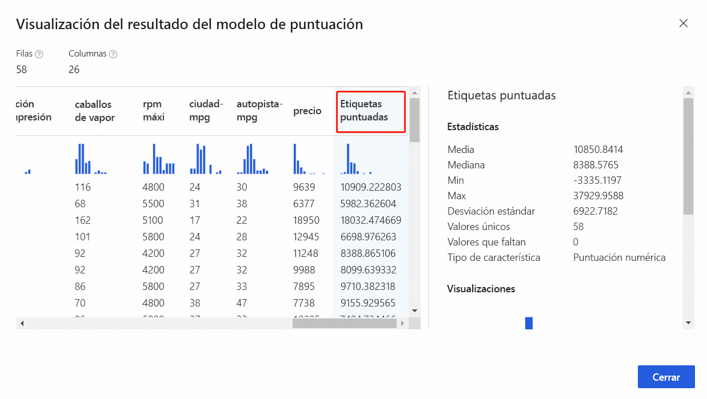

# Tutorial: Predicción del precio de un automóvil con el diseñador (versión preliminar)
[!INCLUDE [applies-to-skus](../../includes/aml-applies-to-enterprise-sku.md)]

En este tutorial de dos partes aprenderá a usar el diseñador de Azure Machine Learning para desarrollar e implementar una solución de análisis predictivo que prediga el precio de cualquier automóvil.

En la primera parte del tutorial, aprenderá a:

> [!div class="checklist"]
> * Crear una canalización.
> * Importar datos.
> * Preparar los datos.
> * Entrenar un modelo de Machine Learning.
> * Evaluar un modelo de Machine Learning.

En la [segunda parte](tutorial-designer-automobile-price-deploy.md) del tutorial implementará el modelo como punto de conexión de inferencia en tiempo real para predecir el precio de cualquier automóvil en función de las especificaciones técnicas que envíe. 

> [!NOTE]
>Está disponible una versión completa de este tutorial como una canalización de ejemplo.
>
>Para encontrarla, vaya al diseñador del área de trabajo. En la sección **Nueva canalización**, seleccione **Sample 1 - Regression: Automobile Price Prediction (Basic)** (Ejemplo 1 - Regresión: predicción del precio de automóviles [básica])

## Creación de una canalización

Las canalizaciones de Azure Machine Learning organizan varios pasos de aprendizaje automático y procesamiento de datos en un único recurso. Las canalizaciones permiten organizar, administrar y reutilizar flujos de trabajo de aprendizaje automático complejos entre proyectos y usuarios.

Para crear una canalización de Azure Machine Learning, necesita un área de trabajo de Azure Machine Learning. En esta sección aprenderá a crear estos dos recursos.

### Crear un área de trabajo

Si tiene un área de trabajo de Azure Machine Learning con una edición Enterprise, [vaya a la siguiente sección](#create-the-pipeline).

[!INCLUDE [aml-create-portal](../../includes/aml-create-in-portal-enterprise.md)]

### Creación de la canalización

1. Inicie sesión en [ml.azure.com](https://ml.azure.com) y seleccione el área de trabajo con la que quiere trabajar.

1. Seleccione **Diseñador**.

    

1. Seleccione **Easy-to-use prebuilt modules** (Módulos precompilados fáciles de usar).

1. En la parte superior del lienzo, seleccione el nombre predeterminado de la canalización, **Pipeline-Created-on** (Canalización creada el). Cambie el nombre a *Automobile price prediction* (Predicción del precio de automóviles). No es necesario que el nombre sea único.

## Importar datos

Se incluyen varios conjuntos de datos de ejemplo en el diseñador para que experimente con ellos. En este tutorial, use **Automobile price data (Raw)** . 

1. A la izquierda del lienzo de la canalización, hay una paleta de conjuntos de datos y módulos. Seleccione **Datasets** (Conjuntos de datos) y examine la sección **Samples** (Ejemplos) para ver los conjuntos de datos de ejemplo disponibles.

1. Seleccione el conjunto de datos **Automobile price data (Raw)** y arrástrelo al lienzo.

   

### Visualización de los datos

Puede visualizar los datos para comprender el conjunto de datos que va a usar.

1. Seleccione el módulo **Automobile price data (RAW)** .

1. En el panel de propiedades a la derecha del lienzo, seleccione **Outputs** (Salidas).

1. Seleccione el icono de gráfico para visualizar los datos.

    

1. Seleccione las diferentes columnas de la ventana de datos para ver información sobre cada una.

    Cada fila representa un automóvil y las variables asociadas a cada uno aparecen como columnas. Hay 205 filas y 26 columnas en este conjunto de datos.

## Preparación de los datos

Los conjuntos de datos suelen necesitar algún procesamiento previo antes del análisis. Puede que, al inspeccionar el conjunto de datos, haya observado que faltan algunos valores. Estos valores que faltan se deben limpiar, para que el modelo pueda analizar los datos de manera adecuada.

### Quitar una columna

Al entrenar un modelo, hay que hacer algo con los datos que faltan. En este conjunto de datos, faltan muchos valores en la columna **normalized-losses**, por lo que excluiremos toda esa columna del modelo.

1. Escriba **Select** en el cuadro de búsqueda de la parte superior de la paleta para buscar el módulo **Select Columns in Dataset** (Seleccionar columnas del conjunto de datos).

1. Haga clic y arrastre el módulo **Select Columns in Dataset** (Seleccionar columnas del conjunto de datos) al lienzo. Coloque el módulo bajo el módulo del conjunto de datos.

1. Conecte el conjunto de datos **Automobile price data (Raw)** al módulo **Select Columns in Dataset** (Seleccionar columnas del conjunto de datos). Arrastre desde el puerto de salida del conjunto de datos, que es el círculo pequeño situado en la parte inferior del conjunto de datos en el lienzo, hasta el puerto de entrada de **Select Columns in Dataset** (Seleccionar columnas del conjunto de datos), que es el círculo pequeño de la parte superior del módulo.

    > [!TIP]
    > Puede crear un flujo de datos mediante la canalización si conecta el puerto de salida de un módulo al puerto de entrada de otro.
    >

    

1. Seleccione el módulo **Select Columns in Dataset**.

1. En el panel de propiedades de la derecha del lienzo, seleccione **All columns** (Todas las columnas).

1. Seleccione el signo **+** para agregar una nueva regla.

1. En el menú desplegable, seleccione **Exclude** (Excluir) y **Column names** (Nombres de columna).
    
1. Escriba *normalized-losses* en el cuadro de texto.

1. En la esquina inferior derecha, seleccione **Save** (Guardar) para cerrar el selector de columnas.

    

1. Seleccione el módulo **Select Columns in Dataset**. 

1. En el panel de propiedades, seleccione el cuadro de texto **Comment** (Comentario) y escriba *Exclude normalized losses* (Excluir pérdidas normalizadas).

    Los comentarios aparecerán en el gráfico para ayudarle a organizar la canalización.

### Limpiar datos que faltan

Después de quitar la columna **normalized-losses**, aún faltan valores en el conjunto de datos. Puede quitar el resto de los datos que faltan mediante el módulo **Clean Missing Data** (Limpiar datos que faltan).

> [!TIP]
> Un requisito previo para usar la mayoría de los módulos del diseñador es limpiar los valores que faltan.

1. Escriba **Clean** en el cuadro de búsqueda para encontrar el módulo **Clean Missing Data** (Limpiar datos que faltan).

1. Arrastre el módulo **Clean Missing Data** (Limpiar datos que faltan) al lienzo de la canalización. Conéctelo al módulo **Select Columns in Dataset** (Seleccionar columnas del conjunto de datos). 

1. En el panel de propiedades, seleccione **Remove entire row** (Quitar toda la fila) en **Cleaning mode** (Modo de limpieza).

1. En el cuadro **Comment** (Comentario) del panel de propiedades, escriba *Remove missing value rows* (Quitar filas de valores que faltan). 

    La canalización debe parecerse a esta:
    
    

## Entrenar un modelo de Machine Learning

Ahora que los módulos están listos para procesar los datos, puede configurar los módulos de entrenamiento.

Como lo que se desea es predecir un precio, que es un número, se puede usar un algoritmo de regresión. En este ejemplo, va a usar un modelo de regresión lineal.

### División de los datos

La división de los datos es una tarea común en el aprendizaje automático. Dividirá los datos en dos conjuntos independientes. Uno de ellos entrenará el modelo, mientras que el otro probará su funcionamiento.

1. Escriba **split data** en el cuadro de búsqueda para buscar el módulo **Split Data** (Dividir datos). Conecte al puerto izquierdo del módulo **Clean Missing Data**(Limpiar datos que faltan) al módulo **Split Data** (Dividir datos).

    > [!IMPORTANT]
    > Asegúrese de que el puerto de salida izquierdo de **Clean Missing Data** (Limpiar datos que faltan) se conecta a **Split Data** (Dividir datos). El puerto izquierdo contiene los datos limpios. El puerto izquierdo contiene los datos descartados.

1. Seleccione el módulo **Split Data** (Dividir datos).

1. En el panel de propiedades, establezca el valor de **Fraction of rows in the first output dataset** (Fracción de filas del primer conjunto de datos de salida) en 0,7.

    De este modo divide los datos: el 70 % para entrenar el modelo y el 30 % para probarlo. Al conjunto de datos del 70 % se podrá acceder a través del puerto de salida de la izquierda. Los restantes datos estarán disponibles a través del puerto de salida derecho.

1. En el cuadro **Comment** (Comentario) del panel de propiedades, escriba *Split the dataset into training set (0.7) and test set (0.3)* (Dividir el conjunto de datos en conjunto de entrenamiento [0,7] y conjunto de pruebas [0,3]).

### Entrenamiento del modelo

Para entrenar el modelo, proporciónele un conjunto de datos que incluya el precio. El algoritmo construye un modelo que explica la relación entre las características y el precio presentado por los datos de entrenamiento.

1. Para seleccionar el algoritmo de aprendizaje, borre e el cuadro de búsqueda de la paleta de módulos.

1. Expanda **Machine Learning Algorithms** (Algoritmos de aprendizaje automático).
    
    Esta opción muestra varias categorías de módulos que se pueden usar para inicializar algoritmos de aprendizaje.

1. Seleccione **Regression** > **Linear Regression** (Regresión > Regresión lineal) y arrástrelo al lienzo de la canalización.

1. Busque y arrastre el módulo **Entrenar modelo** al lienzo de la canalización. 

1. Conecte la salida del módulo **Linear Regression** (Regresión lineal) a la entrada izquierda del módulo **Train Model** (Entrenar modelo).

1. Conecte la salida de datos de entrenamiento (puerto izquierdo) del módulo **Dividir datos** a la entrada derecha del módulo **Entrenar modelo**.
    
    > [!IMPORTANT]
    > Asegúrese de que el puerto de salida izquierdo de **Split Data** (Dividir datos) se conecta a **Train Model** (Entrenar modelo). El puerto izquierdo contiene el conjunto de entrenamiento. El puerto derecho contiene el conjunto de prueba.

    

1. Seleccione el módulo **Train Model** (Entrenar modelo).

1. En el panel de propiedades, seleccione **Edit column** (Editar columna).

1. En el cuadro de diálogo **Label column** (Columna de etiqueta), expanda el menú desplegable y seleccione **Column names** (Nombres de columna). 

1. En el cuadro de texto, escriba *precio* para especificar el valor que el modelo va a predecir.

    La canalización debe ser parecida a esta:

    

## Puntuación de un modelo de Machine Learning

Después de entrenar el modelo con el 70 % de los datos, puede usarlo para puntuar el otro 30 % y ver si el modelo funciona correctamente.

1. Escriba *score model* en el cuadro de búsqueda para encontrar el módulo **Score Model** (Puntuar modelo). Arrastre el módulo al lienzo de la canalización. 

1. Conecte la salida del módulo **Train Model** (Entrenar modelo) al puerto de entrada izquierdo de **Score Model** (Entrenar modelo). Conecte la salida de los datos de prueba (puerto derecho) del módulo **Split Data** al puerto de entrada derecho de **Score Model**.

## Evaluar un modelo de Machine Learning

Use el módulo **Evaluate Model** (Evaluar modelo) para evaluar la puntuación que dio el modelo al conjunto de datos de prueba.

1. Escriba *evaluate* en el cuadro de búsqueda para buscar el módulo **Evaluate Model** (Evaluar modelo). Arrastre el módulo al lienzo de la canalización. 

1. Conecte la salida del módulo **Score Model** (Puntuar modelo) a la entrada izquierda de **Evaluate Model** (Evaluar modelo). 

    La canalización final debe parecerse a esta:

    

## Ejecución de la canalización

[!INCLUDE [aml-ui-create-training-compute](../../includes/aml-ui-create-training-compute.md)]

### Visualización de etiquetas con puntuación

Una vez finalizada la ejecución, puede ver los resultados de la ejecución de la canalización. En primer lugar, examine las predicciones generadas por el modelo de regresión.

1. Seleccione el módulo **Score Model** (Puntuar modelo) para ver su salida.

1. En el panel de propiedades, seleccione **Outputs** (Salidas) > icono de gráfico  para ver los resultados.

    Aquí puede ver los precios previstos y los precios reales de los datos de prueba.

    

### Evaluación de modelos

Use **Evaluate Model** (Evaluar modelo) para ver el rendimiento del modelo entrenado en el conjunto de datos de prueba.

1. Seleccione el módulo **Evaluate Model** (Evaluar modelo) para ver su salida.

1. En el panel de propiedades, seleccione **Output** (Salida) > icono de gráfico  para ver los resultados.

Se muestran las siguientes estadísticas de su modelo:

* **Desviación media (MAE)** : la media de errores absolutos. Un error es la diferencia entre el valor previsto y el valor real.
* **Error cuadrático medio (RMSE)** : la raíz cuadrada de la media de errores al cuadrado de las predicciones realizadas sobre el conjunto de datos de prueba.
* **Error absoluto relativo**: la media de errores absolutos en relación con la diferencia absoluta entre los valores reales y la media de todos los valores reales.
* **Error al cuadrado relativo**: la media de errores al cuadrado en relación con la diferencia al cuadrado entre los valores reales y la media de todos los valores reales.
* **Coeficiente de determinación**: conocido también como valor R cuadrado, es una métrica estadística que indica en qué medida se ajusta un modelo a los datos.

Para cada una de las estadísticas de errores, cuanto menor sea el valor, mejor. Un valor inferior indica que las predicciones están más próximas a los valores reales. En el coeficiente de determinación, cuanto más próximo es su valor a uno (1,0), mejores son las predicciones.

## Limpieza de recursos

[!INCLUDE [aml-ui-cleanup](../../includes/aml-ui-cleanup.md)]

## Pasos siguientes

En la primera parte de este tutorial completó las siguientes tareas:

* Crear una canalización
* Preparación de los datos
* Entrenamiento del modelo
* Puntuar y evaluar el modelo

En la segunda parte, aprenderá a implementar el modelo como un punto de conexión en tiempo real.

> [!div class="nextstepaction"]
> [Continuar con la implementación de modelos](tutorial-designer-automobile-price-deploy.md)
