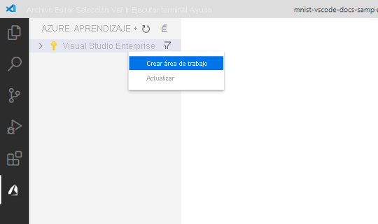
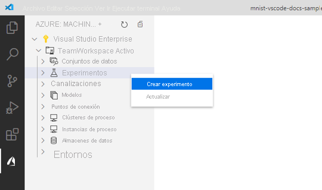
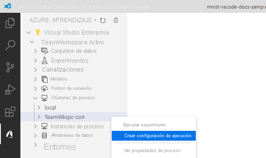
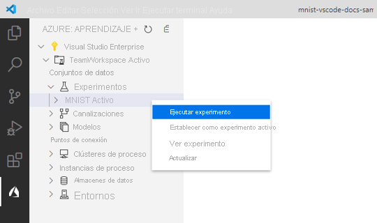
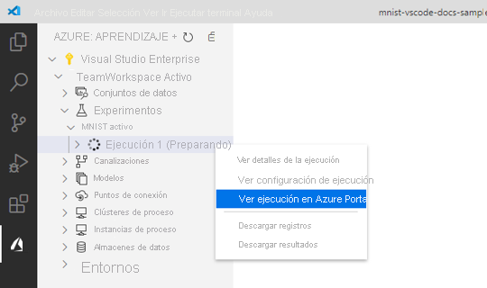
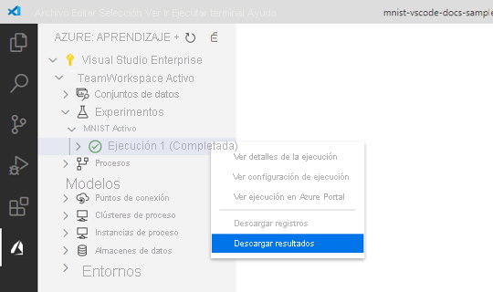
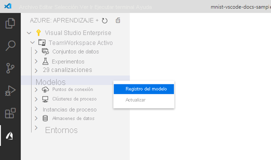

# <a name="train-and-deploy-an-image-classification-tensorflow-model-using-the-azure-machine-learning-visual-studio-code-extension"></a>Entrenamiento e implementación de un modelo de TensorFlow de clasificación de imágenes con la extensión Azure Machine Learning para Visual Studio Code

Aprenda a entrenar e implementar un modelo de TensorFlow de clasificación de imágenes para el reconocimiento de números manuscritos con la extensión Azure Machine Learning para Visual Studio Code.

En este tutorial, ha aprendido las tareas siguientes:

> [!div class="checklist"]
> * Comprendiendo el código
> * Crear un área de trabajo
> * Creación de un experimento
> * Configuración de destinos de proceso
> * Ejecución de un archivo de configuración
> * Entrenamiento de un modelo
> * Registrar un modelo
> * Implementar un modelo

## <a name="prerequisites"></a>Prerrequisitos

- Suscripción de Azure. Si no tiene una, regístrese para probar la [versión gratuita o de pago de Azure Machine Learning](https://aka.ms/AMLFree).
- Instale [Visual Studio Code](https://code.visualstudio.com/docs/setup/setup-overview), un editor de código ligero y multiplataforma.
- Extensión Azure Machine Learning Studio para Visual Studio Code Para obtener instrucciones de instalación, consulte el [tutorial Configuración de la extensión Azure Machine Learning para Visual Studio Code](./tutorial-setup-vscode-extension.md).

## <a name="understand-the-code"></a>Comprendiendo el código

El código de este tutorial usa TensorFlow para entrenar un modelo de aprendizaje automático de clasificación de imágenes que clasifica dígitos manuscritos de 0 a 9. Para ello, crea una red neuronal que toma los valores de píxeles de una imagen de 28 x 28 píxeles como entrada y genera una lista de 10 probabilidades, una para cada uno de los dígitos que se están clasificando. A continuación se muestra un ejemplo del aspecto de los datos.  


Para obtener el código de este tutorial, descargue y descomprima el [repositorio VS Code Tools for AI](https://github.com/microsoft/vscode-tools-for-ai/archive/master.zip) donde quiera en el equipo.

## <a name="create-a-workspace"></a>Crear un área de trabajo

Lo primero que hay que hacer para compilar una aplicación en Azure Machine Learning es crear un área de trabajo. Un área de trabajo contiene los recursos para entrenar modelos, así como los propios modelos entrenados. Para más información, consulte [Qué es un área de trabajo](./concept-workspace.md). 

1. En la barra de actividad de Visual Studio Code, haga clic en el icono de **Azure** para abrir la vista de Azure Machine Learning.
1. Haga clic con el botón derecho en su suscripción de Azure y seleccione **Crear área de trabajo**. 
    
    > [!div class="mx-imgBorder"]
    > 

1. De forma predeterminada, se crea un nombre que contiene la fecha y la hora de la creación. En el cuadro de entrada de texto, cambie el nombre a "TeamWorkspace" y presione **Entrar**.
1. Seleccione **Crear un grupo de recursos nuevo**. 
1. Asígnele al grupo de recursos el nombre "TeamWorkspace-rg" y presione **Entrar**. 
1. Elija una ubicación para el área de trabajo. Se recomienda seleccionar la ubicación que esté más cerca de la ubicación donde quiere implementar el modelo. Por ejemplo, "Oeste de EE. UU. 2".
1. Cuando se le pida que seleccione el tipo de área de trabajo, seleccione **Básico** para crear un área de trabajo básica. Para más información sobre las distintas ofertas de área de trabajo, consulte [Información general de Azure Machine Learning](./overview-what-is-azure-ml.md#sku).

En este momento, se realiza una solicitud a Azure para crear una nueva área de trabajo en su cuenta. Después de unos minutos, la nueva área de trabajo aparece en el nodo de la suscripción. 

## <a name="create-an-experiment"></a>Creación de un experimento

Se pueden crear uno o más experimentos en el área de trabajo y así poder realizar un seguimiento y analizar la ejecuciones de entrenamiento de modelos individuales. Las ejecuciones se pueden realizar en la nube de Azure o en su máquina local.

1. En la barra de actividad de Visual Studio Code, haga clic en el icono de **Azure**. Aparecerá la vista de Azure Machine Learning.
1. Expanda el nodo de la suscripción.
1. Expanda el nodo **TeamWorkspace**. 
1. Haga clic con el botón derecho en el nodo **Experimentos**.
1. Seleccione **Crear experimento** en el menú contextual.

    > [!div class="mx-imgBorder"]
    > 

1. Asígnele al experimento el nombre "MNIST" y presione **Entrar** para crear el experimento. 

Al igual que con las áreas de trabajo, se envía una solicitud a Azure para crear un experimento con las configuraciones proporcionadas. Después de unos minutos, el nuevo experimento aparece en el nodo *Experimentos* del área de trabajo. 

## <a name="configure-compute-targets"></a>Configuración de destinos de proceso

Un destino de proceso es el entorno o recurso informático en el que se ejecutan scripts y se implementan modelos entrenados. Para más información, consulte la [documentación sobre destinos de proceso de Azure Machine Learning](./concept-compute-target.md).

Para crear un destino de proceso:

1. En la barra de actividad de Visual Studio Code, haga clic en el icono de **Azure**. Aparecerá la vista de Azure Machine Learning. 
1. Expanda el nodo de la suscripción. 
1. Expanda el nodo **TeamWorkspace**. 
1. En el nodo del área de trabajo, haga clic con el botón derecho en el nodo **Proceso** y elija **Crear proceso**. 

    > [!div class="mx-imgBorder"]
    > 

1. Seleccione **Proceso de Azure Machine Learning (AmlCompute)** . Proceso de Azure Machine Learning es una infraestructura de proceso administrado que permite al usuario crear fácilmente un proceso de uno o varios nodos que puede usarse con otros usuarios en el área de trabajo.
1. Elija el tamaño de la máquina virtual. Seleccione **Standard_F2s_v2** en la lista de opciones. El tamaño de la máquina virtual afecta a la cantidad de tiempo que se tarda en entrenar los modelos. Para más información sobre los tamaños de máquina virtual, consulte [Tamaños de las máquinas virtuales Linux en Azure](https://docs.microsoft.com/azure/virtual-machines/linux/sizes).
1. Asígnele el nombre "TeamWkspc-com" al proceso y presione **Entrar** para crear el proceso.

    Aparece un archivo en VS Code con un contenido similar al siguiente:

    ```json
    {
        "location": "westus2",
        "tags": {},
        "properties": {
            "computeType": "AmlCompute",
            "description": "",
            "properties": {
                "vmSize": "Standard_F2s_v2",
                "vmPriority": "dedicated",
                "scaleSettings": {
                    "maxNodeCount": 4,
                    "minNodeCount": 0,
                    "nodeIdleTimeBeforeScaleDown": 120
                },
                "userAccountCredentials": {
                    "adminUserName": "",
                    "adminUserPassword": "",
                    "adminUserSshPublicKey": ""
                },
                "subnetName": "",
                "vnetName": "",
                "vnetResourceGroupName": "",
                "remoteLoginPortPublicAccess": ""
            }
        }
    }
    ```

1. Cuando esté satisfecho con la configuración, seleccione **Ver > Paleta de comandos** para abrir la paleta de comandos.
1. Escriba el siguiente comando en la paleta de comandos para guardar el archivo de configuración de ejecución.

    ```text
    Azure ML: Save and Continue
    ```

Después de unos minutos, el nuevo destino de proceso aparece en el nodo *Proceso* del área de trabajo.

## <a name="create-a-run-configuration"></a>Creación de una configuración de ejecución

Cuando envía una ejecución de entrenamiento a un destino de proceso, también envía la configuración necesaria para ejecutar el trabajo de entrenamiento. Por ejemplo, el script que contiene el código de entrenamiento y las dependencias de Python necesarias para ejecutarlo.

Para crear una configuración de ejecución:

1. En la barra de actividad de Visual Studio Code, haga clic en el icono de **Azure**. Aparecerá la vista de Azure Machine Learning. 
1. Expanda el nodo de la suscripción. 
1. Expanda el nodo **TeamWorkspace > Proceso**. 
1. En el nodo de ejecución, haga clic con el botón derecho en el nodo de ejecución **TeamWkspc-com** y elija **Crear configuración de ejecución**.

    > [!div class="mx-imgBorder"]
    > 

1. Asígnele el nombre "MNIST-rc" a la configuración de ejecución y presione **Entrar** para crear la configuración de ejecución.
1. A continuación, seleccione **Crear un nuevo entorno de Azure ML**. Los entornos definen las dependencias necesarias para ejecutar los scripts.
1. Asigne el nombre "MNIST-env" al entorno y presione **Entrar**.
1. Seleccione **Archivo de dependencias de Conda** de la lista.
1. Presione **Entrar** para examinar el archivo de dependencias de Conda. En este caso, el archivo de dependencias es el archivo `env.yml` dentro del directorio `vscode-tools-for-ai/mnist-vscode-docs-sample`.

    Aparece un archivo en VS Code con un contenido similar al siguiente:

    ```json
    {
        "name": "MNIST-env",
        "version": "1",
        "python": {
            "interpreterPath": "python",
            "userManagedDependencies": false,
            "condaDependencies": {
                "name": "vs-code-azure-ml-tutorial",
                "channels": [
                    "defaults"
                ],
                "dependencies": [
                    "python=3.6.2",
                    "tensorflow=1.15.0",
                    "pip",
                    {
                        "pip": [
                            "azureml-defaults"
                        ]
                    }
                ]
            },
            "baseCondaEnvironment": null
        },
        "environmentVariables": {},
        "docker": {
            "baseImage": "mcr.microsoft.com/azureml/base:intelmpi2018.3-ubuntu16.04",
            "baseDockerfile": null,
            "baseImageRegistry": {
                "address": null,
                "username": null,
                "password": null
            },
            "enabled": false,
            "arguments": []
        },
        "spark": {
            "repositories": [],
            "packages": [],
            "precachePackages": true
        },
        "inferencingStackVersion": null
    }
    ```

1. Una vez que esté satisfecho con la configuración, abra la paleta de comandos y escriba el siguiente comando para guardarla:

    ```text
    Azure ML: Save and Continue
    ```

1. Presione **Entrar** para buscar el archivo de script que se va a ejecutar en el proceso. En este caso, el script para entrenar el modelo es el archivo `train.py` dentro del directorio `vscode-tools-for-ai/mnist-vscode-docs-sample`.

    Un archivo denominado `MNIST-rc.runconfig` aparece en VS Code con un contenido similar al siguiente:

    ```json
    {
        "script": "train.py",
        "framework": "Python",
        "communicator": "None",
        "target": "TeamWkspc-com",
        "environment": {
            "name": "MNIST-env",
            "version": "1",
            "python": {
                "interpreterPath": "python",
                "userManagedDependencies": false,
                "condaDependencies": {
                    "name": "vs-code-azure-ml-tutorial",
                    "channels": [
                        "defaults"
                    ],
                    "dependencies": [
                        "python=3.6.2",
                        "tensorflow=1.15.0",
                        "pip",
                        {
                            "pip": [
                                "azureml-defaults"
                            ]
                        }
                    ]
                },
                "baseCondaEnvironment": null
            },
            "environmentVariables": {},
            "docker": {
                "baseImage": "mcr.microsoft.com/azureml/base:intelmpi2018.3-ubuntu16.04",
                "baseDockerfile": null,
                "baseImageRegistry": {
                    "address": null,
                    "username": null,
                    "password": null
                },
                "enabled": false,
                "arguments": []
            },
            "spark": {
                "repositories": [],
                "packages": [],
                "precachePackages": true
            },
            "inferencingStackVersion": null
        },
        "history": {
            "outputCollection": true,
            "snapshotProject": false,
            "directoriesToWatch": [
                "logs"
            ]
        }
    }
    ```

1. Una vez que esté satisfecho con la configuración, abra la paleta de comandos y escriba el siguiente comando para guardarla:

    ```text
    Azure ML: Save and Continue
    ```

La configuración de ejecución `MNIST-rc` se agrega en el nodo de ejecución *TeamWkspc-com* y la configuración del entorno `MNIST-env` se agrega en el nodo *Entornos*.

## <a name="train-the-model"></a>Entrenamiento del modelo

Durante el proceso de entrenamiento, se crea un modelo de TensorFlow al procesar los datos de entrenamiento y los patrones de aprendizaje insertados en ellos para cada uno de los dígitos correspondientes que se están clasificando. 

Para ejecutar un experimento de Azure Machine Learning:

1. En la barra de actividad de Visual Studio Code, haga clic en el icono de **Azure**. Aparecerá la vista de Azure Machine Learning. 
1. Expanda el nodo de la suscripción. 
1. Expanda el nodo **TeamWorkspace > Experimentos**. 
1. Haga clic con el botón derecho en el experimento **MNIST**.
1. Seleccione **Run Experiment** (Ejecutar experimento).

    > [!div class="mx-imgBorder"]
    > 

1. En la lista de opciones de destino de proceso, seleccione **TeamWkspc-com**.
1. A continuación, seleccione la configuración de ejecución **MNIST-rc**.
1. En este momento, se envía una solicitud a Azure para ejecutar el experimento en el destino de proceso seleccionado en el área de trabajo. Este proceso tarda varios minutos. La cantidad de tiempo que se tarda en ejecutar el trabajo de entrenamiento se ve afectada por varios factores, como el tipo de proceso y el tamaño de los datos de entrenamiento. Para realizar un seguimiento del progreso del experimento, haga clic con el botón derecho en el nodo de ejecución actual y seleccione **View Run in Azure Portal** (Ver ejecución en Azure Portal).
1. Cuando aparezca el cuadro de diálogo que solicita abrir un sitio web externo, seleccione **Abrir**.

    > [!div class="mx-imgBorder"]
    > 

Cuando se realiza el entrenamiento del modelo, la etiqueta de estado junto al nodo de ejecución se actualiza a "Completado".

## <a name="register-the-model"></a>Registro del modelo

Ahora que ha entrenado el modelo, puede registrarlo en el área de trabajo. 

Para registrar el modelo:

1. En la barra de actividad de Visual Studio Code, haga clic en el icono de **Azure**. Aparecerá la vista de Azure Machine Learning.
1. Expanda el nodo de la suscripción. 
1. Expanda el nodo **TeamWorkspace > Experimentos > MNIST**.
1. Obtenga las salidas del modelo generadas a partir del entrenamiento del modelo. Haga clic con el botón derecho en el nodo de ejecución **Ejecución 1** y seleccione **Download outputs** (Descargar salidas). 

    > [!div class="mx-imgBorder"]
    > 

1. Elija el directorio en el que desea guardar las salidas descargadas. De forma predeterminada, las salidas se colocan en el directorio abierto actualmente en Visual Studio Code.
1. Haga clic con el botón derecho en el nodo **Modelos** y elija **Register Model** (Registrar modelo).

    > [!div class="mx-imgBorder"]
    > 

1. Asígnele al modelo el nombre "MNIST-TensorFlow-model" y presione **Entrar**.
1. Un modelo de TensorFlow se compone de varios archivos. Seleccione **Model folder** (Carpeta de modelos) como formato de la ruta de acceso del modelo en la lista de opciones. 
1. Seleccione el directorio `azureml_outputs/Run_1/outputs/outputs/model`.

    Un archivo que contiene las configuraciones del modelo aparece en Visual Studio Code con contenido similar al siguiente:

    ```json
    {
        "modelName": "MNIST-TensorFlow-model",
        "tags": {
            "": ""
        },
        "modelPath": "c:\\Dev\\vscode-tools-for-ai\\mnist-vscode-docs-sample\\azureml_outputs\\Run_1\\outputs\\outputs\\model",
        "description": ""
    }
    ```

1. Una vez que esté satisfecho con la configuración, abra la paleta de comandos y escriba el siguiente comando para guardarla:

    ```text
    Azure ML: Save and Continue
    ```

Después de unos minutos, el modelo aparece en el nodo *Modelos*.

## <a name="deploy-the-model"></a>Implementación del modelo

En Visual Studio Code, puede implementar el modelo como un servicio web para lo siguiente:

+ Azure Container Instances (ACI).
+ Azure Kubernetes Service (AKS).

No es necesario crear un contenedor ACI para realizar pruebas por adelantado, ya que estos contenedores se crean según se necesitan. Sin embargo, es necesario configurar clústeres AKS de antemano. Para más información sobre las opciones de implementación, consulte [Implementación de modelos con Azure Machine Learning](how-to-deploy-and-where.md).

Para implementar un servicio web como ACI:

1. En la barra de actividad de Visual Studio Code, haga clic en el icono de **Azure**. Aparecerá la vista de Azure Machine Learning.
1. Expanda el nodo de la suscripción. 
1. Expanda el nodo **TeamWorkspace > Modelos**. 
1. Haga clic con el botón derecho en **MNIST-TensorFlow-model** y seleccione **Deploy Service from Registered Model** (Implementar el servicio a partir del modelo registrado).

    > [!div class="mx-imgBorder"]
    > 

1. Seleccione **Azure Container Instances**.
1. Asígnele al servicio el nombre "mnist-tensorflow-svc" y presione **Entrar**.
1. Elija el script que se va a ejecutar en el contenedor; para ello, presione **Entrar** en el cuadro de entrada y busque el archivo `score.py` en el directorio `mnist-vscode-docs-sample`.
1. Proporcione las dependencias necesarias para ejecutar el script; para ello, presione **Entrar** en cuadro de entrada y busque el archivo `env.yml` en el directorio `mnist-vscode-docs-sample`.

    Un archivo que contiene las configuraciones del modelo aparece en Visual Studio Code con contenido similar al siguiente:

    ```json
    {
        "name": "mnist-tensorflow-svc",
        "imageConfig": {
            "runtime": "python",
            "executionScript": "score.py",
            "dockerFile": null,
            "condaFile": "env.yml",
            "dependencies": [],
            "schemaFile": null,
            "enableGpu": false,
            "description": ""
        },
        "deploymentConfig": {
            "cpu_cores": 1,
            "memory_gb": 10,
            "tags": {
                "": ""
            },
            "description": ""
        },
        "deploymentType": "ACI",
        "modelIds": [
            "MNIST-TensorFlow-model:1"
        ]
    }
    ```

1. Una vez que esté satisfecho con la configuración, abra la paleta de comandos y escriba el siguiente comando para guardarla:

    ```text
    Azure ML: Save and Continue
    ```

En este momento, se envía una solicitud a Azure para implementar el servicio web. Este proceso tarda varios minutos. Una vez implementado, el nuevo servicio aparece en el nodo *Puntos de conexión*.

## <a name="next-steps"></a>Pasos siguientes

* Para ver un tutorial sobre cómo entrenar con Azure Machine Learning fuera de Visual Studio Code, consulte [Tutorial: Entrenamiento de modelos con Azure Machine Learning](tutorial-train-models-with-aml.md).
* Para ver un tutorial sobre cómo editar, ejecutar y depurar código de forma local, consulte el [tutorial de hello world de Python](https://code.visualstudio.com/docs/Python/Python-tutorial).

