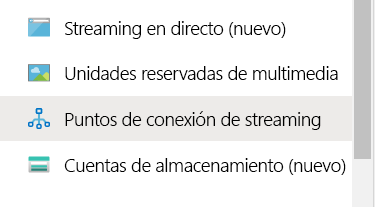
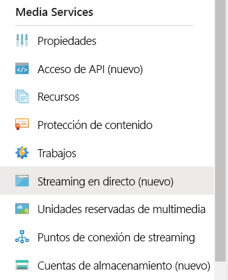
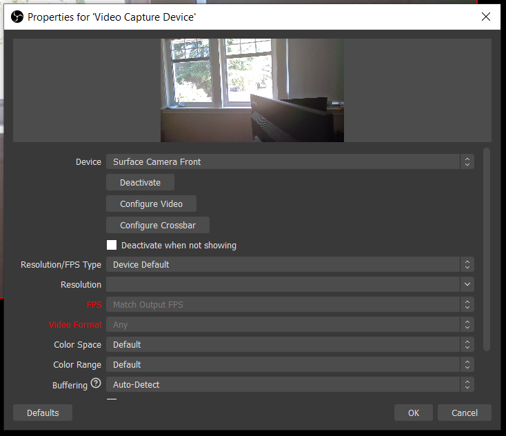

# Creación de un streaming en vivo de Azure Media Services con OBS

[!INCLUDE [media services api v3 logo](./includes/v3-hr.md)]

Este inicio rápido le ayudará a crear streaming en vivo de Azure Media Services mediante Azure Portal y Open Broadcasting Studio (OBS). Se supone que tiene una suscripción a Azure y que ha creado una cuenta de Media Services.

En este inicio rápido, trataremos lo siguiente:

- Configuración de un codificador local con OBS.
- Configuración de streaming en vivo.
- Configuración de las salidas de streaming en vivo.
- Ejecución de un punto de conexión de streaming predeterminado.
- Uso de Azure Media Player para ver streaming en vivo y la salida a petición.

## Requisitos previos

Si no tiene una suscripción a Azure, cree una [cuenta gratuita](https://azure.microsoft.com/free/) antes de empezar.

## Inicio de sesión en Azure Portal

Abra el explorador web y vaya a [Microsoft Azure Portal](https://portal.azure.com/). Introduzca sus credenciales para iniciar sesión en el portal. La vista predeterminada es el panel del servicio.

## Configuración de un codificador local mediante OBS

1. Descargue la versión de OBS para su sistema operativo en el [sitio web de Open Broadcaster Software](https://obsproject.com/) e instálela.
1. Inicie la aplicación y manténgala abierta.

## Ejecución del punto de conexión de streaming predeterminado

1. En la lista de Media Services, seleccione **Streaming endpoints** (Puntos de conexión de streaming).

   
1. Si el estado del punto de conexión de streaming predeterminado es detenido, selecciónelo. Este paso le lleva a la página de ese punto de conexión.
1. Seleccione **Inicio**.

   

## Configuración de streaming en vivo de Azure Media Services

1. Vaya a la cuenta de Azure Media Services en el portal y, luego, seleccione **Live streaming** (Streaming en vivo) en la lista de **Media Services**.

   
1. Seleccione **Add live event** (Agregar evento en directo) para crear un nuevo evento de streaming en vivo.

   
1. Escriba un nombre para el nuevo evento, por ejemplo, *TestLiveEvent*, en el campo **Live event name** (Nombre del evento en directo).

   
1. Escriba una descripción opcional del evento en el campo **Description** (Descripción).
1. Seleccione la opción **Pass-through – no cloud encoding** (Paso a través: sin codificación en la nube).

   
1. Seleccione la opción **RTMP**.
1. Asegúrese de que está seleccionada la opción **No** en **Start live event** (Iniciar el evento en directo), para evitar que se le facture el evento en directo antes de que esté listo. (La facturación comenzará cuando se inicie el evento en directo).

   
1. Seleccione el botón **Review + create** (Revisar y crear) para revisar la configuración.
1. Seleccione el botón **Create** (Crear) para crear el evento en directo. A continuación, volverá a la lista de eventos en directo.
1. Seleccione el vínculo al evento en directo que acaba de crear. Observe que el evento está detenido.
1. Mantenga esta página abierta en el explorador. Volveremos a él más adelante.

## Configuración de streaming en vivo mediante OBS Studio

OBS comienza con una escena predeterminada pero sin datos de entrada seleccionados.

   

### Incorporación de un origen de vídeo

1. En el panel **Sources** (Orígenes), haga clic en el icono **agregar** para seleccionar un dispositivo de origen nuevo. Se abrirá el menú **Sources** (Orígenes).

1. Seleccione **Video Capture Device** (Dispositivo de captura de vídeo) en el menú del dispositivo de origen. Se abrirá el menú **Create/Select Source** (Crear o seleccionar origen).

   

1. Seleccione el botón de radio **Add Existing** (Agregar existente) y, después, haga clic en **OK** (Aceptar). Se abrirá el menú **Properties for Video Device** (Propiedades de dispositivo de vídeo).

   

1. En la lista desplegable **Device** (Dispositivo), seleccione la entrada de vídeo que desea usar para la difusión. Deje el resto de la configuración intacta y haga clic en **OK** (Aceptar). El origen de entrada se agregará al panel **Sources** (Orígenes) y la vista de la entrada de vídeo se mostrará en el área **Preview** (Vista previa).

   

### Incorporación de un origen de audio

1. En el panel **Sources** (Orígenes), haga clic en el icono **agregar** para seleccionar un dispositivo de origen nuevo. Se abrirá el menú Source Device (Dispositivo de origen).

1. Seleccione **Audio Input Capture** (Captura de entrada de audio) en el menú del dispositivo de origen. Se abrirá el menú **Create/Select Source** (Crear o seleccionar origen).

   

1. Seleccione el botón de radio **Add Existing** (Agregar existente) y, después, haga clic en **OK** (Aceptar). Se abrirá el menú **Properties for Audio Input Capture** (Propiedades de captura de entrada de audio).

   

1. En la lista desplegable **Device** (Dispositivo), seleccione el dispositivo de captura de audio que desea usar para la difusión. Deje el resto de la configuración intacta y haga clic en OK (Aceptar). El dispositivo de captura de audio se agregará al panel del mezclador de audio.

   

### Configuración del streaming en OBS

En el siguiente procedimiento, volverá a Azure Media Services en el explorador para copiar la dirección URL de entrada que va a escribir en la configuración de salida.

1. En la página de Azure Media Services del portal, seleccione **Start** (Iniciar) para iniciar el evento de streaming en vivo. (La facturación comienza ahora).

   
1. En **RTMP**, seleccione **RTMPS**.
1. En el cuadro **Input URL** (Dirección URL de entrada), copie la dirección URL en el portapapeles.

   

1. Cambie a la aplicación OBS.

1. Haga clic en el botón **Settings** (Configuración) del panel **Controls** (Controles). Se abrirán las opciones de Settings (Configuración).

   

1. Seleccione **Stream** (Transmisión) en el menú **Settings** (Configuración).

1. En la lista desplegable **Service** (Servicio), seleccione Mostrar todo y, después, seleccione **Custom...** (Personalizado).

1. En el campo **Server** (Servidor), pegue la dirección URL de RTMPS que copió en el Portapapeles.

1. Escriba algo en el campo **Stream key** (Clave de transmisión).  En realidad, da igual lo que sea, pero debe tener un valor.

    

1. Seleccione **Output** (Salida) en el menú **Settings** (Configuración).

1. Escriba *2* en el campo**Keyframe interval** (Intervalo de fotogramas clave). Esto establece la longitud del fragmento en 2 segundos. Si desea una entrega en vivo de baja latencia, use el valor de 1 segundo.

1. OPCIONAL: En **CPU Usage Preset** (Valor preestablecido de uso de CPU), seleccione *veryfast* si usa un equipo con poca capacidad de procesamiento. Opcionalmente, puede establecer los kbps en un valor algo más bajo si las condiciones de la red no son las deseables.

   

1. Deje el resto de la configuración intacta y haga clic en **OK** (Aceptar).

### Iniciar streaming

1. En el panel **Controls** (Controles), haga clic en **Start Streaming** (Iniciar streaming).

    

2. Cambie a la pantalla de eventos en directo de Azure Media Services Live en el explorador y haga clic en el vínculo **Reload Player** (Volver a cargar reproductor). Ahora verá la transmisión en el reproductor de vista previa.

## Configuración de las salidas

En esta parte se configurarán las salidas y se le permitirá guardar una grabación de streaming en vivo.  

> [!NOTE]
> Para transmitir esta salida, el punto de conexión de streaming debe estar en ejecución. Consulte la sección [Ejecución del punto de conexión de streaming predeterminado](#run-the-default-streaming-endpoint).

1. Seleccione el vínculo **Create outputs** (Crear salidas) que aparece debajo del visor de vídeo **Outputs** (Salidas).
1. Si lo desea, modifique el nombre de la salida en el cuadro **Name** (Nombre) y use uno más descriptivo para que sea fácil de encontrar más adelante.

   
1. Deje todos los demás campos como están por ahora.
1. Seleccione **Next** (Siguiente) para agregar un localizador de streaming.
1. Si lo desea, cambie el nombre del localizador por otro más descriptivo.

   
1. Deje todo lo demás en esta pantalla por ahora.
1. Seleccione **Crear**.

## Reproducción de la retransmisión de salida con Azure Media Player

1. Copie la dirección URL de streaming que aparece en el reproductor de vídeo de **salida**.
1. En un explorador web, abra la [demostración de Azure Media Player](https://ampdemo.azureedge.net/azuremediaplayer.html).
1. Pegue la dirección URL de streaming en el cuadro **URL** de Azure Media Player.
1. Seleccione el botón **Update Player** (Actualizar reproductor).
1. Seleccione el icono de **Reproducir** del vídeo para ver el streaming en vivo.

## Detención de la retransmisión

Cuando crea que ha transmitido suficiente contenido, detenga la retransmisión.

1. En el portal, seleccione **Stop** (Detener).

1. En OBS, seleccione el botón **Stop Streaming** (Detener streaming) en el panel **Controls** (Controles). Este paso detiene la retransmisión desde OBS.

## Reproducción de la salida a petición con Azure Media Player

La salida que creó ahora está disponible para streaming a petición siempre y cuando el punto de conexión de streaming esté en ejecución.

1. Vaya a la lista de Media Services y seleccione **Assets** (Recursos).
1. Busque la salida del evento que creó anteriormente y seleccione el vínculo al recurso. Se abre la página de salida del recurso.
1. Copie la dirección URL de streaming situada bajo el reproductor de vídeo del recurso.
1. Vuelva a Azure Media Player en el explorador y pegue la dirección URL de streaming en el cuadro URL.
1. Seleccione **Update Player** (Actualizar reproductor).
1. Seleccione el icono de **Reproducir** del vídeo para ver el recurso a petición.

## Limpieza de recursos

> [!IMPORTANT]
> Detenga los servicios. Cuando haya completado los pasos de este inicio rápido, asegúrese de detener el evento en directo y el punto de conexión de streaming o se le facturará el tiempo que sigan en ejecución. Para detener el evento en directo, consulte el procedimiento [Detención de la retransmisión](#stop-the-broadcast), pasos 2 y 3.

Para detener el punto de conexión de streaming:

1. En la lista de Media Services, seleccione **Puntos de conexión de streaming**.
2. Seleccione el punto de conexión de streaming que inició anteriormente. Este paso abre la página del punto de conexión.
3. Seleccione **Detener**.

> [!TIP]
> Si quiere conservar los recursos de este evento, asegúrese de eliminarlos para evitar que se le facture el almacenamiento.

## Pasos siguientes

> [!div class="nextstepaction"]
> [Eventos en directo y salidas activas en Media Services](./live-events-outputs-concept.md)
