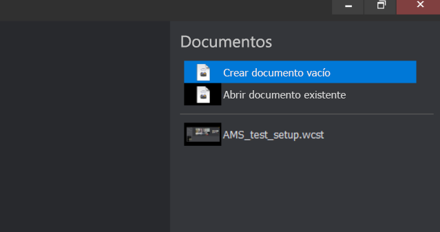
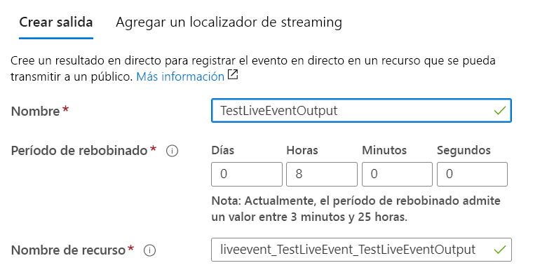
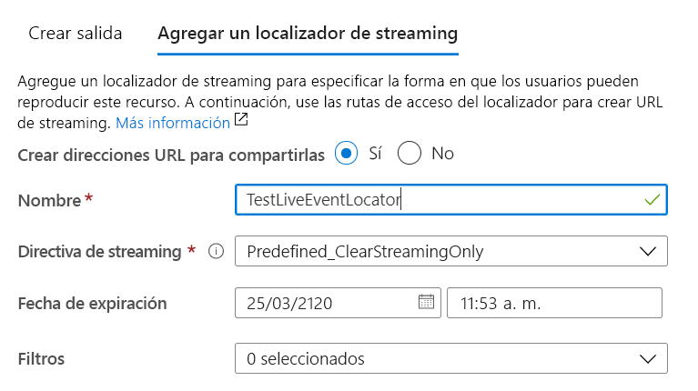

# Creación de streaming en vivo de Azure Media Services con el portal y Wirecast

En esta guía de introducción se da por supuesto que tiene una suscripción de Azure y que ha creado una cuenta de Azure Media Services.

Si no tiene una suscripción a Azure, cree una cuenta [gratuita](https://azure.microsoft.com/free/) antes de empezar.

## Iniciar sesión en Azure Portal

Abra el explorador web y vaya a [Microsoft Azure Portal](https://portal.azure.com/). Introduzca sus credenciales para iniciar sesión en el portal. La vista predeterminada es el panel del servicio.

En esta guía de inicio rápido, trataremos lo siguiente:

- Configuración de un codificador local con una versión de evaluación gratuita de Telestream Wirecast
- Configuración del streaming en vivo
- Configuración de las salidas del streaming en vivo
- Ejecución de un punto de conexión de streaming predeterminado
- Uso de Azure Media Player para ver streaming en vivo y la salida a petición

Para simplificar las cosas, usaremos un valor preestablecido de codificación para Azure Media Services en Wirecast, la codificación en la nube de paso a través y RTMP.

## Configuración de un codificador local con Wirecast

1. Descargue e instale Wirecast para su sistema operativo desde https://www.telestream.net.
1. Inicie la aplicación y use su dirección de correo electrónico favorita para registrar el producto.  Mantenga la aplicación abierta.
1. Recibirá un mensaje de correo electrónico en el que se le pedirá que compruebe su dirección de correo electrónico y, a continuación, la aplicación iniciará la evaluación gratuita.
1. RECOMENDACIÓN: Consulte el tutorial en vídeo de la pantalla de apertura de la aplicación.

## Configuración de streaming en vivo de Azure Media Services

1. Vaya a la cuenta de Azure Media Services en el portal y seleccione **Streaming en vivo** en la lista de Media Services. 
 
1. Haga clic en **Agregar evento en directo** para crear un nuevo evento de streaming en vivo. 
 
1. Escriba un nombre para el nuevo evento, por ejemplo, *TestLiveEvent*, en el campo **Nombre** del evento en directo. 
 
1. Escriba una descripción opcional del evento en el campo **Descripción**.
1. Seleccione el botón de radio **Paso a través: sin codificación en la nube**. 

1. Seleccione el botón de radio **RTMP**.
1. Asegúrese de que está seleccionado el botón de radio **No** para la opción Iniciar evento en directo, para evitar que se le facture por el evento en directo antes de que esté listo.  (La facturación comenzará cuando se inicie el evento en directo).  
1. Haga clic en el botón **Revisar y crear** para revisar la configuración.
1. Haga clic en el botón **Crear** para crear el evento en directo. A continuación, se le devolverá a la vista de lista de eventos en directo.
1. Haga clic en el **vínculo al evento en directo** que acaba de crear. Observe que el evento está detenido.
1. Mantenga esta página abierta en el explorador.  Volveremos a ella más adelante.

## Configuración de streaming en vivo con Wirecast Studio

1. Suponiendo que todavía tiene abierta la aplicación Wirecast, seleccione **Create Empty Document** (Crear documento vacío) en el menú principal y, luego, haga clic en **Continue** (Continuar).

1. Mantenga el ratón sobre la primera capa del área capas de Wirecast.  Haga clic en el icono **Add** (Agregar) que aparece y seleccione la entrada de vídeo que desea transmitir.  Se abrirá el cuadro de diálogo Master Layer 1. 

1. Seleccione **Video capture** (Captura de vídeo) en el menú y, a continuación, seleccione la cámara que desea usar. Si selecciona una cámara, la vista de la cámara aparecerá en el área de vista previa.

1. Mantenga el ratón sobre la segunda capa del área capas de Wirecast. Haga clic en el icono **Add** (Agregar) que aparece y seleccione la entrada de audio que desea transmitir.  Se abrirá el cuadro de diálogo Master Layer 2.
1. Seleccione **Audio capture** (Captura de audio) en el menú y, a continuación, seleccione la entrada de audio que desea usar.

1. En el menú principal, seleccione **Output settings** (Configuración de salida).  Aparecerá el cuadro de diálogo Output (Salida).
1. Seleccione **Azure Media Services** en la lista desplegable de salida.  La configuración de salida de Azure Media Services rellenará automáticamente la *mayoría* de los valores de la configuración de salida. 

1. En la siguiente sección, volverá a Azure Media Services en el explorador para copiar la *dirección URL de entrada* que va a escribir en la configuración de salida.

### Copie y pegue la dirección URL de entrada.

1. De vuelta en la página de Azure Media Services del portal, haga clic en **Iniciar** para iniciar el evento de streaming en vivo. (La facturación comienza ahora). 

2. Haga clic en el botón de alternancia **Seguro/No seguro** para establecerlo en **No seguro**.  Esto establecerá el protocolo en RTMP en lugar de RTMPS.
3. Copie la **dirección URL de entrada** en el Portapapeles.

4. Cambie a la aplicación Wirecast y pegue la **dirección URL de entrada** en el campo **Address** (Dirección) en la configuración de salida. 

5. Haga clic en **Aceptar**.

## Configuración de las salidas

En esta parte se configurarán las salidas y se le permitirá guardar una grabación de streaming en vivo.  

> [!NOTE]
> Para transmitir esta salida, el punto de conexión de streaming debe estar en ejecución.  Consulte la sección Ejecución del punto de conexión de streaming predeterminado a continuación.

1. Haga clic en el vínculo **Crear salidas** debajo del visor de vídeo Salidas.
1. Si lo desea, edite el nombre de la salida en el campo **Nombre** con algo más descriptivo, para que sea fácil de encontrar más adelante.

1. Deje todos los demás campos por ahora.
1. Haga clic en **Siguiente** para agregar el localizador de streaming.
1. Si lo desea, cambie el nombre del localizador por algo más descriptivo.

1. Deje todo lo demás en esta pantalla por ahora.
1. Haga clic en **Crear**.

## Inicio de la retransmisión

1. En Wirecast, seleccione **Output > Start / Stop broadcasting > Start Azure Media Services: Azure Media Services** (Salida > Iniciar/detener retransmisión > Iniciar Azure Media Services: Azure Media Services) en el menú principal.  Cuando se haya enviado la transmisión al evento en directo, la ventana Live (Directo) de Wirecast se mostrará en el reproductor de vídeo de eventos en directo en la página de eventos en directo de Azure Media Services.

   

1. Haga clic en el botón **Go** (Ir) situado bajo la ventana de vista previa para empezar a retransmitir el vídeo y el audio que seleccionó para las capas de Wirecast.

   

   > [!TIP]
   > Si se produce un error, intente volver a cargar el reproductor; para ello, haga clic en el vínculo Reload player (Recargar reproductor) situado sobre el reproductor.

## Ejecución del punto de conexión de streaming predeterminado

1. Asegúrese de que el punto de conexión de streaming está en ejecución; para ello, seleccione **Puntos de conexión de streaming** en la lista de Media Services. Se le dirigirá a la página de puntos de conexión de streaming. 

1. Si el punto de conexión de streaming predeterminado está en estado detenido, haga clic en el punto de conexión de streaming **predeterminado**. Esto le llevará a la página de ese punto de conexión.
1. Haga clic en **Iniciar**.  Se iniciará el punto de conexión de streaming. 

## Reproducción de la retransmisión de salida con Azure Media Player

1. Copie el valor de **Dirección URL de streaming** en el reproductor de vídeo de salida.
1. En un explorador web, abra la demostración de Azure Media Player https://ampdemo.azureedge.net/azuremediaplayer.html.
1. Pegue el valor de **Dirección URL de streaming** en el campo URL de Azure Media Player.
1. Haga clic en el botón **Actualizar reproductor**.
1. Haga clic en el icono **Reproducir** del vídeo para ver el streaming en vivo.

## Detención de la retransmisión

Cuando crea que ha transmitido suficiente contenido, detenga la difusión.

1. En Wirecast, haga clic en el botón **Broadcast** (Retransmisión).  Esto detendrá la retransmisión desde Wirecast.
1. En el Portal, haga clic en **Detener**. Recibirá un mensaje de advertencia que indica que se detendrá el streaming en vivo, pero la salida se convertirá ahora en un recurso a petición.
1. Haga clic en **Detener** en el mensaje de advertencia. Azure Media Player también mostrará un error, porque el streaming en vivo ya no está disponible.

## Reproducción de la salida a petición con Azure Media Player

La salida que creó ahora está disponible para streaming a petición siempre que el punto de conexión de streaming esté en ejecución.

1. Vaya a la lista de Media Services y seleccione **Recursos**.
1. Busque la salida del evento que creó anteriormente y haga clic en el **vínculo al recurso**. Se abrirá la página de salida del recurso.
1. Copie la **dirección URL de streaming** situada bajo el reproductor de vídeo del recurso.
1. Vuelva a Azure Media Player en el explorador y pegue la **dirección URL de streaming** en el campo URL de Azure Media Player.
1. Haga clic en **Actualizar reproductor**.
1. Haga clic en el icono **Reproducir** del vídeo para ver el recurso a petición.

## Limpieza de recursos

> [!IMPORTANT]
> Detenga los servicios. Una vez que haya completado los pasos de esta guía de inicio rápido, asegúrese de detener el evento en directo y el punto de conexión de streaming o se le facturará por el tiempo que sigan en ejecución. Para detener el evento en directo, consulte Detención de la retransmisión, pasos 2 y 3 anteriores.

### Detención del punto de conexión de streaming

1. En la lista de Media Services, seleccione **Puntos de conexión de streaming**.
2. Haga clic en el punto de conexión de streaming **predeterminado** que inició anteriormente. Se abrirá la página del punto de conexión.
3. Haga clic en **Detener**.  Se detendrá el punto de conexión de streaming.

> [!TIP]
> Si no desea conservar los recursos de este evento, asegúrese de eliminarlos para evitar que se le facture por el almacenamiento.

## Pasos siguientes
> [!div class="nextstepaction"]
> [Siguiente artículo de la secuencia](./live-events-outputs-concept.md)
