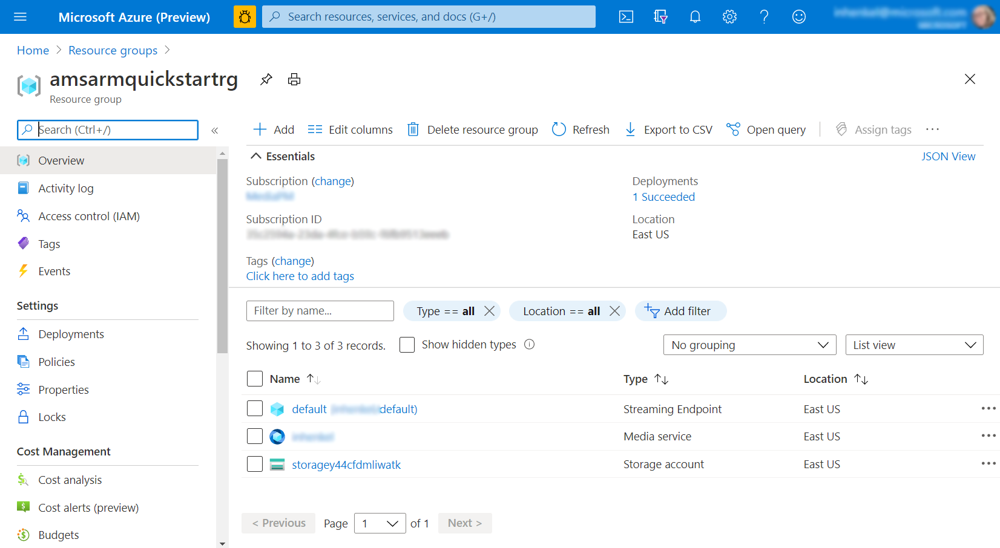

# <a name="quickstart-media-services-account-arm-template"></a>Inicio rápido: Plantilla de Resource Manager de una cuenta de Media Services

[!INCLUDE [media services api v3 logo](./includes/v3-hr.md)]

En este artículo se muestra cómo usar una plantilla de Azure Resource Manager para crear una cuenta de Media Services.

## <a name="introduction"></a>Introducción

[!INCLUDE [About Azure Resource Manager](../../../includes/resource-manager-quickstart-introduction.md)]

Los lectores que tienen experiencia con plantillas de Resource Manager pueden continuar con la [sección de implementación](#deploy-the-template).

<!-- this section will be added when the template is merged. If your environment meets the prerequisites and you're familiar with using ARM templates, select the **Deploy to Azure** button. The template will open in the Azure portal.

[](https://portal.azure.com/#create/Microsoft.Template/uri/<template's URI>)
-->

## <a name="prerequisites"></a>Requisitos previos

Si no tiene una suscripción a Azure, cree una [cuenta gratuita](https://azure.microsoft.com/free/?WT.mc_id=A261C142F) antes de empezar.

Si nunca ha implementado una plantilla de Resource Manager antes, resulta útil leer sobre [plantillas de Azure Resource Manager](https://docs.microsoft.com/azure/azure-resource-manager/templates/) y repasar el [tutorial](https://docs.microsoft.com/azure/azure-resource-manager/templates/template-tutorial-create-first-template?tabs=azure-powershell).

## <a name="review-the-template"></a>Revisión de la plantilla

<!-- this will be added when the template is merged. The template used in this quickstart is from [Azure Quickstart Templates](https://azure.microsoft.com/resources/templates/101-media-services-account-create/).

The syntax for the JSON code fence is:

:::code language="json" source="~/quickstart-templates/101-media-services-account-create/azuredeploy.json"::: -->

```json
{
  "$schema": "https://schema.management.azure.com/schemas/2015-01-01/deploymentTemplate.json#",
  "contentVersion": "1.0.0.0",
  "parameters": {
    "mediaServiceName": {
      "type": "string",
      "metadata": {
        "description": "Name of the Media Services account. A Media Services account name is unique in a given region, all lowercase letters or numbers with no spaces."
      }
    }
  },
  "variables": {
    "storageName": "[concat('storage', uniqueString(resourceGroup().id))]"
  },
  "resources": [
    {
      "name": "[parameters('mediaServiceName')]",
      "type": "Microsoft.Media/mediaServices",
      "apiVersion": "2018-07-01",
      "location": "[resourceGroup().location]",
      "dependsOn": [
        "[resourceId('Microsoft.Storage/storageAccounts', variables('storageName'))]"
      ],
      "properties": {
        "storageAccounts": [
          {
            "id": "[resourceId('microsoft.storage/storageaccounts/', variables('storageName'))]",
            "type": "Primary"
          }
        ]
      }
    },
    {
      "name": "[variables('storageName')]",
      "type": "Microsoft.Storage/storageAccounts",
      "sku": {
        "name": "Standard_LRS",
        "tier": "Standard"
      },
      "kind": "StorageV2",
      "apiVersion": "2017-10-01",
      "location": "[resourceGroup().location]",
      "tags": {},
      "scale": null,
      "properties": {
          "encryption": {
              "services": {
                  "file": {
                      "enabled": true
                  },
                  "blob": {
                      "enabled": true
                  }
              },
              "keySource": "Microsoft.Storage"
          },
          "accessTier": "Hot"
      }
    }
  ]
}

```

En la plantilla se definen tres tipos de recursos de Azure:

- [Microsoft.Media/mediaservices](https://docs.microsoft.com/azure/templates/microsoft.media/mediaservices): crea una cuenta de Media Services.
- [Microsoft.Storage/storageAccounts](https://docs.microsoft.com/azure/templates/microsoft.storage/storageaccounts): crea una cuenta de almacenamiento.

## <a name="set-the-account"></a>Establecimiento de la cuenta

```azurecli-interactive

az account set --subscription {your subscription name or id}

```

## <a name="create-a-resource-group"></a>Crear un grupo de recursos

```azurecli-interactive

az group create --name {the name you want to give your resource group} --location "{pick a location}"

```

## <a name="assign-a-variable-to-your-deployment-file"></a>Asignación de una variable al archivo de implementación

Para mayor comodidad, cree una variable que almacene la ruta de acceso al archivo de plantilla. Esta variable facilita la ejecución de los comandos de implementación, ya que no es necesario volver a escribir la ruta de acceso cada vez que se implementa.

```azurecli-interactive

templateFile="{provide the path to the template file}"

```

## <a name="deploy-the-template"></a>Implementación de la plantilla

Se le pedirá que escriba el nombre de la cuenta de Media Services.

```azurecli-interactive

az deployment group create --name {the name you want to give to your deployment} --resource-group {the name of resource group you created} --template-file $templateFile

```

## <a name="review-deployed-resources"></a>Revisión de los recursos implementados

Debería ver una respuesta JSON similar a la siguiente:

```json
{
  "id": "/subscriptions/{subscriptionid}/resourceGroups/amsarmquickstartrg/providers/Microsoft.Resources/deployments/amsarmquickstartdeploy",
  "location": null,
  "name": "amsarmquickstartdeploy",
  "properties": {
    "correlationId": "{correlationid}",
    "debugSetting": null,
    "dependencies": [
      {
        "dependsOn": [
          {
            "id": "/subscriptions/{subscriptionid}/resourceGroups/amsarmquickstartrg/providers/Microsoft.Storage/storageAccounts/storagey44cfdmliwatk",
            "resourceGroup": "amsarmquickstartrg",
            "resourceName": "storagey44cfdmliwatk",
            "resourceType": "Microsoft.Storage/storageAccounts"
          }
        ],
        "id": "/subscriptions/35c2594a-23da-4fce-b59c-f6fb9513eeeb/resourceGroups/amsarmquickstartrg/providers/Microsoft.Media/mediaServices/{accountname}",
        "resourceGroup": "amsarmquickstartrg",
        "resourceName": "{accountname}",
        "resourceType": "Microsoft.Media/mediaServices"
      }
    ],
    "duration": "PT1M10.8615001S",
    "error": null,
    "mode": "Incremental",
    "onErrorDeployment": null,
    "outputResources": [
      {
        "id": "/subscriptions/{subscriptionid}/resourceGroups/amsarmquickstartrg/providers/Microsoft.Media/mediaServices/{accountname}",
        "resourceGroup": "amsarmquickstartrg"
      },
      {
        "id": "/subscriptions/{subscriptionid}/resourceGroups/amsarmquickstartrg/providers/Microsoft.Storage/storageAccounts/storagey44cfdmliwatk",
        "resourceGroup": "amsarmquickstartrg"
      }
    ],
    "outputs": null,
    "parameters": {
      "mediaServiceName": {
        "type": "String",
        "value": "{accountname}"
      }
    },
    "parametersLink": null,
    "providers": [
      {
        "id": null,
        "namespace": "Microsoft.Media",
        "registrationPolicy": null,
        "registrationState": null,
        "resourceTypes": [
          {
            "aliases": null,
            "apiVersions": null,
            "capabilities": null,
            "locations": [
              "eastus"
            ],
            "properties": null,
            "resourceType": "mediaServices"
          }
        ]
      },
      {
        "id": null,
        "namespace": "Microsoft.Storage",
        "registrationPolicy": null,
        "registrationState": null,
        "resourceTypes": [
          {
            "aliases": null,
            "apiVersions": null,
            "capabilities": null,
            "locations": [
              "eastus"
            ],
            "properties": null,
            "resourceType": "storageAccounts"
          }
        ]
      }
    ],
    "provisioningState": "Succeeded",
    "templateHash": "{templatehash}",
    "templateLink": null,
    "timestamp": "2020-11-24T23:25:52.598184+00:00",
    "validatedResources": null
  },
  "resourceGroup": "amsarmquickstartrg",
  "tags": null,
  "type": "Microsoft.Resources/deployments"
}

```

En Azure Portal, confirme que se han creado los recursos.



## <a name="clean-up-resources"></a>Limpieza de recursos

Si no tiene previsto usar los recursos que acaba de crear, puede eliminar el grupo de recursos.

```azurecli-interactive

az group delete --name {name of the resource group}

```

## <a name="next-steps"></a>Pasos siguientes

Para más información sobre el uso de una plantilla de Resource Manager siguiendo el proceso de creación de una plantilla con parámetros, variables, etc., pruebe:

> [!div class="nextstepaction"]
> [Tutorial: Creación e implementación de su primera plantilla de Resource Manager](/azure/azure-resource-manager/templates/template-tutorial-create-first-template)