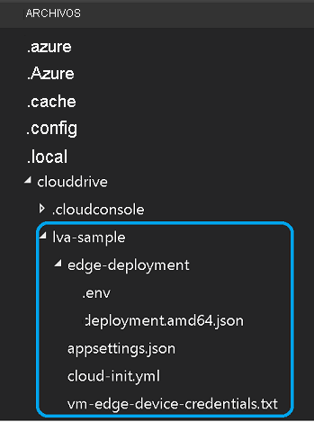
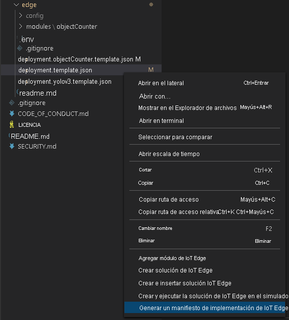
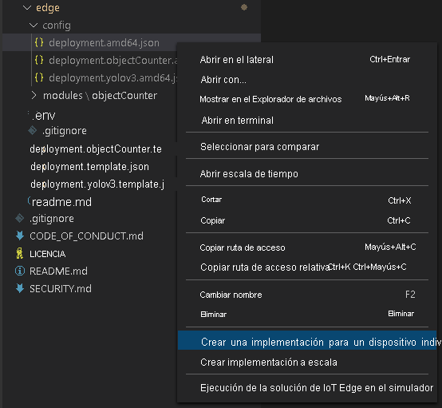

# <a name="tutorial-continuous-video-recording-to-the-cloud-and-playback-from-the-cloud"></a>Tutorial: Grabación continua de vídeo en la nube y reproducción desde la nube

En este tutorial aprenderá a usar Azure Live Video Analytics en Azure IoT Edge para realizar una [grabación continua de vídeo](continuous-video-recording-concept.md) (CVR) en la nube y transmitir cualquier parte de ese vídeo con Azure Media Services. Esta funcionalidad resulta útil para escenarios como la seguridad o el cumplimiento, en los que es necesario mantener un archivo de la secuencia de una cámara durante días o semanas. 

En este tutorial, aprenderá lo siguiente:

> [!div class="checklist"]
> * Configuración de los recursos correspondientes
> * Examen del código que realiza la CVR
> * Ejecución del código de ejemplo
> * Examen de los resultados y visualización del vídeo

[!INCLUDE [quickstarts-free-trial-note](../../../includes/quickstarts-free-trial-note.md)]

## <a name="suggested-pre-reading"></a>Sugerencias antes de la lectura  

Consulte estos artículos antes de empezar:

* [Introducción a Análisis de vídeos en vivo en IoT Edge](overview.md)
* [Terminología de Live Video Analytics en IoT Edge](terminology.md)
* [Concepto de grafo multimedia](media-graph-concept.md) 
* [Escenarios de grabación continua de vídeo](continuous-video-recording-concept.md)

## <a name="prerequisites"></a>Requisitos previos

Los requisitos previos de este tutorial son los siguientes:

* [Visual Studio Code](https://code.visualstudio.com/) en la máquina de desarrollo con las extensiones [Azure IoT Tools](https://marketplace.visualstudio.com/items?itemName=vsciot-vscode.azure-iot-tools) y [C#](https://marketplace.visualstudio.com/items?itemName=ms-dotnettools.csharp).

    > [!TIP]
    > Es posible que se le pida que instale Docker. Puede omitir este mensaje.
* [.NET Core 3.1](https://dotnet.microsoft.com/download/dotnet-core/thank-you/sdk-3.1.201-windows-x64-installer) instalado en el equipo de desarrollo.
* Complete el [Script de configuración de los recursos de Live Video Analytics](https://github.com/Azure/live-video-analytics/tree/master/edge/setup).

Al final de estos pasos, tendrá los recursos de Azure correspondientes implementados en la suscripción de Azure:

* Azure IoT Hub
* Cuenta de Azure Storage
* Cuenta de Azure Media Services
* Máquina virtual Linux en Azure, con el [entorno de ejecución de Azure IoT Edge](https://docs.microsoft.com/azure/iot-edge/how-to-install-iot-edge-linux) instalado

## <a name="concepts"></a>Conceptos

Como se explica en el artículo [Concepto de grafo multimedia](media-graph-concept.md), un grafo multimedia le permite definir:

- Desde dónde se deben capturar los elementos multimedia.
- Cómo se deben procesar.
- Dónde se deben entregar los resultados. 
 
 Para lograr la CVR, debe capturar el vídeo desde una cámara compatible con RTSP y grabarlo continuamente en un [recurso de Azure Media Services](terminology.md#asset). El diagrama muestra una representación gráfica de ese grafo multimedia.


En este tutorial, usará un módulo IoT Edge creado con [Live555 Media Server](https://github.com/Azure/live-video-analytics/tree/master/utilities/rtspsim-live555) para simular una cámara RTSP. Dentro del grafo multimedia, usará un nodo de [origen RTSP](media-graph-concept.md#rtsp-source) para obtener la fuente en directo y enviar ese vídeo al [nodo receptor del recurso](media-graph-concept.md#asset-sink), que graba el vídeo en un recurso.

## <a name="set-up-your-development-environment"></a>Configurado su entorno de desarrollo

Antes de comenzar, compruebe que ha completado el tercer punto de [Requisitos previos](#prerequisites). Una vez finalizado el script de configuración de recursos, seleccione las llaves para exponer la estructura de carpetas. Verá que se han creado algunos archivos en el directorio ~/clouddrive/lva-sample.



Entre los que son de interés para este tutorial se incluyen los archivos:

* **~/clouddrive/lva-sample/edge-deployment/.env**: contiene las propiedades que utiliza Visual Studio Code para implementar módulos en un dispositivo IoT Edge.
* **~/clouddrive/lva-sample/appsettings.json**: lo usa Visual Studio Code para ejecutar el código de ejemplo.

Necesitará los archivos para estos pasos:

1. Clone el repositorio desde el vínculo de GitHub https://github.com/Azure-Samples/live-video-analytics-iot-edge-csharp.
1. Inicie Visual Studio Code y abra la carpeta donde descargó el repositorio.
1. En Visual Studio Code, vaya a la carpeta src/cloud-to-device-console-app y cree un archivo llamado **appsettings.json**. Este archivo contiene la configuración necesaria para ejecutar el programa.
1. Copie el contenido del archivo ~/clouddrive/lva-sample/appsettings.json. El texto debe tener el siguiente aspecto:
    ```
    {  
        "IoThubConnectionString" : "HostName=xxx.azure-devices.net;SharedAccessKeyName=iothubowner;SharedAccessKey=XXX",  
        "deviceId" : "lva-sample-device",  
        "moduleId" : "lvaEdge"  
    }
    ```
    La cadena de conexión de IoT Hub permite usar Visual Studio Code para enviar comandos a los módulos IoT Edge mediante Azure IoT Hub.
    
1. A continuación, vaya a la carpeta src/edge y cree un archivo llamado **.env**.
1. Copie el contenido del archivo ~/clouddrive/lva-sample/.env. El texto debe tener el siguiente aspecto:

    ```
    SUBSCRIPTION_ID="<Subscription ID>"  
    RESOURCE_GROUP="<Resource Group>"  
    AMS_ACCOUNT="<AMS Account ID>"  
    IOTHUB_CONNECTION_STRING="HostName=xxx.azure-devices.net;SharedAccessKeyName=iothubowner;SharedAccessKey=xxx"  
    AAD_TENANT_ID="<AAD Tenant ID>"  
    AAD_SERVICE_PRINCIPAL_ID="<AAD SERVICE_PRINCIPAL ID>"  
    AAD_SERVICE_PRINCIPAL_SECRET="<AAD SERVICE_PRINCIPAL ID>"  
    INPUT_VIDEO_FOLDER_ON_DEVICE="/home/lvaadmin/samples/input"  
    OUTPUT_VIDEO_FOLDER_ON_DEVICE="/home/lvaadmin/samples/output"  
    APPDATA_FOLDER_ON_DEVICE="/var/local/mediaservices"
    CONTAINER_REGISTRY_USERNAME_myacr="<your container registry username>"  
    CONTAINER_REGISTRY_PASSWORD_myacr="<your container registry username>"      
    ```

## <a name="examine-the-sample-files"></a>Examen de los archivos de ejemplo

En Visual Studio Code, abra src/edge/deployment.template.json. Esta plantilla define los módulos IoT Edge que se van a implementar en el dispositivo perimetral (la máquina virtual Linux de Azure). Hay dos entradas en la sección **modules**, con los nombres siguientes:

* **lvaEdge**: módulo Live Video Analytics en IoT Edge.
* **rtspsim**: simulador RTSP.

A continuación, vaya a la carpeta src/cloud-to-device-console-app. Aquí podrá ver el archivo appsettings.json que creó junto con algunos otros archivos:

* **c2d-console-app.csproj**: archivo de proyecto de Visual Studio Code.
* **operations.json**: en este archivo se enumeran las distintas operaciones que se ejecutarán.
* **Program.cs**: código del programa de ejemplo, el cual:
    * Carga la configuración de la aplicación.
    * Invoca los métodos directos que expone el módulo Live Video Analytics en IoT Edge. Puede usar el módulo para analizar secuencias de vídeo en directo mediante la invocación de sus [métodos directos](direct-methods.md).
    * Se pone en pausa para que pueda examinar la salida del programa en la ventana **TERMINAL** y los eventos generados por el módulo en la ventana **SALIDA**.
    * Invoca los métodos directos para limpiar los recursos.

## <a name="generate-and-deploy-the-iot-edge-deployment-manifest"></a>Generación e implementación del manifiesto de implementación de IoT Edge 

El manifiesto de implementación define los módulos que se implementan en un dispositivo IoT Edge y los valores de configuración de dichos módulos. Siga estos pasos para generar un manifiesto a partir del archivo de plantilla y, a continuación, impleméntelo en el dispositivo IoT Edge.

1. Inicie Visual Studio Code.
1. Establezca la cadena de conexión de IoT Hub; para ello, seleccione el icono **More actions** (Más acciones) situado junto al panel **AZURE IOT HUB** en la esquina inferior izquierda. Copie la cadena del archivo src/cloud-to-device-console-app/appsettings.json. 

    
1. Haga clic con el botón derecho en el archivo src/edge/deployment.template.json y seleccione **Generate IoT Edge Deployment Manifest** (Generar manifiesto de implementación de IoT Edge). Visual Studio Code usa los valores del archivo .env para reemplazar las variables que se encuentran en el archivo de la plantilla de implementación. Esta acción crea un archivo de manifiesto en la carpeta src/edge/config llamado **deployment.amd64.json**.

   
1. Haga clic con el botón derecho en el archivo src/edge/config/deployment.amd64.json y seleccione **Create Deployment for Single Device** (Crear una implementación para un dispositivo individual).

   
1. A continuación, aparecerá el mensaje **Select an IoT Hub device** (Seleccione un dispositivo IoT Hub). Seleccione lva-sample-device en la lista desplegable.
1. En unos 30 segundos, actualice Azure IoT Hub en la sección inferior izquierda. Debería ver que el dispositivo IoT Edge tiene los siguientes módulos implementados:
    * Live Video Analytics en IoT Edge (nombre de módulo **lvaEdge**)
    * Simulador RTSP (nombre de módulo **rtspsim**)
 
    

## <a name="prepare-to-monitor-the-modules"></a>Preparación para supervisar los módulos 

Al usar el módulo Live Video Analytics en IoT Edge para grabar la secuencia de vídeo en directo, se envían eventos a IoT Hub. Para ver estos eventos, siga estos pasos:

1. Abra el panel del explorador en Visual Studio Code y busque **Azure IoT Hub** en la esquina inferior izquierda.
1. Expanda el nodo **Devices** (Dispositivos).
1. Haga clic con el botón derecho en el archivo lva-sample-device y seleccione **Start Monitoring Built-in Event Endpoint** (Iniciar la supervisión del punto de conexión de eventos integrado).

    

## <a name="run-the-program"></a>Ejecución del programa 

1. En Visual Studio Code, vaya a src/cloud-to-device-console-app/operations.json.
1. En el nodo **GraphTopologySet**, edite lo siguiente:

    `"topologyUrl" : "https://raw.githubusercontent.com/Azure/live-video-analytics/master/MediaGraph/topologies/cvr-asset/topology.json" `
1. A continuación, en los nodos **GraphInstanceSet** y **GraphTopologyDelete**, asegúrese de que el valor de **topologyName** coincide con el valor de la propiedad **name** en la topología del grafo anterior:

    `"topologyName" : "CVRToAMSAsset"`  
1. Abra el archivo de [topología](https://raw.githubusercontent.com/Azure/live-video-analytics/master/MediaGraph/topologies/cvr-asset/topology.json) en un explorador y examine assetNamePattern. Para asegurarse de que tiene un recurso con un nombre único, puede que desee cambiar el nombre de la instancia del grafo en el archivo operations.json (del valor predeterminado Sample-Graph-1).

    `"assetNamePattern": "sampleAsset-${System.GraphTopologyName}-${System.GraphInstanceName}"`    
1. Para iniciar una sesión de depuración, seleccione F5. Verá algunos mensajes impresos en la ventana **TERMINAL**.
1. El archivo operations.json comienza con llamadas a GraphTopologyList y GraphInstanceList. Si ha limpiado los recursos después de los inicios rápidos o los tutoriales anteriores, esta acción devolverá listas vacías y entrará en pausa para que seleccione **Entrar**, como se muestra a continuación:

    ```
    --------------------------------------------------------------------------
    Executing operation GraphTopologyList
    -----------------------  Request: GraphTopologyList  --------------------------------------------------
    {
      "@apiVersion": "1.0"
    }
    ---------------  Response: GraphTopologyList - Status: 200  ---------------
    {
      "value": []
    }
    --------------------------------------------------------------------------
    Executing operation WaitForInput
    Press Enter to continue
    ```

1. Después de seleccionar **Entrar** en la ventana **TERMINAL**, se realiza el siguiente conjunto de llamadas de método directo:
   * Una llamada a GraphTopologySet con el elemento topologyUrl anterior
   * Una llamada a GraphInstanceSet con el siguiente cuerpo
     
     ```
     {
       "@apiVersion": "1.0",
       "name": "Sample-Graph-1",
       "properties": {
         "topologyName": "CVRToAMSAsset",
         "description": "Sample graph description",
         "parameters": [
           {
             "name": "rtspUrl",
             "value": "rtsp://rtspsim:554/media/camera-300s.mkv"
           },
           {
             "name": "rtspUserName",
             "value": "testuser"
           },
           {
             "name": "rtspPassword",
             "value": "testpassword"
           }
         ]
       }
     }
     ```
   * Una llamada a GraphInstanceActivate para iniciar la instancia del grafo e iniciar el flujo de vídeo
   * Una segunda llamada a GraphInstanceList para mostrar que la instancia del grafo está en ejecución 
1. La salida de la ventana **TERMINAL** se pondrá en pausa ahora con el mensaje **Press Enter to continue** (Presione Entrar para continuar). No seleccione **Entrar** en este momento. Desplácese hacia arriba para ver las cargas de la respuesta JSON para los métodos directos que ha invocado.
1. Si ahora cambia a la ventana **SALIDA** de Visual Studio Code, verá los mensajes que se envían a IoT Hub mediante el módulo Live Video Analytics en IoT Edge.

   Estos mensajes se describen en la sección siguiente.
1. La instancia del grafo continúa en ejecución y graba el vídeo. El simulador RTSP sigue recorriendo el vídeo de origen. Para detener la grabación, vuelva a la ventana **TERMINAL** y seleccione **Entrar**. Se realiza la siguiente serie de llamadas para la limpieza de recursos:

   * Una llamada a GraphInstanceDeactivate para desactivar la instancia del grafo.
   * Una llamada a GraphInstanceDelete para eliminar la instancia.
   * Una llamada a GraphTopologyDelete para eliminar la topología.
   * Una llamada final a GraphTopologyList para mostrar que ahora la lista está vacía.

## <a name="interpret-the-results"></a>Interpretación de los resultados 

Al ejecutar el grafo multimedia, el módulo Live Video Analytics en IoT Edge envía determinados eventos de diagnóstico y de funcionamiento al centro de IoT Edge. Estos eventos son los mensajes que aparecen en la ventana **SALIDA** de Visual Studio Code. Contienen una sección body y una sección applicationProperties. Para comprender lo que representan estas secciones, consulte [Creación y lectura de mensajes de IoT Hub](https://docs.microsoft.com/azure/iot-hub/iot-hub-devguide-messages-construct).

En los mensajes siguientes, se definen las propiedades de la aplicación y el contenido del cuerpo mediante el módulo Live Video Analytics.

## <a name="diagnostics-events"></a>Eventos de diagnóstico 

### <a name="mediasession-established-event"></a>Evento MediaSessionEstablished

Cuando se activa la instancia del grafo, el nodo de origen RTSP intenta conectarse al servidor RTSP que se ejecuta en el módulo rtspsim. Si se realiza correctamente, imprime este evento:

```
[IoTHubMonitor] [9:42:18 AM] Message received from [lvaedgesample/lvaEdge]:
{
  "body": {
    "sdp": "SDP:\nv=0\r\no=- 1586450538111534 1 IN IP4 XXX.XX.XX.XX\r\ns=Matroska video+audio+(optional)subtitles, streamed by the LIVE555 Media Server\r\ni=media/camera-300s.mkv\r\nt=0 0\r\na=tool:LIVE555 Streaming Media v2020.03.06\r\na=type:broadcast\r\na=control:*\r\na=range:npt=0-300.000\r\na=x-qt-text-nam:Matroska video+audio+(optional)subtitles, streamed by the LIVE555 Media Server\r\na=x-qt-text-inf:media/camera-300s.mkv\r\nm=video 0 RTP/AVP 96\r\nc=IN IP4 0.0.0.0\r\nb=AS:500\r\na=rtpmap:96 H264/90000\r\na=fmtp:96 packetization-mode=1;profile-level-id=4D0029;sprop-parameter-sets=XXXXXXXXXXXXXXXXXXXXXX\r\na=control:track1\r\n"
  },
  "applicationProperties": {
    "dataVersion": "1.0",
    "topic": "/subscriptions/{subscriptionID}/resourceGroups/{name}/providers/microsoft.media/mediaservices/hubname",
    "subject": "/graphInstances/Sample-Graph-1/sources/rtspSource",
    "eventType": "Microsoft.Media.MediaGraph.Diagnostics.MediaSessionEstablished",
    "eventTime": "2020-04-09T09:42:18.1280000Z"
  }
}
```

* El mensaje es un evento de diagnóstico (MediaSessionEstablished). Indica que el nodo de origen RTSP (el sujeto) ha establecido una conexión con el simulador RTSP y ha comenzado a recibir una fuente en directo (simulada).
* La sección subject de applicationProperties hace referencia al nodo de la topología de grafo desde la que se generó el mensaje. En este caso, el mensaje se origina en el nodo de origen RTSP.
* La sección eventType de applicationProperties indica que se trata de un evento de diagnóstico.
* La sección eventTime indica la hora a la que se produjo el evento.
* La sección body contiene datos sobre el evento de diagnóstico que, en este caso, es el detalle de [SDP](https://en.wikipedia.org/wiki/Session_Description_Protocol).

## <a name="operational-events"></a>Eventos operativos 

### <a name="recordingstarted-event"></a>Evento RecordingStarted

Cuando el nodo receptor del recurso comienza a grabar el vídeo, emite este evento de tipo Microsoft.Media.Graph.Operational.RecordingStarted:

```
[IoTHubMonitor] [9:42:38 AM] Message received from [lva-sample-device/lvaEdge]:
{
  "body": {
    "outputType": "assetName",
    "outputLocation": "sampleAsset-CVRToAMSAsset-Sample-Graph-1"
  },
  "applicationProperties": {
    "topic": "/subscriptions/{subscriptionID}/resourceGroups/{resource-group-name}/providers/microsoft.media/mediaservices/{ams-account-name}",
    "subject": "/graphInstances/Sample-Graph-1/sinks/assetSink",
    "eventType": "Microsoft.Media.Graph.Operational.RecordingStarted",
    "eventTime": "2020-04-09T09:42:38.1280000Z",
    "dataVersion": "1.0"
  }
}
```

La sección subject de applicationProperties hace referencia al nodo receptor del recurso del grafo que generó este mensaje.

La sección body contiene información sobre la ubicación de salida. En este caso, es el nombre del recurso de Azure Media Services en el que se graba el vídeo. Anote este valor.

### <a name="recordingavailable-event"></a>Evento RecordingAvailable

Como sugiere su nombre, el evento RecordingStarted se envía cuando se inicia la grabación, pero puede que los datos del vídeo aún no se hayan cargado en el recurso. Cuando el nodo receptor del recurso ha cargado los datos del vídeo en el recurso, emite este evento de tipo Microsoft.Media.Graph.Operational.RecordingAvailable:

```
[IoTHubMonitor] [[9:43:38 AM] Message received from [lva-sample-device/lvaEdge]:
{
  "body": {
    "outputType": "assetName",
    "outputLocation": "sampleAsset-CVRToAMSAsset-Sample-Graph-1"
  },
  "applicationProperties": {
    "topic": "/subscriptions/{subscriptionID}/resourceGroups/{resource-group-name}/providers/microsoft.media/mediaservices/{ams-account-name}",
    "subject": "/graphInstances/Sample-Graph-1/sinks/assetSink",
    "eventType": "Microsoft.Media.Graph.Operational.RecordingAvailable",
    "eventTime": "2020-04-09T09:43:38.1280000Z",
    "dataVersion": "1.0"
  }
}
```

Este evento indica que se han escrito suficientes datos en el recurso para que los reproductores y clientes inicien la reproducción del vídeo.

La sección subject de applicationProperties hace referencia al nodo receptor del recurso del grafo que generó este mensaje.

La sección body contiene información sobre la ubicación de salida. En este caso, es el nombre del recurso de Azure Media Services en el que se graba el vídeo.

### <a name="recordingstopped-event"></a>Evento RecordingStopped

Al desactivar la instancia del grafo, el nodo receptor del recurso deja de grabar vídeo en el recurso. Se emite este evento de tipo Microsoft.Media.Graph.Operational.RecordingStopped:

```
[IoTHubMonitor] [11:33:31 PM] Message received from [lva-sample-device/lvaEdge]:
{
  "body": {
    "outputType": "assetName",
    "outputLocation": "sampleAsset-CVRToAMSAsset-Sample-Graph-1"
  },
  "applicationProperties": {
    "topic": "/subscriptions/{subscriptionID}/resourceGroups/{resource-group-name}/providers/microsoft.media/mediaservices/{ams-account-name}",
    "subject": "/graphInstances/Sample-Graph-1/sinks/assetSink",
    "eventType": "Microsoft.Media.Graph.Operational.RecordingStopped",
    "eventTime": "2020-04-10T11:33:31.051Z",
    "dataVersion": "1.0"
  }
}
```

Este evento indica que se ha detenido la grabación.

La sección subject de applicationProperties hace referencia al nodo receptor del recurso del grafo que generó este mensaje.

La sección body contiene información sobre la ubicación de salida, que en este caso es el nombre del recurso de Azure Media Services en el que se graba el vídeo.

## <a name="media-services-asset"></a>Recurso de Media Services  

Puede examinar el recurso de Media Services que creó el grafo multimedia; para ello, inicie sesión en Azure Portal y visualice el vídeo.

1. Abra el explorador web y vaya a [Azure Portal](https://portal.azure.com/). Introduzca sus credenciales para iniciar sesión en el portal. La vista predeterminada es el panel del servicio.
1. Busque la cuenta de Media Services entre los recursos que tiene en la suscripción y abra el panel de cuentas.
1. Seleccione **Recursos** en la lista de **Media Services**.

    
1. Encontrará un recurso que aparece con el nombre sampleAsset-CVRToAMSAsset-Sample-Graph-1. Este es el patrón de nomenclatura elegido en el archivo de topología del grafo.
1. Seleccione el recurso.
1. En la página de detalles del recurso, seleccione **Crear nuevo** bajo el cuadro de texto **Dirección URL de streaming**.

    

1. En el asistente que se abre, acepte las opciones predeterminadas y seleccione **Agregar**. Para más información, consulte [Reproducción de vídeo](video-playback-concept.md).

    > [!TIP]
    > Asegúrese de que el [punto de conexión de streaming está en ejecución](../latest/streaming-endpoint-concept.md).
1. El reproductor debería cargar el vídeo. Seleccione **Reproducir** para verlo.

> [!NOTE]
> Puesto que el origen de vídeo era un contenedor que simula una fuente de cámara, las marcas de tiempo del vídeo están relacionadas a cuándo activó y desactivó la instancia del grafo. Consulte el tutorial [Reproducción de las grabaciones de varios días](playback-multi-day-recordings-tutorial.md) para obtener información sobre cómo explorar una grabación de varios días y visualizar partes del archivo. En dicho tutorial, también podrá ver que las marcas de tiempo del vídeo se muestran en pantalla.

## <a name="clean-up-resources"></a>Limpieza de recursos

Si va a probar los otros tutoriales, debe mantener los recursos creados. En caso contrario, vaya a Azure Portal, vaya a los grupos de recursos, seleccione el grupo de recursos en el que ejecutó este tutorial y elimine el grupo de recursos.

## <a name="next-steps"></a>Pasos siguientes

* Use una [cámara IP](https://en.wikipedia.org/wiki/IP_camera) compatible con RTSP en lugar de utilizar el simulador RTSP. Puede buscar cámaras IP con compatibilidad con RTSP en la página de productos [compatibles con ONVIF](https://www.onvif.org/conformant-products/), buscando dispositivos que cumplan con los perfiles G, S o T.
* Use un dispositivo Linux AMD64 o x64 (en lugar de usar una máquina virtual Linux de Azure). El dispositivo debe estar en la misma red que la cámara IP. Siga las instrucciones de [Instalación del entorno de ejecución de Azure IoT Edge en Linux](https://docs.microsoft.com/azure/iot-edge/how-to-install-iot-edge-linux). A continuación, siga las instrucciones de la guía de inicio rápido [Implementación del primer módulo IoT Edge en un dispositivo virtual Linux](https://docs.microsoft.com/azure/iot-edge/quickstart-linux) para registrar el dispositivo en Azure IoT Hub.
