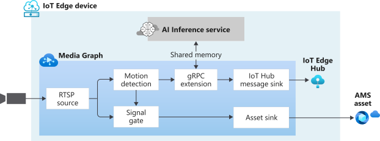

En este diagrama se muestra cómo fluyen las señales en este inicio rápido. Un [módulo perimetral](https://github.com/Azure/live-video-analytics/tree/master/utilities/rtspsim-live555) simula una cámara IP que hospeda un servidor de protocolo RTSP. Un nodo de [origen RTSP](../../../media-graph-concept.md#rtsp-source) extrae la fuente de vídeo de este servidor y envía fotogramas de vídeo al nodo del [procesador de detección del movimiento](../../../media-graph-concept.md#motion-detection-processor). Este procesador detectará el movimiento y, cuando se detecte, enviará fotogramas de vídeo al nodo del [procesador de extensión gRPC](../../../media-graph-concept.md#grpc-extension-processor).

El nodo de extensión gRPC desempeña el rol de un servidor proxy. Convierte los fotogramas de vídeo en el tipo de imagen especificado. Luego, retransmite la imagen sobre gRPC a otro módulo perimetral que ejecuta un modelo de IA detrás de un punto de conexión gRPC en una [memoria compartida](https://en.wikipedia.org/wiki/Shared_memory). En este ejemplo, el módulo perimetral se crea mediante el modelo [YOLOv3](https://github.com/Azure/live-video-analytics/tree/master/utilities/video-analysis/yolov3-onnx), que puede detectar muchos tipos de objetos. El nodo del procesador de extensión gRPC recopila los resultados de la detección y publica los eventos en el nodo del [receptor de IoT Hub](../../../media-graph-concept.md#iot-hub-message-sink). que posteriormente los envía a [IoT Edge Hub](../../../../../iot-edge/iot-edge-glossary.md#iot-edge-hub).

En este inicio rápido realizará lo siguiente:

1. Creará e implementará el grafo de elementos multimedia.
1. Interpretará los resultados.
1. Limpieza de recursos.