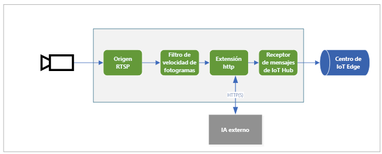
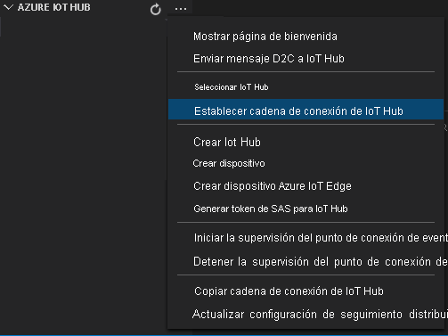
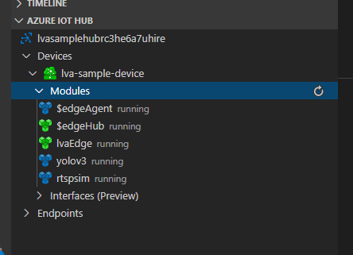

# <a name="quickstart-analyze-live-video-with-your-own-model"></a>Inicio rápido: Análisis de vídeo en directo con su propio modelo

En este inicio rápido se muestra cómo usar Live Video Analytics en IoT Edge para analizar la fuente de vídeo en directo desde una cámara IP (simulada) mediante la aplicación de un modelo de Computer Vision para detectar objetos. Un subconjunto de los fotogramas de la fuente de vídeo en directo se envía a un servicio de inferencia y sus resultados se envían al centro de conectividad de IoT Edge. Usa una máquina virtual de Azure como un dispositivo IoT Edge y una secuencia de vídeo en directo simulada. Este artículo se basa en un ejemplo de código escrito en C#.

Este artículo se basa en [este](detect-motion-emit-events-quickstart.md) inicio rápido. 

## <a name="prerequisites"></a>Requisitos previos

* Una cuenta de Azure con una suscripción activa. [Cree una cuenta gratuita](https://azure.microsoft.com/free/?WT.mc_id=A261C142F).
* [Visual Studio Code](https://code.visualstudio.com/) en la máquina con las siguientes extensiones:
    * [Herramientas de Azure IoT](https://marketplace.visualstudio.com/items?itemName=vsciot-vscode.azure-iot-tools)
    * [C#](https://marketplace.visualstudio.com/items?itemName=ms-dotnettools.csharp)
* [SDK de .NET Core 3.1](https://dotnet.microsoft.com/download/dotnet-core/3.1) instalado en el sistema
* Si no ha completado previamente [este](detect-motion-emit-events-quickstart.md) inicio rápido, complete los pasos siguientes:
     * [Configuración de los recursos de Azure](detect-motion-emit-events-quickstart.md#set-up-azure-resources)

> [!TIP]
> Al instalar Azure IoT Tools, es posible que se le pida que instale Docker. Si lo desea, puede ignorar este aviso.

## <a name="review-the-sample-video"></a>Revisión del vídeo de ejemplo
Como parte de los pasos anteriores para configurar los recursos de Azure, se copiará un vídeo (corto) de tráfico de una autopista en la máquina virtual Linux en Azure que se usa como dispositivo IoT Edge. Este archivo de vídeo se usará para simular un streaming en vivo para este tutorial.

Puede usar una aplicación como [VLC Player](https://www.videolan.org/vlc/), iniciarla, presionar Ctrl + N y pegar [este](https://lvamedia.blob.core.windows.net/public/camera-300s.mkv) vínculo al vídeo para iniciar la reproducción. Puede ver que la secuencia es de tráfico en una autopista, con muchos vehículos en movimiento.

Cuando complete los pasos siguientes, habrá usado Live Video Analytics en IoT Edge para detectar objetos como vehículos, personas, etc., y publicar los eventos de inferencia asociados en el centro de conectividad de IoT Edge.

## <a name="overview"></a>Información general



En el diagrama anterior se muestra cómo fluyen las señales en este inicio rápido. Un módulo IoT Edge (que se detalla [aquí](https://github.com/Azure/live-video-analytics/tree/master/utilities/rtspsim-live555)) simula una cámara IP que hospeda un servidor RTSP. Un nodo de [origen RTSP](media-graph-concept.md#rtsp-source) extrae la fuente de vídeo de este servidor y envía fotogramas de vídeo al nodo del [procesador de filtros de velocidad de fotogramas](media-graph-concept.md#frame-rate-filter-processor). Este procesador limita la velocidad de fotogramas de la secuencia de vídeo que llega al nodo del [procesador de extensiones HTTP](media-graph-concept.md#http-extension-processor). 

El nodo de extensión HTTP desempeña el papel de un servidor proxy, convirtiendo los fotogramas de vídeo en el tipo de imagen especificado y retransmitiendo la imagen a través de REST en otro módulo Edge que ejecuta un modelo de inteligencia artificial detrás de un punto de conexión HTTP. En este ejemplo, ese módulo Edge se crea con el modelo [YOLOv3](https://github.com/Azure/live-video-analytics/tree/master/utilities/video-analysis/yolov3-onnx), que es capaz de detectar muchos tipos de objetos. El nodo del procesador de extensiones HTTP recopila los resultados de la detección y publica los eventos en el nodo [receptor de IoT Hub](media-graph-concept.md#iot-hub-message-sink ), que después envía esos eventos al [centro de conectividad de IoT Edge](../../iot-edge/iot-edge-glossary.md#iot-edge-hub).

En este inicio rápido realizará lo siguiente:

1. Creará e implementará el grafo de elementos multimedia.
1. Interpretará los resultados.
1. Limpieza de recursos.


## <a name="create-and-deploy-the-media-graph"></a>Creación e implementación del grafo de elementos multimedia
    
### <a name="examine-and-edit-the-sample-files"></a>Examen y edición de los archivos de ejemplo

Como parte de los requisitos previos, debería haber descargado el código de ejemplo en una carpeta. Inicie Visual Studio Code y abra la carpeta.

1. En Visual Studio Code, vaya a "src/edge". Verá el archivo .env que ha creado junto con algunos archivos de plantilla de implementación.

    * La plantilla de implementación hace referencia al manifiesto de implementación del dispositivo perimetral con algunos valores de marcador de posición. El archivo .env contiene los valores de esas variables.
1. A continuación, vaya a la carpeta "src/cloud-to-device-console-app". Aquí podrá ver el archivo appsettings.json que creó junto con algunos otros archivos:

    * c2d-console-app.csproj: este es el archivo de proyecto para Visual Studio Code.
    * operations.json: este archivo muestra las distintas operaciones que desea que ejecute el programa.
    * Program.cs: este es el código del programa de ejemplo, que hace lo siguiente:

        * Carga la configuración de la aplicación.
        *  Invoca los métodos directos que expone el módulo Live Video Analytics en IoT Edge. Puede usar el módulo para analizar secuencias de vídeo en directo mediante la invocación de sus [métodos directos](direct-methods.md). 
        * Se pone en pausa para que pueda examinar la salida del programa en la ventana de terminal y los eventos generados por el módulo en la ventana de salida.
        * Invoca los métodos directos para la limpieza de los recursos.   


1. Realice los siguientes cambios en el archivo operations.json.
    * Cambie el vínculo a la topología de grafo: `"topologyUrl" : "https://raw.githubusercontent.com/Azure/live-video-analytics/master/MediaGraph/topologies/httpExtension/topology.json"`
    * En GraphInstanceSet, edite el nombre de la topología del grafo para que coincida con el valor del vínculo anterior `"topologyName" : "InferencingWithHttpExtension"`.
    * En GraphTopologyDelete, edite el nombre `"name": "InferencingWithHttpExtension"`.

### <a name="generate-and-deploy-the-iot-edge-deployment-manifest"></a>Generación e implementación del manifiesto de implementación de IoT Edge

1. Haga clic con el botón derecho en "src/edge/deployment.yolov3.template.json" y haga clic en "Generate IoT Edge Deployment Manifest" (Generar manifiesto de implementación de IoT Edge).

      
1. Esto debe crear un archivo de manifiesto en la carpeta src/edge/config llamado "deployment.yolov3.amd64.json".
1. Si ha completado anteriormente el [inicio rápido](detect-motion-emit-events-quickstart.md) puede ignorar este paso. En caso contrario, establezca la cadena de conexión de IoT Hub; para ello, haga clic en el icono "More actions" (Más acciones) situado junto al panel AZURE IOT HUB en la esquina inferior izquierda. Puede copiarla del archivo appsettings.json. Este es otro enfoque recomendado para asegurarse de que tiene la instancia de IoT Hub adecuada configurada en Visual Studio Code mediante el comando [Select IoT Hub](https://github.com/Microsoft/vscode-azure-iot-toolkit/wiki/Select-IoT-Hub) (Seleccionar IoT Hub).
    
    
1. A continuación, haga clic con el botón derecho en "src/edge/config/deployment.yolov3.amd64.json" y haga clic en "Create Deployment for Single Device" (Crear una implementación para un dispositivo individual). 

    
1. A continuación, aparecerá un mensaje para seleccionar un dispositivo IoT Hub. Seleccione lva-sample-device en la lista desplegable.
1. En unos 30 segundos, actualice la instancia de Azure IoT Hub en la sección inferior izquierda y debería ver que el dispositivo IoT Edge tiene implementados los siguientes módulos:

    1. El módulo de Live Video Analytics, denominado "lvaEdge".
    1. Un módulo denominado "rtspsim", que simula un servidor RTSP, que actúa como el origen de una fuente de vídeo en directo.
    1. Un módulo denominado "yolov3" que, como sugiere el nombre, es el modelo de detección de objetos YOLOv3 que aplica Computer Vision a las imágenes y devuelve varias clases de tipos de objeto.
 
        

### <a name="prepare-for-monitoring-events"></a>Preparación de la supervisión de eventos

Haga clic con el botón derecho en el dispositivo de Live Video Analytics y haga clic en "Iniciar la supervisión del punto de conexión de eventos integrado". Este paso es necesario para supervisar los eventos de IoT Hub y verlos en la ventana de salida de Visual Studio Code. 

 

### <a name="run-the-sample-program"></a>Ejecución del programa de ejemplo

1. Inicie una sesión de depuración (presione F5). Empezará a ver algunos mensajes impresos en la ventana de terminal.
1. El archivo operations.json comienza con llamadas a los métodos directos GraphTopologyList y GraphInstanceList. Si ha limpiado los recursos después de los inicios rápidos anteriores, devolverá listas vacías y, a continuación, entrará en pausa para que presione Entrar.
   ```
   --------------------------------------------------------------------------
   Executing operation GraphTopologyList
   -----------------------  Request: GraphTopologyList  --------------------------------------------------
   {
   "@apiVersion": "1.0"
   }
   ---------------  Response: GraphTopologyList - Status: 200  ---------------
   {
   "value": []
   }
   --------------------------------------------------------------------------
   Executing operation WaitForInput
   Press Enter to continue
   ```

1. Al presionar la tecla "Entrar" en la ventana de terminal, se realiza el siguiente conjunto de llamadas de método directo
     * Una llamada a GraphTopologySet con el elemento topologyUrl anterior
     * Una llamada a GraphInstanceSet con el siguiente cuerpo
     ```
     {
       "@apiVersion": "1.0",
       "name": "Sample-Graph-1",
       "properties": {
         "topologyName": "InferencingWithHttpExtension",
         "description": "Sample graph description",
         "parameters": [
           {
             "name": "rtspUrl",
             "value": "rtsp://rtspsim:554/media/camera-300s.mkv"
           },
           {
             "name": "rtspUserName",
             "value": "testuser"
           },
           {
             "name": "rtspPassword",
             "value": "testpassword"
           }
         ]
       }
     }
     ```
     * Una llamada a GraphInstanceActivate para iniciar la instancia del grafo e iniciar el flujo de vídeo
     * Una segunda llamada a GraphInstanceList para mostrar que la instancia de grafo está ciertamente en ejecución
1. La salida de la ventana de TERMINAL se pondrá en pausa ahora con el mensaje "Press Enter to continue" (Presione Entrar para continuar). No presione "Entrar" en este momento. Puede desplazarse hacia arriba para ver las cargas de la respuesta JSON para los métodos directos que ha invocado.
1. Si ahora cambia a la ventana de salida de Visual Studio Code, verá los mensajes que se envían a IoT Hub mediante el módulo Live Video Analytics en IoT Edge.
     * Estos mensajes se describen en la sección siguiente.
1. El grafo de elementos multimedia seguirá en ejecución e imprimirá los resultados: el simulador RTSP mantendrá el bucle en el vídeo de origen. Para detener el grafo de elementos multimedia, vuelva a la ventana de terminal y presione "Entrar". Se realiza la siguiente serie de llamadas para la limpieza de recursos:
     * Una llamada a GraphInstanceDeactivate para desactivar la instancia del grafo.
     * Una llamada a GraphInstanceDelete para eliminar la instancia
     * Una llamada a GraphTopologyDelete para eliminar la topología
     * Una llamada final a GraphTopologyList para mostrar que ahora la lista está vacía

## <a name="interpret-results"></a>Interpretación de los resultados

Cuando se ejecuta el grafo de elementos multimedia, los resultados del nodo del procesador de extensiones HTTP se envían mediante el nodo de receptor de IoT Hub a IoT Hub. Los mensajes que aparecen en la ventana de salida de Visual Studio Code contienen una sección "body" y una sección "applicationProperties". Para comprender lo que estas secciones representan, consulte [este artículo](https://docs.microsoft.com/azure/iot-hub/iot-hub-devguide-messages-construct).

En los mensajes siguientes, se definen las propiedades de la aplicación y el contenido del cuerpo mediante el módulo Live Video Analytics. 


### <a name="mediasession-established-event"></a>Evento MediaSessionEstablished

Cuando se crean instancias del grafo de elementos multimedia, el nodo de origen RTSP intenta conectarse al servidor RTSP que se ejecuta en el contenedor rtspsim-live55. Si se realiza correctamente, imprimirá este evento. El tipo de evento es Microsoft.Media.MediaGraph.Diagnostics.MediaSessionEstablished.

```
[IoTHubMonitor] [9:42:18 AM] Message received from [lvaedgesample/lvaEdge]:
{
  "body": {
    "sdp": "SDP:\nv=0\r\no=- 1586450538111534 1 IN IP4 nnn.nn.0.6\r\ns=Matroska video+audio+(optional)subtitles, streamed by the LIVE555 Media Server\r\ni=media/camera-300s.mkv\r\nt=0 0\r\na=tool:LIVE555 Streaming Media v2020.03.06\r\na=type:broadcast\r\na=control:*\r\na=range:npt=0-300.000\r\na=x-qt-text-nam:Matroska video+audio+(optional)subtitles, streamed by the LIVE555 Media Server\r\na=x-qt-text-inf:media/camera-300s.mkv\r\nm=video 0 RTP/AVP 96\r\nc=IN IP4 0.0.0.0\r\nb=AS:500\r\na=rtpmap:96 H264/90000\r\na=fmtp:96 packetization-mode=1;profile-level-id=4D0029;sprop-parameter-sets=Z00AKeKQCgC3YC3AQEBpB4kRUA==,aO48gA==\r\na=control:track1\r\n"
  },
  "applicationProperties": {
    "dataVersion": "1.0",
    "topic": "/subscriptions/{subscriptionID}/resourceGroups/{name}/providers/microsoft.media/mediaservices/hubname",
    "subject": "/graphInstances/GRAPHINSTANCENAMEHERE/sources/rtspSource",
    "eventType": "Microsoft.Media.MediaGraph.Diagnostics.MediaSessionEstablished",
    "eventTime": "2020-04-09T16:42:18.1280000Z"
  }
}
```

Observe lo siguiente en el mensaje anterior:
* El mensaje es un evento de diagnóstico, MediaSessionEstablished, que indica que el nodo de origen RTSP (sujeto) ha podido establecer la conexión con el simulador RTSP y comenzar a recibir una fuente en directo (simulada).
* La sección "subject" de applicationProperties indica que el mensaje se generó desde el nodo de origen RTSP del grafo de elementos multimedia.
* "eventType" en applicationProperties indica que se trata de un evento de diagnóstico.
* "eventTime" indica la hora a la que se produjo el evento.
* "body" contiene datos sobre el evento de diagnóstico que, en este caso, es el detalle de [SDP](https://en.wikipedia.org/wiki/Session_Description_Protocol).

### <a name="inference-event"></a>Evento de inferencia

El nodo del procesador de extensiones HTTP recibe los resultados de inferencia del módulo yolov3 y los emite a través del nodo de receptor de IoT Hub como eventos de inferencia. En estos eventos, el tipo se establece en "entidad" para indicar que se trata de una entidad, como un coche o camión, y eventTime le indica en qué hora (UTC) se ha detectado el objeto. A continuación se muestra un ejemplo en el que se han detectado dos automóviles con distintos niveles de confianza en el mismo fotograma de vídeo.

```
[IoTHubMonitor] [11:37:17 PM] Message received from [lva-sample-device/lvaEdge]:
{
  "body": {
    "inferences": [
      {
        "entity": {
          "box": {
            "h": 0.0344108157687717,
            "l": 0.5756940841674805,
            "t": 0.5929375966389974,
            "w": 0.04484643936157227
          },
          "tag": {
            "confidence": 0.8714089393615723,
            "value": "car"
          }
        },
        "type": "entity"
      },
      {
        "entity": {
          "box": {
            "h": 0.03960910373263889,
            "l": 0.2750667095184326,
            "t": 0.6102327558729383,
            "w": 0.031027007102966308
          },
          "tag": {
            "confidence": 0.7042660713195801,
            "value": "car"
          }
        },
        "type": "entity"
      }
    ]
  },
  "applicationProperties": {
    "topic": "/subscriptions/{subscriptionID}/resourceGroups/{name}/providers/microsoft.media/mediaservices/hubname",
    "subject": "/graphInstances/GRAPHINSTANCENAMEHERE/processors/inferenceClient",
    "eventType": "Microsoft.Media.Graph.Analytics.Inference",
    "eventTime": "2020-04-23T06:37:16.097Z"
  }
}
```

Observe lo siguiente en los mensajes anteriores:

* La sección "subject" de applicationProperties hace referencia al nodo de la topología de grafo desde la que se generó el mensaje. 
* "eventType" en applicationProperties indica que se trata de un evento de análisis.
* "eventTime" indica la hora a la que se produjo el evento.
* "body" contiene datos sobre el evento de análisis. En este caso, el evento es un evento de inferencia y, por lo tanto, el cuerpo contiene datos de "inferencias".
* La sección "inferences" indica que el "tipo" es "entidad" y contiene datos adicionales sobre la "entidad".

## <a name="clean-up-resources"></a>Limpieza de recursos

Si su intención es probar los demás inicios rápidos, debería conservar los recursos creados. En caso contrario, vaya a Azure Portal, vaya a los grupos de recursos, seleccione el grupo de recursos en el que ejecutó este inicio rápido y elimine todos los recursos.

## <a name="next-steps"></a>Pasos siguientes

Revise los desafíos adicionales para los usuarios avanzados:

* Use una [cámara IP](https://en.wikipedia.org/wiki/IP_camera) compatible con RTSP en lugar de utilizar el simulador RTSP. Puede buscar cámaras IP con compatibilidad con RTSP en la página de productos [compatibles con ONVIF](https://www.onvif.org/conformant-products/), buscando dispositivos que cumplan con los perfiles G, S o T.
* Use un dispositivo Linux AMD64 o x64 (en lugar de usar una máquina virtual Linux de Azure). El dispositivo debe estar en la misma red que la cámara IP. Puede seguir las instrucciones de [Instalación del entorno de ejecución de Azure IoT Edge en sistemas Linux basados en Debian](https://docs.microsoft.com/azure/iot-edge/how-to-install-iot-edge-linux) y, a continuación, seguir las instrucciones de la guía de inicio rápido [Implementación del primer módulo IoT Edge en un dispositivo virtual Linux](https://docs.microsoft.com/azure/iot-edge/quickstart-linux) para registrar el dispositivo en Azure IoT Hub.

