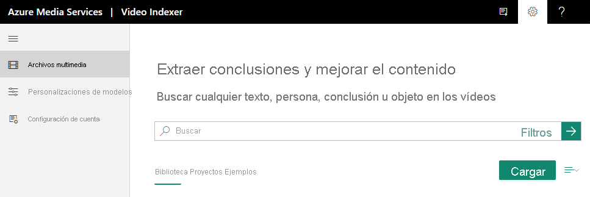

# Inicio rápido: Suscripción y carga del primer vídeo

En este tutorial introductorio se muestra cómo iniciar sesión en el sitio web de Video Indexer y cómo cargar su primer vídeo.

Al crear una cuenta de Video Indexer, puede elegir una cuenta de evaluación gratuita (donde obtendrá un número determinado de minutos gratuitos de indexación) o una opción de pago (donde no está limitado por la cuota). Con la versión de evaluación gratuita, Video Indexer proporciona hasta 600 horas de indexación gratuita a los usuarios de sitios web y hasta 2400 horas de indexación gratuita a los usuarios de API. Con la opción de pago, se crea una cuenta de Video Indexer que está [conectada a su suscripción de Azure y a una cuenta de Azure Media Services](connect-to-azure.md). Se paga por minutos de indexación y por los cargos relacionados con la cuenta de Azure Media Services. 

## Suscripción a Video Indexer

Para empezar a desarrollar con Video Indexer, vaya al sitio web de [Video Indexer](https://www.videoindexer.com) y suscríbase.

## Carga de un vídeo mediante el sitio web de Video Indexer

> [!NOTE]
> El nombre del vídeo no debe superar los 80 caracteres.

### Formatos de archivo admitidos para Video Indexer

Consulte la sección [Formatos de archivo/contenedor de entrada](../latest/media-encoder-standard-formats.md#input-containerfile-formats) para una lista de los formatos de archivo que puede usar con Video Indexer.

### Carga de un vídeo

1. Inicie sesión en el sitio web de [Video Indexer](https://www.videoindexer.ai/).
2. Para cargar un vídeo, presione el botón **Upload** (Cargar) o el vínculo.

    

    Una vez cargado el vídeo, Video Indexer inicia la indexación y el análisis del vídeo.

     

    Cuando Video Indexer ha terminado de analizar, recibirá una notificación con un vínculo a su vídeo y una breve descripción de lo que se ha encontrado en el vídeo. Por ejemplo: personas, temas u OCR.

## Pasos siguientes

Consulte [Carga e indexación de los vídeos](upload-index-videos.md) para más detalles.

Tras la carga e indexación de un vídeo, puede empezar a usar el [sitio web de Video Indexer](video-indexer-view-edit.md) o el [Portal para desarrolladores de Video Indexer](video-indexer-use-apis.md) para ver la información detallada de este. 

## Consulte también

[Introducción a Video Indexer](video-indexer-overview.md)

[Comience a usar las API](video-indexer-use-apis.md).

