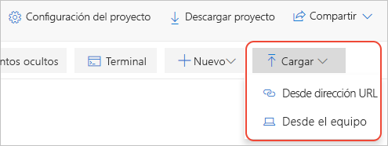

# Inicio rápido: Migración de un cuaderno de Jupyter Notebook local a Azure Notebooks (versión preliminar)

Solo usted puede acceder a los cuadernos de Jupyter Notebook que crea localmente en su propio equipo. Puede compartir los archivos de diferentes maneras, pero los destinatarios tendrán su propia copia local del cuaderno y le será difícil incorporar los cambios que estos realicen. También puede almacenar cuadernos en un repositorio compartido en línea como GitHub, pero para ello es necesario que cada colaborador tenga su propia instalación local de Jupyter con la misma configuración que la suya.

Al migrar los cuadernos basados en repositorio o locales a Azure Notebooks, estos se almacenarán en la nube y podrá compartirlos al instante con sus colaboradores. Los colaboradores solo necesitan un explorador para ver y ejecutar el cuaderno y, si [inician sesión](quickstart-sign-in-azure-notebooks.md) en Azure Notebooks, también podrán realizar cambios.

[!INCLUDE [notebooks-status](../../includes/notebooks-status.md)]

En este inicio rápido se muestra el proceso de migración de un bloc de notas desde su equipo local u otra dirección URL de archivo accesible. Para migrar los cuadernos desde un repositorio de GitHub, consulte [Inicio rápido: Clonación de un cuaderno](quickstart-clone-jupyter-notebook.md).

## Creación de un proyecto en Azure Notebooks

1. Vaya a [Azure Notebooks](https://notebooks.azure.com) e inicie sesión. (Para más información, consulte [Quickstart - Sign in to Azure Notebooks](quickstart-sign-in-azure-notebooks.md) [Inicio rápido: Inicio de sesión en Azure Notebooks]).

1. En la página del perfil público, seleccione **My Projects** (Mis proyectos) en la parte superior de la página:

    

1. En la página **My Projects** (Mis proyectos), seleccione **+New Project** (+Nuevo proyecto) [método abreviado de teclado: n]; el botón puede aparecer solo como **+** si la ventana del explorador es estrecha:

    

1. En la ventana emergente **Crear nuevo proyecto**, introduzca los valores adecuados para el cuaderno que va a migrar en los campos **Nombre del proyecto** e **Id. de proyecto**, desactive las opciones **Proyecto público** y **Crear un archivo README.md** y, después, seleccione **Crear**.

## Carga del cuaderno local

1. En la página del proyecto, seleccione **Cargar** (que puede aparecer como solo una flecha hacia arriba si la ventana del explorador es pequeña) y, después, seleccione 1. En la ventana emergente que aparece, seleccione **From computer** (Desde el equipo) si el cuaderno se encuentra en el sistema de archivos local, o **From URL** (Desde una URL) si su cuaderno está en línea:

    

   (De nuevo, si el cuaderno se encuentra en un repositorio de GitHub, siga los pasos de [Inicio rápido: Clonación de un cuaderno](quickstart-clone-jupyter-notebook.md).)

   - Si usa **From Computer** (Desde el equipo), arrastre y coloque los archivos *.ipynb* en la ventana emergente o seleccione **Elegir archivos** y, después, vaya a los archivos que quiere importar. A continuación, seleccione **Cargar**. Los archivos cargados tienen el mismo nombre que los archivos locales. (No es necesario cargar el contenido de ninguna carpeta *.ipynb_checkpoints*.)

     

   - Si usa **From URL** (Desde la URL), escriba la dirección de origen en el campo **Dirección URL del archivo** y el nombre de archivo que quiere asignar al cuaderno en el proyecto en el campo **Nombre de archivo**. A continuación, seleccione **Cargar**. Si tiene varios archivos con direcciones URL diferentes, use el comando **+ Agregar archivo** para comprobar la primera dirección URL que escribió, después de que la ventana emergente proporcione nuevos campos para otro archivo.

     

1. Abra y ejecute el cuaderno recién cargado para comprobar su contenido y la operación. Cuando haya terminado, seleccione **Archivo** > **Detener y cerrar** para cerrar el cuaderno.

1. Para compartir un vínculo en el cuaderno cargado, haga clic en el archivo del proyecto y seleccione **Copiar vínculo** (método abreviado de teclado: y) y, después, péguelo en el mensaje adecuado. Como alternativa, puede compartir el proyecto como un todo con el control **Compartir** en la página del proyecto.

1. Para editar los archivos que no sean cuadernos, haga clic con el botón derecho en el archivo del proyecto y seleccione **Editar archivo** (método abreviado de teclado: i). La acción predeterminada, **Ejecutar** (método abreviado de teclado: r), solo muestra el contenido del archivo y no permite la edición.

## Pasos siguientes

> [!div class="nextstepaction"]
> [Tutorial: create an run a Jupyter notebook to do linear regression](tutorial-create-run-jupyter-notebook.md) (Tutorial: Creación y ejecución de un cuaderno de Jupyter Notebook para hacer regresión lineal)
