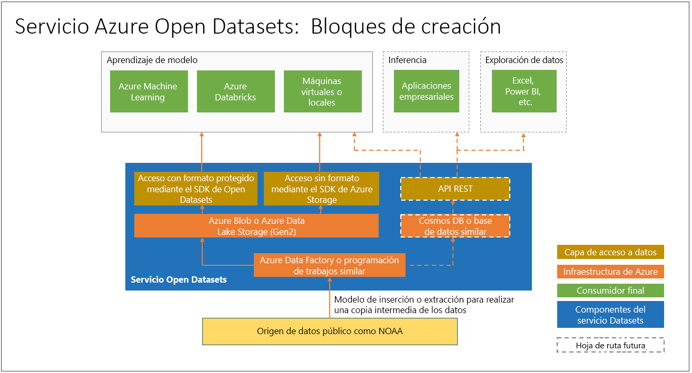

# ¿Qué es Azure Open Datasets y cómo puede usarse?

[Azure Open Datasets](https://azure.microsoft.com/services/open-datasets/) son conjuntos de datos públicos mantenidos que puede usar para agregar características de escenarios específicos a soluciones de aprendizaje automático a fin de obtener modelos más precisos. Open Datasets se encuentra en la nube de Microsoft Azure y está integrado en Azure Machine Learning y disponible de inmediato para Azure Databricks y Machine Learning Studio (clásico). También puede acceder a los conjuntos de datos a través de distintas API y usarlos en otros productos, como Power BI y Azure Data Factory.

Los conjuntos de datos incluyen datos de dominio público para el clima, censos, días festivos, seguridad pública y ubicación, que le ayudarán a entrenar los modelos de Machine Learning y enriquecer las soluciones predictivas. También puede compartir sus conjuntos de datos públicos en Azure Open Datasets. 

## Conjuntos de datos mantenidos, preparados
Los conjuntos de datos públicos abiertos seleccionados en Azure Open Datasets están optimizados para su uso en los flujos de trabajo de aprendizaje automático. 

En general, los científicos de datos dedican la mayor parte de su tiempo a la limpieza y preparación de los datos para análisis avanzados. Open Datasets se copia a la nube de Azure y se preprocesa para ahorrarle tiempo. A intervalos regulares, los datos se extraen de los orígenes, por ejemplo, mediante una conexión FTP a la Administración Nacional Oceánica y Atmosférica (NOAA). A continuación, los datos se analizan en un formato estructurado y, después, se enriquecen según corresponda con características como el código postal o la ubicación de la estación meteorológica más cercana.

Los conjuntos de datos se hospedan conjuntamente con los procesos en la nube en Azure, lo que facilita el acceso y la manipulación.  

A continuación, encontrará ejemplos de conjuntos de datos disponibles. 

### Datos meteorológicos
 
|Dataset         | Notebooks     | DESCRIPCIÓN                                    |
|----------------|---------------|------------------------------------------------|
|[Integrated Surface Data (ISD) de NOAA](https://azure.microsoft.com/services/open-datasets/catalog/noaa-integrated-surface-data/) | [Azure Notebooks](https://azure.microsoft.com/services/open-datasets/catalog/noaa-integrated-surface-data/?tab=data-access#AzureNotebooks)   [Azure Databricks](https://azure.microsoft.com/services/open-datasets/catalog/noaa-integrated-surface-data/?tab=data-access#AzureDatabricks) | Datos meteorológicos mundiales por hora de NOAA, con la mejor cobertura espacial en Norteamérica, Europa, Australia y partes de Asia. Actualización diaria. |
|[Global Forecast System (GFS) de NOAA](https://azure.microsoft.com/services/open-datasets/catalog/noaa-global-forecast-system/) | [Azure Notebooks](https://azure.microsoft.com/services/open-datasets/catalog/noaa-global-forecast-system/?tab=data-access#AzureNotebooks)   [Azure Databricks](https://azure.microsoft.com/services/open-datasets/catalog/noaa-global-forecast-system/?tab=data-access#AzureDatabricks) | Datos de previsión meteorológica por hora a 15 días de NOAA para Estados Unidos. Actualización diaria. |

### Datos de calendario

|Dataset         | Notebooks     | DESCRIPCIÓN                                    |
|----------------|---------------|------------------------------------------------|
|[Días festivos públicos](https://azure.microsoft.com/services/open-datasets/catalog/public-holidays/) | [Azure Notebooks](https://azure.microsoft.com/services/open-datasets/catalog/public-holidays/?tab=data-access#AzureNotebooks)   [Azure Databricks](https://azure.microsoft.com/services/open-datasets/catalog/public-holidays/?tab=data-access#AzureDatabricks) | Datos mundiales de días festivos públicos, que abarcan 41 países o regiones de 1970 a 2099. Incluye el país y si la mayoría de las personas cuentan con tiempo de permiso retribuido. |

## Acceso a los conjuntos de datos  
Con una cuenta de Azure, puede acceder a conjuntos de datos abiertos mediante un código o la interfaz de servicio de Azure. Los datos comparten ubicación con los recursos de proceso en la nube en Azure para su uso en una solución de aprendizaje automático.  

Open Datasets está disponible mediante la interfaz de usuario de Azure Machine Learning y el SDK. Open Datasets proporciona cuadernos de Azure Notebooks y Azure Databricks que puede usar para conectar los datos a Azure Machine Learning y Azure Databricks. También es posible acceder a los conjuntos de datos a través de un SDK de Python. 

Sin embargo, no necesita una cuenta de Azure para acceder a Open Datasets, ya que puede hacerlo desde cualquier entorno de Python, con o sin Spark.

## Solicitar o contribuir con conjuntos de datos

Si no encuentra los datos que quiere, envíenos un correo electrónico para [solicitar un conjunto de datos](mailto:aod@microsoft.com?Subject=Request%20dataset%3A%20%3Creplace%20with%20dataset%20name%3E&Body=%0AYour%20name%20and%20institution%3A%20%0A%0ADataset%20name%3A%0A%20%0ADataset%20description%3A%20%0A%3Cfill%20in%20a%20brief%20description%20and%20share%20any%20web%20links%20of%20the%20dataset%3E%20%0A%0ADataset%20size%3A%20%0A%3Chow%20much%20space%20does%20the%20dataset%20need%20today%20and%20how%20much%20is%20it%20expected%20to%20grow%20each%20year%3E%20%0A%0ADataset%20file%20formats%3A%20%0A%3Ccurrent%20dataset%20file%20formats%2C%20and%20optionally%2C%20any%20formats%20that%20the%20dataset%20must%20be%20transformed%20to%20for%20easy%20access%3E%0A%0ALicense%3A%20%0A%3Cwhat%20is%20the%20license%20or%20terms%20and%20conditions%20governing%20the%20distribution%20of%20this%20dataset%3E%0A%0AUse%20cases%3A%20%0A%3CExplain%20some%20common%20use%20of%20the%20dataset.%20E.g.%20weather%20dataset%20can%20be%20useful%20in%20demand%20forecasting%20and%20predictive%20maintenance%20scenarios%3E%20%0A%0AAny%20additional%20information%20you%20want%20us%20to%20know%3A%0A) o [contribuir con un conjunto de datos](mailto:aod@microsoft.com?Subject=Contribute%20dataset%3A%20%3Creplace%20with%20dataset%20name%3E&Body=%0AYour%20name%20and%20institution%3A%20%0A%0ADataset%20name%3A%0A%20%0ADataset%20description%3A%20%0A%3Cfill%20in%20a%20brief%20description%20and%20share%20any%20web%20links%20of%20the%20dataset%3E%20%0A%0ADataset%20size%3A%20%0A%3Chow%20much%20space%20does%20the%20dataset%20need%20today%20and%20how%20much%20is%20it%20expected%20to%20grow%20each%20year%3E%20%0A%0ADataset%20file%20formats%3A%20%0A%3Ccurrent%20dataset%20file%20formats%2C%20and%20optionally%2C%20any%20formats%20that%20the%20dataset%20must%20be%20transformed%20to%20for%20easy%20access%3E%0A%0ALicense%3A%20%0A%3Cwhat%20is%20the%20license%20or%20terms%20and%20conditions%20governing%20the%20distribution%20of%20this%20dataset%3E%0A%0AUse%20cases%3A%20%0A%3CExplain%20some%20common%20use%20of%20the%20dataset.%20E.g.%20weather%20dataset%20can%20be%20useful%20in%20demand%20forecasting%20and%20predictive%20maintenance%20scenarios%3E%20%0A%0AAny%20additional%20information%20you%20want%20us%20to%20know%3A%0A). 

## Pasos siguientes
* [Cuaderno de ejemplo](samples.md)
* [Tutorial: Regression modeling with NY taxi data](/azure/machine-learning/service/tutorial-auto-train-models?context=azure/open-datasets/context/open-datasets-context) (Tutorial: Modelado de regresión con datos de taxis de Nueva York)
* [SDK de Python para Open Datasets](/python/api/azureml-opendatasets/?view=azure-ml-py)
