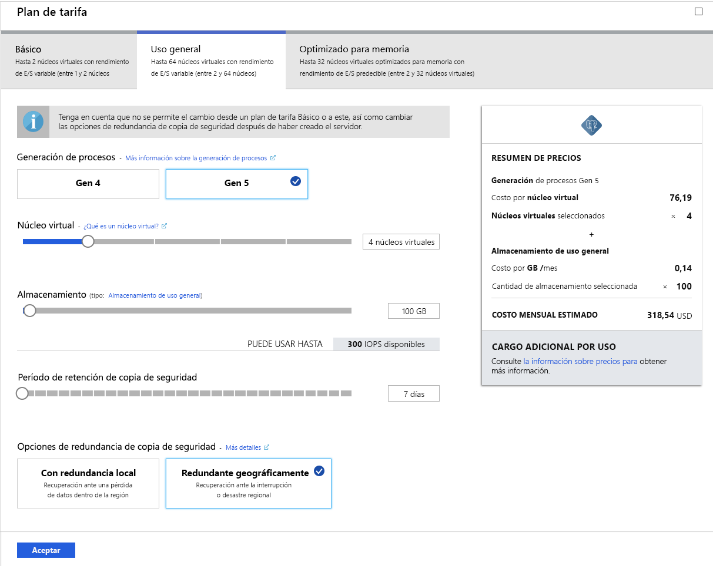
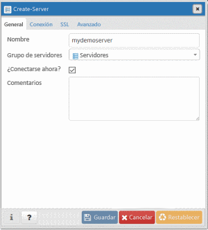
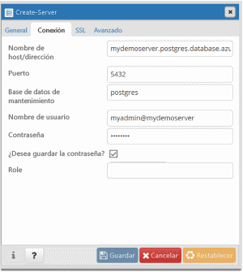
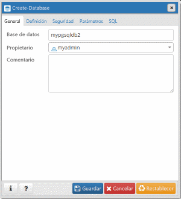

# <a name="quickstart-create-an-azure-database-for-postgresql-server-in-the-azure-portal"></a>Inicio rápido: Creación de un servidor de Azure Database for PostgreSQL en Azure Portal

Azure Database for PostgreSQL es un servicio administrado que usa para ejecutar, administrar y escalar bases de datos de PostgreSQL de alta disponibilidad en la nube. Esta guía de inicio rápido muestra cómo crear un servidor de Azure Database for PostgreSQL en unos cinco minutos en Azure Portal.

Si no tiene una suscripción a Azure, cree una [cuenta gratuita de Azure](https://azure.microsoft.com/free/) antes de empezar.

## <a name="sign-in-to-the-azure-portal"></a>Inicio de sesión en Azure Portal
Abra el explorador web y vaya al [portal](https://portal.azure.com/). Introduzca sus credenciales para iniciar sesión en el portal. La vista predeterminada es el panel del servicio.

## <a name="create-an-azure-database-for-postgresql-server"></a>Creación de un servidor de Azure Database for PostgreSQL

Un servidor de Azure Database for PostgreSQL se crea con un conjunto configurado de [recursos de proceso y almacenamiento](./concepts-pricing-tiers.md). El servidor se crea dentro de un [grupo de recursos de Azure](../azure-resource-manager/management/overview.md).

Para crear un servidor de Azure Database for PostgreSQL, siga los pasos siguientes:
1. En la esquina superior izquierda del portal, seleccione **Crear un recurso** (+).

2. Seleccione **Bases de datos** > **Azure Database for PostgreSQL**.

    

3. Seleccione la opción de implementación de **servidor único**.

   

4. Complete el formulario de **aspectos básicos** con la información siguiente:

    

    Configuración|Valor sugerido|Descripción
    ---|---|---
    Subscription|Nombre de la suscripción|La suscripción de Azure que desea usar para el servidor. Si tiene varias suscripciones, elija aquella en la que se factura el recurso.
    Resource group|*myresourcegroup*| Un nuevo nombre de grupo de recursos o uno existente de la suscripción.
    Nombre de servidor |*mydemoserver*|Un nombre único que identifique al servidor de Azure Database for PostgreSQL. El nombre de dominio *postgres.database.azure.com* se anexa al nombre del servidor proporcionado. El servidor solo puede contener letras minúsculas, números y el carácter de guion (-). Debe contener al menos entre tres y 63 caracteres.
    Origen de datos | *None* | Seleccione *None* para crear un servidor desde cero. (Seleccione *Copia de seguridad* si va a crear un servidor a partir de una copia de seguridad con redundancia geográfica de un servidor existente de Azure Database for PostgreSQL).
    Nombre de usuario administrador |*myadmin*| Su propia cuenta de inicio de sesión para usarla al conectarse al servidor. El nombre de inicio de sesión del administrador no puede ser **azure_superuser,** **azure_pg_admin,** **admin,** **administrator,** **root,** **guest,** ni **public**. No puede empezar por **pg_** .
    Contraseña |La contraseña| Una contraseña nueva para la cuenta de administrador del servidor. Debe tener entre 8 y 128 caracteres. La contraseña debe contener caracteres de tres de las siguientes categorías: Letras del alfabeto inglés mayúsculas y minúsculas, números (0 a 9) y caracteres no alfanuméricos (!, $, #, %, etc.).
    Location|Región más cercana a los usuarios| La ubicación más cercana a los usuarios.
    Versión|La versión principal más reciente| La versión principal más reciente de PostgreSQL, a menos que tenga requisitos específicos.
    Proceso y almacenamiento | **Uso general**, **Gen 5**, **2 núcleos virtuales**, **5 GB**, **7 días**, **Redundancia geográfica** | Configuración de los recursos de proceso, almacenamiento y copia de seguridad para el nuevo servidor. Seleccione **Configurar servidor**. A continuación, seleccione la pestaña **Uso general**. *Gen 5*, *4 núcleos virtuales*, *100 GB* y *7 días* son los valores predeterminados de **Generación de procesos**, **Núcleos virtuales**, **Almacenamiento** y **Período de retención de copia de seguridad**. Puede dejar esos controles deslizantes tal como están o ajustarlos. Para habilitar las copias de seguridad del servidor en el almacenamiento con redundancia geográfica, seleccione **Redundancia geográfica** en **Opciones de redundancia de copia de seguridad**. Para guardar el plan de tarifa elegido, seleccione **Aceptar**. La captura de pantalla siguiente muestra estas opciones seleccionadas.

   > [!NOTE]
   > Considere la posibilidad de usar el plan de tarifa Básico si menos proceso y E/S resultan adecuados para su carga de trabajo. Tenga en cuenta que los servidores que creó en el plan de tarifa Básico no se podrán escalar más adelante a De uso general u Optimizada para memoria. Consulte la [página de precios](https://azure.microsoft.com/pricing/details/postgresql/) para más información.
   > 

    

5. Seleccione **Review + create** (Revisar y crear) para revisar las selecciones. Seleccione **Crear** para realizar el aprovisionamiento del servidor. Esta operación puede tardar algunos minutos.

6. En la barra de herramientas, seleccione el símbolo de **Notificaciones** (una campana) para supervisar el proceso de implementación. Una vez realizada la implementación, puede seleccionar **Anclar al panel** para crear un icono para este servidor en el panel de Azure Portal como un acceso directo a la página **Información general** del servidor. Al seleccionar **Ir al recurso**, se abre la página **Información general** del servidor.

    
   
   De forma predeterminada, una base de datos de **postgres** se crea en el servidor. La base de datos de [postgres](https://www.postgresql.org/docs/9.6/static/app-initdb.html) es una base de datos predeterminada pensada para que la usen los usuarios, las utilidades y aplicaciones de otros fabricantes. (La otra base de datos predeterminada es **azure_maintenance**. Su función consiste en separar los procesos de servicio administrados de las acciones del usuario. No se puede acceder esta base de datos).

## <a name="configure-a-server-level-firewall-rule"></a>Configuración de una regla de firewall de nivel de servidor

Azure Database for PostgreSQL crea un firewall en el nivel de servidor. Evita que herramientas y aplicaciones externas se conecten al servidor o a las bases de datos de este, a menos que cree una regla para abrir el firewall para direcciones IP concretas. 

1. Cuando finalice la implementación, busque el servidor. Si es necesario, puede buscarlo. Por ejemplo, en el menú de la izquierda, seleccione **Todos los recursos**. Escriba el nombre del servidor, en nuestro ejemplo, **mydemoserver**, para buscar el servidor recién creado. Seleccione el nombre del servidor en la lista de resultados de la búsqueda. Se abrirá la página **Introducción** del servidor, que proporciona opciones para continuar la configuración.
 
    

2. En la página del servidor, seleccione **Seguridad de la conexión**.

3. En **Reglas de firewall**, en la columna **Nombre de regla**, seleccione el cuadro de texto en blanco para empezar a crear la regla de firewall. 

   Rellene los cuadros de texto con un nombre y el intervalo IP inicial y final de los clientes que accederán al servidor. Si se trata de una sola dirección IP, use el mismo valor para la dirección IP inicial y la dirección IP final.

   
     

4. En la barra de herramientas superior de la página **Seguridad de la conexión**, seleccione **Guardar**. Antes de continuar espere hasta que aparezca la notificación que indica que la actualización de seguridad de la conexión ha finalizado correctamente.

    > [!NOTE]
    > Las conexiones al servidor de Azure Database for PostgreSQL se comunican a través de puerto 5432. Si intenta conectarse desde una red corporativa, es posible que el firewall de la red no permita el tráfico saliente a través del puerto 5432. En ese caso no podrá conectarse al servidor, salvo que el departamento de TI abra el puerto 5432.
    >

## <a name="get-the-connection-information"></a>Obtención de la información de conexión

Al crear el servidor de Azure Database for PostgreSQL, también se crea la base de datos predeterminada denominada **postgres**. Para conectarse al servidor de base de datos, necesita las credenciales de inicio de sesión de administrador y el nombre de servidor completo. Es posible que anotara dichos valores en el artículo de la guía de inicio rápido. En caso de que no lo hiciera, encontrará fácilmente el nombre del servidor y la información de inicio de sesión en la página **Información general** del servidor en el portal.

Abra la página **Información general** del servidor. Tome nota del **Nombre del servidor** y del **Nombre de inicio de sesión del administrador del servidor**. Desplace el cursor sobre cada campo y el símbolo de copiar aparecerá a la derecha del texto. Seleccione el símbolo de copiar según sea necesario para copiar los valores.

 

## <a name="connect-to-the-postgresql-database-using-psql"></a>Conexión a la base de datos de PostgreSQL mediante psql

Hay una serie de aplicaciones que se pueden usar para conectarse al servidor de Azure Database for PostgreSQL. Si el equipo cliente tiene PostgreSQL instalado, puede usar una instancia local de [psql](https://www.postgresql.org/docs/current/static/app-psql.html) para conectarse a un servidor Azure PostgreSQL. Ahora vamos a usar la utilidad de línea de comandos psql para conectarnos al servidor Azure PostgreSQL.

1. Ejecute el comando psql siguiente para conectarse a un servidor de Azure Database for PostgreSQL
   ```bash
   psql --host=<servername> --port=<port> --username=<user@servername> --dbname=<dbname>
   ```

   Por ejemplo, el siguiente comando se conecta a la base de datos predeterminada llamada **postgres** en el servidor PostgreSQL **mydemoserver.postgres.database.azure.com** con las credenciales de acceso. Escriba el valor de `<server_admin_password>` que eligió cuando se le solicitó una contraseña.
  
   ```bash
   psql --host=mydemoserver.postgres.database.azure.com --port=5432 --username=myadmin@mydemoserver --dbname=postgres
   ```

   > [!TIP]
   > Si prefiere usar una ruta URL para conectarse a Postgres, codifique la URL con el signo @ en el nombre de usuario con `%40`. Por ejemplo, la cadena de conexión de psql sería: 
   > ```
   > psql postgresql://myadmin%40mydemoserver@mydemoserver.postgres.database.azure.com:5432/postgres
   > ```

   Tras conectarse, la utilidad psql muestra un símbolo del sistema de postgres donde escribir comandos sql. En la salida de la conexión inicial, puede aparecer una advertencia, ya que la versión de psql que usa puede diferir de la versión del servidor de Azure Database for PostgreSQL. 

   Ejemplo de salida de psql:
   ```bash
   psql (9.5.7, server 9.6.2)
   WARNING: psql major version 9.5, server major version 9.6.
    Some psql features might not work.
    SSL connection (protocol: TLSv1.2, cipher: ECDHE-RSA-AES256-SHA384, bits: 256, compression: off)
   Type "help" for help.

   postgres=> 
   ```

   > [!TIP]
   > Si el firewall no está configurado para permitir la dirección IP de su cliente, se produce el siguiente error:
   > 
   > "psql: FATAL:  no pg_hba.conf entry for host `<IP address>`, user "myadmin", database "postgres", SSL on FATAL: SSL connection is required. Specify SSL options and retry.
   > 
   > Confirme que la IP de su cliente se permite en el paso anterior de las reglas de firewall.

2. Escriba el comando siguiente para crear una base de datos en blanco llamada "mypgsqldb" en el símbolo del sistema:
    ```bash
    CREATE DATABASE mypgsqldb;
    ```

3. En el símbolo del sistema, ejecute el siguiente comando para cambiar las conexiones a la base de datos **mypgsqldb** recién creada:
    ```bash
    \c mypgsqldb
    ```

4. Escriba `\q` y presione la tecla Entrar para salir de psql. 

Ya está conectado al servidor de Azure Database for PostgreSQL a través de psql y ha creado una base de datos de usuarios en blanco. Pase a la sección siguiente para la conexión con otra herramienta común, pgAdmin.

## <a name="connect-to-the-postgresql-server-using-pgadmin"></a>Conexión al servidor de PostgreSQL mediante pgAdmin

pgAdmin es una herramienta de código abierto que se usa con PostgreSQL. Puede instalar pgAdmin desde el [sitio web de pgAdmin](https://www.pgadmin.org/). La versión de pgAdmin que use podría ser diferente de la que se usa en esta guía de inicio rápido. Lea la documentación de pgAdmin si necesita instrucciones adicionales.

1. Abra la aplicación pgAdmin en el equipo cliente.

2. En la barra de herramientas, vaya a **Object** (Objeto), mantenga el mouse sobre **Create** (Crear) y seleccione **Server** (Servidor).

3. En el cuadro de diálogo **Create - Server** (Crear: servidor) de la pestaña **General**, escriba un nombre descriptivo único para el servidor, como **mydemoserver**.

    

4. En la pestaña **Connection** (Conexión) del cuadro de diálogo **Create - Server** (Crear: servidor), rellene la tabla de configuración.

   

    parámetro pgAdmin |Value|Descripción
    ---|---|---
    Host name/address | Nombre de servidor | El valor de nombre de servidor que usó al crear el servidor de Azure Database for MySQL. El servidor de ejemplo es **mydemoserver.postgres.database.azure.com.** Use el nombre de dominio completo ( **\*.postgres.database.azure.com**) tal como se muestra en el ejemplo. Si no recuerda el nombre del servidor, siga los pasos de la sección anterior para obtener la información de conexión. 
    Port | 5432 | El puerto se usará al conectarse al servidor de Azure Database for PostgreSQL. 
    Maintenance Database | *postgres* | Nombre de la base de datos predeterminada que crea el sistema.
    Nombre de usuario | Nombre de inicio de sesión del administrador del servidor | El nombre de usuario de inicio de sesión del administrador del servidor que suministró al crear el servidor de Azure Database for PostgreSQL. Si no recuerda el nombre de usuario, siga los pasos de la sección anterior para obtener la información de conexión. El formato es *nombre de usuario\@nombre de servidor*.
    Contraseña | Contraseña del administrador | La contraseña que eligió al crear el servidor antes en esta guía de inicio rápido.
    Role | Déjelo en blanco | No es necesario proporcionar un nombre de rol en este momento. Deje el campo en blanco.
    SSL Mode | *Require* | Puede establecer el modo SSL en la pestaña SSL de pgAdmin. De forma predeterminada, todos los servidores de Azure Database for PostgreSQL se crean de modo que se exija SSL. Para desactivar la obligación de SSL, consulte la sección sobre la [aplicación de SSL](./concepts-ssl-connection-security.md).
    
5. Seleccione **Guardar**.

6. En el panel izquierdo del **explorador**, expanda el nodo **Servidores**. Seleccione el servidor, en nuestro ejemplo **mydemoserver**, para conectarse a él.

7. Expanda el nodo de servidor y **Bases de datos**. La lista debe incluir las bases de datos *postgres* existentes y otras bases de datos que haya creado. Con Azure Database for PostgreSQL puede crear varias bases de datos por servidor.

8. Haga clic con el botón derecho en **Bases de datos**, seleccione el menú **Crear** y, luego, seleccione **Base de datos**.

9. Escriba el nombre de base de datos que quiera en el campo **Base de datos**, por ejemplo, **mypgsqldb2**.

10. Seleccione el **propietario** de la base de datos en el cuadro de lista. Seleccione el nombre de inicio de sesión del administrador del servidor, en nuestro ejemplo, **my admin**.

    

11. Seleccione **Guardar** para crear una base de datos vacía.

12. En el panel del **explorador**, puede ver la base de datos que ha creado en la lista de bases de datos, debajo del nombre del servidor.


## <a name="clean-up-resources"></a>Limpieza de recursos
Hay dos formas de eliminar los recursos que ha creado en la guía de inicio rápido. Puede eliminar el [grupo de recursos de Azure](../azure-resource-manager/management/overview.md), lo que incluye todos los recursos del grupo de recursos. Si desea mantener intactos los restantes recursos, elimine solo el recurso del servidor.

> [!TIP]
> Otras guías de inicio rápido de esta colección se basan en esta. Si tiene previsto seguir usando otras guías de inicio rápido, no elimine los recursos que ha creado en esta. Si no tiene previsto continuar, siga estos pasos para eliminar los recursos creados en esta guía de inicio rápido en el portal.

Para eliminar todo el grupo de recursos, incluido el servidor recién creado:
1. Elimine el grupo de recursos en el portal. En el menú de la izquierda, seleccione **Grupos de recursos**. A continuación, seleccione el nombre de su grupo de recursos (en el ejemplo, **myresourcegroup**).

2. En la página del grupo de recursos, seleccione **Eliminar**. Escriba el nombre del grupo de recursos, en nuestro ejemplo **myresourcegroup**, en el cuadro de texto para confirmar la eliminación. Seleccione **Eliminar**.

Para eliminar solo el servidor recién creado:
1. Busque el servidor en el portal si no lo tiene abierto. En el menú de la izquierda, seleccione **Todos los recursos**. Luego busque el servidor que ha creado.

2. En la página **Información general**, seleccione **Eliminar**.

    

3. Confirme el nombre del servidor que desea eliminar y vea las bases de datos que incluye y que resultan afectadas. Escriba el nombre del servidor en el cuadro de texto, como el del ejemplo, **mydemoserver**. Seleccione **Eliminar**.

## <a name="next-steps"></a>Pasos siguientes
> [!div class="nextstepaction"]
> [Migración de una base de datos mediante exportación e importación](./howto-migrate-using-export-and-import.md)
