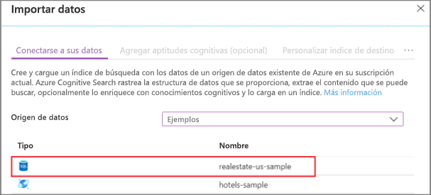
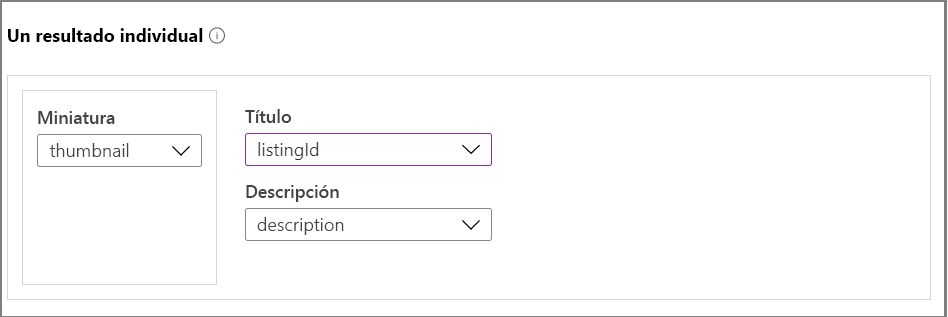
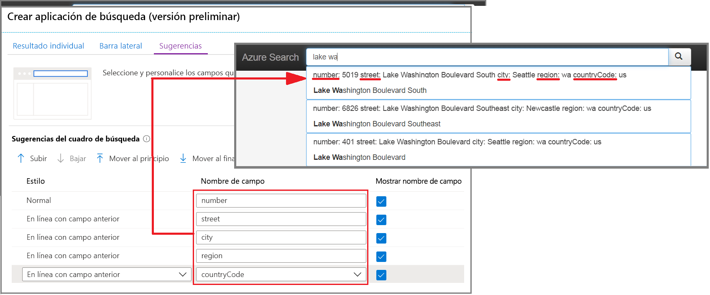
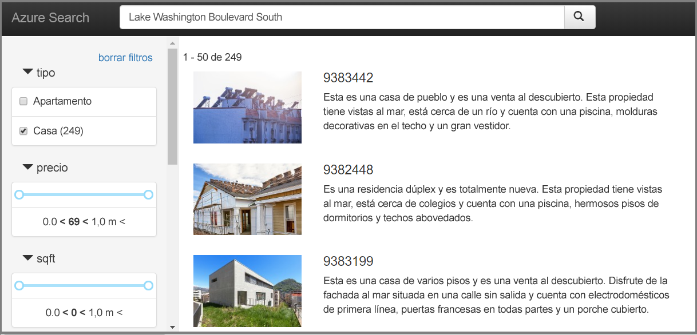

# Inicio rápido: Creación de una aplicación de búsqueda en el portal (Azure Cognitive Search)

Use el Asistente para **crear aplicaciones de búsqueda** del portal para generar una aplicación web de estilo "localhost" que se puede descargar y que se ejecuta en un explorador. Según su configuración, la aplicación generada está operativa desde el primer uso y tiene una conexión dinámica a un índice remoto. Una aplicación predeterminada puede incluir una barra de búsqueda, un área de resultados, filtros en la barra lateral y compatibilidad con la escritura anticipada.

Si no tiene una suscripción a Azure, cree una [cuenta gratuita](https://azure.microsoft.com/free/?WT.mc_id=A261C142F) antes de empezar. 

## Prerrequisitos

En este momento, querrá actualizar a la [versión más reciente de Microsoft Edge](https://www.microsoft.com/edge) o usar el explorador Chrome de Google para este inicio rápido.

[Cree un servicio Azure Cognitive Search](search-create-service-portal.md) o [busque uno existente](https://ms.portal.azure.com/#blade/HubsExtension/BrowseResourceBlade/resourceType/Microsoft.Search%2FsearchServices) en su suscripción actual. Puede usar un servicio gratuito para este inicio rápido. 

[Cree un índice](search-create-index-portal.md) para usarlo como base de la aplicación. 

En este inicio rápido se usan el índice y los datos de ejemplo integrados de una inmobiliaria porque tienen imágenes en miniatura. Para crear el índice que se usa en este ejercicio, ejecute el Asistente para la **importación de datos** y elija el origen de datos *realestate-us-sample*.

Cuando el índice esté listo para usarse, continúe con el paso siguiente.

## Inicio del asistente

1. Inicie sesión en [Azure Portal](https://portal.azure.com) y [busque su servicio de búsqueda](https://ms.portal.azure.com/#blade/HubsExtension/BrowseResourceBlade/resourceType/Microsoft.Search%2FsearchServices).

1. En la página Información general, en los vínculos de la parte central de la página, seleccione **Índices**. 

1. Elija *realestate-us-sample-index* en la lista de índices existentes.

1. En la página de índice, en la parte superior, seleccione **Crear aplicación de búsqueda (versión preliminar)** para iniciar el asistente.

1. En la primera página del asistente, seleccione **Enable Cross Origin Resource Sharing (CORS) (Habilitar el uso compartido de recursos de entre orígenes [CORS])** para agregar compatibilidad con CORS a la definición del índice. Este paso es opcional, pero la aplicación web local no se conectará al índice remoto sin él.

## Configuración de los resultados de la búsqueda

El asistente proporciona un diseño básico para los resultados de búsqueda representados que incluye espacio para una imagen en miniatura, un título y una descripción. El respaldo de estos elementos es un campo del índice que proporciona los datos. 

1. En Miniatura, elija el campo *miniatura* del índice *realestate-us-sample*. Casualmente, este ejemplo incluye miniaturas en forma de imágenes con direcciones URL almacenadas en un campo llamado *miniatura*. Si el índice no tiene imágenes, deje este campo en blanco.

1. En Título, elija un campo que transmita la unicidad de cada documento. En este ejemplo, el identificador del listado es una selección razonable.

1. En Descripción, elija un campo que proporcione detalles que puedan ayudar al usuario a decidir si hace clic para ir a ese documento concreto.

## Incorporación de una barra lateral

El servicio de búsqueda admite la navegación por facetas, que a menudo se representa en forma de barra lateral. Las facetas se basan en campos en los que pueden aplicar filtros y facetas, como se expresa en el esquema del índice.

En Azure Cognitive Search, la navegación por facetas es una experiencia de filtrado acumulativo. En cualquiera de las categorías, la selección de varios filtros expande los resultados (por ejemplo, la selección de Seattle y Bellevue en City [Ciudad]). Si se seleccionan varios filtros en más de una categoría, se estrechan los resultados.

> [!TIP]
> En el portal puede ver el esquema de índice completo. Busque el vínculo **Definición de índice (JSON)** en la página de información general de cada índice. Los campos aptos para la navegación por facetas tienen los atributos "filterable: true" y "facetable: true".

Acepte la selección actual de facetas y diríjase a la página siguiente.

## Incorporación de escritura anticipada

La funcionalidad de escritura anticipada está disponible en forma de la acción de autocompletar y las sugerencias de consulta. El asistente admite sugerencias de consulta. En función de las entradas desde teclado que realiza el usuario, el servicio de búsqueda devuelve una lista de cadenas de consulta "completadas" que se pueden seleccionar como entrada.

Se habilitan sugerencias en las definiciones de campos concretos. El asistente proporciona opciones para configurar la cantidad de información que se incluye en cada sugerencia. 

En la siguiente captura de pantalla, se muestran las opciones del asistente, junto con una página de la aplicación. No solo puede ver cómo se usan las selecciones de campo, sino también cómo se usa "Mostrar nombre de campo" para incluir o excluir etiquetas en la sugerencia.

## Creación, descarga y ejecución

1. Seleccione **Crear aplicación de búsqueda** para generar el archivo HTML.

1. Cuando se le solicite, seleccione **Download your app** (Descargar aplicación) para descargar el archivo.

1. Abra el archivo. Debería ver una página similar a la que aparece en la siguiente captura de pantalla. Escriba un término y use los filtros para restringir los resultados. 

El índice subyacente se compone de datos ficticios generados que se han duplicado en los documentos y, en algunas ocasiones, las descripciones no coinciden con la imagen. Si crea una aplicación con sus propios índices el resultado será más coherente.

## Limpieza de recursos

Cuando trabaje con su propia suscripción, es una buena idea al final de un proyecto identificar si todavía se necesitan los recursos que ha creado. Los recursos que se dejan en ejecución pueden costarle mucho dinero. Puede eliminar los recursos de forma individual o eliminar el grupo de recursos para eliminar todo el conjunto de recursos.

Puede encontrar y administrar recursos en el portal, mediante el vínculo **Todos los recursos** o **Grupos de recursos** en el panel de navegación izquierdo.

Si está usando un servicio gratuito, recuerde que está limitado a tres índices, indexadores y orígenes de datos. Puede eliminar elementos individuales en el portal para mantenerse por debajo del límite. 

## Pasos siguientes

Aunque la aplicación predeterminada es útil para la exploración inicial y para tareas pequeñas, la revisión temprana de las API le ayudará a comprender los conceptos y el flujo de trabajo a un nivel más profundo:

> [!div class="nextstepaction"]
> [Creación de un índice con el SDK de .NET](https://docs.microsoft.com/azure/search/search-create-index-dotnet)