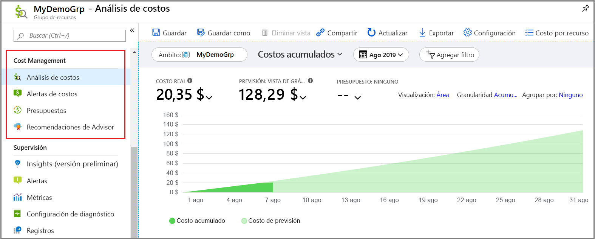
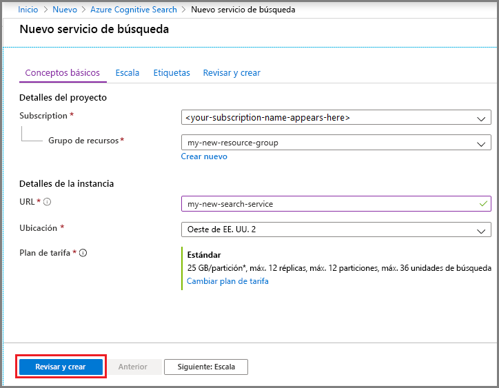
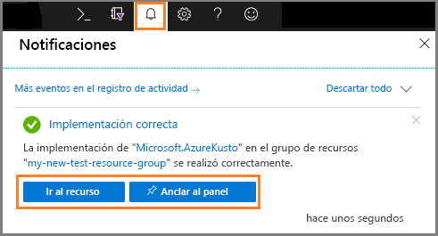
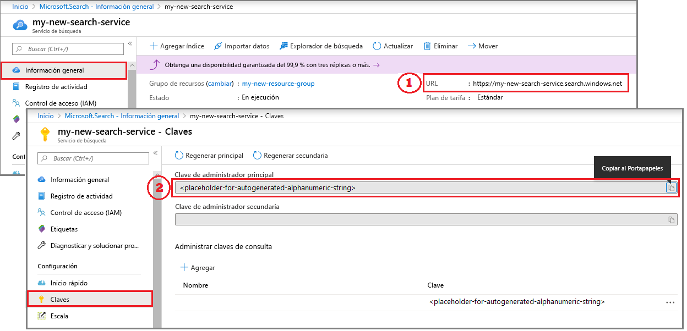
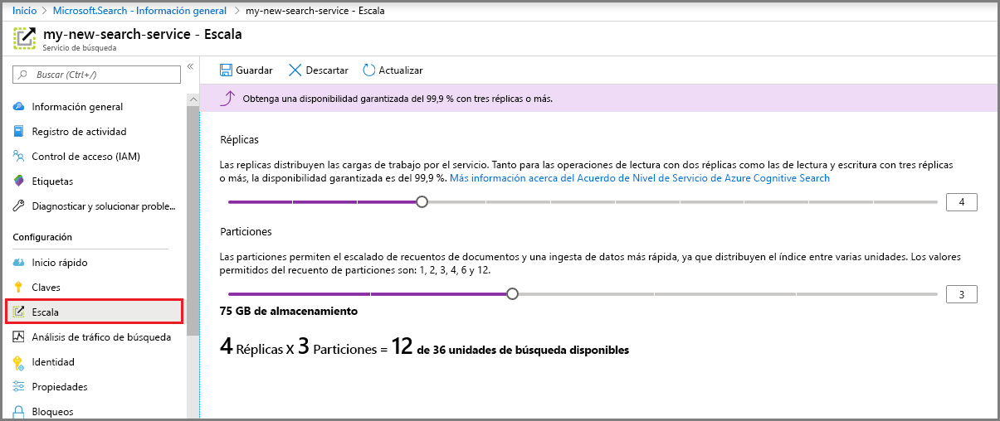

# Creación de un servicio Azure Search en el portal

Azure Search es un recurso independiente que se usa para agregar una experiencia de búsqueda a las aplicaciones personalizadas. Aunque Azure Search se integra fácilmente con otros servicios de Azure, también puede usarlo como un componente independiente o integrarlo con aplicaciones de servidores de red o con software que se ejecuta en otras plataformas en la nube.

En este artículo, aprenderá a crear un recurso de Azure Search en [Azure Portal](https://portal.azure.com/).

¿Prefiere PowerShell? Use la [plantilla de servicio](https://azure.microsoft.com/resources/templates/101-azure-search-create/) de Azure Resource Manager. Para obtener ayuda para empezar, consulte [Administración de Azure Search con PowerShell](search-manage-powershell.md).

## Suscripción (gratuita o de pago)

[Abra una cuenta gratuita de Azure ](https://azure.microsoft.com/pricing/free-trial/?WT.mc_id=A261C142F) y use créditos gratuitos para probar servicios de pago de Azure. Cuando se consuman los créditos, mantenga la cuenta y siga usando servicios de Azure gratuitos, como Websites. No se le realizará ningún cargo en su tarjeta de crédito a menos que cambie explícitamente la configuración y lo solicite.

Como alternativa, [active las ventajas de suscriptor de MSDN](https://azure.microsoft.com/pricing/member-offers/msdn-benefits-details/?WT.mc_id=A261C142F). Una suscripción a MSDN le proporciona créditos todos los meses que puede usar para servicios de Azure de pago. 

## Búsqueda de Azure Search

1. Inicie sesión en el [Azure Portal](https://portal.azure.com/).
2. Haga clic en el signo más ("+ Crear recurso") en la esquina superior izquierda.
3. Use la barra de búsqueda para buscar "Azure Search" o vaya al recurso a través de **Web** > **Azure Search**.

## Selección de una suscripción

Si tiene más de una suscripción, elija una que también tenga servicios de almacenamiento de datos o archivos. Azure Search puede detectar automáticamente Azure Table y Blob Storage, SQL Database y Azure Cosmos DB para indexarlos mediante [*indexadores*](search-indexer-overview.md), pero solo para servicios de la misma suscripción.

## Configuración de un grupo de recursos

Se necesita un grupo de recursos y es útil para administrar todos los aspectos de los recursos, incluidos los costos. Un grupo de recursos puede estar formado por un servicio, o bien por varios servicios que se usen de forma conjunta. Por ejemplo, si usa Azure Search para indexar una base de datos de Azure Cosmos DB, puede agregar ambos servicios a un mismo grupo de recursos con fines de administración. 

Si no combina recursos en un solo grupo o si los grupos de recursos existentes se rellenan con los recursos usados en soluciones no relacionadas, cree un grupo de recursos solo para su recurso de Azure Search. 

Cuando use el servicio, puede realizar un seguimiento de todos los costos actuales y previstos (como se muestra en la captura de pantalla), o bien puede desplazarse para ver los cargos de los recursos individuales.

> [!TIP]
> Al eliminar un grupo de recursos también se eliminan los servicios que contiene. En el caso de proyectos de prototipo que usan muchos servicios, si se ponen todos ellos en el mismo grupo de recursos, la limpieza resulta más fácil después de que el proyecto ha finalizado.

## Asignación de un nombre al servicio

En Detalles de la instancia, proporcione un nombre de servicio en el campo **URL**. Un nombre de servicio forma parte del punto de conexión de la dirección URL con que se emiten llamadas API: `https://your-service-name.search.windows.net`. Por ejemplo, si quiere que el punto de conexión sea `https://myservice.search.windows.net`, debe escribir `myservice`.

Requisitos de nombre de servicio:

* Debe ser único dentro del espacio de nombres search.windows.net.
* Entre 2 y 60 caracteres de longitud.
* Deben usarse letras minúsculas, números o guiones ("-").
* No deben usarse guiones ("-") en los dos primeros caracteres ni en el último carácter.
* No deben usarse guiones consecutivos ("--").

> [!TIP]
> Si piensa que va a usar varios servicios, le recomendamos que incluya la región (o ubicación) en el nombre del servicio como una convención de nomenclatura. Los servicios dentro de la misma región pueden intercambiar datos sin costo alguno; por lo tanto, si Azure Search se encuentra en la región Oeste de EE. UU. y tiene otros servicios en esta misma región, si usa un nombre como `mysearchservice-westus`, ya no tendrá que ir a la página de propiedades al decidir cómo combinar o conectar recursos.

## Selección de una ubicación

En cuanto servicio de Azure, Azure Search se puede hospedar en centros de datos de todo el mundo. Se puede encontrar la lista de regiones admitidas en la [página de precios](https://azure.microsoft.com/pricing/details/search/). 

Para minimizar o evitar los cargos por uso de ancho de banda, seleccione la misma ubicación para varios servicios. Por ejemplo, si indexa datos proporcionados por otro servicio de Azure (Azure Storage, Azure Cosmos DB, Azure SQL Database), al crear el servicio Azure Search en la misma región, evitará los cargos por uso de ancho de banda (no se producen cargos por datos de salida cuando los servicios se encuentran en la misma región).

Además, si usa los enriquecimientos de IA de búsqueda cognitiva, cree el servicio en la misma región que el recurso de Cognitive Services. *La coubicación de Azure Search y Cognitive Services en la misma región es un requisito para el enriquecimiento de la inteligencia artificial*.

> [!Note]
> Los nuevos servicios no están disponibles actualmente en India central. En el caso de los servicios que ya están en India central, puede escalar verticalmente sin restricciones, y el servicio se admite completamente en dicha región. La restricción en esta región es temporal y se limita solo a los nuevos servicios. Se eliminará esta nota cuando ya no se aplique la restricción.

## Selección de un plan de tarifa (SKU)

[Azure Search se ofrece actualmente en varios planes de tarifa](https://azure.microsoft.com/pricing/details/search/): Gratis, Básico o Estándar. Cada plan tiene su propia [capacidad y sus propios límites](search-limits-quotas-capacity.md). Consulte [Selección SKU o plan de tarifa](search-sku-tier.md) para obtener instrucciones.

Básico y Estándar son las opciones más comunes para las cargas de trabajo de producción, pero la mayoría de los clientes empiezan con el servicio gratuito. Las diferencias principales entre los niveles son el tamaño y la velocidad de las particiones, así como los límites en el número de objetos que se pueden crear.

Recuerde que, después de crear el servicio, el plan de tarifa no se puede cambiar. Si necesita un plan superior o inferior más adelante, deberá volver a crear el servicio.

## Creación del servicio

Después de proporcionar los datos necesarios, ya puede crear el servicio. 

El servicio se implementa en cuestión de minutos, lo cual puede supervisar mediante las notificaciones de Azure. Considere la posibilidad de anclar el servicio al panel para facilitar el acceso en el futuro.

## Obtención de una clave y un punto de conexión de dirección URL

Excepto en el caso de que use el portal, para acceder mediante programación al nuevo servicio, tendrá que especificar el punto de conexión de la dirección URL y una clave de API de autenticación.

1. En la página de información general del servicio, busque y copie el punto de conexión de dirección URL en el lado derecho de la página.

2. En el panel de navegación izquierdo, seleccione **Claves** y, luego, copie una de las claves de administrador (son equivalentes). Las claves de API de administrador son necesarias para crear, actualizar y eliminar objetos en el servicio.

   

Para las tareas basadas en el portal, no se necesita un punto de conexión y una clave. El portal ya está vinculado a un recurso de Azure Search con derechos de administrador. Para un tutorial del portal, empiece por [Inicio rápido: Creación de un índice de Azure Search en el portal](search-get-started-portal.md).

## Escalar el servicio

Después de aprovisionado el servicio, se puede escalar para satisfacer sus necesidades. Si ha elegido el nivel Estándar para el servicio Azure Search, puede escalar el servicio en dos dimensiones: réplicas y particiones. Si ha elegido el nivel Básico, solo puede agregar réplicas. Si ha aprovisionado el servicio gratuito, el escalado no está disponible.

Las ***particiones*** permiten que el servicio almacene y busque en más documentos.

Las ***réplicas*** permiten al servicio administrar una carga más elevada de consultas de búsqueda.

La incorporación de recursos aumenta la factura mensual. La [calculadora de precios](https://azure.microsoft.com/pricing/calculator/) puede ayudarle a entender cómo repercute la incorporación de recursos en la facturación. Recuerde que puede ajustar los recursos en base a la carga. Por ejemplo, puede aumentar los recursos para crear un índice inicial completo y luego reducir los recursos más adelante a un nivel más adecuado para la indexación incremental.

> [!Important]
> Un servicio debe tener [2 réplicas para SLA de solo lectura y 3 réplicas para SLA de lectura y escritura](https://azure.microsoft.com/support/legal/sla/search/v1_0/).

1. Vaya a la página del servicio de búsqueda de Azure Portal.
2. En el panel de navegación de la izquierda, seleccione **Configuración** > **Escala**.
3. Use la barra deslizante para agregar recursos de cualquier tipo.

> [!Note]
> El almacenamiento y velocidad por partición aumenta en los niveles más altos. Para más información, consulte [capacidad y límites](search-limits-quotas-capacity.md).

## Cuándo se debe agregar un segundo servicio

La mayoría de los clientes usan un solo servicio aprovisionado en un nivel que proporciona el [equilibrio de recursos adecuado](search-sku-tier.md). Un servicio puede hospedar varios índices en función de los [límites máximos de la capa que seleccione](search-capacity-planning.md), con cada índice aislado del otro. En Azure Search, solo se podrán dirigir las solicitudes a un índice, lo que reduce al máximo la posibilidad de que se recuperen datos accidentales o intencionados desde otros índices en el mismo servicio.

Aunque la mayoría de los clientes usan un solo servicio, la redundancia de servicios puede ser necesaria si los requisitos operativos son los siguientes:

* Recuperación ante desastres (interrupción del centro de datos). Azure Search no proporciona conmutación por error instantánea si se produce una interrupción del servicio. Para obtener recomendaciones e instrucciones, consulte el artículo sobre [administración de servicios](search-manage.md).
* La investigación del modelado de la arquitectura multiempresa ha determinado que los servicios adicionales es el diseño óptimo. Para obtener más información, consulte el artículo sobre [diseño para multiempresa](search-modeling-multitenant-saas-applications.md).
* Para las aplicaciones implementadas globalmente, es posible que necesite una instancia de Azure Search en varias regiones para minimizar la latencia de tráfico internacional de la aplicación.

> [!NOTE]
> En Azure Search, no puede separar las operaciones de indexación y consulta; por lo tanto, no cree varios servicios para cargas de trabajo separadas. Un índice siempre se consulta en el servicio donde se creó (no se puede crear un índice en un servicio y copiar en otro).

No se requiere un segundo servicio para lograr alta disponibilidad. La alta disponibilidad en las consultas se logra al usar 2 o más réplicas en el mismo servicio. Las actualizaciones de réplicas son secuenciales, lo que significa que, al menos, una es operativa cuando se implementa una actualización de servicio. Para obtener más información, consulte [Acuerdos de Nivel de Servicio](https://azure.microsoft.com/support/legal/sla/search/v1_0/).

## Pasos siguientes

Después de aprovisionar un servicio de Azure Search, puede continuar en el portal para crear el primer índice.

> [!div class="nextstepaction"]
> [Inicio rápido: Creación de un índice de Azure Search en el portal](search-get-started-portal.md)
