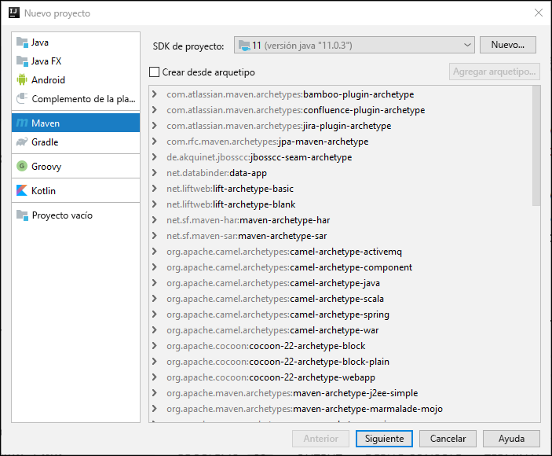
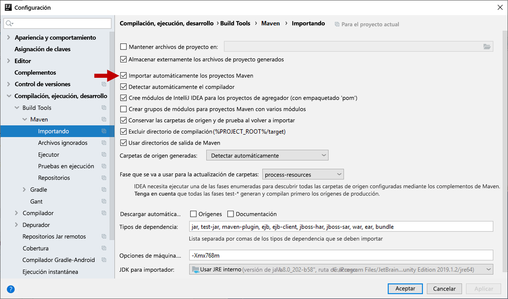
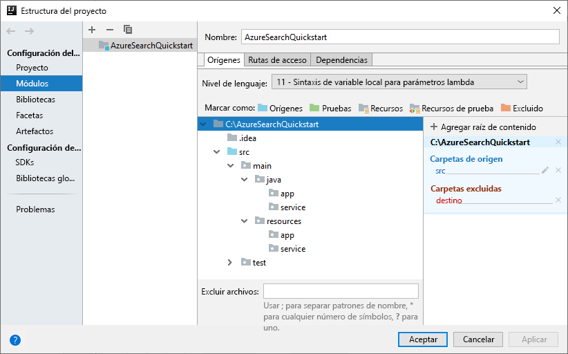
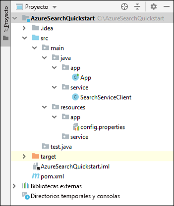
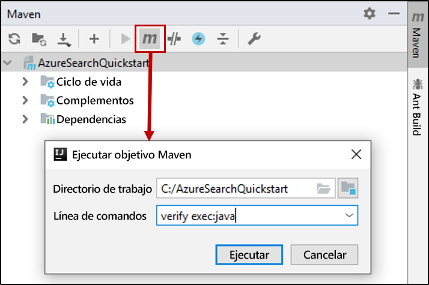

# <a name="quickstart-create-an-azure-cognitive-search-index-in-java-using-rest-apis"></a>Inicio rápido: Creación de un índice de Azure Cognitive Search en Java mediante las API REST
> [!div class="op_single_selector"]
> * [JavaScript](search-get-started-nodejs.md)
> * [C#](search-get-started-dotnet.md)
> * [Java](search-get-started-java.md)
> * [Portal](search-get-started-portal.md)
> * [PowerShell](search-create-index-rest-api.md)
> * [Python](search-get-started-python.md)
> * [Postman](search-get-started-postman.md)

Cree una aplicación de consola de Java que cree, cargue y consulte un índice de búsqueda mediante Azure Cognitive Search mediante [IntelliJ](https://www.jetbrains.com/idea/), [el SDK de Java 11](/java/azure/jdk/?view=azure-java-stable) y la [API REST de Azure Cognitive Search](/rest/api/searchservice/). Este artículo proporciona instrucciones paso a paso para crear la aplicación. Como alternativa, puede [descargar y ejecutar la aplicación completa](/samples/azure-samples/azure-search-java-samples/java-sample-quickstart/).

Si no tiene una suscripción a Azure, cree una [cuenta gratuita](https://azure.microsoft.com/free/?WT.mc_id=A261C142F) antes de empezar.

## <a name="prerequisites"></a>Prerrequisitos

Hemos usado el software y servicios siguientes para compilar y probar este inicio rápido:

+ [IntelliJ IDEA](https://www.jetbrains.com/idea/)

+ [SDK de Java 11](/java/azure/jdk/?view=azure-java-stable)

+ [Cree un servicio Azure Cognitive Search](search-create-service-portal.md) o [busque uno existente](https://ms.portal.azure.com/#blade/HubsExtension/BrowseResourceBlade/resourceType/Microsoft.Search%2FsearchServices) en su suscripción actual. Puede usar un servicio gratuito para este inicio rápido.

<a name="get-service-info"></a>

## <a name="get-a-key-and-url"></a>Obtención de una clave y una dirección URL

Las llamadas al servicio requieren un punto de conexión de URL y una clave de acceso en cada solicitud. Con ambos se crea un servicio de búsqueda, por lo que, si ha agregado Azure Cognitive Search a su suscripción, siga estos pasos para obtener la información necesaria:

1. [Inicie sesión en Azure Portal](https://portal.azure.com/) y en la página **Introducción** del servicio de búsqueda, obtenga la dirección URL. Un punto de conexión de ejemplo podría ser similar a `https://mydemo.search.windows.net`.

2. En **Configuración** > **Claves**, obtenga una clave de administrador para tener derechos completos en el servicio. Se proporcionan dos claves de administrador intercambiables para lograr la continuidad empresarial, por si necesitara sustituir una de ellas. Puede usar la clave principal o secundaria en las solicitudes para agregar, modificar y eliminar objetos.

   Además, cree una clave de consulta. Es una práctica recomendada emitir solicitudes de consulta con acceso de solo lectura.


Todas las solicitudes enviadas al servicio requieren una clave de API. Tener una clave válida genera la confianza, solicitud a solicitud, entre la aplicación que envía la solicitud y el servicio que se encarga de ella.

## <a name="set-up-your-environment"></a>Configurar el entorno

Para comenzar, abra IntelliJ IDEA y configure un nuevo proyecto.

### <a name="create-the-project"></a>Creación del proyecto

1. Abra IntelliJ IDEA y seleccione **Create New Project** (Crear nuevo proyecto).
1. Seleccione **Maven**.
1. En la lista **Project SDK** (SDK del proyecto), seleccione el SDK de Java 11.

     

1. En **GroupId** (Id. de producto) y **ArtifactId** (Id. de artefacto), escriba `AzureSearchQuickstart`.
1. Acepte los valores predeterminados restantes para abrir el proyecto.

### <a name="specify-maven-dependencies"></a>Especificación de las dependencias de Maven

1. Seleccione **File** (Archivo)  > **Settings** (Configuración).
1. En la ventana **Settings** (Configuración), vaya a **Build, Execution, Deployment** > **Build Tools** > **Maven** > **Importing** (Compilación, ejecución o implementación > Herramientas de compilación > Maven > Importación).
1. Active la casilla **Import Maven projects automatically** (Importar proyectos de Maven automáticamente) y haga clic en **OK** (Aceptar) para cerrar la ventana. Los complementos de Maven y otras dependencias se sincronizarán ahora automáticamente al actualizar el archivo pom.xml en el paso siguiente.

    

1. Abra el archivo pom.xml y reemplace el contenido por los siguientes detalles de configuración de Maven. Se incluyen referencias al [complemento Exec Maven](https://www.mojohaus.org/exec-maven-plugin/) y una [API de interfaz de JSON](https://javadoc.io/doc/org.glassfish/javax.json/1.0.2).

    ```xml
    <?xml version="1.0" encoding="UTF-8"?>
    <project xmlns="http://maven.apache.org/POM/4.0.0"
             xmlns:xsi="http://www.w3.org/2001/XMLSchema-instance"
             xsi:schemaLocation="http://maven.apache.org/POM/4.0.0 http://maven.apache.org/xsd/maven-4.0.0.xsd">
        <modelVersion>4.0.0</modelVersion>
    
        <groupId>AzureSearchQuickstart</groupId>
        <artifactId>AzureSearchQuickstart</artifactId>
        <version>1.0-SNAPSHOT</version>
        <build>
            <sourceDirectory>src</sourceDirectory>
            <plugins>
                <plugin>
                    <artifactId>maven-compiler-plugin</artifactId>
                    <version>3.1</version>
                    <configuration>
                        <source>11</source>
                        <target>11</target>
                    </configuration>
                </plugin>
                <plugin>
                    <groupId>org.codehaus.mojo</groupId>
                    <artifactId>exec-maven-plugin</artifactId>
                    <version>1.6.0</version>
                    <executions>
                        <execution>
                            <goals>
                                <goal>exec</goal>
                            </goals>
                        </execution>
                    </executions>
                    <configuration>
                        <mainClass>main.java.app.App</mainClass>
                        <cleanupDaemonThreads>false</cleanupDaemonThreads>
                    </configuration>
                </plugin>
            </plugins>
        </build>
        <dependencies>
            <dependency>
                <groupId>org.glassfish</groupId>
                <artifactId>javax.json</artifactId>
                <version>1.0.2</version>
            </dependency>
        </dependencies>   
    </project>
    ```

### <a name="set-up-the-project-structure"></a>Configuración de la estructura del proyecto

1. Seleccione **File** (Archivo)  > **Project Structure** (Estructura de proyecto).
1. Seleccione **Modules** (Módulos) y expanda el árbol de origen para acceder al contenido de la carpeta `src` >  `main`.
1. En la carpeta `src` >  `main` > `java`, agregue las carpetas `app` y `service`. Para ello, seleccione la carpeta `java`, presione Alt + Insertar y, a continuación, escriba el nombre de la carpeta.
1. En la carpeta `src` >  `main` >`resources`, agregue las carpetas `app` y `service`.

    Una vez lo haya hecho, el árbol del proyecto debe tener un aspecto similar al de la imagen siguiente.

    

1. Haga clic en **Aceptar** para cerrar la ventana.

### <a name="add-azure-cognitive-search-service-information"></a>Incorporación de información del servicio Azure Cognitive Search

1. En la ventana **Project** (Proyecto), expanda el árbol de origen para acceder a la carpeta `src` >  `main` >`resources` > `app`, y agregue un archivo `config.properties`. Para ello, seleccione la carpeta `app`, presione Alt + Insertar, seleccione **File** (Archivo) y, a continuación, escriba el nombre del archivo.

1. Copie la siguiente configuración en el nuevo archivo y reemplace `<YOUR-SEARCH-SERVICE-NAME>`, `<YOUR-ADMIN-KEY>` y `<YOUR-QUERY-KEY>` por el nombre del servicio y las claves. Si el punto de conexión de servicio es `https://mydemo.search.windows.net`, el nombre del servicio será "mydemo".

    ```java
        SearchServiceName=<YOUR-SEARCH-SERVICE-NAME>
        SearchServiceAdminKey=<YOUR-ADMIN-KEY>
        SearchServiceQueryKey=<YOUR-QUERY-KEY>
        IndexName=hotels-quickstart
        ApiVersion=2020-06-30
    ```

### <a name="add-the-main-method"></a>Incorporación del método principal

1. En la carpeta `src` >  `main` > `java` > `app`, agregue una clase `App`. Para ello, seleccione la carpeta `app`, presione Alt + Insertar, seleccione **Java Class** (Clase de Java) y, a continuación, escriba el nombre de la clase.
1. Abra la clase `App` y reemplace el contenido por el código siguiente: Este código contiene el método `main`. 

    El código sin comentarios lee los parámetros del servicio de búsqueda y los usa para crear una instancia del cliente del servicio de búsqueda. El código del cliente del servicio de búsqueda se agregará en la sección siguiente.

    En una sección posterior de este inicio rápido, se quitará el comentario del código comentado de esta clase.

    ```java
    package main.java.app;
    
    import main.java.service.SearchServiceClient;
    import java.io.IOException;
    import java.util.Properties;
    
    public class App {
    
        private static Properties loadPropertiesFromResource(String resourcePath) throws IOException {
            var inputStream = App.class.getResourceAsStream(resourcePath);
            var configProperties = new Properties();
            configProperties.load(inputStream);
            return configProperties;
        }
    
        public static void main(String[] args) {
            try {
                var config = loadPropertiesFromResource("/app/config.properties");
                var client = new SearchServiceClient(
                        config.getProperty("SearchServiceName"),
                        config.getProperty("SearchServiceAdminKey"),
                        config.getProperty("SearchServiceQueryKey"),
                        config.getProperty("ApiVersion"),
                        config.getProperty("IndexName")
                );
    
    
    //Uncomment the next 3 lines in the 1 - Create Index section of the quickstart
    //            if(client.indexExists()){ client.deleteIndex();}
    //            client.createIndex("/service/index.json");
    //            Thread.sleep(1000L); // wait a second to create the index
    
    //Uncomment the next 2 lines in the 2 - Load Documents section of the quickstart
    //            client.uploadDocuments("/service/hotels.json");
    //            Thread.sleep(2000L); // wait 2 seconds for data to upload
    
    //Uncomment the following 5 search queries in the 3 - Search an index section of the quickstart
    //            // Query 1
    //            client.logMessage("\n*QUERY 1****************************************************************");
    //            client.logMessage("Search for: Atlanta'");
    //            client.logMessage("Return: All fields'");
    //            client.searchPlus("Atlanta");
    //
    //            // Query 2
    //            client.logMessage("\n*QUERY 2****************************************************************");
    //            client.logMessage("Search for: Atlanta");
    //            client.logMessage("Return: HotelName, Tags, Address");
    //            SearchServiceClient.SearchOptions options2 = client.createSearchOptions();
    //            options2.select = "HotelName,Tags,Address";
    //            client.searchPlus("Atlanta", options2);
    //
    //            //Query 3
    //            client.logMessage("\n*QUERY 3****************************************************************");
    //            client.logMessage("Search for: wifi & restaurant");
    //            client.logMessage("Return: HotelName, Description, Tags");
    //            SearchServiceClient.SearchOptions options3 = client.createSearchOptions();
    //            options3.select = "HotelName,Description,Tags";
    //            client.searchPlus("wifi,restaurant", options3);
    //
    //            // Query 4 -filtered query
    //            client.logMessage("\n*QUERY 4****************************************************************");
    //            client.logMessage("Search for: all");
    //            client.logMessage("Filter: Ratings greater than 4");
    //            client.logMessage("Return: HotelName, Rating");
    //            SearchServiceClient.SearchOptions options4 = client.createSearchOptions();
    //            options4.filter="Rating%20gt%204";
    //            options4.select = "HotelName,Rating";
    //            client.searchPlus("*",options4);
    //
    //            // Query 5 - top 2 results, ordered by
    //            client.logMessage("\n*QUERY 5****************************************************************");
    //            client.logMessage("Search for: boutique");
    //            client.logMessage("Get: Top 2 results");
    //            client.logMessage("Order by: Rating in descending order");
    //            client.logMessage("Return: HotelId, HotelName, Category, Rating");
    //            SearchServiceClient.SearchOptions options5 = client.createSearchOptions();
    //            options5.top=2;
    //            options5.orderby = "Rating%20desc";
    //            options5.select = "HotelId,HotelName,Category,Rating";
    //            client.searchPlus("boutique", options5);
    
            } catch (Exception e) {
                System.err.println("Exception:" + e.getMessage());
                e.printStackTrace();
            }
        }
    }
    ```

### <a name="add-the-http-operations"></a>Adición de las operaciones HTTP

1. En la carpeta `src` >  `main` > `java` > `service`, agregue una clase `SearchServiceClient`. Para ello, seleccione la carpeta `service`, presione Alt + Insertar, seleccione **Java Class** (Clase de Java) y, a continuación, escriba el nombre de la clase.
1. Abra la clase `SearchServiceClient` y reemplace el contenido por el código siguiente. Este código proporciona las operaciones HTTP necesarias para usar la API REST de Azure Cognitive Search. En una sección posterior, se agregarán métodos adicionales para crear un índice, cargar documentos y consultar el índice.

    ```java
    package main.java.service;

    import javax.json.Json;
    import javax.net.ssl.HttpsURLConnection;
    import java.io.IOException;
    import java.io.StringReader;
    import java.net.HttpURLConnection;
    import java.net.URI;
    import java.net.http.HttpClient;
    import java.net.http.HttpRequest;
    import java.net.http.HttpResponse;
    import java.nio.charset.StandardCharsets;
    import java.util.Formatter;
    import java.util.function.Consumer;
    
        /* This class is responsible for implementing HTTP operations for creating the index, uploading documents and searching the data*/
        public class SearchServiceClient {
            private final String _adminKey;
            private final String _queryKey;
            private final String _apiVersion;
            private final String _serviceName;
            private final String _indexName;
            private final static HttpClient client = HttpClient.newHttpClient();
    
        public SearchServiceClient(String serviceName, String adminKey, String queryKey, String apiVersion, String indexName) {
            this._serviceName = serviceName;
            this._adminKey = adminKey;
            this._queryKey = queryKey;
            this._apiVersion = apiVersion;
            this._indexName = indexName;
        }

        private static HttpResponse<String> sendRequest(HttpRequest request) throws IOException, InterruptedException {
            logMessage(String.format("%s: %s", request.method(), request.uri()));
            return client.send(request, HttpResponse.BodyHandlers.ofString());
        }

        private static URI buildURI(Consumer<Formatter> fmtFn)
                {
                    Formatter strFormatter = new Formatter();
                    fmtFn.accept(strFormatter);
                    String url = strFormatter.out().toString();
                    strFormatter.close();
                    return URI.create(url);
        }
    
        public static void logMessage(String message) {
            System.out.println(message);
        }
    
        public static boolean isSuccessResponse(HttpResponse<String> response) {
            try {
                int responseCode = response.statusCode();
    
                logMessage("\n Response code = " + responseCode);
    
                if (responseCode == HttpURLConnection.HTTP_OK || responseCode == HttpURLConnection.HTTP_ACCEPTED
                        || responseCode == HttpURLConnection.HTTP_NO_CONTENT || responseCode == HttpsURLConnection.HTTP_CREATED) {
                    return true;
                }
    
                // We got an error
                var msg = response.body();
                if (msg != null) {
                    logMessage(String.format("\n MESSAGE: %s", msg));
                }
    
            } catch (Exception e) {
                e.printStackTrace();
            }
    
            return false;
        }
    
        public static HttpRequest httpRequest(URI uri, String key, String method, String contents) {
            contents = contents == null ? "" : contents;
            var builder = HttpRequest.newBuilder();
            builder.uri(uri);
            builder.setHeader("content-type", "application/json");
            builder.setHeader("api-key", key);
    
            switch (method) {
                case "GET":
                    builder = builder.GET();
                    break;
                case "HEAD":
                    builder = builder.GET();
                    break;
                case "DELETE":
                    builder = builder.DELETE();
                    break;
                case "PUT":
                    builder = builder.PUT(HttpRequest.BodyPublishers.ofString(contents));
                    break;
                case "POST":
                    builder = builder.POST(HttpRequest.BodyPublishers.ofString(contents));
                    break;
                default:
                    throw new IllegalArgumentException(String.format("Can't create request for method '%s'", method));
            }
            return builder.build();
        }
    }
    
    ```

### <a name="build-the-project"></a>Compilación del proyecto

1. Compruebe que el proyecto tiene la estructura siguiente.

    

1. Abra la ventana de herramientas de **Maven** y ejecute este objetivo de Maven: `verify exec:java`


Cuando finalice el procesamiento, busque un mensaje BUILD SUCCESS (Compilación correcta) seguido del código de salida cero (0).

## <a name="1---create-index"></a>1 - Creación de un índice

La definición del índice de hoteles contiene campos simples y un campo complejo. Los ejemplos de un campo simple son "HotelName" (Nombre de hotel) o "Description" (Descripción). El campo "Address" (Dirección) es un campo complejo porque tiene campos secundarios, como "Street Address" (Dirección postal) y "City" (Ciudad). En este inicio rápido, la definición del índice se especifica mediante JSON.

1. En la ventana **Project** (Proyecto), expanda el árbol de origen para acceder a la carpeta `src` >  `main` >`resources` > `service`, y agregue un archivo `index.json`. Para ello, seleccione la carpeta `app`, presione Alt + Insertar, seleccione **File** (Archivo) y, a continuación, escriba el nombre del archivo.

1. Abra el archivo `index.json` e inserte la siguiente definición de índice.

    ```json
    {
      "name": "hotels-quickstart",
      "fields": [
        {
          "name": "HotelId",
          "type": "Edm.String",
          "key": true,
          "filterable": true
        },
        {
          "name": "HotelName",
          "type": "Edm.String",
          "searchable": true,
          "filterable": false,
          "sortable": true,
          "facetable": false
        },
        {
          "name": "Description",
          "type": "Edm.String",
          "searchable": true,
          "filterable": false,
          "sortable": false,
          "facetable": false,
          "analyzer": "en.lucene"
        },
        {
          "name": "Description_fr",
          "type": "Edm.String",
          "searchable": true,
          "filterable": false,
          "sortable": false,
          "facetable": false,
          "analyzer": "fr.lucene"
        },
        {
          "name": "Category",
          "type": "Edm.String",
          "searchable": true,
          "filterable": true,
          "sortable": true,
          "facetable": true
        },
        {
          "name": "Tags",
          "type": "Collection(Edm.String)",
          "searchable": true,
          "filterable": true,
          "sortable": false,
          "facetable": true
        },
        {
          "name": "ParkingIncluded",
          "type": "Edm.Boolean",
          "filterable": true,
          "sortable": true,
          "facetable": true
        },
        {
          "name": "LastRenovationDate",
          "type": "Edm.DateTimeOffset",
          "filterable": true,
          "sortable": true,
          "facetable": true
        },
        {
          "name": "Rating",
          "type": "Edm.Double",
          "filterable": true,
          "sortable": true,
          "facetable": true
        },
        {
          "name": "Address",
          "type": "Edm.ComplexType",
          "fields": [
            {
              "name": "StreetAddress",
              "type": "Edm.String",
              "filterable": false,
              "sortable": false,
              "facetable": false,
              "searchable": true
            },
            {
              "name": "City",
              "type": "Edm.String",
              "searchable": true,
              "filterable": true,
              "sortable": true,
              "facetable": true
            },
            {
              "name": "StateProvince",
              "type": "Edm.String",
              "searchable": true,
              "filterable": true,
              "sortable": true,
              "facetable": true
            },
            {
              "name": "PostalCode",
              "type": "Edm.String",
              "searchable": true,
              "filterable": true,
              "sortable": true,
              "facetable": true
            },
            {
              "name": "Country",
              "type": "Edm.String",
              "searchable": true,
              "filterable": true,
              "sortable": true,
              "facetable": true
            }
          ]
        }
      ]
    }
    ```

    El nombre del índice será "hotels-quickstart". Los atributos de los campos de índice determinan cómo se pueden buscar los datos indexados en una aplicación. Por ejemplo, el atributo `IsSearchable` se debe asignar a todos los campos que deben incluirse en una búsqueda de texto completo. Para más información sobre los atributos, consulte [Colección de campos y atributos de campo](search-what-is-an-index.md#fields-collection).
    
    El campo `Description` de este índice usa la propiedad `analyzer` opcional para invalidar el analizador del lenguaje Lucene predeterminado. En el campo `Description_fr` se usa el analizador de Lucene de francés `fr.lucene`, ya que almacena el texto en francés. En `Description`, se usa el analizador de idioma de Microsoft opcional, en.lucene. Para más información sobre los analizadores, consulte [Analizadores para el procesamiento de texto en Azure Cognitive Search](search-analyzers.md).

1. Agregue el siguiente código a la clase `SearchServiceClient` . Estos métodos compilan las direcciones URL del servicio REST de Azure Cognitive Search que crean y eliminan índices, y que determinan si existe un índice. Los métodos también realizan la solicitud HTTP.

    ```java
    public boolean indexExists() throws IOException, InterruptedException {
        logMessage("\n Checking if index exists...");
        var uri = buildURI(strFormatter -> strFormatter.format(
                "https://%s.search.windows.net/indexes/%s/docs?api-version=%s&search=*",
                _serviceName,_indexName,_apiVersion));
        var request = httpRequest(uri, _adminKey, "HEAD", "");
        var response = sendRequest(request);
        return isSuccessResponse(response);
    }
    
    public boolean deleteIndex() throws IOException, InterruptedException {
        logMessage("\n Deleting index...");
        var uri = buildURI(strFormatter -> strFormatter.format(
                "https://%s.search.windows.net/indexes/%s?api-version=%s",
                _serviceName,_indexName,_apiVersion));
        var request = httpRequest(uri, _adminKey, "DELETE", "*");
        var response = sendRequest(request);
        return isSuccessResponse(response);
    }
    
    
    public boolean createIndex(String indexDefinitionFile) throws IOException, InterruptedException {
        logMessage("\n Creating index...");
        //Build the search service URL
        var uri = buildURI(strFormatter -> strFormatter.format(
                "https://%s.search.windows.net/indexes/%s?api-version=%s",
                _serviceName,_indexName,_apiVersion));
        //Read in index definition file
        var inputStream = SearchServiceClient.class.getResourceAsStream(indexDefinitionFile);
        var indexDef = new String(inputStream.readAllBytes(), StandardCharsets.UTF_8);
        //Send HTTP PUT request to create the index in the search service
        var request = httpRequest(uri, _adminKey, "PUT", indexDef);
        var response = sendRequest(request);
        return isSuccessResponse(response);
    }
    ```

1. Quite el comentario del código siguiente en la clase `App`. Este código elimina el índice "hotels-quickstart", si existe, y crea un nuevo índice basado en la definición del índice en el archivo index.json. 

    Se inserta una pausa de un segundo después de la solicitud de creación de índice. Esta pausa garantiza que el índice se crea antes de cargar los documentos.

    ```java
        if (client.indexExists()) { client.deleteIndex();}
          client.createIndex("/service/index.json");
          Thread.sleep(1000L); // wait a second to create the index
    ```

1. Abra la ventana de herramientas de **Maven** y ejecute este objetivo de Maven: `verify exec:java`

    A medida que se ejecute el código, busque un mensaje "Creating index" (Creando índice) seguido de un código de respuesta 201. Este código de respuesta confirma que se ha creado el índice. La ejecución debe finalizar con un mensaje BUILD SUCCESS (Compilación correcta) y un código de salida cero (0).
    
## <a name="2---load-documents"></a>2 - Carga de documentos

1. En la ventana **Project** (Proyecto), expanda el árbol de origen para acceder a la carpeta `src` >  `main` >`resources` > `service`, y agregue un archivo `hotels.json`. Para ello, seleccione la carpeta `app`, presione Alt + Insertar, seleccione **File** (Archivo) y, a continuación, escriba el nombre del archivo.
1. Inserte los documentos de hotel siguientes en el archivo.

    ```json
    {
      "value": [
        {
          "@search.action": "upload",
          "HotelId": "1",
          "HotelName": "Secret Point Motel",
          "Description": "The hotel is ideally located on the main commercial artery of the city in the heart of New York. A few minutes away is Time's Square and the historic centre of the city, as well as other places of interest that make New York one of America's most attractive and cosmopolitan cities.",
          "Description_fr": "L'hôtel est idéalement situé sur la principale artère commerciale de la ville en plein cœur de New York. A quelques minutes se trouve la place du temps et le centre historique de la ville, ainsi que d'autres lieux d'intérêt qui font de New York l'une des villes les plus attractives et cosmopolites de l'Amérique.",
          "Category": "Boutique",
          "Tags": [ "pool", "air conditioning", "concierge" ],
          "ParkingIncluded": "false",
          "LastRenovationDate": "1970-01-18T00:00:00Z",
          "Rating": 3.60,
          "Address": {
            "StreetAddress": "677 5th Ave",
            "City": "New York",
            "StateProvince": "NY",
            "PostalCode": "10022",
            "Country": "USA"
          }
        },
        {
          "@search.action": "upload",
          "HotelId": "2",
          "HotelName": "Twin Dome Motel",
          "Description": "The hotel is situated in a  nineteenth century plaza, which has been expanded and renovated to the highest architectural standards to create a modern, functional and first-class hotel in which art and unique historical elements coexist with the most modern comforts.",
          "Description_fr": "L'hôtel est situé dans une place du XIXe siècle, qui a été agrandie et rénovée aux plus hautes normes architecturales pour créer un hôtel moderne, fonctionnel et de première classe dans lequel l'art et les éléments historiques uniques coexistent avec le confort le plus moderne.",
          "Category": "Boutique",
          "Tags": [ "pool", "free wifi", "concierge" ],
          "ParkingIncluded": "false",
          "LastRenovationDate": "1979-02-18T00:00:00Z",
          "Rating": 3.60,
          "Address": {
            "StreetAddress": "140 University Town Center Dr",
            "City": "Sarasota",
            "StateProvince": "FL",
            "PostalCode": "34243",
            "Country": "USA"
          }
        },
        {
          "@search.action": "upload",
          "HotelId": "3",
          "HotelName": "Triple Landscape Hotel",
          "Description": "The Hotel stands out for its gastronomic excellence under the management of William Dough, who advises on and oversees all of the Hotel’s restaurant services.",
          "Description_fr": "L'hôtel est situé dans une place du XIXe siècle, qui a été agrandie et rénovée aux plus hautes normes architecturales pour créer un hôtel moderne, fonctionnel et de première classe dans lequel l'art et les éléments historiques uniques coexistent avec le confort le plus moderne.",
          "Category": "Resort and Spa",
          "Tags": [ "air conditioning", "bar", "continental breakfast" ],
          "ParkingIncluded": "true",
          "LastRenovationDate": "2015-09-20T00:00:00Z",
          "Rating": 4.80,
          "Address": {
            "StreetAddress": "3393 Peachtree Rd",
            "City": "Atlanta",
            "StateProvince": "GA",
            "PostalCode": "30326",
            "Country": "USA"
          }
        },
        {
          "@search.action": "upload",
          "HotelId": "4",
          "HotelName": "Sublime Cliff Hotel",
          "Description": "Sublime Cliff Hotel is located in the heart of the historic center of Sublime in an extremely vibrant and lively area within short walking distance to the sites and landmarks of the city and is surrounded by the extraordinary beauty of churches, buildings, shops and monuments. Sublime Cliff is part of a lovingly restored 1800 palace.",
          "Description_fr": "Le sublime Cliff Hotel est situé au coeur du centre historique de sublime dans un quartier extrêmement animé et vivant, à courte distance de marche des sites et monuments de la ville et est entouré par l'extraordinaire beauté des églises, des bâtiments, des commerces et Monuments. Sublime Cliff fait partie d'un Palace 1800 restauré avec amour.",
          "Category": "Boutique",
          "Tags": [ "concierge", "view", "24-hour front desk service" ],
          "ParkingIncluded": "true",
          "LastRenovationDate": "1960-02-06T00:00:00Z",
          "Rating": 4.60,
          "Address": {
            "StreetAddress": "7400 San Pedro Ave",
            "City": "San Antonio",
            "StateProvince": "TX",
            "PostalCode": "78216",
            "Country": "USA"
          }
        }
      ]
    }
    ```

1. Inserte el código siguiente en la clase `SearchServiceClient`. Este código crea la dirección URL del servicio REST para cargar los documentos de hotel en el índice y, a continuación, realiza la solicitud HTTP POST.

    ```java
    public boolean uploadDocuments(String documentsFile) throws IOException, InterruptedException {
        logMessage("\n Uploading documents...");
        //Build the search service URL
        var endpoint = buildURI(strFormatter -> strFormatter.format(
                "https://%s.search.windows.net/indexes/%s/docs/index?api-version=%s",
                _serviceName,_indexName,_apiVersion));
        //Read in the data to index
        var inputStream = SearchServiceClient.class.getResourceAsStream(documentsFile);
        var documents = new String(inputStream.readAllBytes(), StandardCharsets.UTF_8);
        //Send HTTP POST request to upload and index the data
        var request = httpRequest(endpoint, _adminKey, "POST", documents);
        var response = sendRequest(request);
        return isSuccessResponse(response);
    }
    ```

1. Quite el comentario del código siguiente en la clase `App`. Este código carga los documentos de "hotels.json" en el índice.

    ```java
    client.uploadDocuments("/service/hotels.json");
    Thread.sleep(2000L); // wait 2 seconds for data to upload
    ```

    Se inserta una pausa de dos segundos después de la solicitud de carga para asegurarse de que el proceso de carga del documento se completa antes de consultar el índice.

1. Abra la ventana de herramientas de **Maven** y ejecute este objetivo de Maven: `verify exec:java`

    Dado que ha creado un índice "hotels-quickstart" en el paso anterior, el código ahora lo eliminará y volverá a crearlo antes de cargar los documentos de hotel.

    A medida que se ejecute el código, busque un mensaje "Uploading documents" (Cargando documentos) seguido de un código de respuesta 200. Este código de respuesta confirma que los documentos se cargaron en el índice. La ejecución debe finalizar con un mensaje BUILD SUCCESS (Compilación correcta) y un código de salida cero (0).

## <a name="3---search-an-index"></a>3 - Búsqueda en un índice

Ahora que ha cargado los documentos de hoteles, puede crear consultas de búsqueda para acceder a los datos de hoteles.

1. Agregue el siguiente código a la clase `SearchServiceClient` . Este código compila las direcciones URL del servicio REST Azure Cognitive Search para buscar los datos indexados e imprime los resultados de la búsqueda.

    La clase `SearchOptions` y el método `createSearchOptions` permiten especificar un subconjunto de las opciones de consulta disponibles de la API REST de Azure Cognitive Search. Para más información sobre las opciones de consulta de la API REST, consulte [Búsqueda de documentos (API REST de Azure Cognitive Search)](/rest/api/searchservice/search-documents).

    El método `SearchPlus` crea la dirección URL de la consulta de búsqueda, realiza la solicitud de búsqueda y, a continuación, imprime los resultados en la consola. 

    ```java
    public SearchOptions createSearchOptions() { return new SearchOptions();}

    //Defines available search parameters that can be set
    public static class SearchOptions {

        public String select = "";
        public String filter = "";
        public int top = 0;
        public String orderby= "";
    }

    //Concatenates search parameters to append to the search request
    private String createOptionsString(SearchOptions options)
    {
        String optionsString = "";
        if (options != null) {
            if (options.select != "")
                optionsString = optionsString + "&$select=" + options.select;
            if (options.filter != "")
                optionsString = optionsString + "&$filter=" + options.filter;
            if (options.top != 0)
                optionsString = optionsString + "&$top=" + options.top;
            if (options.orderby != "")
                optionsString = optionsString + "&$orderby=" +options.orderby;
        }
        return optionsString;
    }
    
    public void searchPlus(String queryString)
    {
        searchPlus( queryString, null);
    }
    
    public void searchPlus(String queryString, SearchOptions options) {
    
        try {
            String optionsString = createOptionsString(options);
            var uri = buildURI(strFormatter -> strFormatter.format(
                    "https://%s.search.windows.net/indexes/%s/docs?api-version=%s&search=%s%s",
                    _serviceName, _indexName, _apiVersion, queryString, optionsString));
            var request = httpRequest(uri, _queryKey, "GET", null);
            var response = sendRequest(request);
            var jsonReader = Json.createReader(new StringReader(response.body()));
            var jsonArray = jsonReader.readObject().getJsonArray("value");
            var resultsCount = jsonArray.size();
            logMessage("Results:\nCount: " + resultsCount);
            for (int i = 0; i <= resultsCount - 1; i++) {
                logMessage(jsonArray.get(i).toString());
            }
    
            jsonReader.close();
    
        }
        catch (Exception e) {
            e.printStackTrace();
        }
    
    }
    ```

1. En la clase `App`, quite el comentario del código siguiente. Este código configura cinco consultas diferentes, entre las que se incluyen el texto de búsqueda, los parámetros de consulta y los campos de datos que se van a devolver. 

    ```java
    // Query 1
    client.logMessage("\n*QUERY 1****************************************************************");
    client.logMessage("Search for: Atlanta");
    client.logMessage("Return: All fields'");
    client.searchPlus("Atlanta");

    // Query 2
    client.logMessage("\n*QUERY 2****************************************************************");
    client.logMessage("Search for: Atlanta");
    client.logMessage("Return: HotelName, Tags, Address");
    SearchServiceClient.SearchOptions options2 = client.createSearchOptions();
    options2.select = "HotelName,Tags,Address";
    client.searchPlus("Atlanta", options2);

    //Query 3
    client.logMessage("\n*QUERY 3****************************************************************");
    client.logMessage("Search for: wifi & restaurant");
    client.logMessage("Return: HotelName, Description, Tags");
    SearchServiceClient.SearchOptions options3 = client.createSearchOptions();
    options3.select = "HotelName,Description,Tags";
    client.searchPlus("wifi,restaurant", options3);

    // Query 4 -filtered query
    client.logMessage("\n*QUERY 4****************************************************************");
    client.logMessage("Search for: all");
    client.logMessage("Filter: Ratings greater than 4");
    client.logMessage("Return: HotelName, Rating");
    SearchServiceClient.SearchOptions options4 = client.createSearchOptions();
    options4.filter="Rating%20gt%204";
    options4.select = "HotelName,Rating";
    client.searchPlus("*",options4);

    // Query 5 - top 2 results, ordered by
    client.logMessage("\n*QUERY 5****************************************************************");
    client.logMessage("Search for: boutique");
    client.logMessage("Get: Top 2 results");
    client.logMessage("Order by: Rating in descending order");
    client.logMessage("Return: HotelId, HotelName, Category, Rating");
    SearchServiceClient.SearchOptions options5 = client.createSearchOptions();
    options5.top=2;
    options5.orderby = "Rating%20desc";
    options5.select = "HotelId,HotelName,Category,Rating";
    client.searchPlus("boutique", options5);
    ```


    Hay dos [formas de hacer coincidir los términos en una consulta](search-query-overview.md#types-of-queries): búsqueda de texto completo y filtros. Una consulta de búsqueda de texto completo realiza búsquedas de uno o más términos en los campos `IsSearchable` en el índice. Un filtro es una expresión booleana que se evalúa en campos `IsFilterable` en un índice. Puede usar la búsqueda de texto completo y los filtros conjuntamente o por separado.

1. Abra la ventana de herramientas de **Maven** y ejecute este objetivo de Maven: `verify exec:java`

    Busque un resumen de cada consulta y sus resultados. La ejecución debe finalizar con un mensaje BUILD SUCCESS (Compilación correcta) y un código de salida cero (0).

## <a name="clean-up-resources"></a>Limpieza de recursos

Cuando trabaje con su propia suscripción, al final de un proyecto, es recomendable eliminar los recursos que ya no necesite. Los recursos que se dejan en ejecución pueden costarle mucho dinero. Puede eliminar los recursos de forma individual o eliminar el grupo de recursos para eliminar todo el conjunto de recursos.

Puede encontrar y administrar recursos en el portal, mediante el vínculo **Todos los recursos** o **Grupos de recursos** en el panel de navegación izquierdo.

Si está usando un servicio gratuito, recuerde que está limitado a tres índices, indexadores y orígenes de datos. Puede eliminar elementos individuales en el portal para mantenerse por debajo del límite. 

## <a name="next-steps"></a>Pasos siguientes

En este inicio rápido de Java, ha realizado una serie de tareas para crear un índice, cargar documentos en él y ejecutar consultas. Si está familiarizado con los conceptos básicos, recomendamos el siguiente artículo que enumera operaciones de indexador en REST.

> [!div class="nextstepaction"]
> [Operaciones de indexador](/rest/api/searchservice/indexer-operations)
