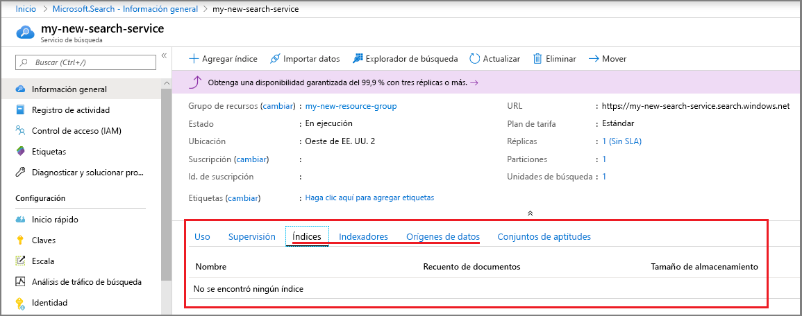
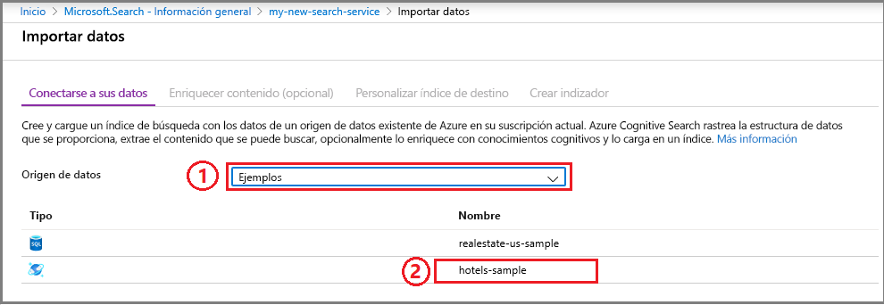
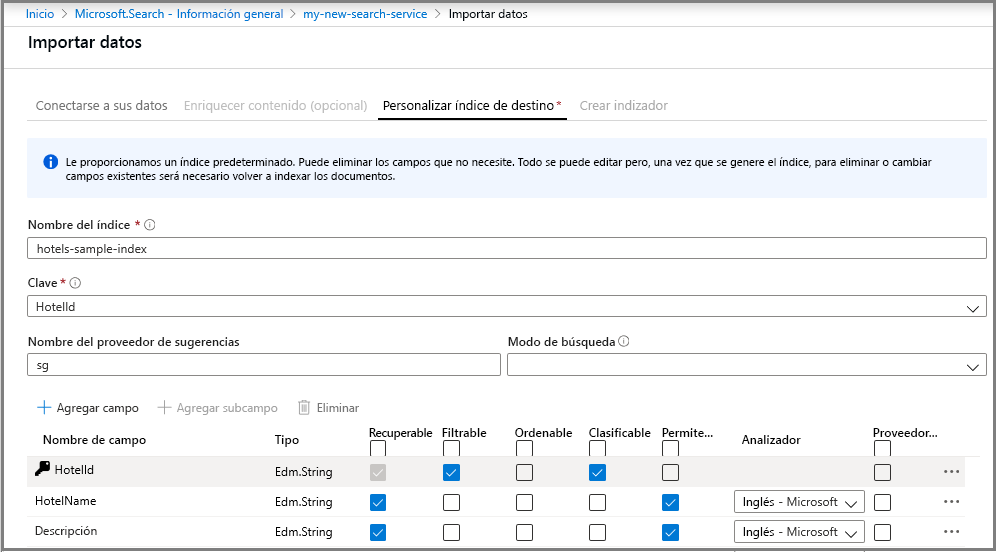
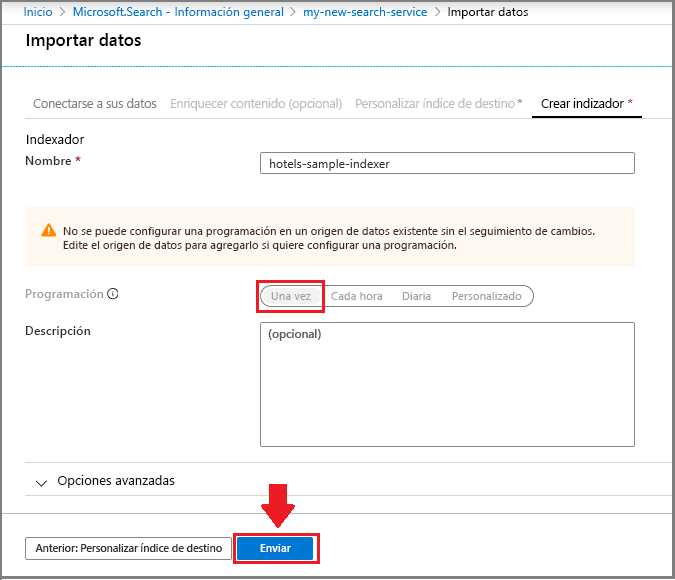
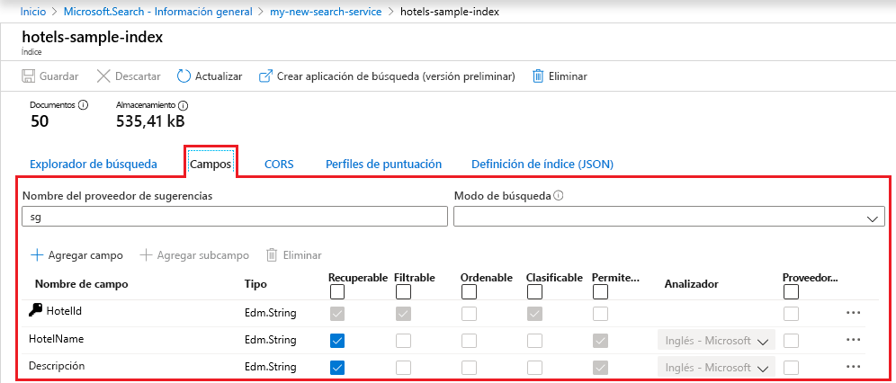

# Inicio rápido: Creación de un índice de Azure Search en Azure Portal
> [!div class="op_single_selector"]
> * [Portal](search-get-started-portal.md)
> * [PowerShell](search-get-started-powershell.md)
> * [Postman](search-get-started-postman.md)
> * [Python](search-get-started-python.md)
> * [C#](search-get-started-dotnet.md)

Para un rápido avance en los conceptos de Azure Search, prueba las herramientas integradas en Azure Portal. Los asistentes y editores no ofrecen una paridad completa con las API REST y .NET, pero puede empezar a trabajar rápidamente con una introducción sin código, que permite escribir consultas interesantes en datos de ejemplo en cuestión de minutos.

> [!div class="checklist"]
> * Empiece con un conjunto de datos de ejemplo público y gratuito hospedado en Azure.
> * Ejecute el **Asistente para la importación de datos** en Azure Search para cargar datos y generar un índice.
> * Supervise el progreso de la indexación en el portal.
> * Vea un índice existente y las opciones para modificarlo.
> * Explore la búsqueda de texto completo, los filtros, las facetas, la búsqueda aproximada y la búsqueda geográfica con el **Explorador de búsqueda**.

Si las herramientas son demasiado restrictivas, puede plantearse utilizar una [introducción basada en código a la programación de Azure Search en .NET](search-howto-dotnet-sdk.md) o utilice [Postman para realizar llamadas a la API REST](search-get-started-postman.md). También puede ver una demostración de seis minutos de los pasos de este tutorial, comenzando por este [vídeo de introducción a Azure Search](https://channel9.msdn.com/Events/Connect/2016/138) de aproximadamente tres minutos.

Si no tiene una suscripción a Azure, cree una [cuenta gratuita](https://azure.microsoft.com/free/?WT.mc_id=A261C142F) antes de empezar. 

## Requisitos previos

[Cree un servicio Azure Search](search-create-service-portal.md) o [busque un servicio existente](https://ms.portal.azure.com/#blade/HubsExtension/BrowseResourceBlade/resourceType/Microsoft.Search%2FsearchServices) en su suscripción actual. Puede usar un servicio gratuito para este inicio rápido. 

### Búsqueda de espacio

Muchos clientes comienzan con el servicio gratis. Esta versión está limitada a tres índices, tres orígenes de datos y tres indexadores. Asegúrese de que tiene espacio para elementos adicionales antes de empezar. Este tutorial crea uno de cada objeto.

Los iconos del panel de servicio muestran el número de índices, indexadores y orígenes de datos que ya tiene. 

##  Creación de un índice y carga de datos

Las consultas de búsqueda recorren en iteración un [*índice*](search-what-is-an-index.md) que contiene los datos de búsqueda, los metadatos y las construcciones adicionales que optimizan determinados comportamientos de la búsqueda.

En este tutorial, usamos un conjunto de datos de ejemplo integrado que se puede rastrear mediante un [*indexador*](search-indexer-overview.md) con el asistente para la **importación de datos**. Un indexador es un rastreador específico del origen que puede leer los metadatos y el contenido de los orígenes de datos de Azure admitidos. Normalmente, los indexadores se usan mediante programación, pero, en el portal, tiene acceso a ellos a través del **Asistente para la importación de datos**. 

### Paso 1: Inicio del Asistente para la importación de datos y creación de un origen de datos

1. En el panel del servicio Azure Search, haga clic en **Importar datos** en la barra de comandos para crear y rellenar un índice de búsqueda.

   

2. En el asistente, haga clic en **Conectar a los datos** > **Ejemplos** > **hotels-sample**. Este origen de datos está integrado. Si creó su propio origen de datos, deberá especificar un nombre, el tipo y la información de conexión. Una vez creado, se convierte en un "origen de datos existente" que se puede reutilizar en otras operaciones de importación.

   

3. Continúe en la siguiente página.

   

### Paso 2: Omisión de aptitudes cognitivas

El asistente admite la creación de una [canalización de aptitudes cognitivas](cognitive-search-concept-intro.md) para incorporar los algoritmos de inteligencia artificial de Cognitive Services a la indexación. 

Omitiremos este paso por ahora y pasaremos directamente a **Personalización del índice de destino**.

   

> [!TIP]
> Puede recorrer un ejemplo de indización con IA en una [guía de inicio rápido](cognitive-search-quickstart-blob.md) o [tutorial](cognitive-search-tutorial-blob.md).

### Paso 3: Configuración del índice

Normalmente, creación de índices es un ejercicio basado en código, que se completa antes de cargar datos. Aunque, como se indica en este tutorial, el asistente puede generar un índice básico para cualquier origen de datos que pueda rastrear. Como mínimo, un índice necesita un nombre y una colección de campos, uno de los cuales debe estar marcado como la clave de documento para identificar de forma única cada documento. Además, puede especificar analizadores de lenguaje o proveedores de sugerencias si quiere que las consultas se sugieran o completen automáticamente.

Los campos tienen tipos de datos y atributos. Las casillas de la parte superior son *atributos de índice* que controlan cómo se usa el campo.

* **Retrievable** significa que se muestra en la lista de resultados de búsqueda. Puede desactivar esta casilla para marcar los campos individuales como fuera de los resultados de búsqueda, por ejemplo, para los campos que se usan solo en expresiones de filtro.
* **Key** es el identificador único del documento. Siempre es una cadena, y es necesario.
* **Filterable**, **Sortable** y **Facetable** determinan si se usan campos en un filtro, una ordenación o una estructura de navegación de facetas.
* **Searchable** significa que se incluye un campo en la búsqueda de texto completo. Las cadenas permiten realizar búsquedas. Los campos numéricos y los booleanos a menudo se marcan como no utilizables en búsquedas.

Los requisitos de almacenamiento no varían como resultado de la selección. Por ejemplo, si establece el atributo **Retrievable** en varios campos, los requisitos de almacenamiento no aumentan.

De forma predeterminada, el asistente busca en el origen de datos identificadores únicos como base para el campo de clave. Las *cadenas* tienen los atributos **Recuperable** y **Permite búsquedas**. Los *enteros* tienen los atributos **Recuperable**, **Filterable**, **Ordenable** y **Clasificable**.

1. Acepte los valores predeterminados. 

   Si vuelve a ejecutar el asistente con un origen de datos de hotels existente, el índice no se configurará con los atributos predeterminados. En las siguientes importaciones tendrá que seleccionar los atributos manualmente. 

   

2. Continúe en la siguiente página.

   

### Paso 4: Configuración del indexador

Aún en el **Asistente para la importación de datos**, haga clic en **Indexador** > **Nombre** y escriba un nombre para el indexador.

Este objeto define un proceso ejecutable. Podría colocarlo en una programación periódica; pero, por ahora, use la opción predeterminada para ejecutar el indexador una vez, inmediatamente.

Haga clic en **Enviar** para crear y ejecutar simultáneamente el indexador.

  

## Supervisión de progreso

El asistente debe llevarle a la lista de indexadores, donde puede supervisar el progreso. En cuanto a la navegación automática, vaya a la página Introducción y haga clic en **Indizadores**.

El portal puede tardar unos minutos en actualizar la página, pero debería ver el indexador recién creado en la lista, con el estado "en curso" o correcto, junto con el número de documentos indexados.

   

## Ver el índice

La página principal del servicio proporciona vínculos a los recursos creados en el servicio Azure Search.  Para ver el índice que acaba de crear, haga clic en **Índices** en la lista de vínculos. 

   

En esta lista, puede hacer clic en el índice de *hotels-sample* que acaba de crear y ver el esquema de índice y, opcionalmente, agregar nuevos campos. 

La pestaña **Campos** muestra el esquema de índice. Desplácese hasta la parte inferior de la lista para especificar un nuevo campo. En la mayoría de los casos, no se pueden cambiar los campos existentes. Los campos existentes tienen una representación física en Azure Search y, por tanto, no son modificables, ni siquiera en el código. Para cambiar radicalmente un campo, cree otro índice y elimine el original.

   

Otras construcciones, como los perfiles de puntuación y las opciones de CORS, pueden agregarse en cualquier momento.

Para saber claramente qué puede y qué no puede modificar durante el diseño del índice, tómese un minuto para ver las opciones de definición de índice. Las opciones atenuadas son un indicador de que un valor no se puede modificar o eliminar. 

##  Realización de consultas con el Explorador de búsqueda

Más adelante, debería tener ahora un índice de búsqueda que esté preparado para la consulta con la página de consulta del [**Explorador de búsqueda**](search-explorer.md) integrada. Proporciona un cuadro de búsqueda para que pueda probar las cadenas de consulta arbitraria.

El **explorador de Search** está equipado solo para administrar [solicitudes de API REST](https://docs.microsoft.com/rest/api/searchservice/search-documents), pero acepta sintaxis para la [sintaxis de consulta simple](https://docs.microsoft.com/rest/api/searchservice/simple-query-syntax-in-azure-search) y el [analizador de consultas completo de Lucene](https://docs.microsoft.com/rest/api/searchservice/lucene-query-syntax-in-azure-search), además de todos los parámetros de búsqueda disponibles en las operaciones de [API REST de búsqueda en documentos](https://docs.microsoft.com/rest/api/searchservice/search-documents#bkmk_examples).

> [!TIP]
> En el [vídeo de introducción a Azure Search](https://channel9.msdn.com/Events/Connect/2016/138), los siguientes pasos se demuestran en 6 minutos y 8 segundos.
>

1. Haga clic en **Explorador de búsqueda** en la barra de comandos.

   

2. En la lista desplegable **Índice**, elija *hotels-sample*. Haga clic en la lista desplegable **Versión de API** para ver las API REST que están disponibles. Con las siguientes consultas, use la versión disponible con carácter general (2019-05-06).

   

3. En la barra de búsqueda, pegue las cadenas de consulta siguientes y haga clic en **Buscar**.

   

## Consultas de ejemplo

Puede escribir términos y frases, de forma similar a lo que podría hacer en una búsqueda en Bing o Google, o expresiones de consulta totalmente especificadas. Los resultados se devuelven como documentos JSON detallados.

### Consulta simple con los N resultados superiores

#### Ejemplo (cadena de consulta): `search=spa`

* El parámetro **search** se usa para la entrada de la búsqueda con una palabra clave en la búsqueda de texto completo; en este caso, se devuelven los datos de los hoteles que contienen *spa* en cualquier documento de búsqueda en el documento.

* El **Explorador de búsqueda** devuelve resultados en JSON, que es detallado y difícil de leer si los documentos tienen una estructura densa. Este comportamiento es deliberado; la visibilidad de todo el documento es importante a efectos de desarrollo, especialmente durante las pruebas. Para una mejor experiencia de usuario, deberá escribir código que [trate los resultados de la búsqueda](search-pagination-page-layout.md) para hacer destacar los elementos importantes.

* Los documentos se componen de todos los campos marcados como recuperables en el índice. Para ver los atributos del índice en el portal, haga clic en *hotels-sample* en la lista **Índices**.

#### Ejemplo (consulta con parámetros): `search=spa&$count=true&$top=10`

* El símbolo **&** se usa para anexar parámetros de búsqueda, que pueden especificarse en cualquier orden.

* El parámetro **$count=true** devuelve el recuento total de todos los documentos devueltos. Este valor aparece en la parte superior de los resultados de búsqueda. Puede comprobar las consultas de filtro mediante la supervisión de los cambios notificados por **$count=true**. Los recuentos más pequeños indican que su filtro está funcionando.

* El parámetro **$top=10** devuelve los 10 documentos mejor clasificados del total. De forma predeterminada, Azure Search devuelve las primeras 50 mejores coincidencias. Puede aumentar o disminuir la cantidad mediante **$top**.

###  Filtro de la consulta

Los filtros se incluyen en las solicitudes de búsqueda al anexar el parámetro **$filter**. 

#### Ejemplo (filtrado): `search=beach&$filter=Rating gt 4`

* El parámetro **$filter** devuelve resultados que coinciden con los criterios que proporcionó. En este caso, las clasificaciones mayores de 4.

* La sintaxis de filtro es una construcción de OData. Para más información, consulte la [sintaxis de filtro de OData](https://docs.microsoft.com/rest/api/searchservice/odata-expression-syntax-for-azure-search).

###  Faceta de la consulta

Los filtros de faceta se incluyen en las solicitudes de búsqueda. Puede usar el parámetro de faceta para devolver un recuento agregado de los documentos que coincidan con el valor de faceta que proporcione.

#### Ejemplo (con faceta con reducción del ámbito): `search=*&facet=Category&$top=2`

* **search=** * es una búsqueda vacía. Las búsquedas vacías buscan en todo. Una de las razones para enviar una búsqueda vacía es filtrar o clasificar el conjunto completo de documentos. Por ejemplo, quiere una estructura de navegación en facetas que conste de todos los hoteles del índice.
* **facet** devuelve una estructura de navegación que puede pasar a un control de interfaz de usuario. Devuelve categorías y un recuento. En este caso, las categorías se basan en un campo denominado convenientemente *Category*. No hay ninguna agregación en Azure Search, pero puede aproximarla mediante `facet`, que proporciona un recuento de documentos de cada categoría.

* **$top=2** devuelve dos documentos, lo cual muestra que puede usar `top` para reducir o aumentar los resultados.

#### Ejemplo (faceta en valores numéricos): `search=spa&facet=Rating`

* Esta consulta es una faceta para la clasificación, en una búsqueda de texto de *spa*. El término *Rating* se puede especificar como una faceta porque el campo está marcado como que se puede recuperar, filtrar y establecer en facetas en el índice, y los valores que contiene (numéricos del 1 al 5) son adecuados para clasificar los listados en grupos.

* Solo los campos que se pueden filtrar se pueden clasificar. Solo se pueden devolver en los resultados campos recuperables.

* El campo *Rating* es un número de punto flotante de doble precisión y la agrupación será por valor preciso. Para más información sobre la agrupación por intervalo (por ejemplo, "clasificaciones de 3 estrellas", "clasificaciones de 4 estrellas", etc.), consulte [Procedimiento para implementar la navegación por facetas en Azure Search](https://docs.microsoft.com/azure/search/search-faceted-navigation#filter-based-on-a-range).

###  Resaltado de los resultados de la búsqueda

El proceso de resaltado de referencias se refiere al formato en el texto que coincide con la palabra clave, dadas las coincidencias encontradas en un campo determinado. Si el término de búsqueda está profundamente enterrado en una descripción, puede agregar resaltado de referencias para que sea más fácil detectarlo.

#### Ejemplo (con resaltado): `search=beach&highlight=Description`

* En este ejemplo, la palabra con formato *beach* es más fácil de detectar en el campo de descripción.

#### Ejemplo (Análisis lingüístico): `search=beaches&highlight=Description`

* La búsqueda de texto completo reconoce variaciones básicas en los formularios de palabras. En este caso, los resultados de búsqueda contienen el texto resaltado para "beach", para aquellos hoteles que tengan esa palabra en sus campos de búsqueda, en respuesta a una búsqueda por palabra clave en "beaches". Diferentes formas de la misma palabra pueden aparecer en los resultados debido al análisis lingüístico. 

* Azure Search admite 56 analizadores de Lucene y Microsoft. El valor predeterminado usado por Azure Search es el analizador de Lucene estándar.

###  Probar la búsqueda aproximada

De forma predeterminada, los términos de consulta mal escritos, como *seatle* para "Seattle", no devuelven coincidencias en una búsqueda normal. El siguiente ejemplo no devuelve resultados.

#### Ejemplo (término mal escrito, no controlado): `search=seatle`

Para controlar los errores de ortografía, puede usar la búsqueda aproximada. La búsqueda aproximada se habilita cuando se usa la sintaxis de consulta de Lucene completa, que se produce al hacer dos cosas: establecer **queryType=full** en la consulta y anexar **~** a la cadena de búsqueda.

#### Ejemplo (término mal escrito, controlado): `search=seatle~&queryType=full`

Este ejemplo devuelve documentos que contengan coincidencias con "Seattle".

Cuando **queryType** no se especifica, se usa el analizador de consultas sencillo de manera predeterminada. El analizador de consultas sencillo es más rápido, pero si necesita búsqueda aproximada, expresiones regulares, búsqueda de proximidad u otros tipos de consultas avanzadas, necesitará la sintaxis completa.

La búsqueda aproximada y la búsqueda con caracteres comodín tienen implicaciones en los resultados de búsqueda. No se realiza un análisis lingüístico en estos formatos de consulta. Antes de usar la búsqueda con caracteres comodín y la búsqueda aproximada, consulte [Cómo funciona la búsqueda de texto completo en Azure Search](search-lucene-query-architecture.md#stage-2-lexical-analysis) y busque la sección sobre las excepciones para el análisis léxico.

Para más información sobre los escenarios de consulta habilitados por el analizador de consultas completo, consulte [Lucene query syntax in Azure Search](https://docs.microsoft.com/rest/api/searchservice/lucene-query-syntax-in-azure-search) (Sintaxis de consulta de Lucene en Azure Search).

###  Prueba de la búsqueda geoespacial

Se admite la búsqueda geoespacial mediante el [tipo de dato edm.GeographyPoint](https://docs.microsoft.com/rest/api/searchservice/supported-data-types) en un campo que contenga coordenadas. La búsqueda geográfica es un tipo de filtro, que se especifica en la [sintaxis de filtro de OData](https://docs.microsoft.com/rest/api/searchservice/odata-expression-syntax-for-azure-search).

#### Ejemplo (filtros de coordenadas geográficas): `search=*&$count=true&$filter=geo.distance(Location,geography'POINT(-122.12 47.67)') le 5`

La consulta de ejemplo filtra todos los resultados por datos de posición, donde los resultados sean inferiores a 5 kilómetros desde un punto dado (especificado como coordenadas de latitud y longitud). Al agregar **$count**, verá cuántos resultados se devuelven al cambiar la distancia o las coordenadas.

La búsqueda geoespacial resulta útil si su aplicación de búsqueda tiene una característica "buscar cerca de mí" o utiliza la navegación mediante mapas. No obstante, no es una búsqueda de texto completo. Si tiene requisitos de usuario de buscar en una ciudad o país/región por nombre, agregue campos que contengan nombres de ciudades o de países/regiones, además de coordenadas.

## Puntos clave

Este tutorial proporciona una introducción rápida al uso de Azure Search desde Azure Portal.

Ha aprendido cómo crear un índice de búsqueda mediante el asistente para **importar datos**. Ha aprendido acerca de los [indexadores](search-indexer-overview.md), así como del flujo de trabajo básico para el diseño de índices, incluidas las [modificaciones admitidas en un índice publicado](https://docs.microsoft.com/rest/api/searchservice/update-index).

Usando el **Explorador de búsqueda** de Azure Portal, ha aprendido la sintaxis de consulta básica mediante ejemplos prácticos de las funcionalidades clave, como los filtros, el resaltado de referencias, la búsqueda aproximada y la búsqueda geográfica.

También ha aprendido a encontrar índices, indexadores y orígenes de datos en el portal. Dado cualquier nuevo origen de datos en el futuro, puede usar el portal para comprobar rápidamente sus definiciones o colecciones de campos con un mínimo esfuerzo.

## Limpieza

Cuando trabaje con su propia suscripción, es una buena idea al final de un proyecto identificar si todavía se necesitan los recursos que ha creado. Los recursos que se dejan en ejecución pueden costarle mucho dinero. Puede eliminar los recursos de forma individual o eliminar el grupo de recursos para eliminar todo el conjunto de recursos.

Puede encontrar y administrar recursos en el portal, mediante el vínculo **Todos los recursos** o **Grupos de recursos** en el panel de navegación izquierdo.

Si está usando un servicio gratuito, recuerde que está limitado a tres índices, indexadores y orígenes de datos. Puede eliminar elementos individuales en el portal para mantenerse por debajo del límite. 

## Pasos siguientes

Puede explorar más sobre Azure Search mediante las herramientas de programación:

* [Creación de un índice con el SDK de .NET](https://docs.microsoft.com/azure/search/search-create-index-dotnet)
* [Creación de un índice con las API REST](https://docs.microsoft.com/azure/search/search-create-index-rest-api)
* [Creación de un índice con Postman o Fiddler y las API REST de Azure Search](search-get-started-postman.md)
