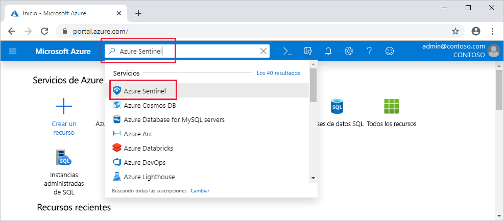

# Incorporación en Azure Sentinel (versión preliminar)

> [!IMPORTANT]
> Azure Sentinel se encuentra actualmente en versión preliminar pública.
> Esta versión preliminar se ofrece sin Acuerdo de Nivel de Servicio y no se recomienda para cargas de trabajo de producción. Es posible que algunas características no sean compatibles o que tengan sus funcionalidades limitadas. Para más información, consulte [Términos de uso complementarios de las Versiones Preliminares de Microsoft Azure](https://azure.microsoft.com/support/legal/preview-supplemental-terms/).

En este tutorial rápido, aprenderá cómo incorporarse a Azure Sentinel. 

Para incorporarse a Azure Sentinel, primero debe habilitarlo y, después, conectar sus orígenes de datos. Azure Sentinel llega con varios conectores para soluciones de Microsoft que están disponibles inmediatamente y proporcionan integración en tiempo real; por ejemplo, para soluciones de Microsoft Threat Protection y orígenes de Microsoft 365, como Office 365, Azure AD, Azure ATP y Microsoft Cloud App Security, entre muchos otros. Además, hay conectores integrados al amplio ecosistema de seguridad para soluciones que no son de Microsoft. También puede usar el formato de evento común, Syslog o las API de REST para conectar los orígenes de datos con Azure Sentinel.  

Después de conectar los orígenes de datos, puede elegir de una galería de paneles creados de forma experta que exponen información basada en los datos. Estos paneles se pueden personalizar fácilmente en función de sus necesidades.

## Requisitos previos globales

- Suscripción activa de Azure. Si no tiene una, cree una [cuenta gratuita](https://azure.microsoft.com/free/?WT.mc_id=A261C142F) antes de comenzar.

- Área de trabajo de Log Analytics. Aprenda a [crear un área de trabajo de Log Analytics](../log-analytics/log-analytics-quick-create-workspace.md)

-  Para habilitar Azure Sentinel, necesita permisos de colaborador en la suscripción en la que reside el área de trabajo de Azure Sentinel. 
- Para usar Azure Sentinel, necesita permisos de colaborador o lector en el grupo de recursos al que pertenece el área de trabajo
- Es posible que se necesiten permisos adicionales para conectarse a orígenes de datos específicos
 
## Habilitar Azure Sentinel 

1. Vaya a Azure Portal.
2. Asegúrese de que la suscripción en la que se crea Azure Sentinel está seleccionada. 
3. Busque Azure Sentinel. 
   

1. Haga clic en **+Agregar**.
1. Seleccione el área de trabajo que quiere usar o cree una nueva. Puede ejecutar Azure Sentinel en más de un área de trabajo, pero los datos se aíslan en un área de trabajo.

   

   >[!NOTE] 
   > - Las áreas de trabajo predeterminadas creadas por Azure Security Center no aparecerán en la lista; no puede instalar Azure Sentinel en ellas.
   > - Puede ejecutar Azure Sentinel en áreas de trabajo que se implementan en cualquiera de las siguientes regiones: Este de Australia, Sudeste de Australia, Centro de Canadá, Centro de la India, Este de EE. UU., Este de EE. UU. 2 EUAP (Canary), Japón Oriental, Asia Suroriental, Sur de Reino Unido, Oeste de Europa, Oeste de EE. UU. 2, Centro-oeste de EE. UU., Centro de Francia, Centro de Corea del Sur, Norte de Europa, Este de EE. UU. 2, Asia Oriental, Oeste de EE. UU., Centro de EE. UU., Centro-sur de EE. UU.

6. Haga clic en **Agregar Azure Sentinel**.
  

## Conexión con orígenes de datos

Azure Sentinel crea la conexión a aplicaciones y servicios al conectar con el servicio y reenviar los eventos y registros a Azure Sentinel. Para equipos y máquinas virtuales, puede instalar el agente de Azure Sentinel que recopila los registros y los reenvía a Azure Sentinel. Para los firewalls y servidores proxy, Azure Sentinel usa un servidor Linux Syslog. El agente está instalado en él y, desde él, recopila los archivos de registro y los reenvía a Azure Sentinel. 
 
1. Haga clic en **Recopilación de datos**.
2. Hay un icono para cada origen de datos al que puede conectarse. 
Por ejemplo, haga clic en **Azure Active Directory**. Si se conecta a este origen de datos, transmitirá todos los registros de Azure AD a Azure Sentinel. Puede seleccionar qué tipo de registros quiere obtener: de inicio de sesión o de auditoría.  
En la parte inferior, Azure Sentinel proporciona recomendaciones sobre qué paneles debería instalar para cada conector, para que pueda obtener información interesante de los datos.   Siga las instrucciones de instalación o [consulte la guía de conexión relevante](connect-data-sources.md) para obtener más información. Para obtener información acerca de los conectores de datos, vea [Conexión de servicios de Microsoft](connect-data-sources.md).

Una vez conectados los orígenes de datos, los datos comienzan a transmitirse a Azure Sentinel y podrá comenzar a trabajar con ellos. Puede ver los registros en los [paneles integrados](quickstart-get-visibility.md) y comenzar a crear consultas en Log Analytics para [investigar los datos](tutorial-investigate-cases.md).

## Pasos siguientes
En este documento, ha aprendido cómo conectarse a orígenes de datos de Azure Sentinel. Para más información sobre Azure Sentinel, consulte los siguientes artículos:
- Aprenda a [obtener visibilidad de los datos y de posibles amenazas](quickstart-get-visibility.md).
- Empiece a [detectar amenazas con Azure Sentinel](tutorial-detect-threats.md).
- Transmita datos desde [dispositivos con formatos de error comunes](connect-common-event-format.md) a Azure Sentinel.
