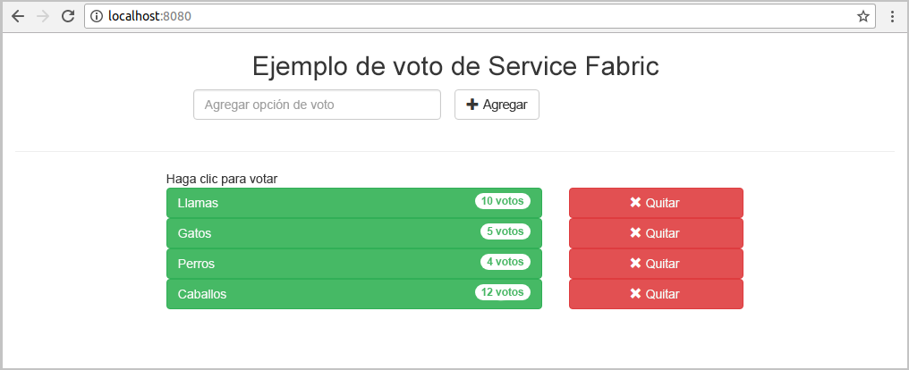
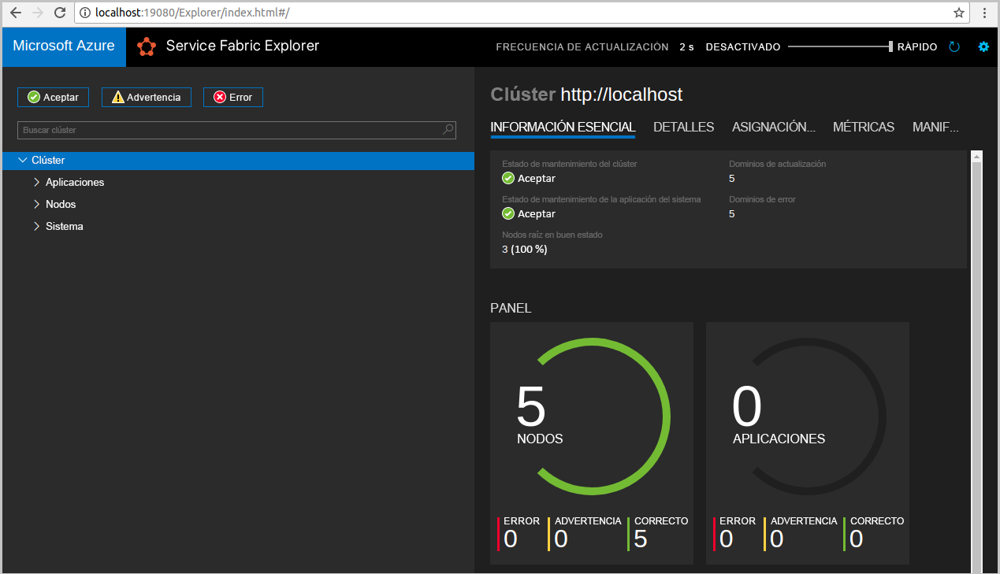
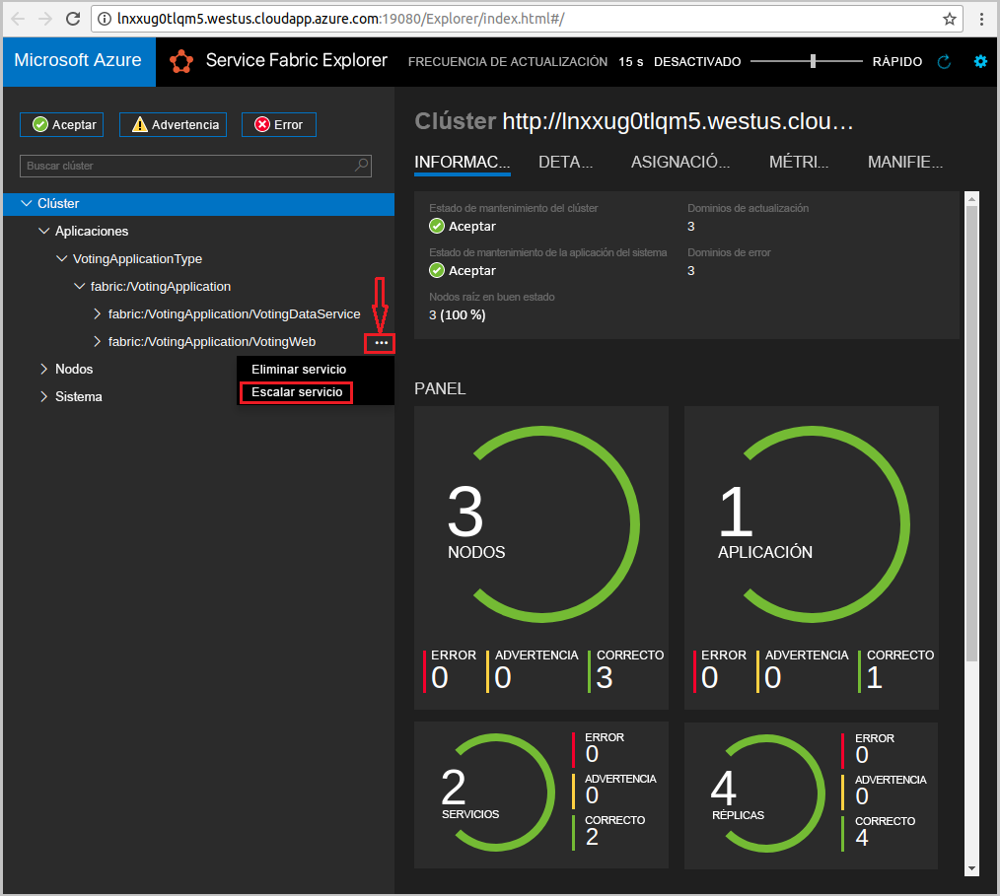

# <a name="quickstart--deploy-a-java-app-to-azure-service-fabric-on-linux"></a>Inicio rápido:  Implementación de una aplicación de Java en Azure Service Fabric con Linux

En esta guía de inicio rápido se explica cómo implementar la primera aplicación Java en Azure Service Fabric mediante el IDE de Eclipse en un equipo de desarrolladores con Linux. Cuando termine, tendrá una aplicación de votación con un front-end web de Java que guarda los resultados de una votación en un servicio back-end con estado en el clúster.

Azure Service Fabric es una plataforma de sistemas distribuidos para implementar y administrar microservicios y contenedores.



En esta guía de inicio rápido, ha aprendido a hacer lo siguiente:

* Usar Eclipse como una herramienta para las aplicaciones Java en Service Fabric
* Implementar la aplicación en el clúster local
* Escalar horizontalmente la aplicación en varios nodos

## <a name="prerequisites"></a>Prerequisites

Para completar esta guía de inicio rápido:

1. [Instale el SDK de Service Fabric y la interfaz de la línea de comandos (CLI) de Service Fabric](https://docs.microsoft.com/azure/service-fabric/service-fabric-get-started-linux#installation-methods)
2. [Instalación de Git](https://git-scm.com/)
3. [Instale Eclipse](https://www.eclipse.org/downloads/)
4. [Configure el entorno de Java](https://docs.microsoft.com/azure/service-fabric/service-fabric-get-started-linux#set-up-java-development), para lo que debe seguir los pasos opcionales para instalar el complemento de Eclipse

## <a name="download-the-sample"></a>Descarga del ejemplo

En una ventana Comandos, ejecute el comando siguiente para clonar el repositorio de la aplicación de ejemplo en la máquina local.

```git
git clone https://github.com/Azure-Samples/service-fabric-java-quickstart.git
```

## <a name="run-the-application-locally"></a>Ejecución de la aplicación de forma local

1. Inicie el clúster local mediante la ejecución del siguiente comando:

    ```bash
    sudo /opt/microsoft/sdk/servicefabric/common/clustersetup/devclustersetup.sh
    ```
    El inicio del clúster local tarda algún tiempo. Para confirmar que el clúster está totalmente operativo, acceda a Service Fabric Explorer en **http://localhost:19080** . Los cinco nodos con estado correcto indican que el clúster local está en funcionamiento.

    

2. Abra Eclipse.
3. Seleccione **Archivo** > **Importar** > **Gradle** > **Existing Gradle Project (Proyecto existente de Gradle)** y siga los pasos del asistente.
4. Seleccione **Directorio** y elija el directorio `Voting` de la carpeta `service-fabric-java-quickstart` que clonó de GitHub. Seleccione **Finalizar**.

    

5. Ahora tiene el proyecto `Voting` en el Explorador de paquetes para Eclipse.
6. Haga clic con el botón derecho en el proyecto y seleccione **Publish Application** (Publicar aplicación) en el menú desplegable **Service Fabric**. Elija **PublishProfiles/Local.json** como el perfil de destino y seleccione **Publish** (Publicar).

    

7. Abra el explorador web favorito y acceda a la aplicación a través de `http://localhost:8080`.

    

Ahora puede agregar una serie de opciones de votación y empezar a recibir votos. La aplicación se ejecuta y almacena todos los datos en el clúster de Service Fabric, sin necesidad de una base de datos independiente.

## <a name="scale-applications-and-services-in-a-cluster"></a>Escalar aplicaciones y servicios en un clúster

Los servicios se pueden escalar en un clúster para adaptarse a un cambio en la carga en los servicios. Para escalar un servicio, cambie el número de instancias que se ejecutan en el clúster. Hay muchas formas de escalar los servicios; por ejemplo, se pueden usar scripts o comandos de la CLI de Service Fabric (sfctl). En los pasos siguientes se utiliza Service Fabric Explorer.

Service Fabric Explorer se ejecuta en todos los clústeres de Service Fabric y se puede acceder a él desde un explorador. Para ello, vaya al puerto de administración HTTP de clústeres (19080); por ejemplo, `http://localhost:19080`.

Para escalar el servicio front-end web, realice estas operaciones:

1. Abra Service Fabric Explorer en el clúster, por ejemplo, `https://localhost:19080`.
2. Seleccione el botón de puntos suspensivos ( **...** ) situado junto al nodo **fabric:/Voting/VotingWeb** en la vista de árbol y seleccione **Scale Service** (Escalar servicio).

    

    Ahora puede escalar el número de instancias del servicio front-end web.

3. Cambie el número a **2** y seleccione **Scale Service** (Escalar servicio).
4. Seleccione el nodo **fabric:/Voting/VotingWeb** en la vista de árbol y expanda el nodo de partición (representado por un GUID).

    

    Ahora puede ver que el servicio tiene dos instancias, y en la vista de árbol verá en qué nodos se ejecutan las instancias.

Mediante esta sencilla tarea de administración, hemos duplicado los recursos disponibles para el servicio de front-end para procesar la carga de usuarios. Es importante entender que no hacen falta varias instancias de un servicio para que se ejecute de forma confiable. Si se produce un error en un servicio, Service Fabric se asegurará de que se ejecute una nueva instancia de servicio en el clúster.

## <a name="next-steps"></a>Pasos siguientes

En este tutorial, ha aprendido a hacer lo siguiente:

* Usar Eclipse como una herramienta para las aplicaciones Java en Service Fabric
* Implementar aplicaciones Java en el clúster local
* Escalar horizontalmente la aplicación en varios nodos

Para más información sobre cómo trabajar con aplicaciones Java en Service Fabric, diríjase al tutorial de las aplicaciones Java.

> [!div class="nextstepaction"]
> [Implementación de una aplicación Java](./service-fabric-tutorial-create-java-app.md)
