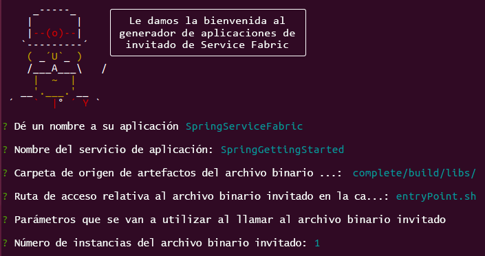
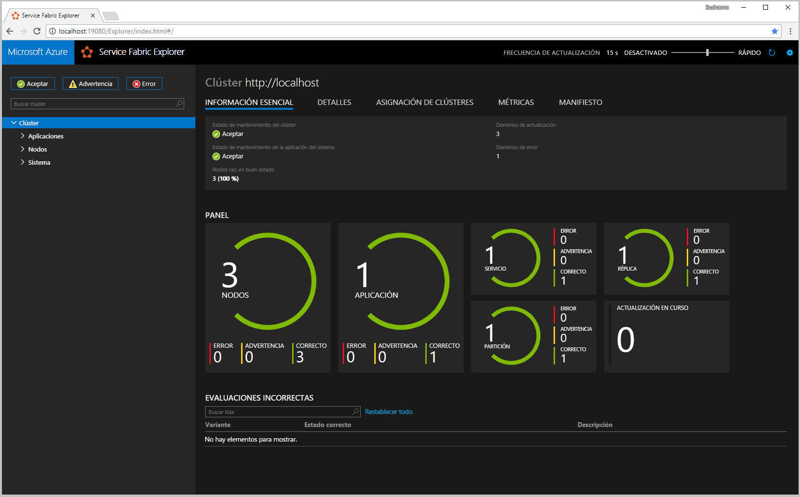
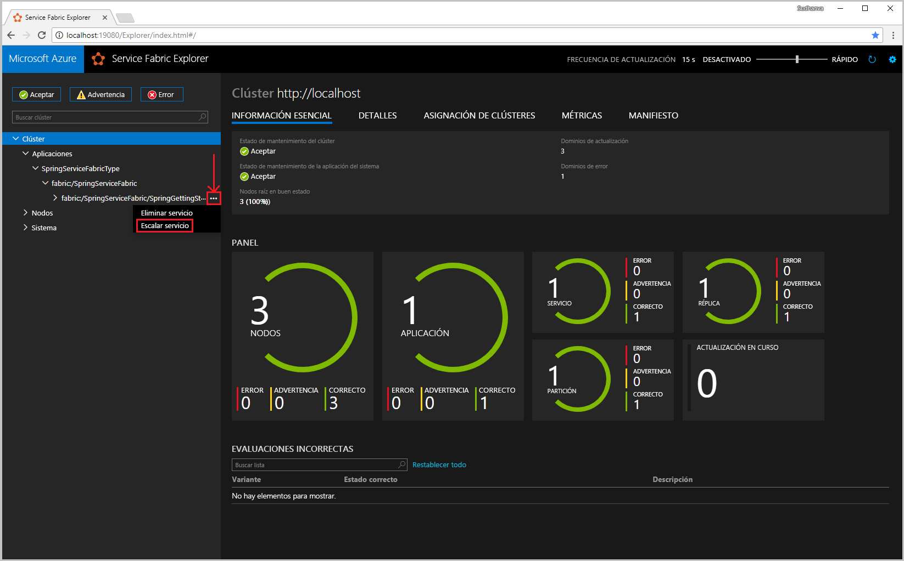
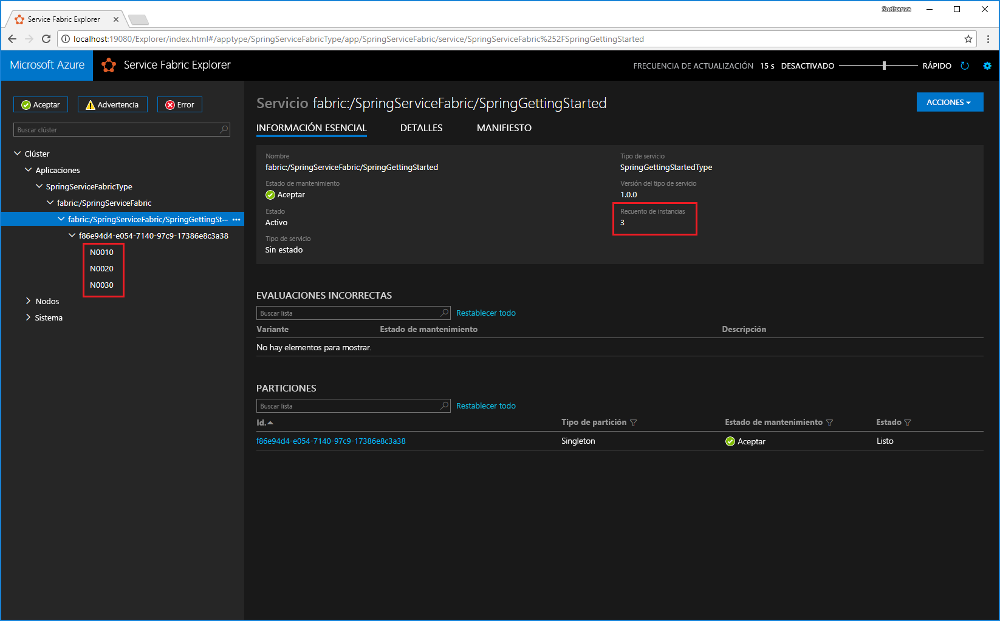
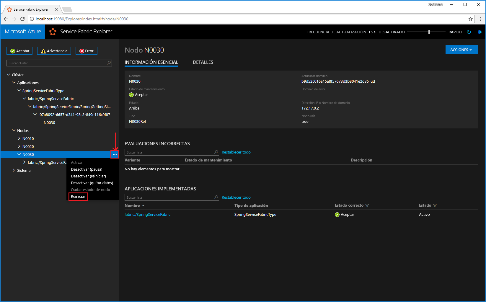
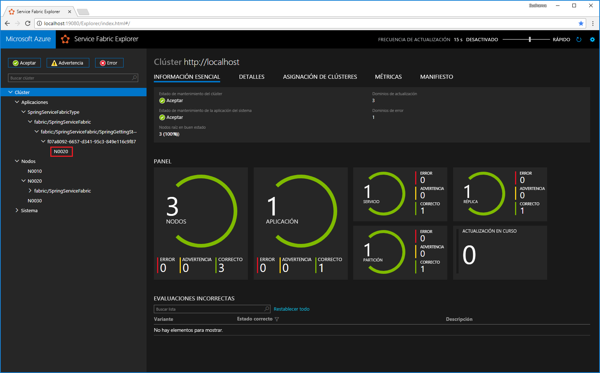

# <a name="quickstart-deploy-a-java-spring-boot-app-on-azure-service-fabric"></a>Inicio rápido: Creación de una aplicación de Spring Boot de Java en Azure Service Fabric

En este inicio rápido, se implementar una aplicación de Spring Boot de Java en Azure Service Fabric mediante herramientas de línea de comandos conocidas en Linux o MacOS. Azure Service Fabric es una plataforma de sistemas distribuidos para implementar y administrar microservicios y contenedores. 

## <a name="prerequisites"></a>Prerrequisitos

#### <a name="linuxtablinux"></a>[Linux](#tab/linux)

- [Entorno de Java](https://docs.microsoft.com/azure/service-fabric/service-fabric-get-started-linux#set-up-java-development) y [Yeoman](https://docs.microsoft.com/azure/service-fabric/service-fabric-get-started-linux#set-up-yeoman-generators-for-containers-and-guest-executables)
- [SDK de Service Fabric e interfaz de la línea de comandos (CLI) de Service Fabric](https://docs.microsoft.com/azure/service-fabric/service-fabric-get-started-linux#installation-methods)
- [Git](https://git-scm.com/downloads)

#### <a name="macostabmacos"></a>[macOS](#tab/macos)

- [Entorno de Java y Yeoman](https://docs.microsoft.com/azure/service-fabric/service-fabric-get-started-mac#create-your-application-on-your-mac-by-using-yeoman)
- [SDK de Service Fabric e interfaz de la línea de comandos (CLI) de Service Fabric](https://docs.microsoft.com/azure/service-fabric/service-fabric-cli#cli-mac)
- [Git](https://git-scm.com/downloads)

--- 

## <a name="download-the-sample"></a>Descarga del ejemplo

En una ventana de terminal, ejecute el siguiente comando para clonar la aplicación de ejemplo de la [introducción](https://github.com/spring-guides/gs-spring-boot) de Spring Boot en su máquina local.

```bash
git clone https://github.com/spring-guides/gs-spring-boot.git
```

## <a name="build-the-spring-boot-application"></a>Creación de una aplicación Spring Boot 
En el directorio *gs-spring-boot/complete*, ejecute el comando siguiente para compilar la aplicación 

```bash
./gradlew build
``` 

## <a name="package-the-spring-boot-application"></a>Empaquetado de una aplicación de Spring Boot 
1. En el directorio *gs-spring-boot* del clon, ejecute el comando `yo azuresfguest`. 

1. Escriba la siguiente información para cada mensaje.

    

1. En la carpeta *SpringServiceFabric/SpringServiceFabric/SpringGettingStartedPkg/code*, cree un archivo denominado *entryPoint.sh*. Agregue el siguiente código al archivo *entryPoint.sh*. 

    ```bash
    #!/bin/bash
    BASEDIR=$(dirname $0)
    cd $BASEDIR
    java -jar gs-spring-boot-0.1.0.jar
    ```

1. Agregue el recurso **Endpoints** al archivo *gs-spring-boot/SpringServiceFabric/SpringServiceFabric/SpringGettingStartedPkg/ServiceManifest.xml*.

    ```xml 
        <Resources>
          <Endpoints>
            <Endpoint Name="WebEndpoint" Protocol="http" Port="8080" />
          </Endpoints>
       </Resources>
    ```

    El archivo *ServiceManifest.xml* ahora tiene este aspecto: 

    ```xml
    <?xml version="1.0" encoding="utf-8"?>
    <ServiceManifest Name="SpringGettingStartedPkg" Version="1.0.0"
                     xmlns="http://schemas.microsoft.com/2011/01/fabric" xmlns:xsd="https://www.w3.org/2001/XMLSchema" xmlns:xsi="https://www.w3.org/2001/XMLSchema-instance" >

       <ServiceTypes>
          <StatelessServiceType ServiceTypeName="SpringGettingStartedType" UseImplicitHost="true">
       </StatelessServiceType>
       </ServiceTypes>

       <CodePackage Name="code" Version="1.0.0">
          <EntryPoint>
             <ExeHost>
                <Program>entryPoint.sh</Program>
                <Arguments></Arguments>
                <WorkingFolder>CodePackage</WorkingFolder>
             </ExeHost>
          </EntryPoint>
       </CodePackage>
        <Resources>
          <Endpoints>
            <Endpoint Name="WebEndpoint" Protocol="http" Port="8080" />
          </Endpoints>
       </Resources>
     </ServiceManifest>
    ```

En este punto, ha creado una aplicación de Service Fabric del ejemplo Getting Started de Spring Boot que se puede implementar en Service Fabric.

## <a name="run-the-application-locally"></a>Ejecución de la aplicación de forma local

1. Inicie el clúster local en máquinas Ubuntu mediante la ejecución del siguiente comando:

    ```bash
    sudo /opt/microsoft/sdk/servicefabric/common/clustersetup/devclustersetup.sh
    ```

    Si utiliza un equipo Mac, inicie el clúster local desde la imagen del Docker (suponiendo que ha seguido los [requisitos previos ](https://docs.microsoft.com/azure/service-fabric/service-fabric-get-started-mac#create-a-local-container-and-set-up-service-fabric) para configurar el clúster local para Mac). 

    ```bash
    docker run --name sftestcluster -d -p 19080:19080 -p 19000:19000 -p 25100-25200:25100-25200 -p 8080:8080 mysfcluster
    ```

    El inicio del clúster local tarda algún tiempo. Para confirmar que el clúster está totalmente operativo, acceda a Service Fabric Explorer en `http://localhost:19080`. Los cinco nodos con estado correcto indican que el clúster local está en funcionamiento. 
    
    

1. Abra la carpeta *gs-spring-boot/SpringServiceFabric*.
1. Ejecute el comando siguiente para conectarse a su clúster local.

    ```bash
    sfctl cluster select --endpoint http://localhost:19080
    ```
1. Ejecute el script *install.sh*.

    ```bash
    ./install.sh
    ```

1. Abra el explorador web favorito y acceda a la aplicación a través de `http://localhost:8080`.

    

Ahora puede acceder a la aplicación de Spring Boot que se implementó en un clúster de Service Fabric.

Para más información, consulte el ejemplo de la [introducción](https://spring.io/guides/gs/spring-boot/) de Spring Boot en el sitio web de Spring.

## <a name="scale-applications-and-services-in-a-cluster"></a>Escalar aplicaciones y servicios en un clúster

Los servicios se pueden escalar en un clúster para adaptarse a un cambio en la carga en los servicios. Para escalar un servicio, cambie el número de instancias que se ejecutan en el clúster. Hay muchas formas de escalar los servicios; por ejemplo, se pueden usar scripts o comandos de la CLI de Service Fabric (sfctl). En los pasos siguientes se utiliza Service Fabric Explorer.

Service Fabric Explorer se ejecuta en todos los clústeres de Service Fabric y se puede acceder a él desde un explorador. Para ello, vaya al puerto de administración HTTP de clústeres (19080); por ejemplo, `http://localhost:19080`.

Para escalar el servicio front-end web, realice estas operaciones:

1. Abra Service Fabric Explorer en el clúster, por ejemplo, `http://localhost:19080`.
1. Seleccione los puntos suspensivos ( **...** ) al lado del nodo **fabric:/SpringServiceFabric/SpringGettingStarted** en la vista de árbol y seleccione **Escalar servicio**.

    

    Ahora puede escalar el número de instancias del servicio.

1. Cambie el número a **3** y seleccione **Scale Service** (Escalar servicio).

    También puede escalar el servicio mediante la línea de comandos.

    ```bash
    # Connect to your local cluster
    sfctl cluster select --endpoint https://<ConnectionIPOrURL>:19080 --pem <path_to_certificate> --no-verify

    # Run Bash command to scale instance count for your service
    sfctl service update --service-id 'SpringServiceFabric~SpringGettingStarted' --instance-count 3 --stateless 
    ``` 

1. Seleccione el nodo **fabric:/SpringServiceFabric/SpringGettingStarted** en la vista de árbol y expanda el nodo de partición (representado por un GUID).

    

    El servicio tiene tres instancias y la vista de árbol muestra en qué nodos se ejecutan las instancias.

Mediante esta sencilla tarea de administración, hemos duplicado los recursos disponibles para el servicio de front-end para procesar la carga de usuarios. Es importante entender que no hacen falta varias instancias de un servicio para que se ejecute de forma confiable. Si se produce un error en un servicio, Service Fabric se asegurará de que se ejecute una nueva instancia de servicio en el clúster.

## <a name="fail-over-services-in-a-cluster"></a>Servicios de conmutación por error en un clúster

Para demostrar la conmutación por error del servicio, se simula un reinicio del nodo mediante Service Fabric Explorer. Asegúrese de que solo se esté ejecutando una instancia del servicio.

1. Abra Service Fabric Explorer en el clúster, por ejemplo, `http://localhost:19080`.
1. Seleccione los puntos suspensivos ( **...** ) junto al nodo que ejecuta la instancia del servicio y reinicie el nodo.

    
1. La instancia del servicio se moverá a otro nodo y la aplicación no tendrá ningún tiempo de inactividad.

    

## <a name="next-steps"></a>Pasos siguientes

En este tutorial, ha aprendido a hacer lo siguiente:

* Implementación de una aplicación de Spring Boot en Service Fabric
* Implementar la aplicación en el clúster local
* Escalar horizontalmente la aplicación en varios nodos
* Realización de la conmutación por error del servicio sin impacto en la disponibilidad

Para más información sobre cómo trabajar con aplicaciones Java en Service Fabric, diríjase al tutorial de las aplicaciones Java.

> [!div class="nextstepaction"]
> [Implementación de una aplicación Java](./service-fabric-tutorial-create-java-app.md)
