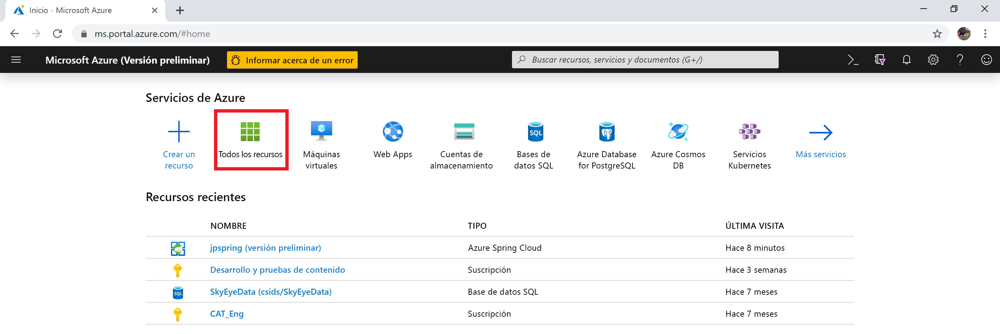
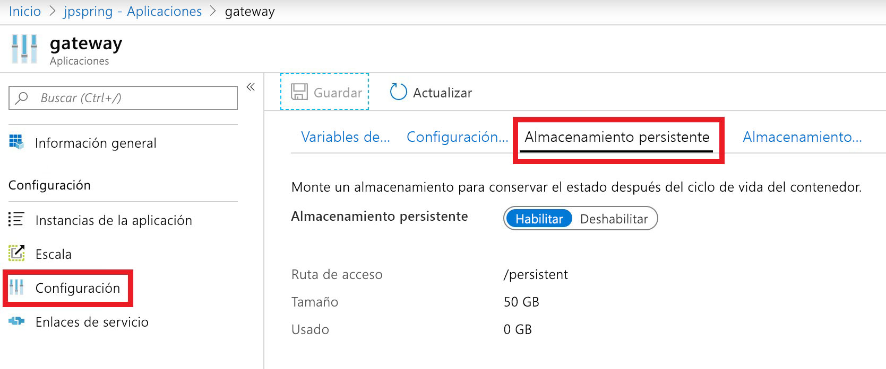

# <a name="use-persistent-storage-in-azure-spring-cloud"></a>Uso del almacenamiento persistente en Azure Spring Cloud

Azure Spring Cloud proporciona dos tipos de almacenamiento para las aplicaciones: persistente y temporal.

De forma predeterminada, Azure Spring Cloud proporciona el almacenamiento temporal para cada instancia de aplicación. El almacenamiento temporal se limita a 5 GB por instancia con la ruta de acceso de montaje predeterminada /tmp.

> [!WARNING]
> Si reinicia una instancia de aplicación, se eliminará de forma permanente el almacenamiento temporal asociado.

El almacenamiento persistente es un contenedor de recursos compartidos de archivos administrado por Azure que se asigna por aplicación. Todas las instancias de una aplicación comparten los datos almacenados en el almacenamiento persistente. Una instancia de Azure Spring Cloud puede tener un máximo de diez aplicaciones con almacenamiento persistente habilitado. Cada aplicación recibe 50 GB de almacenamiento persistente. La ruta de montaje predeterminada para el almacenamiento persistente es /persistent.

> [!WARNING]
> Si deshabilita el almacenamiento persistente de una aplicación, se desasignará todo ese almacenamiento y se perderán todos los datos almacenados.

## <a name="use-the-azure-portal-to-enable-persistent-storage"></a>Uso de Azure Portal para habilitar el almacenamiento persistente

1. En la página **principal** de Azure Portal, seleccione **Todos los recursos**.

    >

1. Seleccione el recurso de Azure Spring Cloud que necesita almacenamiento persistente. En este ejemplo, la aplicación seleccionada se denomina **upspring**.

    > 

1. En el encabezado **Configuración**, seleccione **Aplicaciones**.

1. Sus servicios de Azure Spring Cloud aparecen en una tabla.  Seleccione el servicio al que desea agregar el almacenamiento persistente. En este ejemplo, el servicio de **puerta de enlace** está seleccionado.

    > 

1. En la página de configuración del servicio, seleccione **Configuración**.

1. Seleccione la pestaña **Almacenamiento persistente** y seleccione **Habilitar**.

    > 

Tras habilitarse el almacenamiento persistente, su tamaño y ruta de acceso se muestran en la página de configuración.

## <a name="use-the-azure-cli-to-modify-persistent-storage"></a>Uso de la CLI de Azure para modificar el almacenamiento persistente

Si es necesario, instale la extensión de Spring Cloud para la CLI de Azure:

```azurecli
az extension add --name spring-cloud
```
Otras operaciones:

* Para crear una aplicación con almacenamiento persistente habilitado:

    ```azurecli
    az spring-cloud app create -n <app> -g <resource-group> -s <service-name> --enable-persistent-storage true
    ```

* A fin de habilitar el almacenamiento persistente para una aplicación existente:

    ```azurecli
    az spring-cloud app update -n <app> -g <resource-group> -s <service-name> --enable-persistent-storage true
    ```

* Para deshabilitar el almacenamiento persistente en una aplicación existente:

    ```azurecli
    az spring-cloud app update -n <app> -g <resource-group> -s <service-name> --enable-persistent-storage false
    ```

    > [!WARNING]
    > Si deshabilita el almacenamiento persistente de una aplicación, se desasignará todo ese almacenamiento y se perderán todos los datos almacenados.

## <a name="next-steps"></a>Pasos siguientes

* Obtenga información sobre las [cuotas de servicio y la aplicación](spring-cloud-quotas.md).
* Aprenda a [escalar manualmente su aplicación](spring-cloud-tutorial-scale-manual.md).
